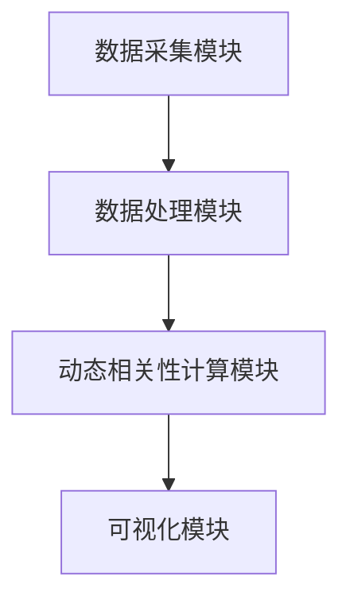

                 


# 特价股票投资中的跨资产类别相关性动态分析

## 关键词：特价股票，跨资产相关性，动态分析，时间序列，机器学习

## 摘要：本文详细探讨了在特价股票投资中，跨资产类别相关性动态分析的重要性、方法和应用。通过结合统计学、时间序列分析和机器学习等技术，分析了不同资产类别之间的动态相关性，帮助投资者更好地理解市场波动，优化投资组合，降低风险。本文内容涵盖相关性分析的理论基础、算法实现、系统设计以及实际案例分析，为投资者提供了全面的指导。

---

## 第1章 特价股票与跨资产相关性概述

### 1.1 特价股票的定义与特点

#### 1.1.1 特价股票的定义
特价股票通常指价格相对较低的股票，通常具有较高的波动性和潜在的高回报率。这类股票通常属于小盘股或中盘股，具有较高的成长潜力，但也伴随着较高的风险。

#### 1.1.2 特价股票的特点
- 价格低廉：相对于大盘股，特价股票的市场价格较低，适合中小投资者参与。
- 波动性较高：由于市场关注度较低，特价股票的价格波动较大，容易受到市场情绪和突发事件的影响。
- 成长潜力：许多特价股票属于新兴行业或中小型公司，具有较高的成长潜力。

#### 1.1.3 特价股票的投资价值与风险
- 投资价值：特价股票通常具有较高的增长潜力，适合长期投资者。
- 投资风险：由于市场波动较大，特价股票的投资风险较高，尤其是在市场低迷时，可能会出现大幅下跌。

### 1.2 跨资产类别相关性的基本概念

#### 1.2.1 相关性的定义
相关性是指两个或多个资产价格变动之间的关系。相关性可以通过统计学中的相关系数来衡量，相关系数的取值范围为-1到1，表示完全负相关、无相关和完全正相关。

#### 1.2.2 跨资产类别相关性的特点
- 多样性：不同资产类别之间的相关性可能不同。
- 动态性：资产之间的相关性会随着时间变化而变化。
- 复杂性：资产之间的相关性可能受到多种因素的影响，如宏观经济环境、市场情绪等。

#### 1.2.3 跨资产类别相关性的重要性
- 投资组合优化：通过分析资产之间的相关性，可以优化投资组合，降低风险。
- 风险管理：了解不同资产之间的相关性有助于更好地管理投资风险。

### 1.3 动态相关性分析的背景与意义

#### 1.3.1 动态相关性的定义
动态相关性是指资产之间的相关性随着时间变化而变化的特性。与静态相关性不同，动态相关性能够捕捉到资产之间关系的变化趋势。

#### 1.3.2 动态相关性分析的背景
随着金融市场的发展，资产之间的相关性不再固定不变，而是受到多种因素的影响，如市场环境、宏观经济政策、突发事件等。因此，动态相关性分析变得尤为重要。

#### 1.3.3 动态相关性分析的意义
- 提高投资决策的准确性：通过分析动态相关性，投资者可以更好地预测资产价格的变动趋势。
- 优化投资组合：动态相关性分析可以帮助投资者更好地分散风险，优化投资组合。

### 1.4 本章小结
本章介绍了特价股票的基本概念和特点，以及跨资产类别相关性的基本概念和动态相关性分析的背景与意义。通过这些内容，读者可以理解为什么在特价股票投资中需要进行跨资产类别相关性动态分析。

---

## 第2章 跨资产类别相关性分析的理论基础

### 2.1 协方差与相关系数的计算

#### 2.1.1 协方差的定义与计算
协方差是衡量两个变量之间关系的统计量，公式如下：
$$ \text{协方差}(X, Y) = E[(X - \mu_X)(Y - \mu_Y)] $$
其中，$\mu_X$和$\mu_Y$分别是变量$X$和$Y$的期望值。

#### 2.1.2 相关系数的定义与计算
相关系数是衡量两个变量之间线性关系的统计量，公式如下：
$$ \text{相关系数} = \frac{\text{协方差}(X, Y)}{\sigma_X \sigma_Y} $$
其中，$\sigma_X$和$\sigma_Y$分别是变量$X$和$Y$的标准差。

#### 2.1.3 相关系数的性质
- 相关系数的取值范围为-1到1。
- 相关系数为正，表示两个变量正相关；为负，表示负相关；为0，表示无相关。

### 2.2 时间序列分析方法

#### 2.2.1 时间序列的基本概念
时间序列是指按照时间顺序排列的数据，如股票价格、指数等。

#### 2.2.2 自相关与偏自相关分析
自相关是指时间序列与其自身的时间滞后之间的相关性。偏自相关是指在控制其他滞后变量的影响下，两个变量之间的相关性。

#### 2.2.3 时间序列模型（ARIMA）简介
ARIMA（自回归积分滑动平均模型）是一种常用的时间序列分析模型，适用于线性、平稳的时间序列数据。

### 2.3 跨资产类别相关性的动态建模

#### 2.3.1 动态相关性的基本模型
动态相关性模型通常包括以下几个步骤：
1. 数据预处理：对时间序列数据进行标准化处理。
2. 计算动态相关性：使用滚动窗口法或滑动窗口法计算动态相关性。
3. 模型验证：通过统计检验验证模型的显著性。

#### 2.3.2 动态相关性的参数估计
动态相关性模型的参数通常通过最大似然估计或贝叶斯估计等方法进行估计。

#### 2.3.3 动态相关性的假设检验
动态相关性模型的假设检验通常包括F检验和t检验等。

### 2.4 本章小结
本章介绍了协方差和相关系数的计算方法，以及时间序列分析的基本方法。通过这些内容，读者可以理解动态相关性分析的理论基础。

---

## 第3章 动态相关性分析的算法实现

### 3.1 动态相关性的计算方法

#### 3.1.1 滚动窗口法
滚动窗口法是一种常用的时间序列分析方法，适用于动态相关性分析。其基本思想是将数据分成多个窗口，计算每个窗口内的相关性。

#### 3.1.2 加权窗口法
加权窗口法是一种改进的滚动窗口法，适用于处理时间序列数据的非平稳性。其基本思想是将窗口内的数据赋予不同的权重，以反映数据的重要性。

#### 3.1.3 基于机器学习的动态相关性计算
基于机器学习的动态相关性计算方法包括支持向量回归（SVR）、随机森林（Random Forest）等。

### 3.2 基于时间序列的动态相关性建模

#### 3.2.1 ARIMA模型在动态相关性中的应用
ARIMA模型适用于线性、平稳的时间序列数据，可以通过自相关函数（ACF）和偏自相关函数（PACF）进行模型识别。

#### 3.2.2 GARCH模型在动态相关性中的应用
GARCH模型是一种常用的风险管理工具，适用于处理金融时间序列的波动性。

#### 3.2.3 机器学习模型（如LSTM）在动态相关性中的应用
LSTM（长短期记忆网络）是一种深度学习模型，适用于处理时间序列数据的长期依赖关系。

### 3.3 动态相关性分析的算法实现

#### 3.3.1 算法实现步骤
1. 数据预处理：对时间序列数据进行标准化处理。
2. 窗口划分：将数据划分为多个窗口。
3. 动态相关性计算：计算每个窗口内的相关性。
4. 模型训练：使用机器学习模型进行动态相关性建模。

#### 3.3.2 算法实现的代码示例
以下是一个基于Python的动态相关性分析代码示例：

```python
import pandas as pd
import numpy as np

# 数据预处理
data = pd.read_csv('data.csv')
data = data[['stock1', 'stock2']]
data = data.pct_change().dropna()

# 滚动窗口法计算动态相关性
window_size = 30
dynamic_correlation = []
for i in range(window_size, len(data)):
    window = data.iloc[i-window_size:i]
    correlation = window['stock1'].corr(window['stock2'])
    dynamic_correlation.append(correlation)

# 可视化动态相关性
import matplotlib.pyplot as plt
plt.plot(dynamic_correlation)
plt.xlabel('Time')
plt.ylabel('Dynamic Correlation')
plt.show()
```

#### 3.3.3 算法实现的优缺点分析
- 优点：动态相关性分析能够捕捉到资产之间关系的变化趋势。
- 缺点：动态相关性分析需要大量的计算资源，且模型的准确性受到数据质量和模型选择的影响。

### 3.4 本章小结
本章介绍了动态相关性分析的算法实现，包括滚动窗口法、加权窗口法和机器学习模型的应用。通过这些内容，读者可以理解如何在实际中应用动态相关性分析。

---

## 第4章 跨资产类别相关性动态分析的系统设计

### 4.1 系统架构与功能设计

#### 4.1.1 系统模块划分
动态相关性分析系统通常包括以下几个模块：
1. 数据采集模块：负责采集资产价格数据。
2. 数据处理模块：负责对数据进行预处理。
3. 动态相关性计算模块：负责计算资产之间的动态相关性。
4. 可视化模块：负责将动态相关性结果进行可视化展示。

#### 4.1.2 系统功能模块设计
- 数据采集模块：支持多种数据源，如CSV文件、数据库等。
- 数据处理模块：支持数据清洗、标准化等操作。
- 动态相关性计算模块：支持多种算法，如滚动窗口法、GARCH模型等。
- 可视化模块：支持多种图表类型，如折线图、散点图等。

#### 4.1.3 系统架构图（Mermaid）



### 4.2 数据流设计

#### 4.2.1 数据采集模块
数据采集模块负责从数据源中采集资产价格数据。常用的数据源包括：
- CSV文件：支持本地CSV文件的读取。
- 数据库：支持从数据库中读取历史数据。

#### 4.2.2 数据处理模块
数据处理模块负责对采集到的数据进行预处理，包括：
- 数据清洗：去除缺失值、异常值等。
- 数据标准化：对数据进行标准化处理，确保数据的可比性。

#### 4.2.3 动态相关性计算模块
动态相关性计算模块负责计算资产之间的动态相关性。常用的算法包括：
- 滚动窗口法：适用于处理时间序列数据。
- GARCH模型：适用于处理金融时间序列的波动性。

### 4.3 系统接口设计

#### 4.3.1 数据接口
- 数据输入接口：支持多种数据格式的输入，如CSV、JSON等。
- 数据输出接口：支持将结果输出为CSV、Excel等格式。

#### 4.3.2 用户接口
- 界面友好：支持用户友好的界面设计，方便用户操作。
- 可视化结果展示：支持多种图表类型的展示，如折线图、散点图等。

### 4.4 本章小结
本章介绍了动态相关性分析系统的架构设计和数据流设计。通过这些内容，读者可以理解如何构建一个完整的动态相关性分析系统。

---

## 第5章 项目实战：动态相关性分析的应用

### 5.1 项目背景与目标
本项目旨在通过动态相关性分析，帮助投资者更好地理解资产之间的关系，优化投资组合，降低风险。

### 5.2 数据来源与预处理

#### 5.2.1 数据来源
本项目使用的是某段时间内的股票价格数据，数据来源为公开的股票价格数据库。

#### 5.2.2 数据清洗
- 去除缺失值：使用`dropna()`函数去除缺失值。
- 去除异常值：使用`z-score`方法去除异常值。

#### 5.2.3 数据标准化
对数据进行标准化处理，确保数据的可比性。

### 5.3 系统实现

#### 5.3.1 系统实现步骤
1. 数据采集：从数据库中读取股票价格数据。
2. 数据处理：对数据进行清洗和标准化处理。
3. 动态相关性计算：使用滚动窗口法计算资产之间的动态相关性。
4. 可视化展示：将动态相关性结果进行可视化展示。

#### 5.3.2 系统实现的代码示例
以下是一个基于Python的动态相关性分析系统实现代码示例：

```python
import pandas as pd
import numpy as np
import matplotlib.pyplot as plt

# 数据采集模块
data = pd.read_csv('stock_prices.csv')
data = data[['stock1', 'stock2']]
data = data.pct_change().dropna()

# 数据处理模块
data = data.fillna(0)

# 动态相关性计算模块
window_size = 30
dynamic_correlation = []
for i in range(window_size, len(data)):
    window = data.iloc[i-window_size:i]
    correlation = window['stock1'].corr(window['stock2'])
    dynamic_correlation.append(correlation)

# 可视化模块
plt.plot(dynamic_correlation)
plt.xlabel('Time')
plt.ylabel('Dynamic Correlation')
plt.show()
```

### 5.4 实际案例分析与结果解读

#### 5.4.1 数据分析结果
通过动态相关性分析，我们发现股票1和股票2在某些时间段内的相关性较高，而在其他时间段内的相关性较低。

#### 5.4.2 结果解读
- 相关性较高：说明两支股票的价格变动趋势相似，风险较高。
- 相关性较低：说明两支股票的价格变动趋势不同，风险较低。

### 5.5 本章小结
本章通过一个实际案例，展示了动态相关性分析在资产投资中的应用。通过这些内容，读者可以理解如何将理论应用于实际投资决策。

---

## 第6章 总结与展望

### 6.1 本章总结
本文详细探讨了特价股票投资中跨资产类别相关性动态分析的重要性、方法和应用。通过结合统计学、时间序列分析和机器学习等技术，分析了不同资产类别之间的动态相关性，帮助投资者更好地理解市场波动，优化投资组合，降低风险。

### 6.2 未来展望
未来，随着人工智能技术的发展，动态相关性分析将更加智能化和自动化。同时，随着金融市场的复杂化，动态相关性分析将更加重要，成为投资者决策的重要工具。

### 6.3 最佳实践 Tips
- 数据质量是动态相关性分析的关键，确保数据的准确性和完整性。
- 选择合适的算法和模型，能够提高动态相关性分析的准确性。
- 动态相关性分析结果仅供参考，投资需谨慎。

### 6.4 本章小结
本章总结了全文的主要内容，并展望了未来的研究方向。

---

## 附录

### 附录A：术语表
- 动态相关性：资产之间的相关性随着时间变化而变化的特性。
- 协方差：衡量两个变量之间关系的统计量。
- 相关系数：衡量两个变量之间线性关系的统计量。

### 附录B：数据来源
- 数据来源：公开的股票价格数据库。

---

## 作者：AI天才研究院/AI Genius Institute & 禅与计算机程序设计艺术 /Zen And The Art of Computer Programming

---

# 本文到此结束，感谢您的阅读！

