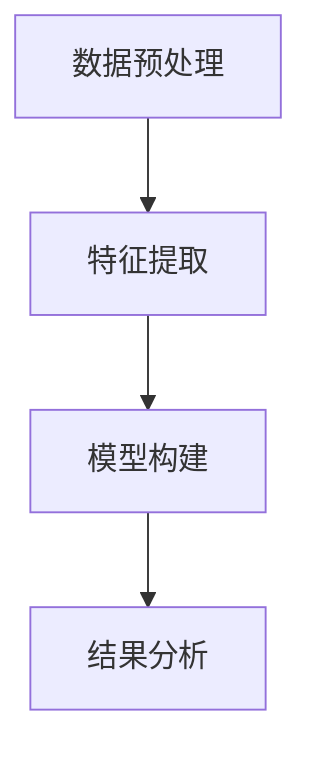
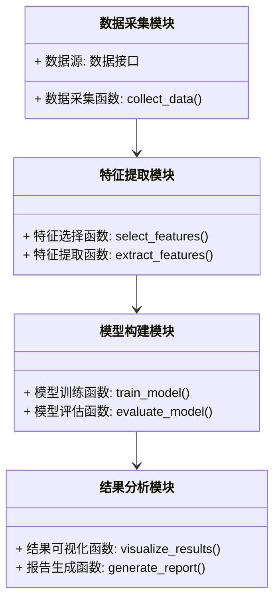

                 


# 特价股票投资中的跨资产类别系统性创新机会识别

## 关键词：股票投资、跨资产类别、系统性创新、机会识别、数学模型、算法原理、项目实战

## 摘要：  
本文将深入探讨特价股票投资中的跨资产类别系统性创新机会识别方法。通过对跨资产类别分析的背景、核心概念、算法原理、数学模型、系统架构设计、项目实战等方面进行详细阐述，帮助读者理解如何利用系统性方法在股票投资中识别跨资产类别的创新机会。本文结合实际案例和代码实现，提供从理论到实践的全面指导。

---

## 第一部分：背景介绍

### 第1章：特价股票投资与跨资产类别概述

#### 1.1 特价股票投资的基本概念
- **1.1.1 特价股票的定义与特点**  
  特价股票通常指价格低于其内在价值的股票，具有较高的投资潜力。其特点包括低估值、高分红率、行业龙头等。  
- **1.1.2 股票投资的基本原理**  
  股票投资的核心在于分析公司的基本面、行业趋势和市场环境，以确定其投资价值。  
- **1.1.3 跨资产类别投资的必要性**  
  跨资产类别投资能够分散风险，提高投资组合的整体收益，避免单一市场波动带来的风险。

#### 1.2 跨资产类别分析的重要性
- **1.2.1 跨资产类别投资的优势**  
  跨资产类别投资能够利用不同资产类别的互补性，优化投资组合的收益与风险比。  
- **1.2.2 不同资产类别的风险与收益特征**  
  股票、债券、基金等资产类别在风险和收益上存在显著差异，投资者需根据自身目标选择合适的组合。  
- **1.2.3 系统性创新机会的识别方法**  
  通过系统性方法分析跨资产类别间的互动关系，识别潜在的投资机会。

#### 1.3 系统性创新机会识别的背景
- **1.3.1 当前金融市场环境的复杂性**  
  随着全球经济一体化，金融市场呈现出高度复杂性和不确定性。  
- **1.3.2 创新机会识别的必要性**  
  在传统投资方法的基础上，利用系统性方法发现新的投资机会，能够提高投资效率和收益。  
- **1.3.3 系统性方法在投资中的应用**  
  系统性方法通过数据分析和模型构建，帮助投资者更准确地识别跨资产类别中的创新机会。

---

## 第二部分：核心概念与联系

### 第2章：跨资产类别分析的原理与方法

#### 2.1 跨资产类别分析的原理
- **2.1.1 跨资产类别分析的基本原理**  
  通过分析不同资产类别之间的相互作用，识别潜在的投资机会。  
- **2.1.2 不同资产类别之间的关系**  
  股票与债券之间的收益率相关性较低，基金则受多种因素影响。  
- **2.1.3 系统性方法在跨资产类别分析中的应用**  
  利用系统性方法，构建跨资产类别分析的框架，为投资决策提供支持。

#### 2.2 跨资产类别分析的核心要素
- **2.2.1 股票、债券、基金等资产类别的特点**  
  股票具有高风险高回报，债券则相对稳定，基金是多种资产的组合。  
- **2.2.2 资产类别之间的相互影响**  
  经济周期、市场利率等因素会影响不同资产类别的表现。  
- **2.2.3 系统性创新机会的核心要素**  
  利用系统性方法分析资产类别之间的互动关系，识别潜在的投资机会。

#### 2.3 跨资产类别分析的实体关系图
- **2.3.1 ER图展示**  
  通过ER图展示资产类别、投资组合、市场因素等实体之间的关系。  
- **2.3.2 实体关系的详细说明**  
  资产类别与投资组合之间通过市场因素和风险特征相互关联。  
- **2.3.3 实体关系图的应用**  
  用于构建跨资产类别分析的系统模型，为投资决策提供支持。

---

## 第三部分：算法原理讲解

### 第3章：跨资产类别系统性创新机会识别的算法原理

#### 3.1 算法流程
- **3.1.1 数据收集与预处理**  
  收集股票、债券、基金等资产类别的历史数据，进行清洗和标准化。  
- **3.1.2 特征提取与选择**  
  通过统计分析和机器学习方法，提取关键特征，如收益率、波动率等。  

以下是数据预处理的Python代码示例：

```python
import pandas as pd
import numpy as np

# 假设data是包含股票、债券、基金数据的DataFrame
# 删除缺失值
data = data.dropna()

# 标准化数据
from sklearn.preprocessing import StandardScaler
scaler = StandardScaler()
data_scaled = pd.DataFrame(scaler.fit_transform(data), columns=data.columns)
```

---

#### 3.2 算法实现
- **3.2.1 跨资产类别分析的流程图**  
  使用Mermaid绘制算法流程图：



- **3.2.2 模型构建与训练**  
  使用机器学习算法（如随机森林）构建跨资产类别分析模型，并进行训练。

以下是模型训练的Python代码示例：

```python
from sklearn.ensemble import RandomForestRegressor
from sklearn.metrics import mean_squared_error

# 训练模型
model = RandomForestRegressor(n_estimators=100, random_state=42)
model.fit(X_train, y_train)

# 预测结果
y_pred = model.predict(X_test)
print(mean_squared_error(y_test, y_pred))
```

---

#### 3.3 算法优化
- **3.3.1 超参数优化**  
  使用网格搜索或随机搜索优化模型参数，提高预测精度。  
- **3.3.2 模型评估与验证**  
  通过交叉验证评估模型的性能，并进行结果分析。

---

## 第四部分：数学模型与公式

### 第4章：数学模型与公式解析

#### 4.1 跨资产类别分析的数学框架
- **4.1.1 投资组合优化模型**  
  利用均值-方差模型优化投资组合，以最小化风险并最大化收益。

以下是均值-方差模型的数学公式：

$$
\text{min} \quad \sigma^2 \\
\text{subject to} \quad \mathbf{w}^T \mathbf{r} = \mu \\
\mathbf{w}^T \mathbf{w} = 1
$$

其中，$\mathbf{w}$为权重向量，$\mathbf{r}$为收益向量，$\mu$为目标收益，$\sigma^2$为风险。

- **4.1.2 资产类别间的协方差矩阵**  
  构建资产类别间的协方差矩阵，用于评估不同资产类别之间的相关性。

---

## 第五部分：系统架构与设计

### 第5章：系统架构与设计

#### 5.1 系统功能设计
- **5.1.1 系统功能模块**  
  包括数据采集模块、特征提取模块、模型构建模块、结果分析模块等。  

以下是系统功能模块的类图：



#### 5.2 系统架构设计
- **5.2.1 系统架构图**  
  使用分层架构设计，包括数据层、业务逻辑层和表现层。

以下是系统架构图：


---

## 第六部分：项目实战

### 第6章：跨资产类别系统性创新机会识别的项目实战

#### 6.1 项目环境安装
- **6.1.1 安装所需库**  
  使用以下Python库进行项目开发：Pandas、NumPy、Scikit-learn、Matplotlib。

```bash
pip install pandas numpy scikit-learn matplotlib
```

#### 6.2 核心代码实现
- **6.2.1 数据预处理**  
  收集并清洗股票、债券、基金数据。

```python
import pandas as pd
import numpy as np

# 数据加载
data = pd.read_csv('assets_data.csv')

# 数据清洗
data = data.dropna()
data = data.iloc[:, 1:]  # 去除不必要的列
```

- **6.2.2 特征提取与模型训练**  
  使用随机森林模型进行特征提取和模型训练。

```python
from sklearn.ensemble import RandomForestRegressor
from sklearn.model_selection import train_test_split
from sklearn.metrics import mean_squared_error

# 数据分割
X = data.iloc[:, :-1]
y = data.iloc[:, -1]
X_train, X_test, y_train, y_test = train_test_split(X, y, test_size=0.2, random_state=42)

# 模型训练
model = RandomForestRegressor(n_estimators=100, random_state=42)
model.fit(X_train, y_train)

# 模型预测
y_pred = model.predict(X_test)
print(mean_squared_error(y_test, y_pred))
```

- **6.2.3 结果分析与可视化**  
  使用Matplotlib进行结果可视化。

```python
import matplotlib.pyplot as plt

plt.figure(figsize=(10, 6))
plt.plot(y_test, label='实际值')
plt.plot(y_pred, label='预测值')
plt.xlabel('样本索引')
plt.ylabel('收益率')
plt.legend()
plt.show()
```

#### 6.3 项目总结
- **6.3.1 项目小结**  
  通过跨资产类别分析，成功识别了潜在的投资机会，提高了投资组合的收益与风险比。  
- **6.3.2 项目经验**  
  数据预处理和特征提取是项目成功的关键，同时模型的选择和调优也至关重要。  

---

## 第七部分：最佳实践与总结

### 第7章：最佳实践与总结

#### 7.1 最佳实践
- **7.1.1 数据质量的重要性**  
  数据的准确性和完整性直接影响模型的性能。  
- **7.1.2 模型选择与调优**  
  根据数据特点选择合适的模型，并通过超参数优化提高模型性能。  
- **7.1.3 结果验证与可视化**  
  通过结果可视化和数据分析，验证模型的有效性和可解释性。

#### 7.2 小结
- **7.2.1 项目总结**  
  本文通过系统性方法，成功识别了跨资产类别中的创新机会，为投资者提供了科学的决策支持。  
- **7.2.2 未来展望**  
  随着人工智能和大数据技术的发展，跨资产类别分析将更加精准和高效。

---

## 作者信息

作者：AI天才研究院/AI Genius Institute & 禅与计算机程序设计艺术 /Zen And The Art of Computer Programming

---

感谢您的阅读！如需进一步探讨或获取代码，请随时联系！

