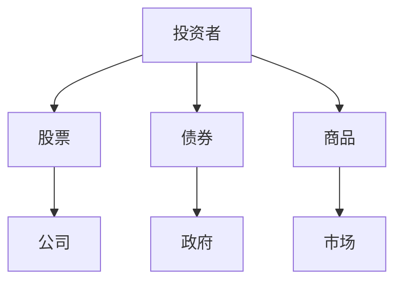
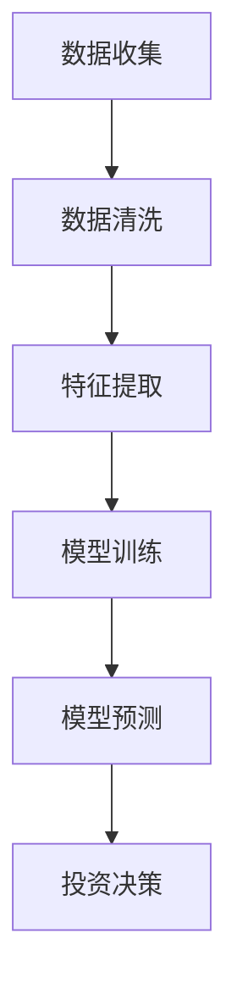
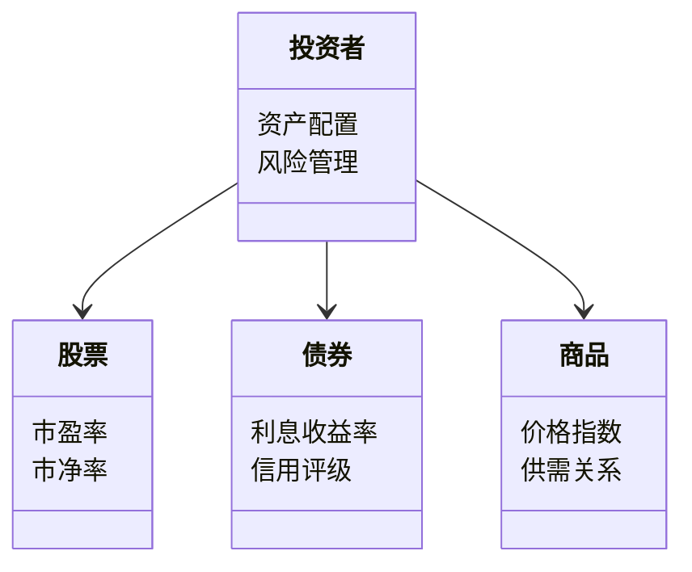
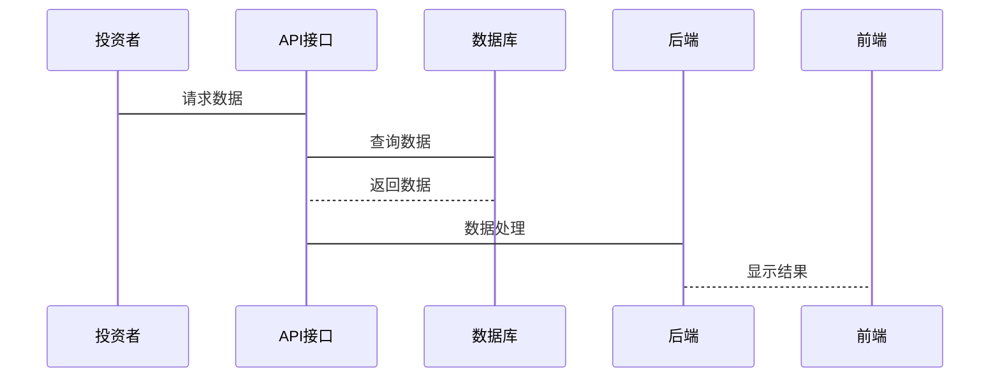

                 


# 特价股票投资中的跨资产类别系统性数字创新机会识别

> 关键词：特价股票投资、跨资产类别、系统性机会识别、数字创新、机器学习、金融数据分析

> 摘要：本文探讨了在特价股票投资中，如何利用跨资产类别分析和数字创新技术来识别系统性投资机会。文章从背景介绍、核心概念、算法原理、系统架构到项目实战，详细分析了如何通过大数据和机器学习技术，在跨资产类别中发现潜在的投资机会。文章还提供了具体的Python代码实现和案例分析，帮助读者更好地理解如何在实际投资中应用这些方法。

---

# 第1章: 特价股票投资的背景与概念

## 1.1 特价股票投资的定义与特点

### 1.1.1 特价股票的定义
特价股票通常指价格低于市场平均水平的股票，具有低估值的特点。这些股票可能因为市场波动、行业周期或其他因素而被低估，为投资者提供了潜在的高回报机会。

### 1.1.2 特价股票投资的特点
1. **低估值**：通常市盈率、市净率等指标低于行业平均水平。
2. **高波动性**：价格波动较大，可能带来短期收益。
3. **周期性**：受行业周期和市场情绪影响较大。
4. **风险较高**：低估股票可能隐藏着较高的风险，如公司基本面恶化。

### 1.1.3 特价股票投资的边界与外延
- **边界**：仅限于股票市场，不包括其他资产类别。
- **外延**：扩展到跨资产类别投资，如债券、基金等。

## 1.2 跨资产类别投资的背景

### 1.2.1 跨资产类别投资的定义
跨资产类别投资指同时投资于股票、债券、商品等多种资产类别，以分散风险并提高收益。

### 1.2.2 跨资产类别投资的优势
1. **风险分散**：通过投资不同资产类别降低单一资产的风险。
2. **收益增强**：不同资产类别的收益来源不同，可能带来更高的总体收益。
3. **对冲通货膨胀**：不同资产类别对通货膨胀的敏感性不同，可以有效对冲通胀风险。

### 1.2.3 跨资产类别投资的挑战
1. **复杂性增加**：需要对多种资产类别进行分析和管理。
2. **流动性风险**：某些资产类别的流动性可能较低，导致难以快速变现。
3. **协调性问题**：不同资产类别的波动性不同，可能导致投资组合的不稳定性。

## 1.3 数字创新在金融领域的应用

### 1.3.1 数字创新的定义
数字创新指利用新技术（如大数据、人工智能、区块链等）在金融领域的应用，以提高效率、降低成本并创造新的价值。

### 1.3.2 数字创新在金融领域的表现
1. **大数据分析**：利用海量数据进行预测和决策。
2. **人工智能**：通过机器学习算法进行自动化交易和风险管理。
3. **区块链技术**：用于金融交易的去中心化和安全性。

### 1.3.3 数字创新对投资决策的影响
1. **数据驱动决策**：通过大数据分析，投资者可以更准确地识别市场趋势和机会。
2. **自动化交易**：利用算法进行高频交易，提高交易效率。
3. **风险管理**：通过实时监控和预测模型，降低投资风险。

---

# 第2章: 系统性机会识别的核心概念与联系

## 2.1 系统性机会识别的原理

### 2.1.1 系统性机会识别的定义
系统性机会识别指通过系统化的方法，识别出具有长期增长潜力的投资机会。

### 2.1.2 系统性机会识别的关键要素
1. **数据**：包括历史价格、财务数据、市场情绪等。
2. **模型**：用于分析数据并预测未来趋势的数学模型。
3. **策略**：基于模型输出的投资策略。

### 2.1.3 系统性机会识别的流程
1. 数据收集与预处理。
2. 模型构建与训练。
3. 策略制定与执行。
4. 风险管理与优化。

## 2.2 跨资产类别分析的核心概念

### 2.2.1 跨资产类别分析的定义
跨资产类别分析指对多种资产类别进行综合分析，以识别潜在的投资机会。

### 2.2.2 跨资产类别分析的特征对比表

| 特征                | 股票         | 债券         | 商品         |
|---------------------|--------------|--------------|--------------|
| 收益类型            | 股息收益      | 利息收益      | 价格波动收益 |
| 风险水平            | 高           | 中            | 高           |
| 流动性              | 高           | 中            | 高           |
| 对市场敏感性        | 高           | 中            | 高           |

### 2.2.3 跨资产类别分析的ER实体关系图


## 2.3 数字创新与机会识别的关系

### 2.3.1 数字创新对机会识别的推动作用
1. **数据处理能力**：大数据技术可以处理海量数据，提高分析效率。
2. **算法优化**：人工智能算法可以提高预测准确性。
3. **实时监控**：通过实时数据流，投资者可以及时发现市场变化。

### 2.3.2 数字创新与机会识别的协同效应
1. **数据驱动决策**：通过数字技术，投资者可以基于实时数据做出决策。
2. **自动化交易**：利用算法进行自动化交易，提高交易效率。
3. **风险管理**：通过数字技术实时监控市场变化，降低投资风险。

### 2.3.3 数字创新对机会识别的未来影响
1. **智能化投资**：通过AI技术实现智能化投资决策。
2. **个性化投资**：基于投资者的风险偏好和目标，提供个性化的投资建议。
3. **全球化投资**：通过数字技术实现全球范围内的资产配置。

---

# 第3章: 系统性机会识别的算法原理

## 3.1 数据预处理与特征提取

### 3.1.1 数据清洗与标准化
1. **数据清洗**：去除无效数据，处理缺失值。
2. **标准化**：将数据标准化，使其具有相同的量纲。

### 3.1.2 特征选择与降维
1. **特征选择**：通过相关性分析选择重要特征。
2. **降维**：使用主成分分析（PCA）等方法降低数据维度。

### 3.1.3 时间序列数据分析
1. **时间序列分解**：将时间序列分解为趋势、季节性和随机成分。
2. **移动平均模型（MA）**：用于预测未来趋势。

## 3.2 机器学习模型构建

### 3.2.1 监督学习模型（如回归分析）
1. **线性回归**：用于预测股票价格。
2. **逻辑回归**：用于分类问题，如判断股票是否为低估股票。

### 3.2.2 非监督学习模型（如聚类分析）
1. **K-means聚类**：将股票分为不同的类别，识别潜在的投资机会。

### 3.2.3 深度学习模型（如LSTM）
1. **LSTM网络**：用于时间序列预测，捕捉长期依赖关系。

## 3.3 算法流程图



---

# 第4章: 系统分析与架构设计方案

## 4.1 系统功能设计

### 4.1.1 领域模型


### 4.1.2 系统架构设计


### 4.1.3 系统接口设计
1. **API接口**：用于获取实时数据和进行交易操作。
2. **用户界面**：供投资者查看分析结果和执行交易。

### 4.1.4 系统交互流程


---

# 第5章: 项目实战

## 5.1 环境安装

### 5.1.1 安装Python
```bash
python --version
pip install numpy pandas scikit-learn
```

### 5.1.2 安装其他工具
```bash
pip install plotly matplotlib
```

## 5.2 系统核心实现源代码

### 5.2.1 数据预处理
```python
import pandas as pd
import numpy as np

# 数据加载
data = pd.read_csv('data.csv')

# 数据清洗
data = data.dropna()

# 标准化
from sklearn.preprocessing import StandardScaler
scaler = StandardScaler()
data_scaled = scaler.fit_transform(data)
```

### 5.2.2 模型构建
```python
from sklearn.linear_model import LinearRegression
model = LinearRegression()
model.fit(X_train, y_train)
```

## 5.3 案例分析

### 5.3.1 数据分析
1. **数据可视化**：使用Matplotlib或Plotly绘制股票价格趋势图。
2. **模型验证**：通过回测检验模型的有效性。

### 5.3.2 投资策略制定
1. **多头策略**：当模型预测价格将上涨时，买入股票。
2. **空头策略**：当模型预测价格将下跌时，卖出股票。

## 5.4 项目小结
通过本项目，我们展示了如何利用大数据和机器学习技术，在跨资产类别中识别投资机会。实际案例分析表明，系统性机会识别方法可以在一定程度上提高投资收益。

---

# 小结

通过本文的分析，我们了解了在特价股票投资中，如何利用跨资产类别分析和数字创新技术来识别系统性投资机会。文章从背景介绍、核心概念、算法原理到系统架构和项目实战，详细讲解了如何通过大数据和机器学习技术，提高投资决策的准确性和效率。

---

# 注意事项

1. **数据风险**：数据来源和质量直接影响模型的准确性。
2. **模型风险**：模型的有效性和可解释性需要持续监控和优化。
3. **市场风险**：市场波动和突发事件可能对投资结果产生重大影响。

---

# 拓展阅读

1. **《Python机器学习实战》**：深入学习机器学习算法的实现与应用。
2. **《金融数据分析与R》**：利用R语言进行金融数据分析。
3. **《数字金融与区块链》**：探讨数字技术在金融领域的应用。

---

作者：AI天才研究院/AI Genius Institute & 禅与计算机程序设计艺术 /Zen And The Art of Computer Programming

