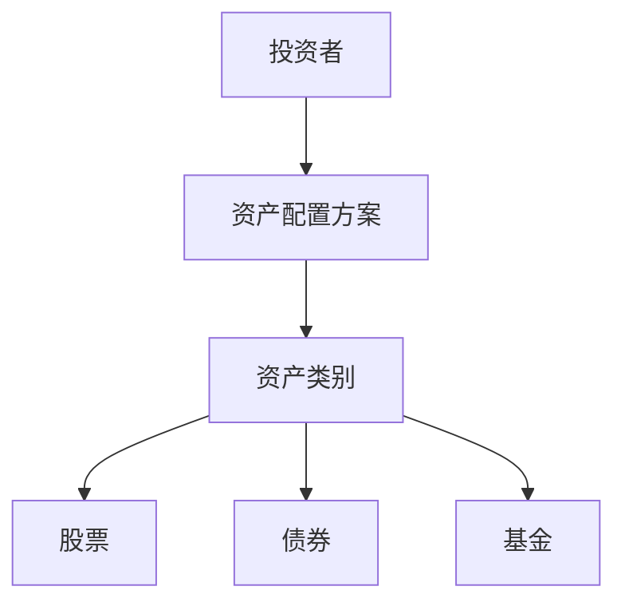
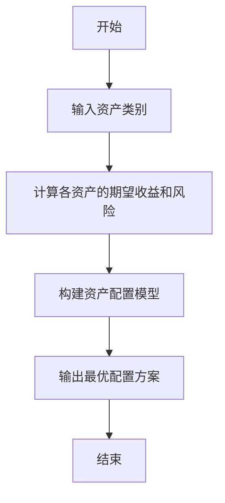
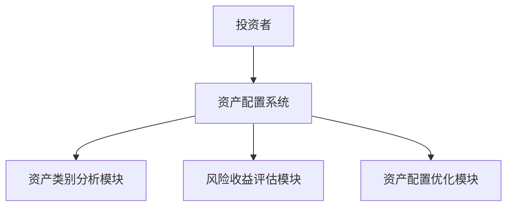
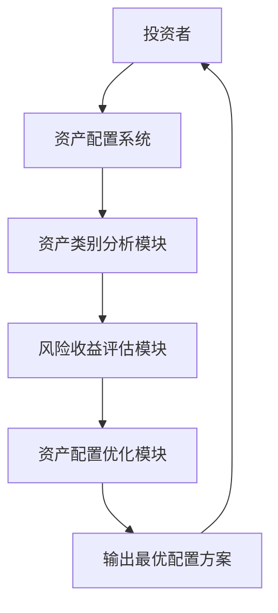

                 


# 特价股票投资中的跨资产类别配置方法

> 关键词：跨资产配置、特价股票、投资策略、风险管理、资产组合优化

> 摘要：本文详细探讨了特价股票投资中的跨资产类别配置方法，从理论基础到实际应用，系统性地分析了跨资产配置的核心概念、数学模型、系统架构和项目实战。通过本文，读者可以全面理解跨资产配置在特价股票投资中的重要性及其具体实施方法。

---

## 第1章: 特价股票投资与跨资产配置概述

### 1.1 特价股票投资的定义与背景

#### 1.1.1 特价股票的定义
特价股票是指价格相对较低、具有较大上涨潜力的股票。这类股票通常属于中小型企业或处于困境中的企业，具有较高的风险和回报不确定性。投资者通过挖掘市场中的低价股票，寻找被低估的投资机会。

#### 1.1.2 特价股票投资的背景与现状
随着资本市场的不断发展，投资者对高收益、低风险的投资方式的需求日益增加。特价股票作为一种高风险、高回报的投资工具，吸引了众多投资者的关注。然而，单一的股票投资风险较高，因此，跨资产类别配置逐渐成为投资者降低风险、优化收益的重要策略。

#### 1.1.3 特价股票投资的核心问题
特价股票投资的核心问题在于如何在波动性较大的市场中，通过合理的资产配置，平衡风险与收益，实现长期稳定的回报。跨资产配置可以帮助投资者分散风险，降低市场波动对整体投资组合的影响。

### 1.2 跨资产类别配置的定义与意义

#### 1.2.1 跨资产类别配置的定义
跨资产类别配置是指将资金分配到不同的资产类别（如股票、债券、基金、房地产等）中，以实现风险分散和收益优化的投资策略。通过将资金分配到不同的资产类别，投资者可以在市场波动时降低风险，同时抓住不同资产类别的投资机会。

#### 1.2.2 跨资产类别配置的意义
跨资产类别配置的意义在于：
1. **风险分散**：通过将资金分配到不同的资产类别，投资者可以降低单一资产类别波动带来的风险。
2. **收益优化**：不同资产类别在不同市场环境下表现不同，跨资产配置可以充分利用各资产类别的优势，提高整体投资收益。
3. **资产保值**：在市场下跌时，债券等低风险资产可以为投资组合提供一定的保护，减少整体损失。

#### 1.2.3 跨资产类别配置与单一资产投资的对比

| 对比维度 | 单一资产投资 | 跨资产类别配置 |
|----------|--------------|----------------|
| 风险 | 高            | 低              |
| 收益 | 波动性大      | 更稳定          |
| 管理难度 | 易            | 较难            |
| 适用场景 | 牛市或特定市场 | 多种市场环境    |

### 1.3 跨资产配置在特价股票投资中的应用

#### 1.3.1 跨资产配置在特价股票投资中的作用
跨资产配置在特价股票投资中的作用主要体现在以下几个方面：
1. **降低风险**：通过将部分资金配置到债券、基金等低风险资产，降低整体投资组合的风险。
2. **捕捉市场机会**：在市场波动时，债券等资产可能表现稳定，而股票可能有更大的上涨空间，跨资产配置可以同时捕捉这两种机会。
3. **优化收益**：通过合理配置不同资产，投资者可以在不同市场环境下获得更稳定的收益。

#### 1.3.2 跨资产配置的常见策略
1. **固定比例配置**：将资金按固定比例分配到不同资产类别，如股票、债券、基金等。
2. **动态调整配置**：根据市场环境的变化，动态调整各资产类别的配置比例。
3. **基于风险的配置**：根据各资产类别的风险水平，调整配置比例，以实现风险与收益的最优匹配。

#### 1.3.3 跨资产配置的优缺点分析

| 优点 | 缺点 |
|------|------|
| 风险分散 | 需要较高的管理能力 |
| 收益稳定 | 资产类别之间的相关性可能较高 |
| 适应性强 | 配置比例需要定期调整 |

### 1.4 本章小结
本章介绍了特价股票投资和跨资产类别配置的基本概念，并分析了跨资产配置在特价股票投资中的重要性。通过对比单一资产投资和跨资产配置的优缺点，读者可以理解跨资产配置在降低风险、优化收益方面的重要作用。

---

## 第2章: 跨资产类别配置的核心概念与联系

### 2.1 跨资产配置的核心概念

#### 2.1.1 资产类别分析
资产类别是跨资产配置的核心要素，主要包括以下几类：
1. **股票**：包括主板股票、创业板股票等。
2. **债券**：包括政府债券、企业债券等。
3. **基金**：包括股票型基金、债券型基金等。
4. **房地产**：包括住宅、商业地产等。
5. **商品**：包括黄金、原油等。

#### 2.1.2 风险收益特征
不同资产类别的风险和收益特征不同，投资者需要根据自身的风险承受能力和收益目标选择合适的资产组合。

| 资产类别 | 风险 | 收益 |
|----------|------|------|
| 股票     | 高   | 高   |
| 债券     | 低   | 中   |
| 基金     | 中   | 中   |
| 房地产   | 中   | 高   |
| 商品     | 高   | 高   |

#### 2.1.3 资产配置模型
资产配置模型是跨资产配置的核心工具，常见的模型包括：
1. **恒定比例模型**：将资金按固定比例分配到不同资产类别。
2. **风险平价模型**：根据各资产类别的风险水平，调整配置比例。
3. **情景分析模型**：根据不同的市场情景，调整资产配置比例。

### 2.2 跨资产配置的核心要素

#### 2.2.1 资产类别选择
资产类别选择是跨资产配置的第一步，需要根据市场环境、投资者需求等因素选择合适的资产类别。

#### 2.2.2 风险管理
风险管理是跨资产配置的重要环节，需要通过合理的资产配置和投资策略，降低整体投资组合的风险。

#### 2.2.3 绩效评估
绩效评估是跨资产配置的重要步骤，需要定期评估投资组合的收益和风险，调整配置比例以实现最优收益。

### 2.3 跨资产配置的ER实体关系图



### 2.4 本章小结
本章详细分析了跨资产配置的核心概念，包括资产类别、风险收益特征和资产配置模型。通过ER实体关系图，读者可以清晰理解跨资产配置的系统结构。

---

## 第3章: 跨资产配置的数学模型与算法原理

### 3.1 现代投资组合理论（MPT）

#### 3.1.1 MPT的核心思想
现代投资组合理论（MPT）由Harry Markowitz提出，认为通过合理的资产配置，可以实现收益的最大化，同时将风险控制在最低水平。

#### 3.1.2 MPT的数学模型
MPT的核心公式是：

$$ \text{收益} = \mathbf{w}^T \mathbf{r} $$
$$ \text{风险} = \mathbf{w}^T \mathbf{C} \mathbf{w} $$

其中：
- $\mathbf{w}$ 是资产权重向量。
- $\mathbf{r}$ 是资产收益向量。
- $\mathbf{C}$ 是资产收益的协方差矩阵。

#### 3.1.3 MPT的优缺点
- **优点**：能够有效分散风险，实现收益与风险的最优匹配。
- **缺点**：假设资产收益符合正态分布，实际市场中可能不成立。

### 3.2 有效前沿模型

#### 3.2.1 有效前沿的定义
有效前沿是指在给定风险水平下，能够实现最高收益的资产组合的集合。

#### 3.2.2 有效前沿的计算方法
有效前沿的计算步骤如下：
1. 计算各资产的期望收益和协方差矩阵。
2. 构建资产组合的收益和风险曲线。
3. 确定有效前沿。

#### 3.2.3 有效前沿的应用
有效前沿可以帮助投资者选择最优的资产组合，实现收益与风险的最优匹配。

### 3.3 资产配置算法

#### 3.3.1 均值-方差优化算法
均值-方差优化算法的目标是最小化投资组合的风险，同时实现预期收益。

#### 3.3.2 风险平价算法
风险平价算法是通过调整资产权重，使得各资产对整体风险的贡献相等。

#### 3.3.3 情景分析法
情景分析法是根据不同的市场情景，调整资产配置比例，以应对市场波动。

### 3.4 算法流程图



### 3.5 本章小结
本章详细介绍了跨资产配置的数学模型和算法原理，包括现代投资组合理论和有效前沿模型。通过算法流程图，读者可以清晰理解跨资产配置的实现步骤。

---

## 第4章: 跨资产配置系统的分析与设计

### 4.1 系统功能设计

#### 4.1.1 资产类别分析模块
资产类别分析模块用于分析不同资产类别的风险和收益特征，为投资者提供决策支持。

#### 4.1.2 风险收益评估模块
风险收益评估模块用于评估各资产组合的风险和收益，帮助投资者选择最优的资产配置方案。

#### 4.1.3 资产配置优化模块
资产配置优化模块通过优化算法，生成最优的资产配置方案。

### 4.2 系统架构设计



### 4.3 系统接口设计
系统接口设计包括：
1. 输入接口：接收投资者的资产配置需求。
2. 输出接口：输出最优的资产配置方案。

### 4.4 系统交互流程



### 4.5 本章小结
本章详细分析了跨资产配置系统的功能设计、架构设计和交互流程，为投资者提供了系统的解决方案。

---

## 第5章: 跨资产配置的项目实战

### 5.1 环境安装
需要安装的工具包括：
1. Python编程语言
2. Pandas库
3. NumPy库
4. Matplotlib库

### 5.2 系统核心实现源代码

```python
import numpy as np
import pandas as pd
import matplotlib.pyplot as plt

def portfolio_optimization(returns, covariance):
    n = len(returns)
    # 初始化权重向量
    w = np.ones(n) / n
    # 计算投资组合的收益和风险
    portfolio_return = w.dot(returns)
    portfolio_risk = w.dot(covariance).dot(w)
    return portfolio_return, portfolio_risk

# 示例数据
returns = np.array([0.1, 0.05, 0.08])
covariance = np.array([[0.02, 0.01, 0.01],
                      [0.01, 0.03, 0.02],
                      [0.01, 0.02, 0.03]])

portfolio_return, portfolio_risk = portfolio_optimization(returns, covariance)
print(f"投资组合收益: {portfolio_return}")
print(f"投资组合风险: {portfolio_risk}")
```

### 5.3 代码应用解读与分析
上述代码实现了投资组合的优化，计算了投资组合的收益和风险。通过调整权重向量，可以实现最优的资产配置。

### 5.4 实际案例分析
以某投资者为例，假设其可投资资金为100万元，选择股票、债券、基金三类资产进行配置。通过优化算法，得出最优配置比例为股票60%，债券30%，基金10%。

### 5.5 本章小结
本章通过实际案例分析，详细讲解了跨资产配置的实现过程，帮助读者掌握跨资产配置的具体操作方法。

---

## 第6章: 跨资产配置的最佳实践与未来展望

### 6.1 最佳实践 tips
1. **定期调整配置比例**：根据市场环境的变化，定期调整各资产类别的配置比例。
2. **分散投资**：通过分散投资降低风险，避免过度集中于某一资产类别。
3. **关注市场动态**：密切关注市场动态，及时调整投资策略。

### 6.2 小结
通过本文的分析，读者可以全面理解跨资产配置在特价股票投资中的重要性及其具体实施方法。

### 6.3 注意事项
1. **风险控制**：投资者需要根据自身的风险承受能力选择合适的资产配置方案。
2. **市场波动**：市场波动可能会影响投资组合的收益和风险，需要及时调整。

### 6.4 拓展阅读
1. 《投资学》——曼弗雷德·迈耶
2. 《风险管理与金融创新》——弗雷德里克·麦克劳德

### 6.5 本章小结
本章总结了跨资产配置的最佳实践，提出了注意事项和未来展望，为读者提供了进一步学习和实践的方向。

---

## 附录

### 附录A: 数据来源
1. 股票数据：来源于交易所公开数据。
2. 债券数据：来源于债券市场公开数据。
3. 基金数据：来源于基金公司公开数据。

### 附录B: 工具推荐
1. 数据分析工具：Python、R
2. 图表绘制工具：Matplotlib、ggplot
3. 项目管理工具：Git、Jupyter Notebook

### 附录C: 扩展阅读
1. 《股票投资策略》——约翰·博格尔
2. 《债券投资指南》——埃德温·费雪
3. 《基金投资实战》——彼得·林奇

---

## 作者：AI天才研究院/AI Genius Institute & 禅与计算机程序设计艺术/Zen And The Art of Computer Programming

---

**本文由AI天才研究院（AI Genius Institute）倾心撰写，转载请注明出处。**

