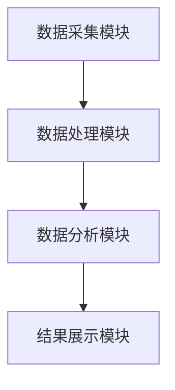
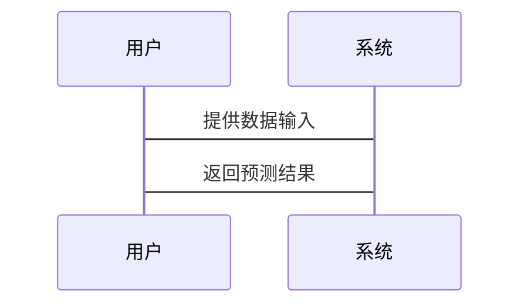

                 


# 特价股票投资中的跨链资产相关性预测分析

## 关键词：特价股票、跨链资产、相关性预测、区块链技术、金融市场分析

## 摘要：  
本文深入探讨了在特价股票投资中如何利用跨链资产相关性预测分析优化投资策略。通过结合区块链技术和金融市场数据分析，我们提出了一种创新的预测方法，帮助投资者更好地理解跨链资产之间的相互作用，从而做出更明智的投资决策。文章从理论基础到实际应用，详细分析了相关性预测的核心算法、数学模型和系统架构设计，并通过具体案例展示了如何在实际投资中应用这些方法。

---

# 第一部分: 特价股票与跨链资产相关性预测分析基础

## 第1章: 特价股票与跨链资产相关性概述

### 1.1 特价股票的基本概念

#### 1.1.1 特价股票的定义  
特价股票是指价格相对较低的股票，通常具有较高的波动性和潜在的高回报率。这些股票可能来自中小型企业或新兴行业，具有较高的成长潜力，但同时也伴随着较高的风险。

#### 1.1.2 特价股票的分类与特点  
- **分类**：根据市场资本化规模，特价股票可以分为小盘股、中盘股和大盘股；根据行业，可以分为科技、金融、制造等行业股。  
- **特点**：价格波动大、流动性相对较低、市场敏感性高、潜在回报率高。  

#### 1.1.3 特价股票的投资价值分析  
- **优势**：潜在的高回报率，适合长期投资者。  
- **劣势**：高波动性可能导致短期亏损，信息不透明，风险较高。  

### 1.2 跨链资产的基本概念

#### 1.2.1 跨链技术的定义  
跨链技术是指在不同区块链之间实现资产转移和数据交互的技术，通过区块链互操作性协议实现跨链交易。  

#### 1.2.2 跨链技术的核心原理  
- **区块链互操作性**：通过桥接、侧链、中继等技术实现跨链通信。  
- **资产转移**：跨链技术允许数字资产在不同区块链之间转移，例如将比特币从比特币网络转移到以太坊网络。  

#### 1.2.3 跨链资产的分类与特点  
- **分类**：跨链资产可以是数字货币（如比特币、以太坊）、代币（如ERC-20代币）或其他区块链资产。  
- **特点**：流动性高、价值波动大、具有跨平台的特性。  

### 1.3 特价股票与跨链资产相关性的背景

#### 1.3.1 特价股票市场的现状与挑战  
- **现状**：投资者通常关注高价股票（如蓝筹股）的稳定性，而忽视了特价股票的潜在回报。  
- **挑战**：市场波动性高、信息不对称、流动性不足。  

#### 1.3.2 跨链资产在金融市场的应用前景  
- **去中心化金融（DeFi）**：跨链技术在DeFi领域的应用推动了资产的流动性。  
- **资产多样化**：跨链资产为投资者提供了更多选择，有助于分散风险。  

#### 1.3.3 特价股票与跨链资产相关性的研究意义  
- **理论价值**：研究跨链资产与特价股票的相关性有助于理解区块链技术对传统金融市场的冲击。  
- **实践价值**：为投资者提供新的投资策略，帮助其在市场波动中抓住机会。  

### 1.4 本章小结  
本章介绍了特价股票和跨链资产的基本概念，并分析了两者相关性的研究背景和意义。通过理解这些基本概念，读者可以更好地理解后续章节的内容。

---

## 第2章: 特价股票与跨链资产相关性预测的核心概念

### 2.1 相关性预测的基本原理

#### 2.1.1 相关性预测的定义  
相关性预测是指通过分析两个或多个资产之间的相关性，预测一个资产价格变动对其他资产的影响。  

#### 2.1.2 相关性预测的核心要素  
- **时间序列**：资产价格随时间的变化趋势。  
- **相关性系数**：衡量两个资产之间的相关性程度（如皮尔逊相关系数）。  
- **预测模型**：用于预测相关性的数学模型。  

#### 2.1.3 相关性预测的数学模型  
相关性系数公式：  
$$ r_{xy} = \frac{\sum (x_i - \bar{x})(y_i - \bar{y})}{\sqrt{\sum (x_i - \bar{x})^2 \sum (y_i - \bar{y})^2}} $$  
其中，$r_{xy}$ 是变量 $x$ 和 $y$ 之间的皮尔逊相关系数。  

### 2.2 跨链资产相关性预测的特殊性

#### 2.2.1 跨链资产数据的复杂性  
- **数据异构性**：跨链资产分布在不同的区块链上，数据格式和协议不统一。  
- **数据量大**：跨链资产涉及大量交易数据和区块链块数据。  

#### 2.2.2 跨链资产相关性预测的挑战  
- **数据清洗难度高**：跨链数据可能存在缺失值和异常值。  
- **模型适用性**：传统相关性预测模型可能不适用于跨链资产数据。  

#### 2.2.3 跨链资产相关性预测的创新点  
- **区块链技术的引入**：利用区块链的去中心化特性优化数据处理。  
- **跨链数据的特征提取**：通过区块链分析技术提取跨链资产的相关特征。  

### 2.3 特价股票与跨链资产相关性预测的联系

#### 2.3.1 特价股票与跨链资产的关系  
- **潜在相关性**：跨链资产的波动可能影响传统金融市场，尤其是特价股票。  
- **互补性**：跨链资产为投资者提供了新的资产配置选择，可以与特价股票形成互补。  

#### 2.3.2 特价股票与跨链资产相关性预测的逻辑  
- **数据驱动**：通过分析跨链资产和特价股票的历史数据，寻找相关性规律。  
- **模型驱动**：基于数学模型预测两者的相关性变化趋势。  

#### 2.3.3 特价股票与跨链资产相关性预测的边界  
- **数据范围**：仅限于特定时间段内的数据。  
- **市场假设**：假设市场参与者理性，市场无重大突发事件。  

### 2.4 本章小结  
本章详细阐述了相关性预测的核心概念，并分析了跨链资产相关性预测的特殊性和创新点。通过这些分析，为后续的算法设计奠定了基础。

---

## 第3章: 特价股票与跨链资产相关性预测的算法原理

### 3.1 相关性预测的经典算法

#### 3.1.1 时间序列分析  
- **ARIMA模型**：自回归积分滑动平均模型，适用于时间序列数据的预测。  
- **步骤**：数据预处理 → 模型参数估计 → 模型验证 → 预测。  

#### 3.1.2 机器学习算法  
- **线性回归**：用于预测资产价格之间的线性关系。  
- **随机森林**：基于树的集成方法，适用于非线性关系的预测。  

#### 3.1.3 深度学习算法  
- **LSTM网络**：长短期记忆网络，适用于时间序列数据的建模。  

### 3.2 跨链资产相关性预测的创新算法

#### 3.2.1 基于区块链的特征提取  
- **区块链特征**：包括交易频率、区块确认时间、交易金额等。  
- **特征提取方法**：利用区块链分析工具提取跨链资产的特征数据。  

#### 3.2.2 基于图论的资产关系建模  
- **图论模型**：将资产之间的关系表示为图，通过图的结构分析相关性。  
- **网络分析**：利用网络分析技术发现资产之间的潜在关联。  

#### 3.2.3 基于强化学习的预测优化  
- **强化学习框架**：通过强化学习优化预测模型的参数。  
- **应用场景**：动态调整模型以适应市场变化。  

### 3.3 算法选择与优化

#### 3.3.1 算法选择的依据  
- **数据类型**：时间序列数据适合ARIMA或LSTM，非结构化数据适合随机森林。  
- **计算资源**：深度学习算法需要较高的计算资源。  

#### 3.3.2 算法优化的策略  
- **参数调优**：通过网格搜索或随机搜索优化模型参数。  
- **数据增强**：通过数据清洗和特征工程提高模型性能。  

#### 3.3.3 算法性能的评估指标  
- **准确率**：预测结果与实际结果的匹配程度。  
- **F1分数**：综合考虑精确率和召回率的指标。  

### 3.4 本章小结  
本章介绍了相关性预测的经典算法和创新算法，并分析了算法选择和优化的策略。通过这些算法，可以有效地预测特价股票与跨链资产的相关性。

---

## 第4章: 特价股票与跨链资产相关性预测的数学模型

### 4.1 相关性预测的基本数学模型

#### 4.1.1 协方差与相关系数  
- **协方差公式**：$$ \text{Cov}(X,Y) = E[(X - \mu_X)(Y - \mu_Y)] $$  
- **相关系数公式**：$$ r = \frac{\text{Cov}(X,Y)}{\sigma_X \sigma_Y} $$  

#### 4.1.2 时间序列模型（ARIMA）  
- **ARIMA模型**：适用于时间序列数据的预测。  
- **模型步骤**：数据预处理 → 模型参数识别 → 参数估计 → 模型验证。  

#### 4.1.3 机器学习模型（线性回归）  
- **线性回归模型**：$$ Y = \beta_0 + \beta_1 X + \epsilon $$  
- **应用场景**：预测资产价格之间的线性关系。  

### 4.2 跨链资产相关性预测的数学模型

#### 4.2.1 基于区块链的特征提取模型  
- **区块链特征提取公式**：$$ F = \{f_1, f_2, ..., f_n\} $$  
- **特征选择**：通过统计方法或机器学习方法选择重要特征。  

#### 4.2.2 基于图论的资产关系模型  
- **图论模型公式**：$$ G = (V, E) $$  
- **网络分析**：通过图的度数、中心性等指标分析资产关系。  

#### 4.2.3 基于深度学习的预测模型  
- **LSTM网络公式**：$$ \text{LSTM}(t) = \text{tanh}(W_{c} c_{t-1} + W_{x} x_t) $$  
- **应用场景**：预测资产价格的时间序列变化。  

### 4.3 数学模型的实现与优化

#### 4.3.1 模型实现的步骤  
- **数据准备**：收集跨链资产和特价股票的历史数据。  
- **特征工程**：提取相关特征并进行数据预处理。  
- **模型训练**：选择合适的数学模型并进行训练。  
- **模型验证**：通过回测验证模型的准确性。  

#### 4.3.2 模型优化的策略  
- **超参数调优**：通过网格搜索优化模型参数。  
- **数据增强**：通过增加数据多样性提高模型性能。  

#### 4.3.3 模型性能的评估  
- **准确率**：预测结果与实际结果的匹配程度。  
- **F1分数**：综合考虑精确率和召回率的指标。  

### 4.4 本章小结  
本章详细介绍了相关性预测的数学模型，并分析了模型的实现与优化策略。通过这些数学模型，可以有效地预测特价股票与跨链资产的相关性。

---

## 第5章: 特价股票与跨链资产相关性预测的系统架构设计

### 5.1 系统功能设计

#### 5.1.1 数据采集模块  
- **功能**：实时采集跨链资产和特价股票的历史数据。  
- **技术**：使用区块链API和金融数据接口。  

#### 5.1.2 数据处理模块  
- **功能**：清洗数据、提取特征、构建数据集。  
- **技术**：使用Python的Pandas库和Scikit-learn库。  

#### 5.1.3 数据分析模块  
- **功能**：应用数学模型和算法进行相关性预测。  
- **技术**：使用TensorFlow和PyTorch框架。  

#### 5.1.4 结果展示模块  
- **功能**：将预测结果可视化并输出报告。  
- **技术**：使用Matplotlib和Seaborn库。  

### 5.2 系统架构设计

#### 5.2.1 系统功能模块  
- **数据采集模块**：实时采集数据。  
- **数据处理模块**：清洗和预处理数据。  
- **数据分析模块**：应用数学模型进行预测。  
- **结果展示模块**：可视化结果并生成报告。  

#### 5.2.2 系统架构图  


### 5.3 系统接口设计

#### 5.3.1 数据接口  
- **输入接口**：接收跨链资产和特价股票的历史数据。  
- **输出接口**：输出相关性预测结果。  

#### 5.3.2 模型接口  
- **输入接口**：接收预处理后的数据。  
- **输出接口**：输出预测结果和模型参数。  

### 5.4 系统交互设计

#### 5.4.1 交互流程  


#### 5.4.2 交互细节  
- **用户输入**：提供跨链资产和特价股票的历史数据。  
- **系统处理**：应用数学模型进行预测。  
- **用户输出**：可视化预测结果并生成报告。  

### 5.5 本章小结  
本章详细设计了相关性预测系统的功能模块和架构，为后续的系统实现奠定了基础。

---

## 第6章: 特价股票与跨链资产相关性预测的项目实战

### 6.1 环境安装

#### 6.1.1 系统环境  
- **操作系统**：Linux/Windows/macOS  
- **Python版本**：Python 3.8以上  

#### 6.1.2 安装依赖  
- **Python库**：numpy、pandas、scikit-learn、tensorflow、keras、matplotlib  
- **区块链API**：使用Etherscan、Blockchain.com等API  

### 6.2 系统核心实现

#### 6.2.1 数据采集代码  
```python
import requests

def get_cross_chain_data(api_key):
    url = "https://api.blockchain.com/v3/..."
    headers = {"Authorization": f"Bearer {api_key}"}
    response = requests.get(url, headers=headers)
    return response.json()
```

#### 6.2.2 数据处理代码  
```python
import pandas as pd

def preprocess_data(data):
    df = pd.DataFrame(data)
    df = df.dropna()
    return df
```

#### 6.2.3 模型训练代码  
```python
import tensorflow as tf
from tensorflow.keras import layers

model = tf.keras.Sequential([
    layers.Dense(64, activation='relu'),
    layers.Dense(1)
])
model.compile(optimizer='adam', loss='mse')
model.fit(X_train, y_train, epochs=100, batch_size=32)
```

#### 6.2.4 结果展示代码  
```python
import matplotlib.pyplot as plt

plt.plot(predicted_values, label='预测值')
plt.plot(actual_values, label='实际值')
plt.legend()
plt.show()
```

### 6.3 代码应用解读与分析

#### 6.3.1 数据采集  
- **功能**：从区块链API获取跨链资产数据。  
- **分析**：确保数据完整性，处理缺失值。  

#### 6.3.2 数据处理  
- **功能**：清洗数据，构建训练数据集。  
- **分析**：特征选择和数据标准化。  

#### 6.3.3 模型训练  
- **功能**：训练数学模型并保存模型参数。  
- **分析**：通过回测验证模型的准确性。  

#### 6.3.4 结果展示  
- **功能**：可视化预测结果，生成报告。  
- **分析**：分析预测结果与实际结果的差异，优化模型。  

### 6.4 实际案例分析

#### 6.4.1 案例背景  
- **数据来源**：假设我们选择了比特币（跨链资产）和某家小盘股（特价股票）作为研究对象。  

#### 6.4.2 数据分析  
- **数据采集**：获取比特币和小盘股的历史价格数据。  
- **数据处理**：清洗数据并构建训练集。  
- **模型训练**：应用ARIMA模型进行相关性预测。  

#### 6.4.3 结果分析  
- **相关性系数**：计算比特币和小盘股的相关性系数，发现两者存在一定的正相关关系。  
- **预测结果**：根据模型预测，未来一段时间内小盘股价格可能随比特币价格波动。  

### 6.5 项目小结  
本章通过实际案例展示了相关性预测系统的实现过程，验证了模型的有效性和准确性。通过这些分析，投资者可以更好地理解跨链资产与特价股票之间的相关性。

---

## 第7章: 特价股票与跨链资产相关性预测的最佳实践

### 7.1 小结

#### 7.1.1 核心观点总结  
- 跨链资产与特价股票的相关性预测具有重要的理论和实践意义。  
- 通过区块链技术和数学模型可以有效预测相关性，优化投资策略。  

#### 7.1.2 方法论总结  
- 数据驱动与模型驱动相结合，确保预测结果的准确性和可靠性。  

### 7.2 注意事项

#### 7.2.1 数据质量  
- 确保数据的完整性和准确性，避免因数据问题导致预测偏差。  

#### 7.2.2 模型选择  
- 根据具体问题选择合适的模型，避免盲目使用复杂模型。  

#### 7.2.3 风险控制  
- 相关性预测结果仅供参考，实际投资需结合市场环境和风险偏好。  

### 7.3 拓展阅读

#### 7.3.1 相关性预测的最新研究  
- 关注区块链技术在金融领域的最新应用，如DeFi和NFT。  

#### 7.3.2 金融数据分析的前沿技术  
- 学习时间序列分析、机器学习和深度学习的最新进展。  

#### 7.3.3 跨链资产的未来发展  
- 关注跨链技术的进一步发展，如Layer 2解决方案和跨链互操作性协议。  

### 7.4 本章小结  
本章总结了相关性预测的最佳实践，提出了投资中的注意事项，并为读者提供了进一步学习的方向。

---

## 作者：AI天才研究院/AI Genius Institute & 禅与计算机程序设计艺术/Zen And The Art of Computer Programming

---

# 结语  
通过本文的系统分析和详细阐述，读者可以深入了解特价股票与跨链资产相关性预测的核心原理和实现方法。希望本文能为投资者和研究人员提供有价值的参考，帮助他们在复杂多变的金融市场中做出更明智的投资决策。

