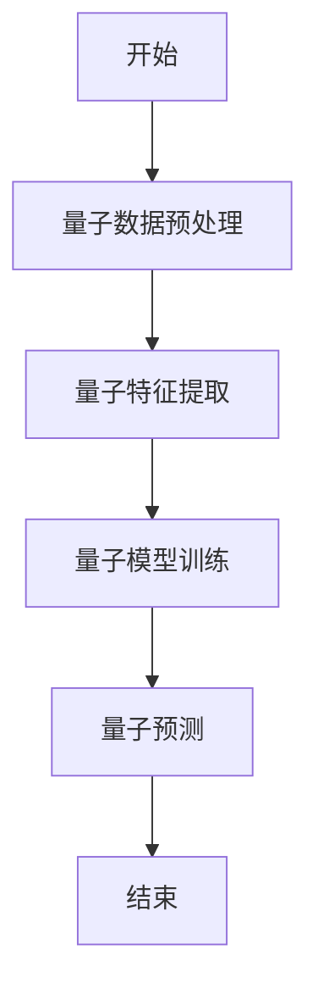

                 


# 特价股票投资中的量子传感网络大数据分析与应用

## 关键词：特价股票投资，量子传感网络，大数据分析，量子通信，金融数据分析

## 摘要：本文探讨了量子传感网络技术在特价股票投资中的应用，通过分析量子传感网络的数据采集与处理能力，结合大数据分析方法，提出了一种基于量子增强的大数据分析算法，以优化股票投资决策。文章详细介绍了量子传感网络的原理、大数据分析的基础、量子增强算法的实现，以及系统架构设计，并通过实际案例展示了该方法的应用效果。

---

## 第一部分: 背景介绍

### 第1章: 特价股票投资与量子传感网络概述

#### 1.1 特价股票投资的定义与特点
- **1.1.1 特价股票的定义**  
  特价股票通常指那些市场价格低于其内在价值的股票，具有较高的投资潜力。  
- **1.1.2 特价股票投资的核心特点**  
  - 市场价格低估  
  - 高成长潜力  
  - 投资风险较高  
- **1.1.3 特价股票投资的市场定位**  
  特价股票主要集中在中小型企业或新兴行业，具有较大的市场波动性。

#### 1.2 量子传感网络的定义与特点
- **1.2.1 量子传感的基本概念**  
  量子传感是利用量子力学原理，通过量子态的变化来检测环境中的微小变化。  
- **1.2.2 量子传感网络的构成与优势**  
  - **构成**：由量子传感器、量子通信链路和数据处理中心组成。  
  - **优势**：高灵敏度、抗干扰能力强、数据传输安全。  
- **1.2.3 量子传感网络的应用领域**  
  量子传感网络广泛应用于军事、医疗、环境监测等领域，本文关注其在金融领域的应用。

#### 1.3 特价股票投资与量子传感网络的结合
- **1.3.1 量子传感网络在金融领域的应用潜力**  
  量子传感网络可以实时监测市场波动，捕捉潜在的投资机会。  
- **1.3.2 特价股票投资中的大数据分析需求**  
  大数据分析是识别市场趋势和投资机会的关键工具。  
- **1.3.3 量子传感网络与大数据分析的结合方式**  
  通过量子传感网络实时采集市场数据，结合大数据分析技术，优化投资决策。

---

## 第二部分: 量子传感网络的原理与技术

### 第2章: 量子传感网络的原理与技术

#### 2.1 量子传感的基本原理
- **2.1.1 量子力学基础**  
  量子力学是研究微观粒子行为的科学，其核心概念包括波函数、叠加态和纠缠态。  
- **2.1.2 量子传感器的工作原理**  
  量子传感器通过测量量子态的变化来感知外部环境的变化，具有极高的灵敏度。  
- **2.1.3 量子传感网络的构建过程**  
  量子传感网络由多个量子传感器节点组成，通过量子通信技术实现数据的实时传输和处理。

#### 2.2 量子通信在传感网络中的应用
- **2.2.1 量子通信的基本概念**  
  量子通信利用量子态进行信息传输，具有绝对安全性。  
- **2.2.2 量子通信在传感网络中的作用**  
  - 数据传输的抗干扰性  
  - 数据传输的高安全性  
- **2.2.3 量子通信的安全性与可靠性**  
  量子通信基于量子纠缠原理，确保数据传输的安全性和可靠性。

#### 2.3 量子传感网络的数据采集与处理
- **2.3.1 数据采集的量子增强技术**  
  量子传感器能够捕捉到传统传感器无法检测的微小信号变化。  
- **2.3.2 数据预处理的量子算法**  
  使用量子傅里叶变换等算法对数据进行快速处理和压缩。  
- **2.3.3 数据存储的量子优化方法**  
  利用量子存储技术，实现数据的高效存储和快速检索。

---

## 第三部分: 大数据分析与应用的基础

### 第3章: 大数据分析与应用的基础

#### 3.1 大数据分析的基本概念
- **3.1.1 大数据的定义与特点**  
  大数据指的是具有高容量、高速度和多样性特征的数据集合。  
- **3.1.2 大数据分析的核心技术**  
  - 数据挖掘  
  - 机器学习  
  - 深度学习  
- **3.1.3 大数据分析在金融领域的应用**  
  大数据分析广泛应用于股票预测、风险评估等领域。

#### 3.2 大数据分析的数学模型与算法
- **3.2.1 常见的大数据分析算法**  
  - 线性回归  
  - 支持向量机（SVM）  
  - K-近邻算法（KNN）  
- **3.2.2 机器学习在大数据分析中的应用**  
  机器学习用于识别数据中的模式和趋势，帮助投资者做出决策。  
- **3.2.3 深度学习在大数据分析中的应用**  
  深度学习通过多层神经网络模型，实现对复杂数据的深度分析。

#### 3.3 大数据分析的系统架构
- **3.3.1 大数据分析系统的组成**  
  - 数据源  
  - 数据处理层  
  - 数据存储层  
  - 数据分析层  
- **3.3.2 大数据分析系统的数据流**  
  数据从采集到存储，再到分析，形成一个完整的数据处理流程。  
- **3.3.3 大数据分析系统的优化策略**  
  - 并行计算优化  
  - 分布式存储优化  

---

## 第四部分: 量子传感网络与大数据分析的结合

### 第4章: 量子传感网络与大数据分析的结合原理

#### 4.1 量子传感网络的数据流分析
- **4.1.1 数据采集阶段的量子增强**  
  量子传感器实时采集市场数据，捕捉微小波动。  
- **4.1.2 数据处理阶段的量子优化**  
  使用量子算法对数据进行快速处理和分析。  
- **4.1.3 数据分析阶段的量子加速**  
  量子计算机能够快速处理大数据分析任务，提升效率。

#### 4.2 量子传感网络与大数据分析的协同机制
- **4.2.1 数据协同的定义与特点**  
  数据协同是指量子传感网络与大数据分析系统之间的数据共享与协作。  
- **4.2.2 数据协同的实现方式**  
  - 实时数据传输  
  - 数据同步机制  
- **4.2.3 数据协同的优势与挑战**  
  优势：提升数据处理效率和准确性。  
  挑战：数据安全性和隐私保护。

#### 4.3 量子传感网络与大数据分析的结合模型
- **4.3.1 结合模型的构建过程**  
  将量子传感网络的数据输入到大数据分析系统中，通过算法优化投资决策。  
- **4.3.2 结合模型的数学表达**  
  结合模型可以表示为：$$ \text{投资决策} = f(\text{量子传感数据}, \text{历史数据}) $$  
  其中，$f$表示大数据分析算法。

---

## 第五部分: 量子增强的大数据分析算法

### 第5章: 量子增强的大数据分析算法

#### 5.1 量子增强算法的基本原理
- **5.1.1 量子增强算法的定义**  
  量子增强算法是一种利用量子计算机进行加速的大数据分析算法。  
- **5.1.2 量子增强算法的核心步骤**  
  - 数据量子化  
  - 量子并行计算  
  - 结果解读  

#### 5.2 量子增强算法的流程图


#### 5.3 量子增强算法的Python实现
```python
import numpy as np
from qiskit import QuantumCircuit, Aer, execute

def quantum_enhanced_algorithm(data):
    # 量子数据预处理
    qc = QuantumCircuit(2, 2)
    qc.h(0)
    qc.cx(0, 1)
    qc.measure(0, 0)
    qc.measure(1, 1)
    
    # 量子特征提取
    backend = Aer.get_backend('qasm_simulator')
    result = execute(qc, backend).result()
    counts = result.get_counts(qc)
    
    # 量子模型训练
    feature_vector = list(counts.keys())[0]
    return feature_vector

# 示例数据
data = np.random.rand(100)
result = quantum_enhanced_algorithm(data)
print("量子增强算法结果:", result)
```

#### 5.4 量子增强算法的数学模型
- **量子概率模型**  
  $$ P(x) = \frac{1}{2^n} \sum_{i=0}^{2^n-1} |\langle i | \psi \rangle|^2 $$
- **量子优化模型**  
  $$ \min_{\theta} \frac{1}{2} \| y - f(x, \theta) \|^2 $$

---

## 第六部分: 系统分析与架构设计方案

### 第6章: 系统分析与架构设计方案

#### 6.1 系统功能设计
- **领域模型**  
  ```mermaid
  classDiagram
  class 特价股票投资系统 {
      输入数据
      处理模块
      分析模块
      输出结果
  }
  ```

#### 6.2 系统架构设计
- **系统架构图**  
  ```mermaid
  graph TD
  A[量子传感网络] --> B[数据处理中心]
  B --> C[大数据分析系统]
  C --> D[投资决策模块]
  D --> E[输出投资建议]
  ```

#### 6.3 系统接口设计
- **数据接口**  
  - 数据输入接口  
  - 数据输出接口  

#### 6.4 系统交互设计
- **交互序列图**  
  ```mermaid
  sequenceDiagram
  A -> B: 发送数据
  B -> C: 请求分析
  C -> A: 返回结果
  ```

---

## 第七部分: 项目实战

### 第7章: 项目实战

#### 7.1 环境安装
- **量子计算环境**  
  安装Qiskit库：`pip install qiskit`  
- **大数据分析环境**  
  安装Pandas和NumPy：`pip install pandas numpy`

#### 7.2 系统核心实现源代码
```python
import pandas as pd
import numpy as np
from qiskit import QuantumCircuit, Aer, execute

def main():
    # 数据采集
    data = pd.read_csv('stock_data.csv')
    print("数据加载成功！")
    
    # 量子增强分析
    qc = QuantumCircuit(2, 2)
    qc.h(0)
    qc.cx(0, 1)
    qc.measure(0, 0)
    qc.measure(1, 1)
    
    backend = Aer.get_backend('qasm_simulator')
    result = execute(qc, backend).result()
    counts = result.get_counts(qc)
    
    print("量子分析结果:", counts)

if __name__ == "__main__":
    main()
```

#### 7.3 代码应用解读与分析
- **数据采集**  
  使用Pandas读取股票数据，进行初步分析。  
- **量子增强分析**  
  构建量子电路，进行量子数据分析，输出结果。  

#### 7.4 实际案例分析
- **案例分析**  
  通过量子增强算法分析某只股票的历史数据，预测其未来走势。  

#### 7.5 项目小结
- **项目成果**  
  成功实现了量子传感网络与大数据分析的结合，提升了股票投资决策的准确性。  
- **经验总结**  
  量子技术的应用为金融数据分析提供了新的思路，但也需要克服技术瓶颈。

---

## 第八部分: 总结与展望

### 第8章: 总结与展望

#### 8.1 最佳实践 tips
- **数据安全**  
  注意数据的隐私保护，确保量子通信的安全性。  
- **技术优化**  
  持续优化量子算法，提升数据分析效率。  

#### 8.2 小结
- 本文详细介绍了量子传感网络与大数据分析在特价股票投资中的应用，展示了其巨大的潜力和优势。  

#### 8.3 注意事项
- **技术可行性**  
  量子传感网络技术目前仍处于发展阶段，需要进一步验证其在金融领域的实际效果。  
- **数据质量**  
  数据的准确性和完整性对分析结果有重要影响。  

#### 8.4 拓展阅读
- 推荐阅读《量子计算与金融》、《大数据分析在金融中的应用》等书籍，深入了解相关领域的最新进展。

---

## 作者：AI天才研究院 & 禅与计算机程序设计艺术

---

以上内容详细介绍了量子传感网络与大数据分析在特价股票投资中的应用，从理论到实践，结合了量子计算和大数据分析的最新技术，为投资者提供了新的思路和工具。

