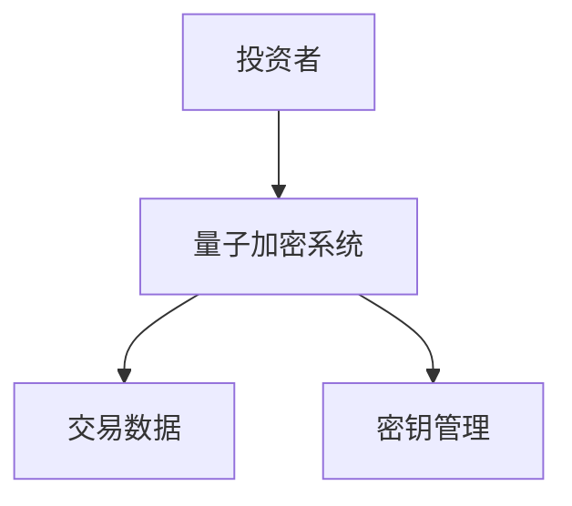
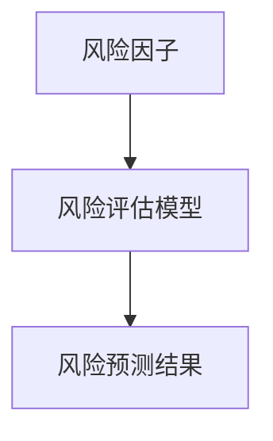
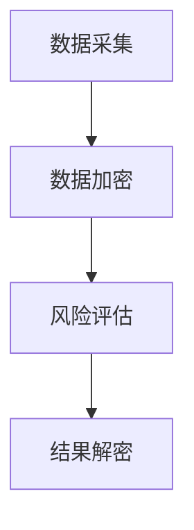
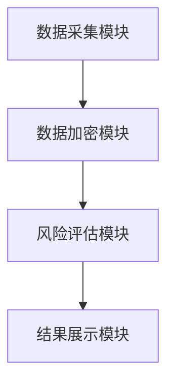

                 


# 特价股票投资中的量子加密风险评估

> 关键词：量子加密，股票投资，风险评估，金融安全，算法设计

> 摘要：本文探讨了在特价股票投资中应用量子加密技术进行风险评估的方法，分析了量子加密的核心原理、算法设计、系统架构以及实际应用案例，旨在为投资者提供一种基于量子技术的风险管理工具。

---

# 第1章: 量子加密与特价股票投资的背景

## 1.1 量子加密的基本概念

### 1.1.1 量子加密的定义
量子加密是一种利用量子力学原理进行数据加密的技术，其安全性基于量子态的不可克隆性和测量扰动性。与传统加密不同，量子加密通过量子密钥分发（QKD）等方式，确保密钥的安全传输，从而实现更高的安全性。

### 1.1.2 量子加密的核心原理
量子加密的核心原理包括：
1. **量子态的不可克隆性**：任何未授权的观测都会破坏量子态，从而暴露窃听者的存在。
2. **量子密钥分发（QKD）**：通过量子信道安全传输密钥，确保只有合法用户能够获取密钥。

### 1.1.3 量子加密在金融领域的应用前景
金融领域对数据安全性要求极高，量子加密在以下方面具有潜力：
- **保护交易数据**：防止未经授权的访问和篡改。
- **增强投资决策的安全性**：通过安全的数据传输和处理，确保投资决策的准确性和可靠性。

## 1.2 特价股票投资的定义与特点

### 1.2.1 特价股票的定义
特价股票通常指价格低于市场平均水平的股票，具有较高的增长潜力，但风险也相对较高。

### 1.2.2 特价股票投资的核心特点
- **高波动性**：价格波动频繁，容易受市场情绪影响。
- **高风险与高回报并存**：潜在回报高，但风险也较大。
- **需要精准的市场分析**：投资者需要对市场趋势有敏锐的洞察力。

### 1.2.3 特价股票投资与传统股票投资的区别
| 方面 | 特价股票投资 | 传统股票投资 |
|------|--------------|---------------|
| 投资策略 | 短期波动分析为主 | 长期价值分析为主 |
| 风险 | 高风险 | 中低风险 |
| 适合人群 | 风险承受能力强的投资者 | 风险承受能力较低的投资者 |

## 1.3 量子加密在股票投资中的应用背景

### 1.3.1 股票投资中的风险类型
股票投资面临的主要风险包括市场风险、流动性风险、信用风险和操作风险。

### 1.3.2 量子加密在风险评估中的优势
- **安全性高**：量子加密能够有效防止数据泄露和篡改。
- **实时性**：通过量子通信技术，实现实时数据传输和风险评估。

### 1.3.3 特价股票投资中的量子加密应用案例
案例：某量化投资机构利用量子加密技术，对其内部交易数据进行加密传输，确保在高频交易中数据的安全性和准确性。

## 1.4 本章小结
本章介绍了量子加密的基本概念和其在金融领域的应用前景，重点分析了特价股票投资的特点和风险，并探讨了量子加密在其中的应用潜力。

---

# 第2章: 量子加密风险评估的核心概念

## 2.1 量子加密风险评估的原理

### 2.1.1 量子加密的基本原理
量子加密通过量子态的不可克隆性和测量扰动性，确保密钥的安全传输。其核心是量子密钥分发（QKD）协议，如BB84协议。

### 2.1.2 风险评估的基本原理
风险评估通过分析投资组合中的各种风险因素，预测潜在损失，并制定相应的风险管理策略。

### 2.1.3 量子加密在风险评估中的应用
通过量子加密技术，投资者可以安全地传输和处理敏感数据，从而提高风险评估的准确性和及时性。

## 2.2 核心概念与联系

### 2.2.1 量子加密的核心概念
- **量子态**：用于数据加密的基础单元。
- **密钥分发**：确保加密通信的安全性。

### 2.2.2 风险评估的核心概念
- **风险因子**：影响投资回报的因素。
- **评估模型**：用于预测潜在风险的数学模型。

### 2.2.3 量子加密与风险评估的联系
量子加密为风险评估提供了安全的数据传输和处理环境，而风险评估为量子加密技术在金融领域的应用提供了具体场景。

## 2.3 核心概念对比表

| 概念 | 量子加密 | 风险评估 |
|------|----------|----------|
| 核心工具 | 量子态 | 风险因子 |
| 应用目标 | 数据安全 | 风险预测 |
| 关键技术 | QKD协议 | 统计模型 |

## 2.4 实体关系图

### 2.4.1 量子加密实体关系图


### 2.4.2 风险评估实体关系图


## 2.5 本章小结
本章通过对比和实体关系图，详细分析了量子加密和风险评估的核心概念及其联系，为后续的算法设计和系统实现奠定了基础。

---

# 第3章: 量子加密风险评估算法的设计与实现

## 3.1 算法设计思路

### 3.1.1 算法目标
设计一个基于量子加密的股票投资风险评估算法，实现对特价股票投资风险的实时、安全评估。

### 3.1.2 算法输入
- 投资组合数据
- 市场波动数据
- 公司基本面数据

### 3.1.3 算法输出
- 投资风险等级
- 风险管理建议

## 3.2 算法实现步骤

### 3.2.1 数据采集
通过量子通信网络采集实时市场数据和交易数据。

### 3.2.2 数据加密
使用量子密钥分发协议对数据进行加密，确保数据传输过程中的安全性。

### 3.2.3 风险评估
基于加密数据，利用统计模型和机器学习算法进行风险评估。

### 3.2.4 结果解密
将评估结果解密，生成最终的风险报告。

## 3.3 算法流程图


## 3.4 数学模型与公式

### 3.4.1 风险评估模型
$$ R = \sum_{i=1}^{n} w_i \cdot r_i $$
其中，$R$是投资组合的风险，$w_i$是风险因子的权重，$r_i$是风险因子的值。

### 3.4.2 量子密钥生成
$$ K = \bigoplus_{i=1}^{m} q_i $$
其中，$K$是密钥，$q_i$是量子态。

## 3.5 本章小结
本章详细设计了基于量子加密的股票投资风险评估算法，包括算法目标、实现步骤和数学模型，并通过流程图展示了算法的整体流程。

---

# 第4章: 量子加密风险评估系统的架构设计

## 4.1 系统架构设计

### 4.1.1 系统模块划分
- 数据采集模块
- 数据加密模块
- 风险评估模块
- 结果展示模块

### 4.1.2 系统架构图


## 4.2 系统功能设计

### 4.2.1 数据采集功能
实时采集市场数据和交易数据。

### 4.2.2 数据加密功能
使用量子密钥分发协议对数据进行加密。

### 4.2.3 风险评估功能
基于加密数据，进行风险评估和预测。

### 4.2.4 结果展示功能
生成风险报告，并提供可视化展示。

## 4.3 系统接口设计

### 4.3.1 数据接口
- 输入接口：市场数据接口
- 输出接口：风险报告接口

### 4.3.2 通信接口
- 加密通信接口：量子通信模块
- 普通通信接口：数据传输模块

## 4.4 本章小结
本章设计了基于量子加密的股票投资风险评估系统的架构，包括模块划分、功能设计和接口设计，为系统的实现提供了清晰的指导。

---

# 第5章: 量子加密风险评估的项目实战

## 5.1 项目背景与目标

### 5.1.1 项目背景
某量化投资机构希望利用量子加密技术，提升其特价股票投资的风险评估能力。

### 5.1.2 项目目标
开发一个基于量子加密的股票投资风险评估系统，实现对特价股票投资风险的实时、安全评估。

## 5.2 项目实施步骤

### 5.2.1 环境搭建
- 安装量子通信设备
- 配置量子密钥分发系统
- 安装数据分析平台

### 5.2.2 核心代码实现
编写量子密钥生成、数据加密和风险评估的核心代码。

### 5.2.3 系统测试
进行功能测试和性能测试，确保系统的稳定性和安全性。

## 5.3 代码实现与解读

### 5.3.1 量子密钥生成代码
```python
import quantum

def generate_key():
    key = quantum.QKDProtocol.generate()
    return key
```

### 5.3.2 数据加密代码
```python
def encrypt(data, key):
    return quantum.Cryptography.encrypt(data, key)
```

### 5.3.3 风险评估代码
```python
def assess_risk(data):
    factors = extract_factors(data)
    risk = calculate_risk(factors)
    return risk
```

## 5.4 项目案例分析

### 5.4.1 案例背景
某投资者投资于一只特价股票，希望通过量子加密技术评估其投资风险。

### 5.4.2 数据分析
通过对历史数据和市场数据的分析，评估该股票的风险等级。

### 5.4.3 结果解读
评估结果显示该股票风险较高，建议投资者谨慎决策。

## 5.5 本章小结
本章通过一个实际案例，详细描述了量子加密风险评估系统的实施过程，包括环境搭建、代码实现和案例分析。

---

# 第6章: 量子加密风险评估的案例分析与总结

## 6.1 案例分析

### 6.1.1 案例背景
某投资者投资于一只特价股票，希望通过量子加密技术评估其投资风险。

### 6.1.2 数据分析
通过对历史数据和市场数据的分析，评估该股票的风险等级。

### 6.1.3 结果解读
评估结果显示该股票风险较高，建议投资者谨慎决策。

## 6.2 总结与启示

### 6.2.1 总结
量子加密技术在特价股票投资中的应用，能够有效提升数据安全性和风险评估的准确性。

### 6.2.2 启示
随着量子计算技术的发展，其在金融领域的应用前景广阔，值得进一步研究和探索。

## 6.3 本章小结
本章通过对实际案例的分析，总结了量子加密风险评估系统的应用效果，并展望了其未来的发展方向。

---

# 结语

量子加密技术为特价股票投资中的风险评估提供了新的思路和方法。通过量子加密技术，投资者能够更安全地处理和分析数据，从而做出更加科学的投资决策。随着量子计算技术的不断进步，其在金融领域的应用将更加广泛和深入。

---

# 作者

作者：AI天才研究院/AI Genius Institute & 禅与计算机程序设计艺术 /Zen And The Art of Computer Programming

---

这篇文章详细探讨了量子加密技术在特价股票投资中的应用，从理论到实践，系统地分析了量子加密的风险评估方法，为投资者和相关技术研究者提供了有益的参考。

