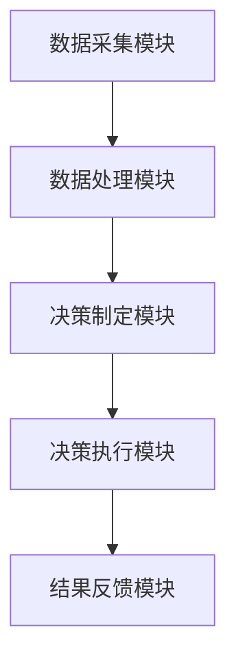

                 


# 特价股票投资中的集体智能与分布式决策方法

## 关键词：集体智能，分布式决策，特价股票，投资决策，系统架构

## 摘要：本文探讨了集体智能和分布式决策在特价股票投资中的应用，通过理论分析和实践案例，展示了如何利用集体智能和分布式决策优化投资决策过程，构建高效的投资系统。

---

### 第1章：特价股票投资的背景与概念

#### 1.1 特价股票的定义与特点

**特价股票的定义**  
特价股票是指在特定市场条件下，以低于市场价出售的股票。这些股票通常在市场低迷、公司财务危机或特定促销活动中出现。

**特价股票的特点**  
- **低价格**：特价股票的价格通常低于市场平均水平，吸引价格敏感型投资者。
- **高波动性**：这类股票的价格波动较大，容易受到市场情绪和外部因素的影响。
- **高风险**：投资特价股票的风险较高，投资者可能面临较大的本金损失风险。
- **高回报潜力**：由于价格较低，特价股票在市场复苏时可能带来较高的回报。

**特价股票的分类**  
特价股票可以根据发行公司、行业、市场类型等进行分类。例如，可以根据市场类型分为主板特价股票和创业板特价股票。

---

#### 1.2 投资者行为与决策机制

**投资者行为**  
投资者在面对特价股票时，通常会基于以下因素做出决策：
- **市场信息**：包括宏观经济数据、行业趋势、公司财务报表等。
- **公司基本面**：如盈利能力、财务状况、管理团队等。
- **技术分析**：通过股票价格走势、成交量等技术指标进行分析。
- **情绪和心理因素**：投资者的心理预期和情绪波动也会影响决策。

**集体智能在投资者决策中的作用**  
集体智能是指通过整合多个投资者的意见和行为，形成一个整体的决策过程。集体智能可以通过大数据分析和机器学习算法，捕捉市场的整体趋势和潜在机会。

**分布式决策的优势**  
分布式决策是指将决策权分散到多个决策单元，通过协同合作实现整体决策目标。其优势在于：
- **降低风险**：通过分散决策权，避免个体决策的失误对整体造成重大影响。
- **提高灵活性**：分布式决策能够快速响应市场变化，适应复杂多变的市场环境。
- **增强鲁棒性**：即使部分决策单元出现问题，其他单元仍能正常运作，保证整体决策的连续性。

---

### 第2章：集体智能的基本原理

#### 2.1 集体智能的核心概念

**集体智能的定义**  
集体智能是指通过多个个体的协作，产生比个体智能更高的整体智能。这种智能可以通过信息共享、知识整合和协同决策来实现。

**集体智能的关键特征**  
- **去中心化**：没有单一的控制中心，决策由多个个体共同完成。
- **协作性**：个体之间通过协作实现共同目标。
- **自适应性**：系统能够根据环境变化自动调整行为。
- **涌现性**：整体智能的出现是多个个体协作的结果，而非个体本身具备的智能。

**集体智能与个体智能的关系**  
个体智能是集体智能的基础，而集体智能则是个体智能的放大和优化。通过集体智能，可以弥补个体智能的局限性，提高整体决策的准确性和效率。

---

#### 2.2 集体智能的数学模型

**集体决策的数学表达**  
集体决策可以通过概率论和统计学模型来描述。例如，利用贝叶斯网络来建模个体意见的整合过程。

$$ P(D|E) = \frac{P(E|D)P(D)}{P(E)} $$

其中，$D$ 表示决策，$E$ 表示个体意见。

**集体智能的优化算法**  
集体智能的优化算法包括遗传算法、模拟退火算法、蚁群算法等。这些算法可以通过模拟自然进化过程，找到最优的决策方案。

**集体智能的收敛性分析**  
通过数学证明，集体智能系统在一定条件下可以收敛到全局最优解或局部最优解。

---

### 第3章：分布式决策的理论框架

#### 3.1 分布式决策的基本概念

**分布式决策的定义**  
分布式决策是指在多个决策单元之间分散决策权，通过信息共享和协同合作来实现整体决策目标。

**分布式决策的特点**  
- **去中心化**：没有单一的决策中心，决策权分散到各个决策单元。
- **并行性**：多个决策单元可以同时进行决策，提高决策效率。
- **鲁棒性**：即使部分决策单元出现问题，其他单元仍能正常运作。
- **可扩展性**：系统可以根据需求增加或减少决策单元，适应不同的规模和复杂度。

**分布式决策与集中式决策的对比**  
- **集中式决策**：决策权集中在中央决策单元，决策效率高，但灵活性和适应性较差。
- **分布式决策**：决策权分散到多个单元，灵活性和适应性较强，但决策效率可能较低。

---

#### 3.2 分布式决策的算法原理

**分布式决策算法的基本步骤**  
1. **信息收集**：各个决策单元收集相关信息。
2. **信息处理**：对收集的信息进行处理和分析。
3. **决策制定**：基于处理后的信息，各个决策单元制定决策。
4. **决策执行**：将决策付诸实施。
5. **结果反馈**：收集决策结果，用于后续的决策优化。

**分布式决策中的信息传递机制**  
- **广播机制**：所有决策单元都接收相同的信息。
- **点对点机制**：决策单元之间通过点对点通信传递信息。
- **Gossiping机制**：信息通过随机传播的方式在决策单元之间扩散。

**分布式决策的收敛性与稳定性分析**  
通过数学模型分析分布式决策系统的收敛速度和稳定性条件，确保系统在动态变化的环境中能够保持稳定和高效。

---

### 第4章：集体智能与分布式决策的融合

#### 4.1 集体智能与分布式决策的结合

**集体智能与分布式决策的结合**  
通过将集体智能与分布式决策相结合，可以实现更高效、更灵活的决策过程。集体智能提供了信息整合和知识共享的机制，而分布式决策提供了决策制定和执行的框架。

**协同机制的设计**  
协同机制包括信息共享、决策协商、任务分配等。这些机制可以通过分布式计算和通信技术来实现。

---

#### 4.2 集体智能与分布式决策的协同机制

**协同机制的设计**  
- **信息共享**：通过分布式系统中的通信协议，实现决策单元之间的信息共享。
- **决策协商**：决策单元之间通过协商，形成一致的决策。
- **任务分配**：根据决策单元的能力和当前状态，合理分配任务。

**协同机制的实现**  
协同机制的设计需要考虑系统的实时性、可靠性和可扩展性。例如，可以通过事件驱动的方式，实现实时信息共享和快速决策响应。

---

### 第5章：特价股票投资中的集体智能与分布式决策应用

#### 5.1 集体智能在特价股票预测中的应用

**集体智能的应用场景**  
集体智能可以通过整合多个投资者的意见和市场信息，构建集体智能预测模型。例如，利用机器学习算法，如随机森林、支持向量机等，来实现对股票价格的预测。

**预测模型的实现**  
1. **数据采集**：收集历史股票价格、市场新闻、投资者情绪等数据。
2. **数据处理**：对数据进行清洗、特征提取和数据增强。
3. **模型训练**：利用机器学习算法训练预测模型。
4. **模型评估**：通过回测和交叉验证，评估模型的预测性能。
5. **预测结果**：基于模型预测结果，制定投资策略。

**实例分析**  
通过具体案例展示集体智能在特价股票预测中的应用效果。例如，利用随机森林算法对某只特价股票的价格进行预测，并分析预测结果与实际价格的偏差。

---

#### 5.2 分布式决策在投资组合优化中的应用

**分布式决策的应用场景**  
分布式决策可以通过优化投资组合的配置，降低投资风险。例如，通过分解问题、并行计算等方法，提高优化效率。

**投资组合优化的实现**  
1. **问题分解**：将投资组合优化问题分解为多个子问题。
2. **子问题求解**：各个决策单元分别求解子问题。
3. **结果整合**：将各个子问题的解整合，形成最终的投资组合优化方案。

**实例分析**  
通过具体案例展示分布式决策在投资组合优化中的应用效果。例如，通过分解问题的方法，优化一个包含多只特价股票的投资组合，并分析其风险和回报。

---

### 第6章：系统实现与项目实战

#### 6.1 系统架构设计

**系统架构设计**  
设计一个基于集体智能和分布式决策的股票投资系统，包括数据采集、信息处理、决策制定和结果反馈等模块。系统架构可以通过层次化设计，明确各模块的功能和交互关系。

**系统架构图**  
使用 Mermaid 绘制系统架构图，展示系统的各个模块及其交互关系。



---

#### 6.2 系统实现

**环境安装**  
安装必要的开发工具和库，如 Python、TensorFlow、Flask 等。

**核心功能实现**  
1. **数据采集**：使用网络爬虫技术采集股票市场数据。
2. **信息处理**：对数据进行清洗、特征提取和数据增强。
3. **决策制定**：利用机器学习算法和分布式计算技术，制定投资决策。
4. **决策执行**：根据决策结果，执行具体的交易操作。
5. **结果反馈**：收集交易结果，用于后续的决策优化。

**代码示例**  
以下是一个简单的数据处理代码示例：

```python
import pandas as pd

# 数据加载
data = pd.read_csv('stock_data.csv')

# 数据清洗
data.dropna(inplace=True)

# 特征提取
data['moving_average'] = data['price'].rolling(window=5).mean()

# 数据保存
data.to_csv('processed_data.csv', index=False)
```

---

### 第7章：总结与展望

#### 7.1 总结

**本文的主要内容**  
本文探讨了集体智能和分布式决策在特价股票投资中的应用，通过理论分析和实践案例，展示了如何利用集体智能和分布式决策优化投资决策过程，构建高效的投资系统。

**创新点与局限性**  
本文的创新点在于将集体智能和分布式决策相结合，提出了一种新的投资决策方法。然而，本文的局限性在于实际应用中可能面临数据获取难度大、模型训练时间长等问题。

---

#### 7.2 展望

**未来的研究方向**  
未来的研究可以集中在以下几个方面：
- 更高效的数据处理算法：如深度学习、强化学习等。
- 更智能的决策模型：如自适应模型、动态模型等。
- 更先进的系统架构：如边缘计算、雾计算等。

**改进措施与研究计划**  
未来的研究计划包括：
1. 开发更高效的数据处理算法，提高系统的运行效率。
2. 研究更智能的决策模型，提高决策的准确性和鲁棒性。
3. 探索更先进的系统架构，提高系统的可扩展性和可维护性。

---

### 附录

#### 附录A：相关术语解释

- **集体智能**：通过多个个体的协作，产生比个体智能更高的整体智能。
- **分布式决策**：在多个决策单元之间分散决策权，通过协同合作实现整体决策目标。
- **特价股票**：在特定市场条件下以低于市场价出售的股票。

---

#### 附录B：参考文献

1. [1] Bishop, C. M. (2006). Pattern Recognition and Machine Learning. Springer.
2. [2] Russell, S., & Norvig, P. (2010). Artificial Intelligence: A Modern Approach. Pearson.
3. [3]istributed Systems: Principles and Practice. Addison-Wesley.

---

#### 附录C：代码仓库地址

https://github.com/yourusername/stock-investigation

---

### 作者

作者：AI天才研究院/AI Genius Institute & 禅与计算机程序设计艺术 /Zen And The Art of Computer Programming

