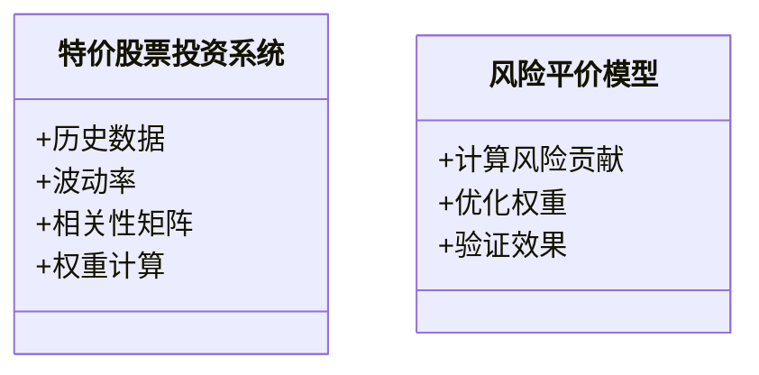
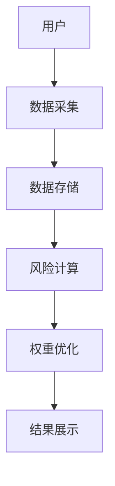

                 


# 特价股票投资中的风险平价理念应用

> 关键词：特价股票投资、风险平价、投资组合优化、风险管理、算法实现

> 摘要：本文深入探讨了风险平价理念在特价股票投资中的应用，结合实际案例和系统设计，详细分析了如何通过风险平价模型优化投资组合，降低投资风险，实现收益最大化。

---

## 第1章: 特价股票投资的背景与现状

### 1.1 特价股票投资的定义与特点

#### 1.1.1 特价股票的定义
特价股票指的是市场价低于其内在价值的股票。这种股票通常被市场低估，具有较大的上涨潜力。投资者通过寻找这些股票，可以在市场恢复其真实价值时获得超额收益。

#### 1.1.2 特价股票投资的核心特点
- **低估性**：市场价格低于内在价值。
- **周期性**：通常出现在市场低迷或公司暂时困境时期。
- **风险性**：低估可能意味着公司存在潜在问题，需要谨慎筛选。

#### 1.1.3 特价股票投资的市场环境
近年来，全球经济波动加剧，市场不确定性增加，投资者更加关注风险管理。在这样的背景下，风险平价理念逐渐成为投资的重要指导思想。

---

### 1.2 风险平价理念的引入

#### 1.2.1 风险平价的定义
风险平价是一种投资理念，旨在通过优化投资组合中的风险分配，使每种资产的风险贡献相等。这种策略有助于分散风险，避免单一资产的大幅波动对整体组合的影响。

#### 1.2.2 风险平价在投资中的作用
- **分散风险**：平衡不同资产的风险暴露，降低整体组合的波动性。
- **优化收益**：通过科学的风险分配，实现收益最大化。
- **适应市场变化**：根据市场环境动态调整资产配置。

#### 1.2.3 风险平价与传统投资理念的区别
| 特性 | 风险平价 | 传统投资理念 |
|------|----------|---------------|
| 目标 | 风险分散与收益优化 | 追求超额收益 |
| 方法 | 基于风险贡献分配资产 | 基于资产类别分配 |
| 适用场景 | 高波动性市场 | 稳定市场环境 |

---

### 1.3 特价股票投资中的风险平价理念

#### 1.3.1 风险平价在特价股票投资中的应用
- 在投资组合中引入风险平价理念，平衡特价股票与其他资产的风险贡献。
- 通过量化分析，选择具有低风险但高回报潜力的特价股票。

#### 1.3.2 风险平价理念的核心要素
- **风险评估**：计算每种资产的风险贡献。
- **资产配置**：根据风险平价原则调整资产权重。
- **动态优化**：定期重新评估并调整配置。

#### 1.3.3 风险平价理念的优势与局限性
- **优势**：降低整体风险，提高收益稳定性。
- **局限性**：需要复杂的计算和持续的市场监控。

---

## 第2章: 特价股票投资中的风险平价理念体系

### 2.1 风险平价模型的构建

#### 2.1.1 风险平价模型的构建步骤
1. **数据收集**：获取历史价格、收益、波动率等数据。
2. **风险计算**：计算每种资产的波动率和相关性。
3. **优化配置**：根据风险平价原则，确定各资产的权重。

#### 2.1.2 风险平价模型的输入变量
- 历史价格数据
- 波动率
- 相关性矩阵

#### 2.1.3 风险平价模型的输出结果
- 各资产的目标权重
- 组合的风险贡献

---

### 2.2 风险平价模型的数学表达

#### 2.2.1 风险平价的数学公式
$$ \text{权重}_i = \frac{\sigma_i}{\sum_{j=1}^{n} \sigma_j} $$
其中，$\sigma_i$ 表示第 $i$ 种资产的波动率，$n$ 表示资产数量。

#### 2.2.2 风险平价模型的优化方法
使用均值-方差优化模型：
$$ \min \sum_{i=1}^{n} w_i^2 \sigma_i^2 $$
$$ \text{s.t.} \quad \sum_{i=1}^{n} w_i = 1 $$

---

## 第3章: 风险平价理念在特价股票投资中的应用

### 3.1 特价股票投资中的风险评估

#### 3.1.1 风险评估的步骤与方法
1. **数据清洗**：剔除异常值和缺失数据。
2. **波动率计算**：计算每只股票的历史波动率。
3. **相关性分析**：分析股票之间的相关性。

#### 3.1.2 风险评估的关键指标
- 波动率
- 相关性矩阵
- 风险贡献

---

### 3.2 风险平价理念在投资组合中的应用

#### 3.2.1 投资组合的风险平价分配
根据每只股票的风险贡献，计算其在组合中的目标权重。

#### 3.2.2 投资组合的风险调整与优化
通过调整权重，使每只股票的风险贡献相等。

#### 3.2.3 投资组合的风险平价效果评估
比较调整前后的组合波动率和收益，验证风险平价的效果。

---

## 第4章: 风险平价理念的算法实现

### 4.1 风险平价算法的原理

#### 4.1.1 算法流程
1. 收集历史数据。
2. 计算波动率和相关性。
3. 优化权重。
4. 验证结果。

#### 4.1.2 算法实现的Python代码

```python
import numpy as np

def risk_parity(weights, covariance_matrix):
    portfolio_variance = np.dot(weights.T, np.dot(covariance_matrix, weights))
    risk_contribution = weights * np.sqrt(np.diag(covariance_matrix))
    return risk_contribution / portfolio_variance

# 示例数据
n = 5
covariance_matrix = np.random.randn(n, n)
covariance_matrix = covariance_matrix.T.dot(covariance_matrix)
weights = np.ones(n) / n

# 计算风险贡献
risk_contribution = risk_parity(weights, covariance_matrix)
print("风险贡献:", risk_contribution)
```

---

## 第5章: 系统分析与架构设计

### 5.1 系统功能设计

#### 5.1.1 领域模型


#### 5.1.2 系统架构


---

## 第6章: 项目实战

### 6.1 环境安装
安装必要的Python库：
```bash
pip install numpy pandas matplotlib
```

### 6.2 核心代码实现

```python
import numpy as np

def compute_risk_parity(weights, covariance_matrix):
    portfolio_variance = weights.T.dot(covariance_matrix.dot(weights))
    risk_contribution = weights * np.sqrt(np.diag(covariance_matrix))
    return risk_contribution / portfolio_variance

# 示例数据
n = 5
covariance_matrix = np.random.randn(n, n)
covariance_matrix = covariance_matrix.T.dot(covariance_matrix)
weights = np.ones(n) / n

# 计算风险平价
risk_contribution = compute_risk_parity(weights, covariance_matrix)
print("风险平价贡献:", risk_contribution)
```

---

## 第7章: 最佳实践

### 7.1 小结
风险平价理念能够有效降低投资组合的整体风险，提高收益稳定性。

### 7.2 注意事项
- 定期重新评估和调整组合。
- 结合市场环境灵活运用。

### 7.3 拓展阅读
建议阅读《投资学》和《风险管理》等相关书籍。

---

## 作者信息

作者：AI天才研究院 & 禅与计算机程序设计艺术

