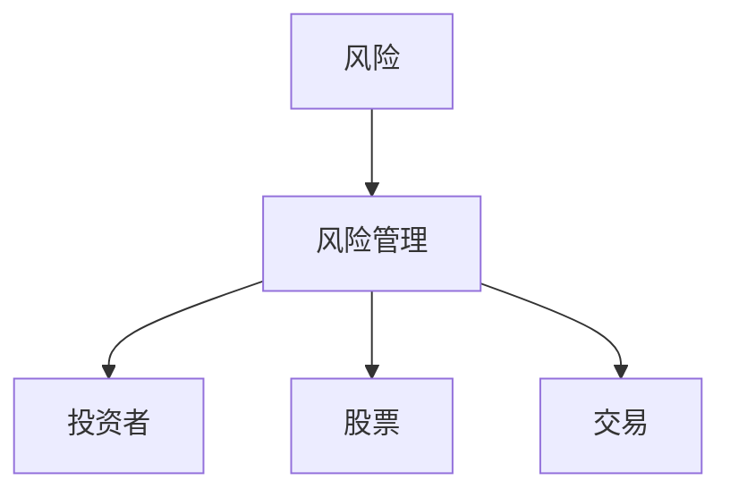
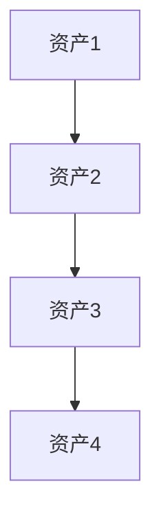
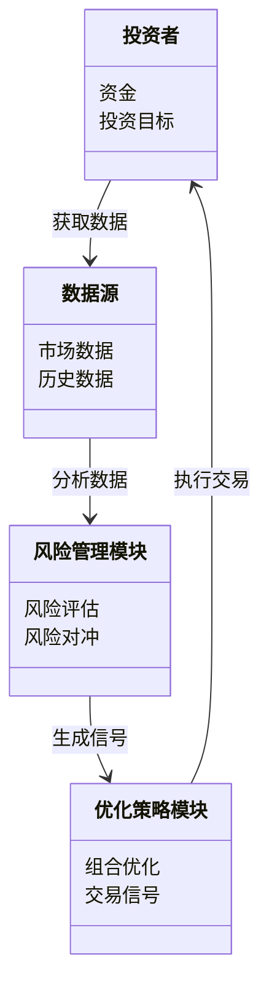

                 


# 特价股票投资中的风险管理

> 关键词：风险管理, 特价股票, 投资策略, 波动率, 数学模型

> 摘要：本文深入探讨了特价股票投资中的风险管理问题，分析了风险管理的核心概念、数学模型、系统架构及实际应用。通过理论与实践结合，提出了有效的风险管理策略，帮助投资者在复杂多变的股票市场中实现稳健投资。

---

# 第一部分: 风险管理的背景与核心概念

## 第1章: 风险管理的重要性与背景

### 1.1 风险管理的核心概念

#### 1.1.1 风险的定义与特征
风险是指投资收益的不确定性，通常表现为损失的可能性。在特价股票投资中，风险主要来源于市场的波动性、个股的特异风险以及投资者的心理因素。

#### 1.1.2 收益与风险的权衡
投资收益与风险密切相关，收益越高，风险通常越大。投资者需要在风险与收益之间找到平衡点，避免过度冒险或保守。

#### 1.1.3 投资者心理与风险管理
投资者的心理因素（如贪婪和恐惧）往往会影响决策，导致非理性行为。有效的风险管理需要考虑投资者的心理特征。

---

### 1.2 特价股票的特点与风险

#### 1.2.1 特价股票的定义与分类
特价股票通常指价格低于市场平均水平的股票，分为周期性特价股票、价值型特价股票等。

#### 1.2.2 特价股票市场的波动性
特价股票市场波动较大，价格受市场情绪影响显著，因此风险较高。

#### 1.2.3 特价股票投资的风险来源
包括市场风险、流动性风险、个股风险等。

---

### 1.3 风险管理的必要性

#### 1.3.1 投资失败的常见原因
盲目跟风、过度杠杆、缺乏风险控制等。

#### 1.3.2 风险管理在投资中的作用
通过量化风险，投资者可以更好地控制仓位、分散投资，降低整体投资组合的风险。

#### 1.3.3 风险管理的边界与外延
风险管理并非完全消除风险，而是通过科学方法将风险控制在可承受范围内。

---

## 第2章: 风险管理的核心概念与联系

### 2.1 风险管理的原理

#### 2.1.1 风险的来源与传播
市场波动、政策变化等因素可能通过资产相关性影响整个投资组合。

#### 2.1.2 风险的度量与评估方法
常用的度量方法包括标准差、VaR（Value at Risk）、CVaR（Conditional Value at Risk）等。

#### 2.1.3 风险管理的系统性
风险管理需要从整体角度出发，考虑投资组合的多样性和相关性。

---

### 2.2 核心概念对比分析

#### 2.2.1 风险与收益的对比
| 指标 | 风险 | 收益 |
|------|------|------|
| 度量 | 标准差 | � 净现值 |
| 影响 | 资产损失 | 资产增值 |

#### 2.2.2 不同风险指标的特征
| 指标 | 特点 | 应用场景 |
|------|------|----------|
| VaR | 显示在给定置信水平下的潜在损失 | 常用于银行和金融机构的风险管理 |
| CVaR | 考虑尾部风险，计算超过VaR的平均损失 | 适用于厌恶尾部风险的投资者 |

#### 2.2.3 风险管理工具的优缺点
| 工具 | 优点 | 缺点 |
|------|------|------|
| 多元化 | 分散风险 | 无法完全消除系统性风险 |
| 对冲 | 减少波动 | 成本较高 |
| 保险 | 转移风险 | 保护有限 |

---

### 2.3 风险管理的ER实体关系图



---

## 第3章: 风险管理的数学模型与算法原理

### 3.1 风险管理的数学模型

#### 3.1.1 风险的度量公式
$$\text{风险} = \text{标准差} = \sqrt{\frac{1}{n}\sum_{i=1}^{n}(x_i - \mu)^2}$$

#### 3.1.2 风险与收益的平衡方程
$$\text{收益} = \text{风险} \times \text{概率}$$

---

### 3.2 算法原理

#### 3.2.1 方差-协方差矩阵的计算



方差-协方差矩阵用于衡量资产之间的相关性，公式为：
$$\Sigma_{i,j} = \text{Cov}(r_i, r_j) = E[(r_i - E[r_i])(r_j - E[r_j])]$$

---

#### 3.2.2 现代投资组优化理论

$$\text{最小方差投资组} = \arg\min_w w^T \Sigma w$$

---

### 3.3 算法实现

#### 3.3.1 环境安装

```bash
pip install numpy pandas scikit-learn matplotlib
```

#### 3.3.2 核心代码

```python
import numpy as np
import pandas as pd
from sklearn.covariance import LedoitWolf

# 示例数据
returns = pd.DataFrame({
    '资产1': [0.05, 0.02, -0.03],
    '资产2': [0.03, 0.04, 0.01],
    '资产3': [-0.01, 0.02, 0.05]
})

# 计算方差-协方差矩阵
cov = LedoitWolf().fit(returns)
cov_matrix = cov.covariance_

# 计算最小方差投资组
n = len(cov_matrix)
inv_cov = np.linalg.inv(cov_matrix)
weights = inv_cov.sum(axis=1) / inv_cov.sum().sum()

print("最小方差权重：", weights)
```

---

## 第4章: 系统分析与架构设计

### 4.1 投资系统介绍

#### 4.1.1 问题场景介绍
通过构建一个投资管理系统，帮助投资者量化和管理特价股票投资中的风险。

#### 4.1.2 系统功能设计



---

## 第5章: 项目实战与案例分析

### 5.1 环境安装

```bash
pip install numpy pandas scikit-learn matplotlib
```

### 5.2 核心代码实现

```python
import numpy as np
import pandas as pd
from sklearn.covariance import LedoitWolf

# 示例数据
returns = pd.DataFrame({
    '资产1': [0.05, 0.02, -0.03],
    '资产2': [0.03, 0.04, 0.01],
    '资产3': [-0.01, 0.02, 0.05]
})

# 计算方差-协方差矩阵
cov = LedoitWolf().fit(returns)
cov_matrix = cov.covariance_

# 计算最小方差投资组
n = len(cov_matrix)
inv_cov = np.linalg.inv(cov_matrix)
weights = inv_cov.sum(axis=1) / inv_cov.sum().sum()

print("最小方差权重：", weights)
```

---

## 第6章: 最佳实践与小结

### 6.1 最佳实践

#### 6.1.1 风险管理的关键点
- 分散投资，降低非系统性风险
- 设置止损，避免重大损失
- 定期调整，适应市场变化

#### 6.1.2 实际操作建议
- 定期复盘，评估风险管理效果
- 结合技术分析和基本面分析
- 使用工具辅助量化分析

---

### 6.2 注意事项

#### 6.2.1 市场波动
特价股票市场的波动性较大，投资者需要时刻关注市场变化。

#### 6.2.2 模型局限性
数学模型无法完全预测市场，投资者需结合实际情况进行调整。

---

### 6.3 拓展阅读

- 《风险管理与投资组合》
- 《Python金融大数据分析》
- 《股票投资的数学分析》

---

# 结语

通过本文的分析，我们可以看到，风险管理在特价股票投资中具有重要意义。投资者需要结合数学模型和实际操作，制定科学的风险管理策略，才能在复杂多变的市场中实现稳健投资。

---

# 作者：AI天才研究院 & 禅与计算机程序设计艺术

