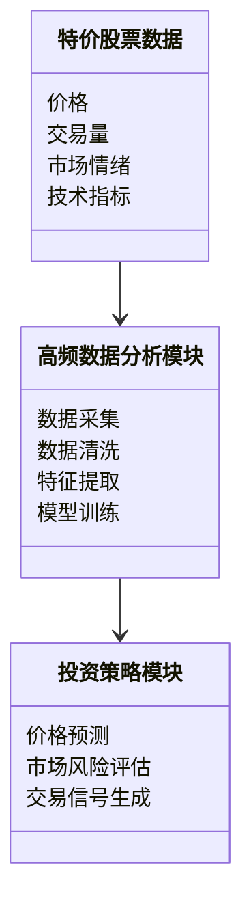

                 

# 特价股票投资中的高频数据分析

> 关键词：特价股票，高频数据分析，投资策略，算法实现，数学模型

> 摘要：本文深入探讨了特价股票投资中的高频数据分析方法，从背景介绍、核心概念、算法原理到系统架构和项目实战，详细阐述了如何利用高频数据进行投资决策。通过具体案例分析，本文展示了如何利用时间序列分析、机器学习算法和统计套利策略来优化投资组合，帮助投资者在复杂多变的股票市场中捕捉机会，降低风险。

---

# 第1章: 特价股票与高频数据分析概述

## 1.1 特价股票的定义与特点
### 1.1.1 特价股票的定义
特价股票通常指的是价格低于市场平均值的股票，这些股票可能因市场波动、公司基本面变化或短期事件而被低估。投资者希望通过高频数据分析，快速识别这些被低估的股票，从而在短期内获利。

### 1.1.2 特价股票的特点
- 价格波动大
- 交易量小
- 市场关注度低
- 短期内可能存在反弹机会

### 1.1.3 特价股票的投资价值
- 低价股票可能隐藏潜在的价值
- 短期内可能因市场情绪或外部事件快速反弹
- 适合高频交易策略

## 1.2 高频数据分析的背景与意义
### 1.2.1 高频交易的定义
高频交易是指在极短时间内进行大量的交易，通常利用算法和计算机技术来捕捉市场中的微小价格波动。

### 1.2.2 高频数据分析的重要性
- 快速决策：高频数据可以帮助投资者在短时间内做出交易决策
- 市场洞察：通过高频数据分析，投资者可以发现市场中的短期趋势和模式
- 风险控制：高频数据分析可以帮助投资者及时发现和应对市场风险

### 1.2.3 高频数据分析在股票投资中的应用
- 短期价格预测
- 市场情绪分析
- 交易机会识别

## 1.3 特价股票与高频数据的特点
### 1.3.1 数据的实时性
特价股票的价格波动通常在短时间内发生，高频数据分析需要实时处理这些数据。

### 1.3.2 数据的海量性
高频交易会产生大量的数据，这些数据需要快速处理和分析。

### 1.3.3 数据的复杂性
特价股票的数据通常包含多种因素，如市场情绪、公司新闻、宏观经济指标等，这些因素需要综合分析。

## 1.4 本章小结
本章介绍了特价股票和高频数据分析的基本概念，分析了高频数据分析在特价股票投资中的重要性，并总结了特价股票与高频数据的特点。

---

# 第2章: 特价股票投资中的高频数据分析核心概念

## 2.1 高频数据分析的核心原理
### 2.1.1 数据采集与处理
- 数据源：股票市场的实时数据，包括价格、交易量、订单簿等
- 数据清洗：去除噪声数据，确保数据的准确性和完整性

### 2.1.2 数据特征提取
- 时间序列特征：均值、方差、自相关性
- 市场情绪特征：通过新闻和社交媒体分析市场情绪
- 技术指标：移动平均线、相对强弱指数（RSI）、布林带等

### 2.1.3 数据分析与建模
- 时间序列分析：ARIMA、LSTM等模型
- 机器学习：支持向量机（SVM）、随机森林（Random Forest）
- 统计套利：利用价格差异和统计套利策略进行投资

## 2.2 高频数据分析的关键算法
### 2.2.1 时间序列分析
- ARIMA模型：用于预测未来的股票价格
- GARCH模型：用于估计市场波动性
- LSTM模型：用于捕捉复杂的非线性关系

### 2.2.2 机器学习算法
- 支持向量机（SVM）：用于分类和回归分析
- 随机森林（Random Forest）：用于特征选择和预测
- 神经网络：用于复杂模式的识别

### 2.2.3 统计套利策略
- 均值-方差模型：优化投资组合的风险和收益
- 距离度量模型：识别价格差异和套利机会
- 风险中性定价模型：评估资产的合理价格

## 2.3 特价股票与高频数据的关系
### 2.3.1 特价股票的市场特征
- 价格低，波动大
- 交易量小，流动性差
- 易受外部因素影响

### 2.3.2 高频数据在特价股票中的应用
- 快速识别市场机会
- 评估短期价格波动风险
- 制定交易策略

### 2.3.3 高频数据分析对投资决策的影响
- 提高交易效率
- 减少交易成本
- 增强市场洞察力

## 2.4 本章小结
本章详细介绍了高频数据分析的核心原理和关键算法，并探讨了特价股票与高频数据的关系，分析了高频数据分析对投资决策的影响。

---

# 第3章: 高频数据分析的数学模型与算法原理

## 3.1 时间序列分析模型
### 3.1.1 ARIMA模型
- ARIMA模型的三个参数：自回归（p）、差分（d）、移动平均（q）
- 公式：$$ARIMA(p, d, q)$$
- 应用：预测股票价格

### 3.1.2 GARCH模型
- GARCH模型用于估计市场波动性
- 公式：$$GARCH(p, q)$$
- 应用：评估市场风险

### 3.1.3 LSTM模型
- LSTM模型是一种递归神经网络，适合处理时间序列数据
- 结构：输入门、遗忘门、输出门
- 应用：捕捉非线性关系

## 3.2 机器学习算法在高频数据分析中的应用
### 3.2.1 支持向量机（SVM）
- SVM用于分类和回归分析
- 核心思想：寻找最优超平面，最大化类别间隔
- 应用：预测股票价格走势

### 3.2.2 随机森林（Random Forest）
- 随机森林是一种基于决策树的集成学习算法
- 优势：抗过拟合，适合高维数据
- 应用：特征选择和预测

### 3.2.3 神经网络（Neural Network）
- 神经网络用于复杂模式的识别
- 结构：输入层、隐藏层、输出层
- 应用：识别市场情绪和价格趋势

## 3.3 统计套利策略的数学模型
### 3.3.1 均值-方差模型
- 目标：优化投资组合的风险和收益
- 公式：$$\min \sigma^2, \text{ subject to } \mu \geq \text{目标收益}$$
- 应用：制定投资策略

### 3.3.2 距离度量模型
- 距离度量：衡量资产价格差异
- 公式：$$d(x, y) = \sqrt{(x_1 - y_1)^2 + (x_2 - y_2)^2 + \dots + (x_n - y_n)^2}$$
- 应用：识别套利机会

### 3.3.3 风险中性定价模型
- 风险中性定价：假设市场参与者对风险持中性态度
- 公式：$$F = S_0 e^{rt}$$
- 应用：评估资产的合理价格

## 3.4 算法实现与优化
### 3.4.1 算法实现步骤
1. 数据清洗与预处理
2. 特征提取与选择
3. 模型训练与优化
4. 模型评估与验证

### 3.4.2 算法优化方法
- 参数调优：通过交叉验证选择最佳参数
- 并行计算：利用多线程或分布式计算加速
- 模型集成：结合多种模型提高预测准确性

### 3.4.3 算法性能评估
- 准确率：预测与实际值的匹配程度
- 回撤率：预测错误的频率
- 盈利因子：投资策略的收益与风险比

## 3.5 本章小结
本章详细介绍了时间序列分析模型、机器学习算法和统计套利策略的数学模型，并探讨了算法实现与优化的方法，帮助读者理解高频数据分析的核心原理。

---

# 第4章: 特价股票投资中的高频数据分析系统架构

## 4.1 系统功能设计
### 4.1.1 领域模型

### 4.1.2 系统架构设计

## 4.2 系统接口设计
### 4.2.1 数据接口
- 数据采集接口：从交易所获取实时数据
- 数据存储接口：将数据存入数据库
- 数据处理接口：对数据进行清洗和特征提取

### 4.2.2 算法接口
- 模型训练接口：训练时间序列模型、机器学习模型
- 预测接口：生成价格预测和交易信号

## 4.3 本章小结
本章通过领域模型和系统架构图，详细描述了高频数据分析系统的功能设计和架构设计，为后续的实现提供了理论基础。

---

# 第5章: 特价股票投资中的高频数据分析项目实战

## 5.1 项目环境安装
### 5.1.1 安装Python
- 安装Python 3.8或更高版本
- 安装常用库：numpy、pandas、scikit-learn、tensorflow、keras

### 5.1.2 安装数据获取工具
- 使用Yahoo Finance API获取股票数据
- 使用pandas_datareader获取数据

## 5.2 数据获取与预处理
### 5.2.1 数据获取
- 从Yahoo Finance获取特价股票的历史数据
- 数据格式：CSV或Excel

### 5.2.2 数据清洗
- 处理缺失值
- 标准化数据
- 去除异常值

## 5.3 特征提取与模型训练
### 5.3.1 特征提取
- 提取时间序列特征
- 提取技术指标（如移动平均线、RSI）
- 分析市场情绪

### 5.3.2 模型训练
- 使用ARIMA模型预测价格
- 使用随机森林进行分类
- 使用LSTM进行时间序列预测

## 5.4 投资策略实现
### 5.4.1 价格预测
- 使用训练好的模型预测未来的价格
- 生成交易信号（买入或卖出）

### 5.4.2 风险评估
- 使用GARCH模型评估市场波动性
- 计算投资组合的风险和收益

## 5.5 实际案例分析
### 5.5.1 案例背景
- 选择一只特价股票
- 设定交易策略和参数

### 5.5.2 数据分析
- 使用Python代码进行数据分析
- 生成可视化图表

### 5.5.3 结果解读
- 预测结果与实际结果对比
- 评估交易策略的盈利能力

## 5.6 本章小结
本章通过实际案例，详细展示了如何利用Python进行高频数据分析，从数据获取到模型训练，再到策略实现，帮助读者掌握高频数据分析的实际操作方法。

---

# 第6章: 总结与最佳实践

## 6.1 本章总结
- 特价股票投资中的高频数据分析是一个复杂但 rewarding 的过程
- 高频数据分析可以帮助投资者快速识别市场机会和风险
- 统计套利和机器学习算法是实现高频交易的核心工具

## 6.2 最佳实践 tips
1. 数据清洗与特征提取是关键，确保数据的准确性和完整性
2. 算法选择与优化是关键，根据具体情况选择合适的模型
3. 风险控制是关键，制定合理的风险管理策略

## 6.3 未来研究方向
- 更高效的算法优化方法
- 更准确的市场情绪分析
- 更智能的交易策略生成

## 6.4 注意事项
- 高频交易需要快速的网络和高效的计算能力
- 需要注意市场风险和交易成本
- 需要遵守相关法律法规

## 6.5 拓展阅读
- 推荐书籍：《算法交易：数学模型与实践》
- 推荐博客：Quantitative and Algorithmic Trading

## 6.6 本章小结
本章总结了全文的内容，提出了高频数据分析在特价股票投资中的最佳实践，并展望了未来的研究方向，帮助读者更好地理解和应用高频数据分析技术。

---

# 作者：AI天才研究院/AI Genius Institute & 禅与计算机程序设计艺术 /Zen And The Art of Computer Programming

---

以上是《特价股票投资中的高频数据分析》的技术博客文章目录大纲，涵盖了从基础概念到实战应用的各个方面，内容详实，结构清晰，适合对高频数据分析和股票投资感兴趣的技术人员和投资者阅读。

