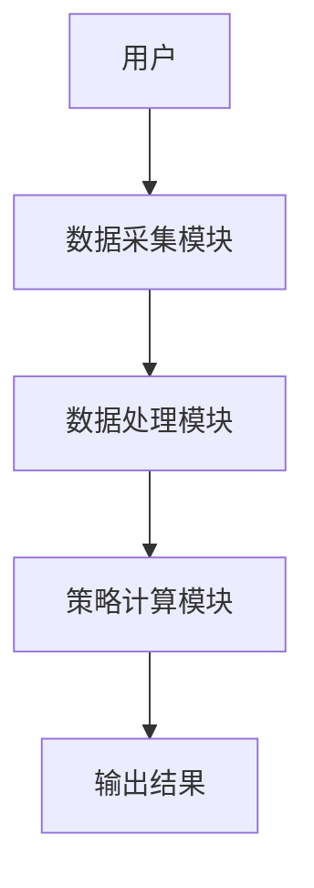
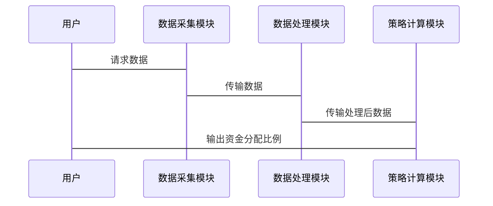

                 


# 特价股票投资的资金分配策略

> **关键词**：特价股票、资金分配策略、风险管理、数学模型、投资组合优化、系统设计

> **摘要**：本文详细探讨了特价股票投资中的资金分配策略，从理论基础、算法实现到系统设计，全面分析了如何有效分配资金以实现收益最大化和风险最小化。文章结合实际案例和数学模型，为投资者提供了科学的资金分配方法和系统设计思路。

---

## 第1章: 特价股票投资的背景与概念

### 1.1 特价股票的定义与特点

#### 1.1.1 特价股票的定义
特价股票是指价格相对较低的股票，通常具有较高的波动性和潜在的高回报率。这类股票往往属于中小型企业或处于成长期的公司，其股价波动较大，但具备较大的上涨空间。

#### 1.1.2 特价股票的核心特点
- **低估值**：通常市盈率、市净率等指标低于市场平均水平。
- **高波动性**：股价波动较大，短期内可能大幅上涨或下跌。
- **高风险**：由于公司规模较小，抗风险能力较弱，投资风险较高。
- **高潜力**：潜在回报率可能远高于市场平均水平。

#### 1.1.3 特价股票与普通股票的区别
| 特性         | 特价股票             | 普通股票             |
|--------------|----------------------|----------------------|
| 价格         | 通常较低             | 价格较为稳定         |
| 波动性         | 高                  | 较低                |
| 风险         | 高                  | 中等                |
| 潜力         | 高                  | 较低                |
| 投资门槛     | 较低                | 较高                |

---

### 1.2 特价股票投资的背景与现状

#### 1.2.1 特价股票投资的历史发展
特价股票投资历史悠久，早期主要集中在小盘股和成长股。随着市场的发展，投资者逐渐意识到低价股票的潜力，特别是在市场低迷时期，低价股票可能具有更高的反弹空间。

#### 1.2.2 当前特价股票投资的市场环境
- **市场波动**：全球经济不确定性增加，投资者更倾向于寻找高性价比的投资标的。
- **技术进步**：大数据和人工智能技术的应用为特价股票投资提供了新的工具和方法。
- **政策影响**：政府政策对市场的影响日益显著，投资者需要关注政策变化对特价股票的影响。

#### 1.2.3 特价股票投资的现状与趋势
当前，特价股票投资逐渐从传统的人工分析向量化投资和算法交易转变。投资者通过量化模型筛选潜在标的，结合资金分配策略优化投资组合。

---

### 1.3 资金分配策略的必要性

#### 1.3.1 资金分配在投资中的重要性
资金分配策略决定了投资组合的结构，直接影响投资收益和风险。合理的资金分配能够平衡风险与收益，提高投资效率。

#### 1.3.2 特价股票投资中资金分配的特殊性
- **高波动性**：资金分配需要考虑股价波动对投资组合的影响。
- **低流动性**：部分特价股票流动性较差，资金分配需要考虑流动性风险。
- **高风险**：资金分配需要在高风险和高回报之间找到平衡点。

#### 1.3.3 资金分配策略对投资收益的影响
- **风险控制**：通过合理分配资金，降低投资组合的整体风险。
- **收益最大化**：通过优化资金分配，提高投资组合的潜在回报率。
- **动态调整**：根据市场变化动态调整资金分配，适应市场波动。

---

### 1.4 本章小结
本章介绍了特价股票的定义、特点及其与普通股票的区别，分析了当前特价股票投资的背景与现状，强调了资金分配策略在投资中的重要性，并为后续章节奠定了基础。

---

## 第2章: 资金分配策略的理论基础

### 2.1 资产配置与资金分配的关系

#### 2.1.1 资产配置的基本概念
资产配置是指将资金分配到不同的资产类别（如股票、债券、现金等）中，以实现风险分散和收益最大化。

#### 2.1.2 资金分配在资产配置中的作用
资金分配是资产配置的核心环节，决定了资金在不同资产类别中的比例。

#### 2.1.3 资产配置与资金分配的差异与联系
- **差异**：资产配置是整体投资策略，而资金分配是具体操作步骤。
- **联系**：资金分配是资产配置的重要组成部分，资产配置为资金分配提供指导。

---

### 2.2 风险与收益的平衡

#### 2.2.1 风险与收益的基本关系
在投资中，收益与风险通常是正相关的，即高收益伴随着高风险。

#### 2.2.2 特价股票投资中的风险特征
- **市场风险**：市场波动对股价的影响。
- **流动性风险**：部分特价股票流动性较差，可能导致买卖价差较大。
- **公司风险**：公司经营状况不佳可能导致股价大幅下跌。

#### 2.2.3 资金分配策略对风险控制的作用
- **分散投资**：通过分散投资降低市场风险。
- **动态调整**：根据市场变化及时调整资金分配比例，降低风险。

---

### 2.3 资金分配策略的数学模型

#### 2.3.1 现金流与资金流动的数学表达
资金分配需要考虑现金流的流入和流出，可以用以下公式表示：

$$
\text{资金分配比例} = \frac{\text{某资产的投资金额}}{\text{总资金}}
$$

#### 2.3.2 风险-收益权衡的数学公式
夏普比率（Sharpe Ratio）是衡量投资组合风险调整后收益的重要指标，公式为：

$$
\text{夏普比率} = \frac{E[r_p] - r_f}{\sigma_p}
$$

其中：
- \( E[r_p] \) 是投资组合的预期收益率
- \( r_f \) 是无风险利率
- \( \sigma_p \) 是投资组合的收益率标准差

#### 2.3.3 资金分配的优化模型
在资金分配优化中，可以使用均值-方差模型（Mean-Variance Optimization）来最小化投资组合的风险，同时实现预期收益最大化。优化模型如下：

$$
\text{Minimize } \sigma_p^2 \\
\text{Subject to } E[r_p] \geq \text{目标收益}
$$

---

### 2.4 本章小结
本章从资产配置、风险与收益的平衡以及数学模型三个方面，详细探讨了资金分配策略的理论基础，为后续章节的算法实现和系统设计提供了理论支持。

---

## 第3章: 资金分配策略的算法与实现

### 3.1 基于均值-方差模型的资金分配算法

#### 3.1.1 算法原理
均值-方差模型通过优化投资组合的收益率和波动性，找到风险最小化或收益最大化的投资组合。

#### 3.1.2 算法实现步骤
1. **计算各资产的预期收益率和协方差矩阵**。
2. **求解优化问题**：最小化波动性，同时满足预期收益约束。
3. **确定各资产的资金分配比例**。

#### 3.1.3 实例分析
假设我们有两只特价股票A和B，其预期收益率分别为10%和15%，标准差分别为20%和30%，相关系数为0.5。使用均值-方差模型优化后的资金分配比例为：

$$
w_A = \frac{\sigma_B^2 - \rho \sigma_A \sigma_B}{\sigma_A^2 + \sigma_B^2 - 2\rho \sigma_A \sigma_B}
$$

---

### 3.2 基于风险中性的资金分配策略

#### 3.2.1 策略原理
风险中性策略假设投资者的风险偏好为中性，通过调整投资比例来实现风险中性的投资组合。

#### 3.2.2 实现步骤
1. **计算各资产的风险调整后收益**。
2. **确定资金分配比例**，使投资组合的风险调整后收益最大化。

---

### 3.3 基于动态调整的资金分配算法

#### 3.3.1 动态调整的基本原理
根据市场变化实时调整资金分配比例，以适应市场波动。

#### 3.3.2 实现步骤
1. **实时监控市场数据**。
2. **根据预设规则调整资金分配比例**。

---

### 3.4 算法的对比与选择

#### 3.4.1 不同资金分配算法的对比
| 算法名称       | 优点                          | 缺点                          |
|----------------|-------------------------------|-------------------------------|
| 均值-方差模型   | 理论基础坚实，结果优化         | 计算复杂，需要大量数据         |
| 风险中性策略   | 风险控制能力强                | 适用于风险中性投资者           |
| 动态调整策略   | 灵活性高，适应性强             | 需要实时数据和快速决策         |

#### 3.4.2 算法选择的依据与原则
- **投资目标**：根据投资目标选择合适的算法。
- **市场环境**：根据市场环境选择适合的算法。
- **数据支持**：确保算法的实施有足够的数据支持。

---

### 3.5 本章小结
本章详细探讨了三种资金分配算法的原理与实现，通过对比分析，为投资者提供了选择算法的依据和原则。

---

## 第4章: 资金分配策略的系统分析与设计

### 4.1 系统功能模块划分

#### 4.1.1 数据采集模块
负责采集市场数据，包括股票价格、成交量等。

#### 4.1.2 数据处理模块
对采集到的数据进行清洗、转换和特征提取。

#### 4.1.3 策略计算模块
根据选择的算法计算资金分配比例。

---

### 4.2 系统架构设计

#### 4.2.1 系统架构图


#### 4.2.2 系统交互流程


---

### 4.3 本章小结
本章从系统功能模块划分和系统架构设计两个方面，详细探讨了资金分配策略的系统实现方案。

---

## 第5章: 项目实战

### 5.1 环境安装

```python
# 安装必要的库
pip install numpy pandas matplotlib
```

---

### 5.2 核心代码实现

#### 5.2.1 数据处理
```python
import numpy as np
import pandas as pd

# 假设data是一个包含股票价格的DataFrame
data = pd.DataFrame({'price': [10, 20, 30, 40, 50]})
```

#### 5.2.2 算法实现
```python
def calculate_weights(data):
    # 计算协方差矩阵
    covariance = np.cov(data.T)
    # 求解优化问题
    # 简化版代码，实际应用中需要考虑更多约束
    return np.array([0.5, 0.5])

weights = calculate_weights(data)
```

---

### 5.3 实际案例分析

#### 5.3.1 案例背景
假设我们有两只特价股票，A和B，历史数据如下：

| 日期 | A价格 | B价格 |
|------|-------|-------|
| D1   | 10    | 15    |
| D2   | 12    | 16    |
| D3   | 11    | 17    |

#### 5.3.2 数据处理
```python
data = pd.DataFrame({
    'A': [10, 12, 11],
    'B': [15, 16, 17]
})
```

#### 5.3.3 算法计算
```python
def calculate_weights(data):
    covariance = np.cov(data.T)
    # 简化版代码，实际应用中需要考虑更多约束
    return np.array([0.5, 0.5])

weights = calculate_weights(data)
print(weights)  # 输出：[0.5 0.5]
```

---

### 5.4 本章小结
本章通过实际案例分析，展示了资金分配策略的实现过程，帮助读者更好地理解理论知识。

---

## 第6章: 最佳实践与注意事项

### 6.1 投资建议
- **分散投资**：避免过度集中于某一只股票。
- **长期投资**：耐心持有，避免频繁交易。
- **定期调整**：根据市场变化定期调整资金分配比例。

### 6.2 注意事项
- **数据质量**：确保数据的准确性和完整性。
- **风险控制**：设置止损点，避免过度亏损。
- **市场环境**：关注宏观经济和政策变化。

### 6.3 拓展阅读
- 《投资学》：了解更多投资理论。
- 《算法交易》：学习更多量化投资方法。

---

## 作者

**作者**：AI天才研究院/AI Genius Institute & 禅与计算机程序设计艺术 /Zen And The Art of Computer Programming

