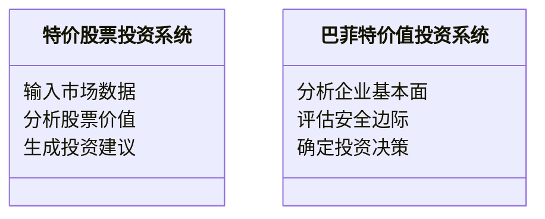
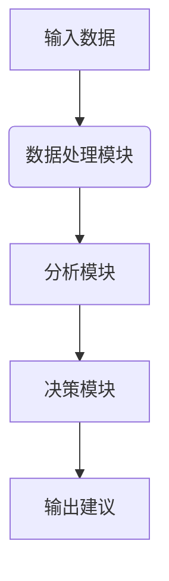
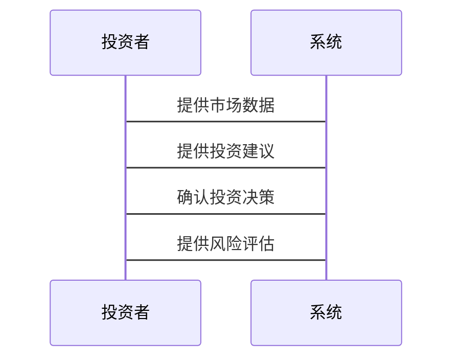

                 


# 特价股票投资策略与巴菲特的价值投资比较

## 关键词：股票投资，价值投资，特价股票，巴菲特，投资策略

## 摘要：本文详细探讨了特价股票投资策略与巴菲特价值投资之间的异同，分析了两者的核心理念、适用场景及优缺点，通过比较帮助投资者更好地理解两种策略的特点及适用情况，为投资者提供有价值的参考。

---

## 第一部分：特价股票投资策略与巴菲特价值投资的背景与核心理念

### 第1章：特价股票投资策略概述

#### 1.1 特价股票投资的定义与特点

##### 1.1.1 什么是特价股票
特价股票通常指那些市场价格低于其内在价值的股票。这些股票可能因为市场波动、投资者情绪或市场不完善等原因被低估。投资者认为这些股票具有潜在的增值空间，因此在低价时买入，等待价格回升以获利。

##### 1.1.2 特价股票投资的核心特点
- **低估值**：股价低于其真实价值。
- **逆向投资**：在市场低迷时买入，市场高涨时卖出。
- **短期机会**：通常关注短期价格反弹，而非长期增值。

##### 1.1.3 特价股票投资的适用场景
- 市场低迷或熊市时。
- 特定行业或公司因短期问题被市场过度抛售时。
- 投资者具备快速分析和决策能力时。

#### 1.2 特价股票投资的理论基础

##### 1.2.1 市场有效性的探讨
市场有效性理论认为，股票价格反映了所有公开信息。然而，短期市场波动可能导致价格偏离其真实价值，为特价股票投资提供了机会。

##### 1.2.2 价值发现与市场低估的关系
投资者通过分析公司基本面，寻找市场价格低于内在价值的股票。这种差异为投资提供了安全边际。

##### 1.2.3 投资者心理与市场情绪的影响
市场情绪的波动导致股票价格的短期波动，投资者利用这种波动，低价买入，高价卖出。

#### 1.3 特价股票投资的历史与发展

##### 1.3.1 特价股票投资的起源
起源于20世纪初，早期投资者通过分析公司财务报表寻找低估股票。

##### 1.3.2 现代特价股票投资的发展
随着金融工具的多样化和信息透明度的提高，特价股票投资策略更加成熟，投资者利用技术分析和量化模型寻找机会。

##### 1.3.3 特价股票投资在不同市场周期的表现
在熊市中，特价股票投资表现较好；在牛市中，可能因市场情绪导致收益有限。

#### 1.4 特价股票投资与其他投资策略的比较

##### 1.4.1 与趋势投资的对比
趋势投资关注价格走势，而特价股票投资关注价格与价值的偏离。

##### 1.4.2 与技术分析的对比
技术分析依赖价格形态，而特价股票投资注重基本面分析。

##### 1.4.3 与成长投资的对比
成长投资追求高增长公司，而特价股票投资关注低估值股票。

#### 1.5 本章小结
特价股票投资是一种逆向投资策略，利用市场低估的机会，适合具备快速决策能力的投资者。

---

### 第2章：巴菲特价值投资的核心理念

#### 2.1 巴菲特投资哲学概述

##### 2.1.1 巴菲特的投资理念
巴菲特强调购买优秀企业的股票，长期持有，分享企业成长的收益。

##### 2.1.2 巴菲特的价值投资定义
投资于具有持续竞争优势、良好治理结构和合理估值的企业。

##### 2.1.3 巴菲特投资成功的几个关键因素
- **优秀的企业**：具备护城河和持续盈利能力。
- **合理的价格**：买入价格低于内在价值。
- **长期持有**：分享企业成长的成果。

#### 2.2 巴菲特投资策略的四个步骤

##### 2.2.1 确定投资目标
明确投资目标，寻找具备竞争优势的企业。

##### 2.2.2 分析公司基本面
通过财务报表分析企业的盈利能力、资产负债情况和现金流。

##### 2.2.3 评估安全边际
买入价格低于内在价值，确保安全边际。

##### 2.2.4 长期持有优质公司
长期持有优质股票，分享企业成长。

#### 2.3 巴菲特投资组合管理

##### 2.3.1 投资组合的构建原则
集中投资于少数优质企业，避免过度分散。

##### 2.3.2 投资组合的调整策略
长期持有，除非企业基本面发生变化，否则不频繁调整。

##### 2.3.3 巴菲特投资组合的长期表现
通过长期持有优质股票，巴菲特定价获得稳定收益。

#### 2.4 巴菲特投资理念的局限性

##### 2.4.1 价值投资的适用范围
适用于长期投资者，不适合短期交易者。

##### 2.4.2 巴菲特投资策略的潜在风险
市场波动可能导致短期亏损，需要足够的耐心和纪律。

##### 2.4.3 巴菲特投资理念的现代挑战
科技企业的快速变化可能影响传统的护城河分析。

#### 2.5 本章小结
巴菲特的价值投资是一种长期投资策略，注重企业质量和安全边际，适合具备长期视角的投资者。

---

### 第3章：特价股票投资与巴菲特价值投资的比较分析

#### 3.1 核心理念的对比

##### 3.1.1 投资目标
- 特价股票投资：短期价格反弹。
- 巴菲特价值投资：长期企业成长。

##### 3.1.2 投资策略
- 特价股票投资：逆向投资，寻找低估股票。
- 巴菲特价值投资：买入优质企业，长期持有。

##### 3.1.3 风险承受
- 特价股票投资：高风险，市场波动大。
- 巴菲特价值投资：相对稳定，但可能短期波动。

#### 3.2 投资策略的比较

##### 3.2.1 选股标准
- 特价股票投资：关注市场低估和短期价值。
- 巴菲特价值投资：关注企业基本面和长期竞争优势。

##### 3.2.2 持股时间
- 特价股票投资：短期持有，快速交易。
- 巴菲特价值投资：长期持有，分享成长。

##### 3.2.3 交易频率
- 特价股票投资：高频率，抓住短期机会。
- 巴菲特价值投资：低频率，长期持有。

#### 3.3 优缺点对比

##### 3.3.1 特价股票投资的优点
- 高回报潜力。
- 适合短期投资者。

##### 3.3.2 特价股票投资的缺点
- 高风险。
- 需要快速决策能力。

##### 3.3.3 巴菲特价值投资的优点
- 长期稳定收益。
- 低风险，安全边际高。

##### 3.3.4 巴菲特价值投资的缺点
- 需要长期等待。
- 高门槛，需要深入研究。

#### 3.4 适用场景的对比

##### 3.4.1 特价股票投资的适用场景
- 市场低迷。
- 特定行业或公司被低估。

##### 3.4.2 巴菲特价值投资的适用场景
- 长期投资者。
- 市场稳定，具备优质企业。

#### 3.5 投资者心理的对比

##### 3.5.1 特价股票投资者的心理
- 乐观，相信市场低估会恢复。
- 喜欢短期挑战。

##### 3.5.2 巴菲特投资者的心理
- 耐心，相信长期价值。
- 保守，注重安全边际。

#### 3.6 本章小结
特价股票投资和巴菲特价值投资各有优劣，适用于不同类型的投资者和市场环境。

---

## 第四部分：数学模型与公式

### 4.1 特价股票投资的数学模型

#### 4.1.1 内在价值公式
$$ 内在价值 = \frac{未来现金流的现值}{折现率} $$

#### 4.1.2 安全边际计算
$$ 安全边际 = 内在价值 - 市场价格 $$

### 4.2 巴菲特价值投资的数学模型

#### 4.2.1 股东权益回报率（ROE）
$$ ROE = \frac{净利润}{股东权益} $$

#### 4.2.2 资产回报率（ROA）
$$ ROA = \frac{净利润}{总资产} $$

---

## 第五部分：系统分析与架构设计

### 5.1 系统功能设计

#### 5.1.1 领域模型


### 5.2 系统架构设计

#### 5.2.1 系统架构图


### 5.3 系统接口设计

#### 5.3.1 接口描述
- 输入接口：市场数据、公司财务数据。
- 输出接口：投资建议、风险评估。

### 5.4 系统交互流程

#### 5.4.1 交互流程图


---

## 第六部分：项目实战

### 6.1 环境安装

#### 6.1.1 安装Python
```bash
python --version
pip install numpy pandas matplotlib
```

### 6.2 核心实现

#### 6.2.1 特价股票投资实现
```python
import pandas as pd
import numpy as np

def calculate_intrinsic_value(fcf, discount_rate):
    return fcf / (1 + discount_rate)
```

#### 6.2.2 巴菲特价值投资实现
```python
def calculate_roe(net_income, shareholders_equity):
    return net_income / shareholders_equity
```

### 6.3 案例分析

#### 6.3.1 特价股票投资案例
某公司股票价格为10元，内在价值为12元，安全边际为2元，适合买入。

#### 6.3.2 巴菲特价值投资案例
某公司ROE为20%，股东权益为1000万元，净利润为200万元，适合长期持有。

### 6.4 本章小结
通过实战案例，投资者可以更好地理解两种策略的应用。

---

## 第七部分：总结与展望

### 7.1 总结

#### 7.1.1 核心观点回顾
- 特价股票投资适合短期投资者，巴菲特价值投资适合长期投资者。
- 两者各有优劣，适用于不同市场环境。

#### 7.1.2 投资者启示
- 根据自身情况选择合适策略。
- 结合多种策略，优化投资组合。

### 7.2 展望

#### 7.2.1 研究方向
- 结合量化模型，优化投资策略。
- 探讨两种策略在不同市场中的表现。

#### 7.2.2 实际应用
- 开发综合投资系统，结合两种策略的优势。
- 提供投资者工具，辅助决策。

### 7.3 本章小结
理解两种策略的异同，帮助投资者制定更有效的投资计划。

---

## 参考文献

- 巴菲特的《投资哲学》
- 《股票投资实战》
- 《价值投资入门》
- 相关学术论文和研究报告

---

## 作者信息

作者：AI天才研究院/AI Genius Institute & 禅与计算机程序设计艺术 /Zen And The Art of Computer Programming

