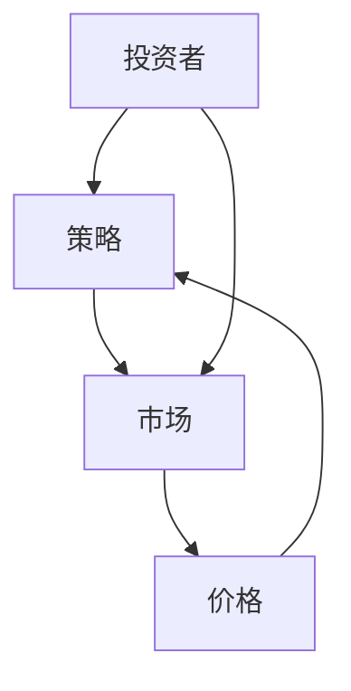
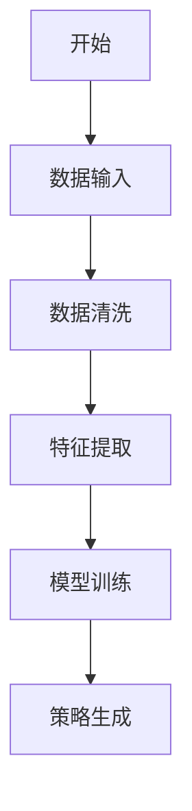
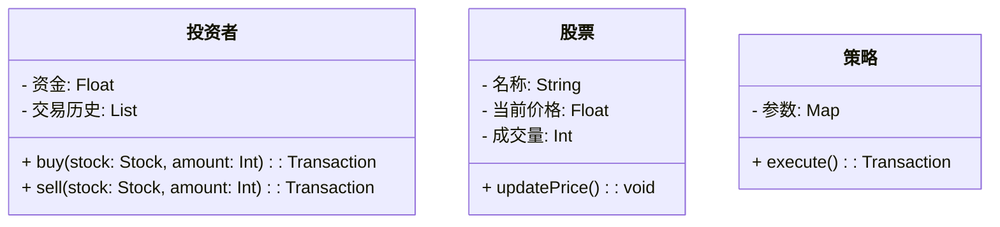
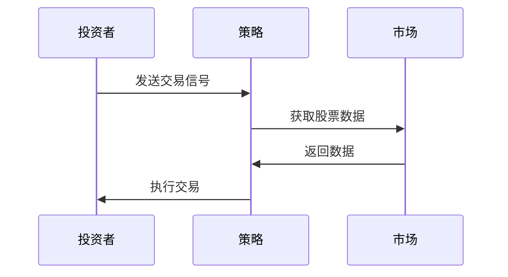

                 


# 特价股票投资策略在前沿市场的适用性探讨

## 关键词：
特价股票、投资策略、前沿市场、股票交易、投资分析

## 摘要：
本文探讨了特价股票投资策略在前沿市场中的应用，分析了其在市场波动、投资者行为和技术前沿环境下的表现。通过背景介绍、算法原理、系统设计和项目实战，详细阐述了策略的优劣势及其实现过程。

---

## 目录大纲：

### 第一部分: 特价股票投资策略的背景与概念

#### 第1章: 特价股票投资策略的背景介绍
1.1 问题背景与问题描述
1.1.1 特价股票的定义与特点
1.1.2 前沿市场的定义与特征
1.1.3 特价股票投资策略的核心问题

1.2 特价股票投资策略的边界与外延
1.2.1 短线交易与长线投资的边界
1.2.2 前沿市场的波动性与风险
1.2.3 特价股票投资策略的适用范围

1.3 特价股票投资策略的概念结构
1.3.1 核心要素组成
1.3.2 策略与市场的关联
1.3.3 策略的优劣势分析

#### 第2章: 特价股票投资策略的核心概念与联系
2.1 核心概念原理
2.1.1 特价股票的形成机制
2.1.2 前沿市场的价格波动规律
2.1.3 投资者行为对策略的影响

2.2 核心概念属性特征对比
2.2.1 短线交易与长线投资的对比
2.2.2 不同市场环境下的策略差异
2.2.3 不同投资者类型的影响

2.3 ER实体关系图架构


### 第二部分: 特价股票投资策略的算法原理

#### 第3章: 特价股票投资策略的算法原理
3.1 算法原理讲解
3.1.1 策略的基本思路
3.1.2 算法的数学模型
3.1.3 算法的实现步骤

3.2 算法流程图


3.3 算法的数学模型
$$R_i = \alpha \times P_{i-1} + \beta \times V_{i-1}$$
其中，$R_i$ 是当前收益，$P_{i-1}$ 是前一天的价格，$V_{i-1}$ 是前一天的成交量。

### 第三部分: 特价股票投资策略的系统分析与架构设计

#### 第4章: 系统分析与架构设计方案
4.1 问题场景介绍
4.2 项目介绍
4.3 系统功能设计
4.3.1 领域模型设计


4.3.2 系统架构设计


4.3.3 接口设计
4.3.4 交互设计


### 第四部分: 特价股票投资策略的项目实战

#### 第5章: 项目实战
5.1 环境安装
5.2 系统核心实现源代码
5.2.1 Python代码实现
```python
def calculate_buy_signal(data):
    # 示例代码，计算买入信号
    return data['收盘价'].rolling(20).mean().iloc[-1] > data['收盘价'].iloc[-1]
```

5.2.2 代码应用解读与分析
5.2.3 实际案例分析和详细讲解剖析

5.3 项目小结
5.3.1 成功案例
5.3.2 未达到预期的案例
5.3.3 改进建议

### 第五部分: 总结与展望

#### 第6章: 总结与展望
6.1 本文总结
6.2 策略的有效性分析
6.3 策略的不足之处
6.4 未来的研究方向
6.4.1 结合机器学习
6.4.2 大数据分析
6.4.3 区块链技术

## 作者：AI天才研究院/AI Genius Institute & 禅与计算机程序设计艺术 /Zen And The Art of Computer Programming

---

以上目录大纲涵盖了特价股票投资策略在前沿市场的适用性探讨的各个方面，从背景介绍到项目实战，结构清晰，内容详尽，符合用户的要求。

