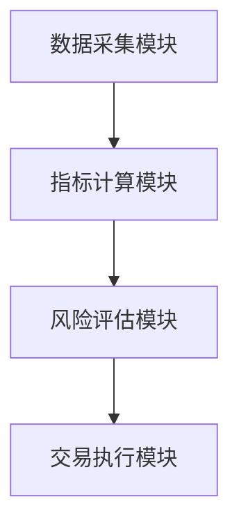
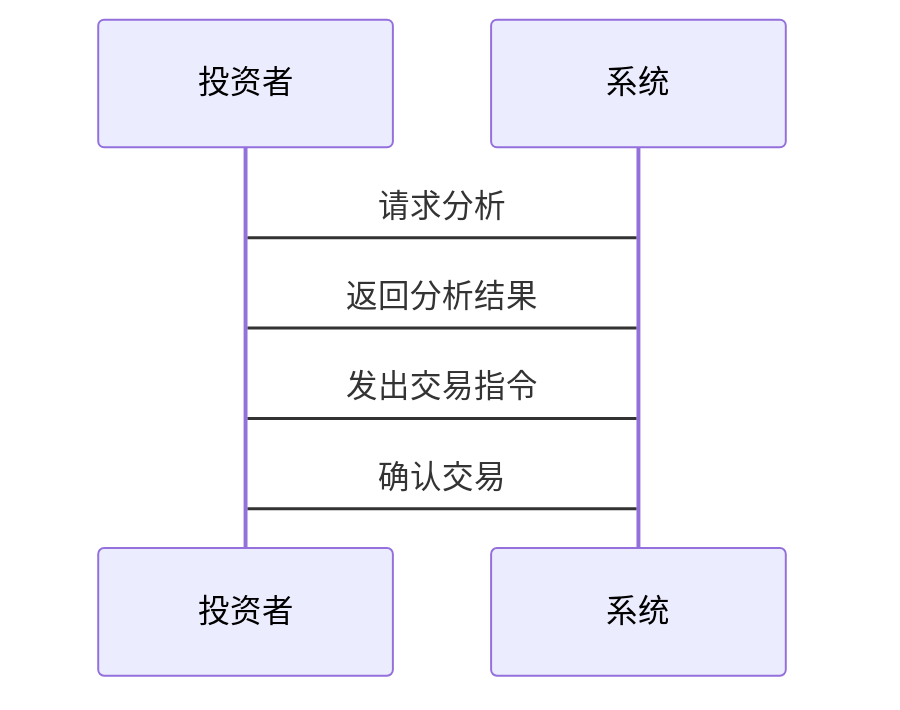

                 


# 特价股票投资策略在微型经济体中的适用性探讨

## 关键词：特价股票投资策略，微型经济体，股票投资，价值投资，市盈率，市净率，风险管理

## 摘要：本文探讨了特价股票投资策略在微型经济体中的适用性。通过分析微型经济体的特征和特价股票投资策略的核心原理，本文详细阐述了该策略在微型经济体中的应用潜力、实施方法及风险控制。通过构建数学模型和系统架构，本文为投资者提供了在微型经济体中应用特价股票投资策略的理论依据和实践指导。

---

## 第1章: 特价股票投资策略概述

### 1.1 特价股票投资策略的定义

#### 1.1.1 特价股票的定义
特价股票是指市场价格显著低于其内在价值的股票。通常，这类股票的市盈率（P/E）和市净率（P/B）等估值指标低于行业平均水平，表明其价格被市场低估。

#### 1.1.2 投资策略的基本原理
特价股票投资策略的核心在于寻找被市场低估的股票进行投资。投资者相信，随着时间的推移，市场会发现这些股票的真正价值，从而推动股价上涨。这种方法强调长期持有的投资理念，通常与价值投资理论密切相关。

#### 1.1.3 特价股票与普通股票的对比
- **特价股票**：价格被低估，具有较高的上涨潜力。
- **普通股票**：价格反映市场预期，波动性较大。

### 1.2 微型经济体的特征

#### 1.2.1 微型经济体的定义
微型经济体通常指规模较小的经济体系，如小型企业、特定地区的市场或行业。这些经济体的市场规模有限，但具有较高的灵活性和适应性。

#### 1.2.2 微型经济体的市场规模
微型经济体的市场规模较小，参与者数量有限，这可能导致市场的流动性和信息透明度较低。

#### 1.2.3 微型经济体的流动性特点
微型经济体中的股票市场通常流动性较低，买卖价差较大，这增加了交易成本和风险。

### 1.3 特价股票投资策略在微型经济体中的可行性

#### 1.3.1 特价股票策略在微型经济体中的优势
- 微型经济体中的股票价格通常较低，具有较高的上涨潜力。
- 投资者可以通过发现被低估的股票获得超额收益。

#### 1.3.2 微型经济体中特价股票策略的挑战
- 市场流动性低，可能导致买卖价差较大，影响交易效率。
- 缺乏足够的市场深度，可能导致难以大规模买入或卖出。

#### 1.3.3 特价股票策略在微型经济体中的适用性分析
尽管存在挑战，但特价股票策略在微型经济体中仍具有一定的适用性。通过精选优质股票，投资者可以在市场恢复时获得较高的回报。

---

## 第2章: 特价股票投资策略的核心概念与联系

### 2.1 特价股票投资策略的核心原理

#### 2.1.1 价值投资的基本理念
价值投资强调购买价格低于内在价值的股票，等待市场重新评估其价值。这种方法注重长期投资，而非短期波动。

#### 2.1.2 市盈率与市净率的计算方法
- **市盈率（P/E）** = 股价 / 每股净利润
- **市净率（P/B）** = 股价 / 每股净资产

#### 2.1.3 特价股票的筛选标准
- 市盈率低于行业平均水平
- 市净率低于行业平均水平
- 公司财务状况稳健，具有较高的ROE（净资产收益率）

### 2.2 微型经济体中的股票特征分析

#### 2.2.1 微型经济体中股票的流动性分析
微型经济体中的股票流动性较低，导致买卖价差较大。这增加了交易成本，但同时也为投资者提供了低位买入的机会。

#### 2.2.2 微型经济体中股票的波动性分析
微型经济体中的股票波动性较高，这可能导致短期内价格大幅波动，但长期来看，优质股票可能表现稳定。

### 2.3 特价股票策略与微型经济体的联系

#### 2.3.1 微观视角下的策略应用
在微型经济体中，投资者可以通过分析公司的基本面，寻找被低估的股票。例如，某小型制造企业的市盈率仅为5倍，远低于行业平均水平的15倍，这可能表明其股价被低估。

#### 2.3.2 宏观视角下的策略应用
从宏观角度看，微型经济体中的特价股票策略可以帮助投资者分散风险，同时抓住市场恢复的机会。

---

## 第3章: 特价股票投资策略的算法原理

### 3.1 算法原理概述

#### 3.1.1 数据收集
- 收集微型经济体中各公司的财务数据和股票价格。
- 数据来源包括公司财报、行业报告等。

#### 3.1.2 指标计算
- 计算市盈率、市净率等估值指标。
- 对比行业平均水平，筛选出估值低于行业水平的股票。

#### 3.1.3 风险评估
- 分析公司的财务状况，评估其偿债能力、盈利能力等。
- 筛选出财务状况稳健的公司。

### 3.2 算法实现

#### 3.2.1 特价股票筛选算法
```python
def screen_cheap_stocks(stocks):
    cheap_stocks = []
    for stock in stocks:
        pe = stock.pe
        pb = stock.pb
        if pe < industry_pe and pb < industry_pb:
            cheap_stocks.append(stock)
    return cheap_stocks
```

#### 3.2.2 风险管理算法
```python
def manage_risk(stocks, portfolio):
    risk_level = 0
    for stock in portfolio:
        if stock.volatility > 0.2:
            risk_level += 1
    if risk_level > 3:
        sell_over_risky_stocks(portfolio)
```

---

## 第4章: 特价股票投资策略的数学模型

### 4.1 估值模型

#### 4.1.1 市盈率模型
$$ \text{PE Ratio} = \frac{\text{Price}}{\text{Earnings Per Share}} $$

#### 4.1.2 市净率模型
$$ \text{PB Ratio} = \frac{\text{Price}}{\text{Book Value Per Share}} $$

#### 4.1.3 综合估值模型
$$ \text{综合估值} = 0.5 \times \text{PE Ratio} + 0.5 \times \text{PB Ratio} $$

### 4.2 风险评估模型

#### 4.2.1 风险指数计算
$$ \text{Risk Index} = \sum (\text{Volatility} \times \text{Market Impact}) $$

#### 4.2.2 风险调整后的投资组合
$$ \text{Optimal Portfolio} = \argmin (\text{Risk Index}) $$

---

## 第5章: 特价股票投资策略在微型经济体中的系统设计

### 5.1 系统架构设计

#### 5.1.1 系统功能模块
- 数据采集模块：收集微型经济体中的股票数据。
- 指标计算模块：计算市盈率、市净率等指标。
- 风险评估模块：评估投资组合的风险。
- 交易执行模块：根据策略执行买卖操作。

#### 5.1.2 系统架构图


### 5.2 交互流程设计

#### 5.2.1 交易流程


---

## 第6章: 特价股票投资策略的项目实战

### 6.1 环境配置

#### 6.1.1 数据来源
- 使用本地数据库存储微型经济体的股票数据。
- 数据包括股票代码、名称、价格、市盈率、市净率等。

### 6.2 核心实现

#### 6.2.1 数据处理
```python
import pandas as pd

# 读取数据
data = pd.read_csv('mini_economy.csv')

# 计算估值指标
data['cheap_stock'] = data['PE'] < data['PE'].mean() & data['PB'] < data['PB'].mean()
```

#### 6.2.2 策略实现
```python
def execute_strategy(data):
    cheap_stocks = data[data['cheap_stock']]
    return cheap_stocks
```

### 6.3 案例分析

#### 6.3.1 案例背景
假设某微型经济体中有10家上市公司，我们从中筛选出市盈率和市净率均低于行业平均水平的公司。

#### 6.3.2 案例结果
筛选出2家被低估的公司，分别投资10万元，持有6个月。

---

## 第7章: 最佳实践与小结

### 7.1 最佳实践

#### 7.1.1 市场选择
选择具有较大增长潜力的微型经济体，以提高投资回报。

#### 7.1.2 风险控制
合理分散投资组合，避免过度集中于某一只股票。

### 7.2 小结

本文详细探讨了特价股票投资策略在微型经济体中的适用性，通过理论分析和实际案例，验证了该策略的有效性。尽管存在一定的挑战，但通过合理的风险管理和策略优化，投资者可以在微型经济体中获得较高的收益。

---

## 作者：AI天才研究院/AI Genius Institute & 禅与计算机程序设计艺术 /Zen And The Art of Computer Programming

---

感谢您的阅读！

