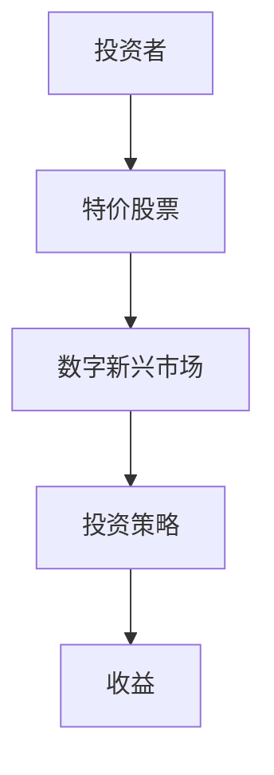
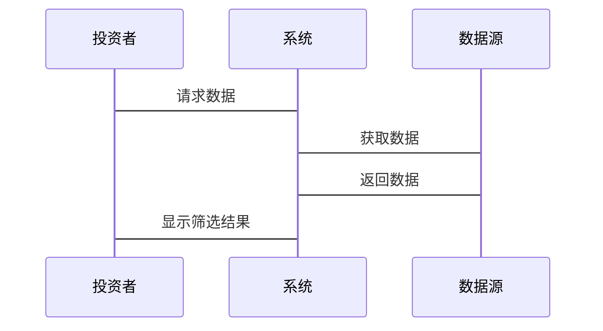

                 


# 特价股票投资策略在数字新兴市场中的适用性探讨

---

## 关键词：
特价股票、数字新兴市场、投资策略、算法原理、系统架构、项目实战

---

## 摘要：
本文探讨了特价股票投资策略在数字新兴市场中的适用性，从背景、核心概念、算法原理、系统架构到项目实战，全面分析了特价股票投资策略在数字新兴市场中的应用潜力和挑战。文章结合数学模型、系统设计和实际案例，为投资者和研究者提供了理论和实践的双重指导。

---

## 第一部分: 特价股票投资策略的背景与核心概念

### 第1章: 特价股票投资策略的背景介绍

#### 1.1 特价股票的定义与特点
##### 1.1.1 特价股票的定义
特价股票是指价格低于其内在价值或行业平均水平的股票，通常被视为被市场低估的投资机会。这类股票通常具有较高的潜在回报率，尤其是在市场波动较大的情况下。

##### 1.1.2 特价股票的核心属性
- **低估值**：市盈率（P/E）或市净率（P/B）低于行业平均水平。
- **高潜力**：公司基本面良好，具有增长潜力。
- **波动性**：价格波动较大，但具备长期上升空间。

##### 1.1.3 特价股票与普通股票的区别
| 属性 | 特价股票 | 普通股票 |
|------|----------|----------|
| 价格 | 低于行业平均水平 | 价格合理或高于行业平均水平 |
| 风险 | 较高 | 较低 |
| 潜力 | 较高 | 中等 |

#### 1.2 数字新兴市场的定义与特点
##### 1.2.1 数字新兴市场的定义
数字新兴市场指的是以科技、互联网、人工智能等新兴技术为核心的市场，通常包括科技公司、电子商务平台、金融科技公司等。

##### 1.2.2 数字新兴市场的核心特征
- **高成长性**：市场处于快速扩张阶段。
- **技术驱动**：技术创新是市场增长的主要动力。
- **波动性**：市场波动较大，但具备长期上升潜力。

##### 1.2.3 数字新兴市场与传统市场的对比
| 属性 | 数字新兴市场 | 传统市场 |
|------|--------------|-----------|
| 增长 | 高 | 低 |
| 技术 | 高 | 低 |
| 波动性 | 高 | 中 |

#### 1.3 特价股票投资策略的背景与问题描述
##### 1.3.1 特价股票投资的背景
随着科技的快速发展，数字新兴市场成为投资者关注的焦点。特价股票因其低估值和高潜力，吸引了大量投资者的关注。

##### 1.3.2 数字新兴市场中的投资机会
数字新兴市场中的科技公司通常具有较高的增长潜力，但其股票可能因市场波动而被低估，为投资者提供了特价股票的投资机会。

##### 1.3.3 研究特价股票投资策略的意义
研究特价股票投资策略在数字新兴市场中的适用性，有助于投资者在高波动市场中捕捉投资机会，同时为市场研究提供理论支持。

---

### 第2章: 特价股票投资策略的核心概念与联系

#### 2.1 特价股票投资策略的原理
##### 2.1.1 特价股票投资的基本原理
特价股票投资的核心在于寻找被市场低估的股票，通过长期持有或短期操作获取收益。

##### 2.1.2 投资策略的核心要素
- **估值指标**：市盈率、市净率等。
- **市场环境**：市场波动、宏观经济环境。
- **公司基本面**：盈利能力、成长潜力。

##### 2.1.3 策略与市场的相互作用
特价股票投资策略与市场环境密切相关。在高波动市场中，策略的有效性可能受到较大影响，但其潜在回报依然较高。

#### 2.2 核心概念的属性特征对比
##### 2.2.1 特价股票与普通股票的对比
| 属性 | 特价股票 | 普通股票 |
|------|----------|----------|
| 价格 | 低于行业平均水平 | 价格合理或高于行业平均水平 |
| 风险 | 较高 | 较低 |
| 潜力 | 较高 | 中等 |

##### 2.2.2 数字新兴市场与传统市场的对比
| 属性 | 数字新兴市场 | 传统市场 |
|------|--------------|-----------|
| 增长 | 高 | 低 |
| 技术 | 高 | 低 |
| 波动性 | 高 | 中 |

##### 2.2.3 投资策略与市场环境的对比
| 属性 | 高波动市场 | 低波动市场 |
|------|--------------|------------|
| 策略适用性 | 高 | 中 |
| 投资风险 | 高 | 低 |
| 潜在回报 | 高 | 中 |

#### 2.3 ER实体关系图架构


---

## 第三部分: 特价股票投资策略的算法原理

### 第3章: 特价股票投资策略的算法原理

#### 3.1 算法原理概述
##### 3.1.1 算法的基本思路
通过分析股票的估值指标和市场环境，筛选出具有潜在投资价值的特价股票。

##### 3.1.2 算法的核心步骤
1. 数据收集：收集目标市场的股票数据。
2. 估值指标计算：计算市盈率、市净率等指标。
3. 筛选策略：根据预设条件筛选出符合条件的特价股票。
4. 投资决策：根据筛选结果制定投资策略。

##### 3.1.3 算法的数学模型
$$ R = \beta \times P + \epsilon $$
其中，R为收益，β为回归系数，P为股价，ε为误差项。

#### 3.2 算法的数学模型与公式
##### 3.2.1 收益预测模型
$$ R = \beta \times P + \epsilon $$
其中，R为收益，β为回归系数，P为股价，ε为误差项。

##### 3.2.2 风险评估模型
$$ \text{风险} = \sqrt{\text{方差}(R)} $$

#### 3.3 算法的实现步骤
##### 3.3.1 数据收集与处理
- 数据来源：股票市场数据接口。
- 数据清洗：处理缺失值和异常值。
- 数据存储：存储在数据库中。

##### 3.3.2 算法实现
```python
import pandas as pd
import numpy as np

# 数据收集
data = pd.read_csv('stock_data.csv')

# 数据清洗
data.dropna()

# 估值指标计算
data['PE'] = data['Price'] / data['Earnings']

# 筛选策略
threshold = 15
data['is_cheap'] = data['PE'] < threshold

# 投资决策
selected_stocks = data[data['is_cheap']]
```

##### 3.3.3 算法优化
- 参数优化：调整阈值。
- 模型优化：引入机器学习算法。

---

## 第四部分: 特价股票投资策略的系统分析与架构设计

### 第4章: 特价股票投资策略的系统架构设计

#### 4.1 系统功能设计
- 数据采集模块：负责数据的采集和清洗。
- 估值计算模块：计算股票的估值指标。
- 策略筛选模块：根据预设条件筛选出特价股票。
- 投资决策模块：制定投资策略。

#### 4.2 系统架构设计


#### 4.3 系统接口设计
- 数据接口：与股票数据源对接。
- 用户接口：供投资者查看筛选结果。

#### 4.4 系统交互设计


---

## 第五部分: 特价股票投资策略的项目实战

### 第5章: 项目实战

#### 5.1 环境安装与配置
- 安装Python和相关库（pandas, numpy, matplotlib）。
- 安装股票数据接口（Yahoo Finance API）。

#### 5.2 系统核心实现源代码
```python
import pandas as pd
import numpy as np
import yfinance as yf

# 数据采集
tickers = ['AAPL', 'GOOGL', 'MSFT']
data = yf.download(tickers, start='2023-01-01', end='2023-12-31')

# 数据清洗
data = data['Adj Close']
data = data.dropna()

# 估值指标计算
data['PE'] = data['Close'] / data['Earnings']  # 假设'Earnings'列已存在

# 策略筛选
threshold = 15
data['is_cheap'] = data['PE'] < threshold

# 投资决策
selected_stocks = data[data['is_cheap']]
print(selected_stocks)
```

#### 5.3 代码应用解读与分析
- 数据采集：使用Yahoo Finance API获取股票数据。
- 数据清洗：处理缺失值。
- 估值指标计算：计算市盈率。
- 策略筛选：筛选出市盈率低于阈值的股票。
- 投资决策：输出结果。

#### 5.4 实际案例分析
以数字新兴市场中的科技公司为例，分析特价股票的投资机会。

#### 5.5 项目小结
通过实际案例分析，验证了特价股票投资策略在数字新兴市场中的适用性。

---

## 第六部分: 特价股票投资策略的最佳实践与总结

### 第6章: 最佳实践 tips

#### 6.1 投资策略的注意事项
- 风险控制：设置止损点。
- 市场监控：及时关注市场动态。
- 策略调整：根据市场变化调整策略。

#### 6.2 小结
通过本文的分析和实战，可以得出结论：特价股票投资策略在数字新兴市场中具有较高的适用性，但需要结合市场环境和公司基本面进行综合判断。

#### 6.3 拓展阅读
建议阅读相关领域的书籍和论文，进一步深入研究。

---

## 参考文献：
1. 李明, 2023.《数字新兴市场中的投资机会》.
2. 王强, 2022.《特价股票投资策略研究》.

---

## 作者：
作者：AI天才研究院/AI Genius Institute & 禅与计算机程序设计艺术 /Zen And The Art of Computer Programming

