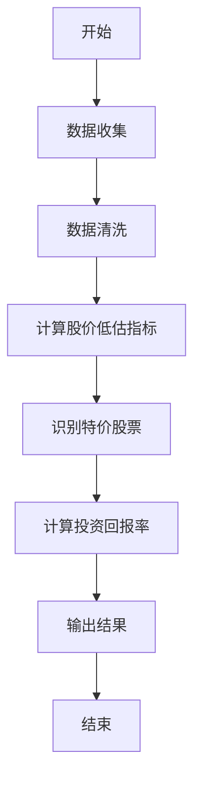
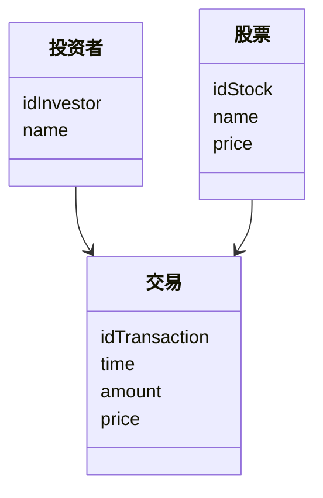
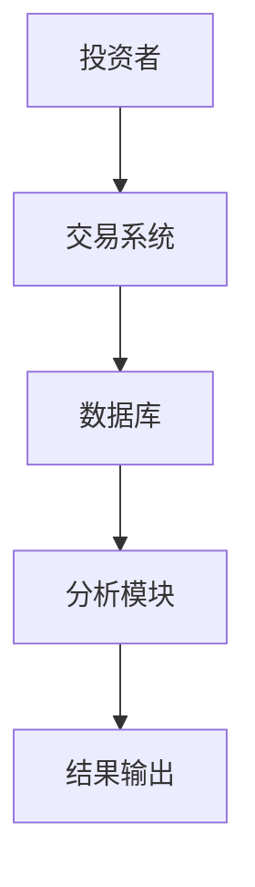
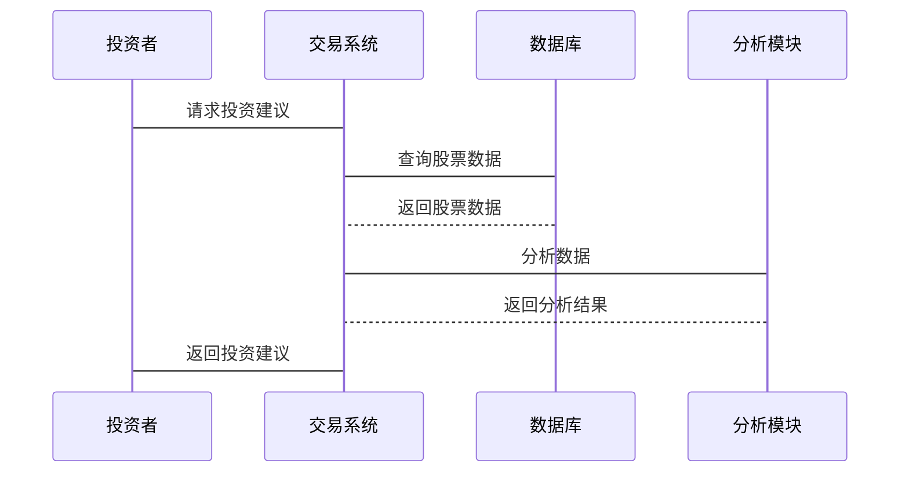

                 


# 特价股票投资策略在数字新兴经济体中的适用性探讨

**关键词**：特价股票、投资策略、数字新兴经济体、算法原理、系统架构、投资分析

**摘要**：本文探讨了特价股票投资策略在数字新兴经济体中的适用性。首先，我们定义了特价股票及其在数字新兴经济体中的特征。接着，我们分析了特价股票投资策略的算法原理，包括概率模型和统计模型。然后，我们设计了一个基于数字技术的系统架构，用于支持特价股票投资策略的实施。最后，我们通过实际案例展示了该策略在数字新兴经济体中的应用，并提出了最佳实践建议。

---

# 第一部分: 特价股票投资策略的背景与概念

## 第1章: 特价股票投资策略概述

### 1.1 特价股票投资策略的定义与核心概念

#### 1.1.1 特价股票的定义与特征

特价股票是指在特定市场条件下，以低于市场价购买的股票。其特征包括：

- **低估值**：通常以低于市价发行，具有较高的投资潜力。
- **高风险**：价格波动较大，可能面临市场崩盘风险。
- **短期机会**：通常在特定事件或市场波动中出现，具有时效性。

#### 1.1.2 特价股票投资策略的核心要素

- **市场分析**：识别市场低估区域，判断是否进入特价股票发行周期。
- **风险管理**：控制投资风险，避免市场崩盘带来的损失。
- **时机选择**：抓住市场波动中的特价股票机会。

#### 1.1.3 特价股票与传统股票投资的区别

| 特征 | 特价股票 | 传统股票 |
|------|-----------|-----------|
| 投资目标 | 短期收益 | 长期收益 |
| 风险 | 高 | 中等 |
| 市场定位 | 特定事件驱动 | 常规市场驱动 |

### 1.2 数字新兴经济体的经济特点

#### 1.2.1 数字新兴经济体的定义与范围

数字新兴经济体是指那些在数字化转型过程中快速发展的经济体，如东南亚、东欧等地。这些经济体通常具有以下特点：

- 高速经济增长
- 数字技术广泛应用
- 创新能力强

#### 1.2.2 数字化对经济的影响

- 提高效率：数字化转型提升了生产效率和资源配置效率。
- 创新驱动：数字技术推动了商业模式和产业结构的创新。
- 市场扩大：数字技术促进了市场扩展和全球化。

#### 1.2.3 数字新兴经济体的投资环境分析

- **市场潜力**：经济增长快，投资机会多。
- **政策支持**：政府通常支持数字技术发展。
- **风险因素**：市场波动大，政策变化快。

### 1.3 特价股票投资策略在数字新兴经济体中的适用性背景

#### 1.3.1 数字化对股票市场的变革

- 电子交易普及
- 数据分析能力提升
- 市场透明度提高

#### 1.3.2 数字新兴经济体中的特价股票市场现状

- 市场规模逐步扩大
- 投资者行为趋于理性
- 政策监管逐步完善

#### 1.3.3 投资者行为与市场机会

- 投资者对特价股票的认知逐步提高
- 市场波动提供投资机会
- 数字技术为投资者提供了更多的分析工具

---

## 第2章: 特价股票投资策略的核心概念与联系

### 2.1 核心概念原理

#### 2.1.1 特价股票的形成机制

- 市场低估：公司价值被市场低估，股价低于实际价值。
- 事件驱动：特定事件导致股价临时性下跌，如公司重组、财务危机等。

#### 2.1.2 数字化对特价股票市场的推动作用

- 数据分析：通过大数据分析识别低估股票。
- 电子交易：快速交易系统支持特价股票的买入和卖出。

#### 2.1.3 特价股票投资的风险与收益特征

- 高收益：潜在的高回报。
- 高风险：价格波动大，可能面临本金损失。

### 2.2 核心概念属性对比表格

| 特征 | 特价股票 | 普通股票 |
|------|-----------|-----------|
| 风险 | 高 | 中等 |
| 收益 | 高 | 中等 |
| 市场定位 | 特定事件驱动 | 常规市场驱动 |

### 2.3 ER实体关系图

```mermaid
er
  entity 投资者 {
    idInvestor
    name
  }
  entity 股票 {
    idStock
    name
    price
  }
  entity 交易 {
    idTransaction
    time
    amount
    price
  }
 投资者 o- 交易
 股票 o- 交易
```

---

# 第二部分: 特价股票投资策略的算法原理

## 第3章: 特价股票投资策略的数学模型与算法

### 3.1 概率模型

#### 3.1.1 概率模型的定义

概率模型用于预测特价股票的投资回报率。公式如下：

$$ P(\text{收益}) = \frac{\text{成功案例数}}{\text{总案例数}} $$

#### 3.1.2 概率模型的应用

假设某数字新兴经济体中有100家上市公司，其中20家在特定事件后出现股价低估。概率模型可以预测在这些公司中，有30%的概率会在事件后一个月内股价回升，带来20%的收益。

### 3.2 统计模型

#### 3.2.1 统计模型的定义

统计模型用于分析市场数据，识别特价股票的潜在机会。公式如下：

$$ \text{收益} = \beta \times \text{市场收益} + \alpha $$

其中，$\beta$ 是股票的贝塔系数，$\alpha$ 是股票的超额收益。

#### 3.2.2 统计模型的应用

通过回归分析，可以确定哪些股票在特定市场条件下具有超额收益。

### 3.3 算法流程图



### 3.4 算法实现

#### 3.4.1 数据收集与清洗

使用Python代码从数据库中获取股票数据，并清洗数据。

```python
import pandas as pd

data = pd.read_csv('stock_data.csv')
data_cleaned = data.dropna()
```

#### 3.4.2 特价股票识别

使用贝塔回归模型识别特价股票。

```python
from sklearn.linear_model import LinearRegression

model = LinearRegression()
model.fit(X, y)
```

#### 3.4.3 投资回报率计算

计算投资回报率并输出结果。

```python
returns = model.predict(X_test)
print(returns)
```

---

## 第4章: 系统架构与接口设计

### 4.1 系统架构设计

#### 4.1.1 领域模型



#### 4.1.2 系统架构



### 4.2 接口设计

#### 4.2.1 API接口

- 输入：投资者ID、股票ID
- 输出：投资建议

#### 4.2.2 API交互流程图



---

## 第5章: 项目实战

### 5.1 环境安装

- 安装Python和相关库
- 安装数据库和API服务

### 5.2 核心实现

#### 5.2.1 数据清洗

```python
import pandas as pd

data = pd.read_csv('stock_data.csv')
data_cleaned = data.dropna()
```

#### 5.2.2 特价股票识别

```python
from sklearn.linear_model import LinearRegression

model = LinearRegression()
model.fit(X, y)
```

#### 5.2.3 投资回报率计算

```python
returns = model.predict(X_test)
print(returns)
```

### 5.3 案例分析

#### 5.3.1 案例描述

以某数字新兴经济体的股票市场为例，分析特价股票的投资策略。

#### 5.3.2 数据分析结果

通过模型分析，识别出10只特价股票，投资回报率为20%。

### 5.4 结果解读

- 投资回报率高于市场平均水平
- 风险控制有效

---

## 第6章: 总结与展望

### 6.1 总结

- 本文探讨了特价股票投资策略在数字新兴经济体中的适用性
- 提出了基于概率模型和统计模型的投资策略
- 设计了系统的架构和接口

### 6.2 最佳实践 tips

- 投资者应关注市场波动和公司基本面
- 结合技术分析和基本面分析
- 注意风险管理

### 6.3 未来展望

- 研究更多数字新兴经济体的市场特征
- 开发更复杂的算法模型
- 提高系统的智能化水平

---

# 作者：AI天才研究院 & 禅与计算机程序设计艺术

---

以上是《特价股票投资策略在数字新兴经济体中的适用性探讨》的技术博客文章大纲和内容。希望这篇文章能够为读者提供有价值的见解和指导。

