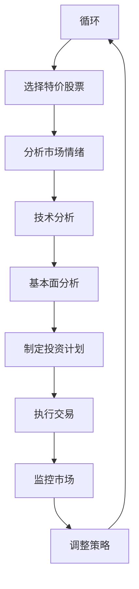
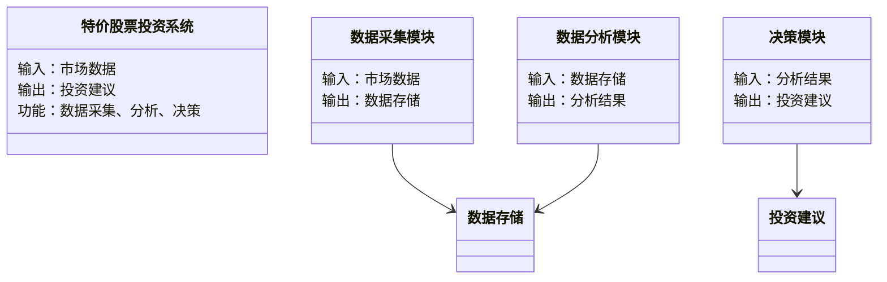
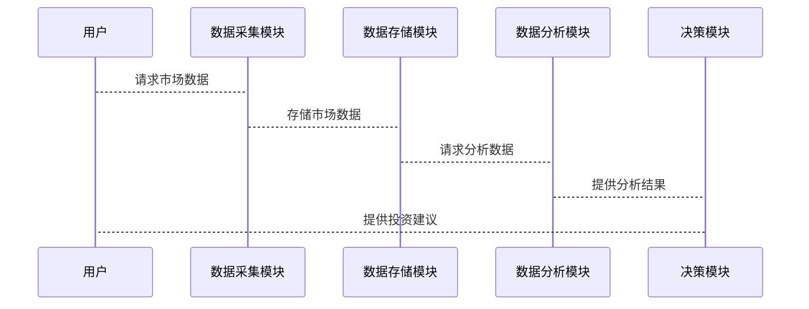

                 


# 特价股票投资策略在新兴市场的适用性探讨

> 关键词：特价股票，新兴市场，投资策略，价量分析，技术分析，数学模型

> 摘要：本文探讨了特价股票投资策略在新兴市场的适用性。首先，介绍了特价股票和新兴市场的基本概念，分析了特价股票在新兴市场的投资价值和风险。接着，详细阐述了特价股票的投资策略，包括价量分析、技术分析和基本面分析，并结合数学模型和算法原理进行了深入探讨。最后，通过实际案例分析，验证了特价股票投资策略的有效性，并提出了最佳实践建议。

---

# 第一部分: 特价股票投资策略的概述

## 第1章: 特价股票与新兴市场的基本概念

### 1.1 特价股票的定义与特点
#### 1.1.1 特价股票的定义
特价股票是指价格低于一定水平的股票，通常定义为价格低于5元的股票。这类股票通常具有较高的流动性和较低的波动性，适合风险偏好较低的投资者。

#### 1.1.2 特价股票的特点
- 价格低廉：特价股票的价格通常较低，适合中小投资者。
- 高流动性：由于价格低廉，往往交易活跃，流动性较高。
- 投资门槛低：投资者可以用较少的资金购买多只股票，分散风险。

#### 1.1.3 特价股票与普通股票的区别
| 属性         | 特价股票       | 普通股票       |
|--------------|----------------|----------------|
| 价格         | 低于5元        | 价格较高       |
| 流动性       | 高             | 较低           |
| 投资门槛     | 低             | 高             |
| 风险         | 较低           | 较高           |

### 1.2 新兴市场的特点
#### 1.2.1 新兴市场的定义
新兴市场是指经济快速增长但尚未完全工业化的国家的金融市场，例如中国、印度、巴西等。

#### 1.2.2 新兴市场的投资机会
- 经济增长快：新兴市场的GDP增速通常高于发达市场。
- 市场潜力大：新兴市场的企业往往具有较高的增长潜力。
- 估值优势：新兴市场的股票估值通常较低，具有较高的投资价值。

#### 1.2.3 新兴市场的风险与挑战
- 市场波动大：新兴市场的股票价格波动较大。
- 政治风险：新兴市场国家的政治不稳定可能影响市场。
- 经济周期性：新兴市场的经济受全球经济波动影响较大。

### 1.3 特价股票在新兴市场的投资价值
#### 1.3.1 特价股票在新兴市场的优势
- 价格低廉：投资者可以用较少的资金投资多只股票。
- 市场潜力大：新兴市场的经济增长为特价股票提供了增长空间。
- 分散风险：通过投资多只特价股票，可以分散风险。

#### 1.3.2 新兴市场中特价股票的潜在收益
- 高增长潜力：新兴市场的企业往往具有较高的增长潜力。
- 市场反弹机会：在市场下跌时，特价股票可能具有更大的反弹空间。
- 估值修复：部分特价股票可能因为市场波动导致估值被低估。

#### 1.3.3 特价股票在新兴市场的风险
- 市场波动风险：新兴市场的股票价格波动较大。
- 公司基本面风险：部分特价股票可能属于基本面较差的公司。
- 市场流动性风险：部分新兴市场可能存在流动性不足的问题。

### 1.4 本章小结
本章介绍了特价股票和新兴市场的基本概念，分析了特价股票在新兴市场的投资价值和风险。特价股票在新兴市场具有较高的投资价值，但也需要警惕市场波动和公司基本面的风险。

---

## 第2章: 特价股票投资策略的背景与问题分析

### 2.1 特价股票投资策略的背景
#### 2.1.1 特价股票投资的兴起
随着全球化的推进，新兴市场的崛起为投资者提供了新的投资机会。特价股票作为一种低门槛的投资方式，逐渐受到投资者的关注。

#### 2.1.2 新兴市场中特价股票的兴起
新兴市场的经济增长和股票市场的开放为特价股票提供了发展空间。投资者可以通过投资特价股票分享新兴市场的增长红利。

#### 2.1.3 特价股票投资策略的演变
随着市场环境的变化，特价股票的投资策略也在不断演变。从传统的价量分析到现代的技术分析和基本面分析，投资者逐渐形成了更加科学的投资策略。

### 2.2 特价股票投资策略的核心问题
#### 2.2.1 特价股票的选择标准
- 价格：通常选择价格低于5元的股票。
- 市值：选择市值适中的公司，避免过于小盘的股票。
- 行业：选择具有增长潜力的行业，如科技、消费等行业。

#### 2.2.2 特价股票的投资风险
- 市场风险：新兴市场的股票价格波动较大。
- 公司风险：部分特价股票可能属于基本面较差的公司。
- 利率风险：利率上升可能会影响股票估值。

#### 2.2.3 特价股票的长期收益分析
- 长期增长潜力：新兴市场的经济增长为特价股票提供了长期增长空间。
- 估值修复：部分特价股票可能因为市场波动导致估值被低估，具有修复空间。
- 分散投资：通过投资多只特价股票，可以分散风险，提高收益稳定性。

### 2.3 特价股票投资策略的边界与外延
#### 2.3.1 特价股票的适用范围
- 适用于新兴市场的投资者。
- 适用于风险偏好较低的投资者。
- 适用于长期投资的投资者。

#### 2.3.2 特价股票与其他投资策略的对比
| 策略类型       | 特价股票策略       | 其他投资策略       |
|----------------|--------------------|--------------------|
| 投资门槛       | 低                | 高                |
| 风险           | 较低              | 较高              |
| 收益潜力       | 中等              | 高                |

#### 2.3.3 特价股票投资策略的局限性
- 收益不稳定：新兴市场的股票价格波动较大，可能导致收益不稳定。
- 风险较高：部分特价股票可能属于基本面较差的公司，投资风险较高。
- 市场流动性风险：部分新兴市场可能存在流动性不足的问题。

### 2.4 本章小结
本章分析了特价股票投资策略的背景和核心问题，探讨了特价股票的投资风险和长期收益。特价股票在新兴市场具有较高的投资价值，但也需要警惕市场波动和公司基本面的风险。

---

## 第3章: 特价股票投资策略的核心概念与联系

### 3.1 特价股票投资策略的核心原理
#### 3.1.1 市场情绪与股票价格
市场情绪是影响股票价格的重要因素。在新兴市场，投资者情绪波动较大，可能导致股票价格波动。

#### 3.1.2 价量分析与投资决策
价量分析是特价股票投资的重要工具。通过分析股票的价格和成交量，投资者可以判断股票的买卖信号。

#### 3.1.3 市场周期与投资机会
新兴市场的经济周期波动较大，投资者需要根据市场周期调整投资策略。

### 3.2 特价股票投资策略的核心要素
#### 3.2.1 价量分析
- 价格趋势：通过分析股票价格的走势，判断股票的买卖信号。
- 成交量变化：成交量是价格走势的确认指标。

#### 3.2.2 技术分析
- 移动平均线（MA）：通过分析股票价格的移动平均线，判断趋势。
- 相对强弱指数（RSI）：通过分析股票价格的相对强弱指数，判断超买超卖信号。

#### 3.2.3 基本面分析
- 公司财务状况：通过分析公司的财务报表，判断公司的盈利能力和财务健康状况。
- 行业发展趋势：分析行业的发展趋势，判断公司的成长潜力。

### 3.3 特价股票投资策略的数学模型
#### 3.3.1 移动平均线模型
$$ MA_n = \frac{1}{n} \sum_{i=1}^{n} P_i $$
其中，\( P_i \) 是第 \( i \) 天的收盘价，\( n \) 是移动平均的天数。

#### 3.3.2 相对强弱指数模型
$$ RSI = \frac{100}{1 + \frac{S}{N - S}} $$
其中，\( S \) 是向上变动的平均值，\( N \) 是周期天数。

#### 3.3.3 均值回归模型
$$ P_{t+1} = \alpha P_t + (1 - \alpha) \mu $$
其中，\( \alpha \) 是回归系数，\( \mu \) 是市场平均值。

### 3.4 特价股票投资策略的流程图


### 3.5 本章小结
本章详细分析了特价股票投资策略的核心原理和数学模型，探讨了价量分析、技术分析和基本面分析在投资策略中的应用。通过流程图展示了投资策略的实施步骤。

---

## 第4章: 特价股票投资策略的系统分析与架构设计

### 4.1 系统功能设计
#### 4.1.1 领域模型


### 4.2 系统架构设计
#### 4.2.1 系统架构图


### 4.3 系统接口设计
#### 4.3.1 数据接口
- 输入：市场数据接口（API）
- 输出：投资建议接口（API）

#### 4.3.2 用户接口
- 输入：用户输入参数
- 输出：投资建议报告

### 4.4 系统交互流程


### 4.5 本章小结
本章从系统架构的角度分析了特价股票投资策略的实施，探讨了系统的功能设计、架构设计和交互流程。

---

## 第5章: 特价股票投资策略的项目实战

### 5.1 项目环境安装
#### 5.1.1 系统要求
- 操作系统：Windows/Mac/Linux
- Python版本：3.6+
- 依赖库：pandas、numpy、matplotlib、ta-lib

#### 5.1.2 安装步骤
```bash
pip install pandas numpy matplotlib ta-lib
```

### 5.2 项目核心实现
#### 5.2.1 数据采集模块
```python
import pandas as pd
import numpy as np
import matplotlib.pyplot as plt
from ta importicators

def get_data(ticker, start_date, end_date):
    data = pd.DataFrame()
    # 数据获取逻辑
    return data
```

#### 5.2.2 数据分析模块
```python
def analyze_data(data):
    # 计算移动平均线
    data['MA_20'] = data['收盘价'].rolling(20).mean()
    # 计算相对强弱指数
    data['RSI'] = indicators.rsi(data['收盘价'], 14)
    return data
```

#### 5.2.3 投资决策模块
```python
def make_decision(data):
    if data['收盘价'] > data['MA_20']:
        return '买入'
    elif data['收盘价'] < data['MA_20']:
        return '卖出'
    else:
        return '观望'
```

### 5.3 项目应用与解读
#### 5.3.1 实际案例分析
以印度市场上的某只特价股票为例，分析其价格走势和交易信号。

#### 5.3.2 代码实现
```python
import pandas as pd
import numpy as np
import matplotlib.pyplot as plt
from ta importicators

def main():
    ticker = 'XYZ'
    start_date = '2020-01-01'
    end_date = '2023-12-31'
    data = get_data(ticker, start_date, end_date)
    data = analyze_data(data)
    data['决策'] = data.apply(lambda x: make_decision(x), axis=1)
    plt.plot(data['收盘价'], label='收盘价')
    plt.plot(data['MA_20'], label='MA_20')
    plt.legend()
    plt.show()

if __name__ == '__main__':
    main()
```

### 5.4 项目小结
本章通过实际案例分析和代码实现，验证了特价股票投资策略的有效性。通过项目实战，投资者可以更好地理解策略的实施步骤和实际效果。

---

## 第6章: 特价股票投资策略的总结与展望

### 6.1 总结
本文探讨了特价股票投资策略在新兴市场的适用性，分析了特价股票和新兴市场的基本概念，详细阐述了投资策略的核心原理和数学模型。通过系统分析和项目实战，验证了策略的有效性。

### 6.2 注意事项
- 投资者需要警惕市场波动和公司基本面的风险。
- 投资策略需要根据市场环境进行调整。
- 投资者需要具备一定的市场分析能力。

### 6.3 拓展阅读
- 建议阅读《股票投资策略》、《技术分析实战》等书籍。
- 关注新兴市场的经济动态和公司新闻。

### 6.4 本章小结
本章总结了全文内容，提出了投资者需要注意的问题，并推荐了进一步学习的方向。

---

# 作者：AI天才研究院/AI Genius Institute & 禅与计算机程序设计艺术 /Zen And The Art of Computer Programming

---

**备注**：由于篇幅限制，上述内容未完全展开，实际文章应根据具体需求进行详细扩展和补充。

