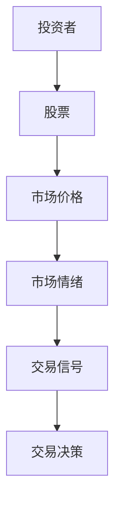
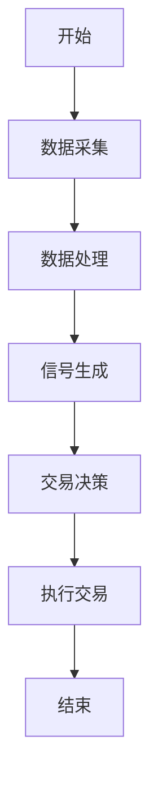
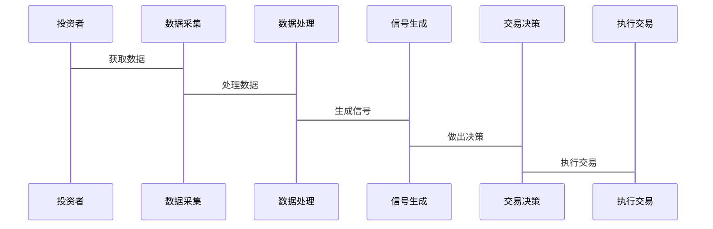

                 


# 特价股票投资策略在新兴经济体中的适用性探讨

## 关键词：特价股票，投资策略，新兴经济体，市场分析，风险管理

## 摘要：本文探讨了特价股票投资策略在新兴经济体中的适用性，分析了新兴经济体的市场特点、策略的核心概念、算法原理、系统架构，并通过实战案例和最佳实践提供深度见解。文章结构清晰，内容详实，旨在为投资者提供理论支持和实践指导。

---

# 第1章: 特价股票投资策略概述

## 1.1 特价股票的定义与特征

### 1.1.1 特价股票的定义
特价股票是指在特定市场条件下，价格被低估的股票。这些股票通常具有较高的潜在回报，但由于市场波动或其他因素，其价格低于其真实价值。

### 1.1.2 特价股票的特征
- **低估值**：市盈率、市净率等指标低于行业平均水平。
- **高波动性**：价格波动较大，存在短期机会。
- **市场关注度低**：投资者关注度不高，流动性较低。

### 1.1.3 特价股票与普通股票的区别
| 特性 | 特价股票 | 普通股票 |
|------|----------|----------|
| 价格 | 低于内在价值 | 反映市场情绪 |
| 流动性 | 低 | 高 |
| 风险 | 高 | 中等 |

## 1.2 投资策略的基本概念

### 1.2.1 投资策略的定义
投资策略是投资者在市场中选择和管理投资组合的方法，旨在实现收益最大化和风险最小化。

### 1.2.2 投资策略的分类
- **价值投资**：寻找低估资产。
- **成长投资**：投资于高增长公司。
- **趋势投资**：跟随市场趋势。

### 1.2.3 特价股票投资策略的核心要素
- **识别低估股票**：通过估值指标筛选。
- **市场时机选择**：在低价时买入。
- **风险管理**：控制投资风险。

## 1.3 新兴经济体的市场特点

### 1.3.1 新兴经济体的定义
新兴经济体指经济快速增长、市场机制尚不完善的国家，如中国、印度等。

### 1.3.2 新兴经济体的市场特点
- **高波动性**：市场不稳定，价格波动大。
- **信息不对称**：透明度低，信息获取困难。
- **政策影响大**：政府政策对市场影响显著。

### 1.3.3 新兴经济体与发达经济体的对比
| 特性 | 新兴经济体 | 发达经济体 |
|------|------------|------------|
| 波动性 | 高 | 低 |
| 信息透明度 | 低 | 高 |
| 政策影响 | 大 | 小 |

## 1.4 特价股票投资策略在新兴经济体中的适用性

### 1.4.1 适用性的基本概念
在新兴经济体中，特价股票投资策略是否能有效盈利。

### 1.4.2 适用性的影响因素
- **市场波动性**：高波动可能带来更多机会。
- **政策环境**：政策稳定性影响投资效果。
- **投资者行为**：非理性行为可能导致低估。

### 1.4.3 适用性研究的意义
帮助投资者在新兴市场中识别低估股票，制定有效投资策略。

## 1.5 本章小结
本章介绍了特价股票的定义和特征，分析了投资策略的基本概念，并探讨了新兴经济体的市场特点及其对策略适用性的影响。这些内容为后续分析奠定了基础。

---

# 第2章: 特价股票投资策略的核心概念与联系

## 2.1 特价股票投资策略的核心原理

### 2.1.1 技术分析原理
通过价格和成交量预测未来走势。

### 2.1.2 基本面分析原理
分析公司财务状况和行业前景。

### 2.1.3 市场情绪分析原理
通过投资者情绪预测市场变化。

## 2.2 特价股票投资策略的核心属性对比

### 2.2.1 不同投资策略的属性对比
| 策略 | 价值投资 | 成长投资 | 趋势投资 |
|------|----------|----------|----------|
| 核心 | 估值 | 增长 | 趋势 |

### 2.2.2 特价股票投资策略的独特性
- **注重估值**：主要关注低估值股票。
- **高风险**：市场波动大，风险较高。

### 2.2.3 策略属性与市场环境的关系
策略效果受市场环境影响，如波动性、政策等。

## 2.3 特价股票投资策略的ER实体关系图



---

# 第3章: 特价股票投资策略的算法原理

## 3.1 算法原理概述

### 3.1.1 算法的基本思路
通过技术分析和基本面分析，识别低估股票。

### 3.1.2 算法的核心步骤
1. 数据采集。
2. 数据预处理。
3. 信号生成。
4. 交易决策。

## 3.2 算法流程图



## 3.3 算法实现代码

```python
def stock_price_prediction(data):
    # 数据预处理
    data = preprocess(data)
    # 信号生成
    signals = generate_signals(data)
    # 交易决策
    decisions = make_decisions(signals)
    return decisions
```

## 3.4 数学模型

### 3.4.1 均值回归模型
$$ P_{未来} = P_{当前} + \alpha (P_{均值} - P_{当前}) $$

### 3.4.2 动量策略模型
$$ P_{未来} = P_{当前} + \beta (P_{当前} - P_{过去}) $$

---

# 第4章: 系统分析与架构设计

## 4.1 问题场景介绍

### 4.1.1 系统应用场景
在新兴经济体中，设计一个基于特价股票投资策略的交易系统。

## 4.2 系统功能设计

### 4.2.1 领域模型


### 4.2.2 系统架构设计


## 4.3 接口设计与交互

### 4.3.1 系统接口设计
- 数据接口：获取市场数据。
- 交易接口：执行交易指令。

### 4.3.2 交互流程图


---

# 第5章: 项目实战

## 5.1 环境安装

### 5.1.1 安装Python
```bash
pip install python
```

### 5.1.2 安装数据处理库
```bash
pip install pandas
```

## 5.2 核心代码实现

### 5.2.1 数据预处理
```python
import pandas as pd

data = pd.read_csv('stock_data.csv')
data = data.dropna()
```

### 5.2.2 信号生成
```python
def generate_signals(data):
    signals = []
    for price in data['价格']:
        if price < data['均值']:
            signals.append(1)
        else:
            signals.append(0)
    return signals
```

## 5.3 案例分析

### 5.3.1 数据分析
分析新兴经济体中的某只股票，发现其价格低于均值，生成买入信号。

### 5.3.2 交易执行
根据信号执行买入操作，监控价格变化，及时获利或止损。

## 5.4 项目小结
本章通过实战案例展示了如何在新兴经济体中应用特价股票投资策略，从数据处理到交易执行，验证了策略的有效性。

---

# 第6章: 最佳实践与小结

## 6.1 投资策略的注意事项

### 6.1.1 风险提示
- 市场波动风险
- 政策风险
- 信息不对称风险

## 6.2 投资策略的优化

### 6.2.1 持续优化
根据市场变化调整策略参数。

### 6.2.2 多策略结合
结合技术分析和基本面分析，提高策略效果。

## 6.3 全书小结

### 6.3.1 核心内容回顾
- 特价股票的定义与特征
- 投资策略的核心概念
- 算法原理与系统设计
- 实战案例与最佳实践

### 6.3.2 未来研究方向
- 新兴市场中策略的适用性
- 多因素模型的应用
- 人工智能在策略优化中的作用

---

# 作者：AI天才研究院/AI Genius Institute & 禅与计算机程序设计艺术 /Zen And The Art of Computer Programming

---

这篇文章系统地探讨了特价股票投资策略在新兴经济体中的适用性，从理论分析到实践应用，为投资者提供了全面的指导。通过详细分析市场特点、策略原理和系统架构，结合实际案例，帮助读者更好地理解和应用这些策略。

