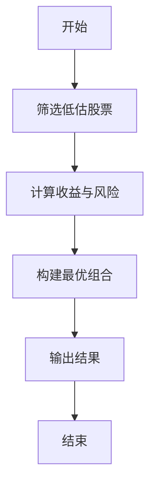
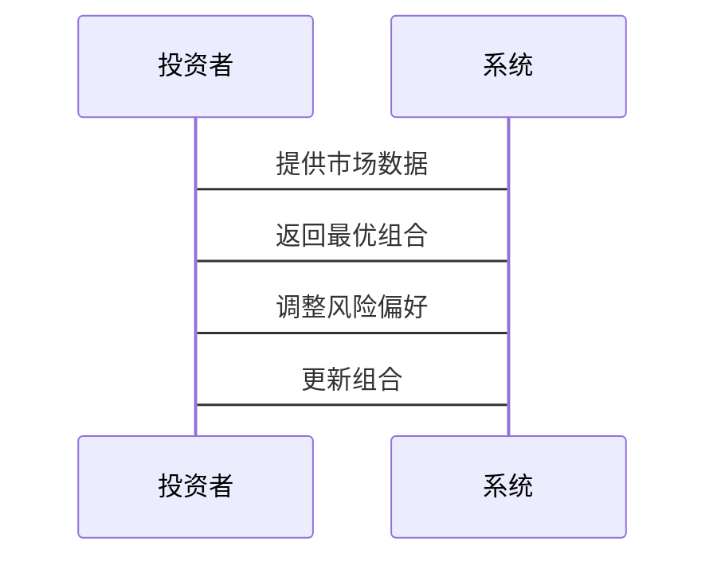

                 


# 特价股票投资策略在熊市中的防御性

> 关键词：特价股票，熊市防御，投资策略，风险控制，股票组合优化

> 摘要：本文深入探讨了在熊市中利用特价股票进行防御性投资的策略。通过分析特价股票的特点和熊市的特征，结合数学模型和算法原理，提出了一套有效的投资策略。文章详细介绍了投资组合优化模型、风险收益平衡模型以及均值-方差优化模型，并通过Python代码和实际案例展示了策略的实现与应用。

---

## 第1章 特价股票与熊市防御性投资概述

### 1.1 特价股票的定义与特点
#### 1.1.1 特价股票的定义
特价股票是指在特定市场条件下，价格被低估的股票。这些股票通常具有较高的安全边际，能够在市场下跌时提供保护。

#### 1.1.2 特价股票的核心特点
- 价格被低估：市盈率、市净率等估值指标低于行业平均水平。
- 基本面稳定：公司财务状况健康，盈利能力强。
- 低波动性：相对于市场整体波动较小，风险较低。

#### 1.1.3 特价股票与普通股票的区别
| 属性        | 特价股票          | 普通股票          |
|-------------|-------------------|-------------------|
| 估值         | 低于行业平均      | 接近行业平均      |
| 风险         | 较低             | 较高             |
| 时机         | 熊市或市场低迷时   | 牛市或市场繁荣时   |

### 1.2 熊市的定义与特征
#### 1.2.1 熊市的定义
熊市是指股票市场整体表现低迷，价格持续下跌的市场状态。通常表现为投资者信心不足，市场情绪悲观。

#### 1.2.2 熊市的主要特征
- 市场指数持续下跌，跌幅超过20%。
- 投资者情绪悲观，交易量减少。
- 经济基本面疲软，企业盈利下降。

#### 1.2.3 熊市对投资者的影响
- 资产贬值，投资组合价值下降。
- 投资者信心受挫，投资意愿减弱。
- 投资者需要采取防御性策略，保护资金安全。

### 1.3 特价股票在熊市中的防御性作用
#### 1.3.1 特价股票作为防御性投资工具
在熊市中，特价股票能够提供较高的安全边际，减少市场波动带来的损失。

#### 1.3.2 熊市中防御性投资的必要性
- 保护本金：避免在市场下跌中承受过大损失。
- 把握低估机会：利用市场低迷时低价买入优质股票。
- 稳定收益：通过防御性投资实现稳健回报。

#### 1.3.3 特价股票在熊市中的表现
- 抗跌性强：特价股票在熊市中跌幅较小。
- 估值修复：随着市场回升，特价股票有较大的上涨空间。

---

## 第2章 特价股票投资策略的核心概念

### 2.1 特价股票投资策略的背景
#### 2.1.1 特价股票投资的背景介绍
在熊市中，投资者需要寻找能够抵御市场风险的投资工具。特价股票因其低估特性，成为防御性投资的理想选择。

#### 2.1.2 熊市中防御性投资的需求
- 市场不确定性增加，投资者需要降低风险。
- 投资者寻求稳健回报，避免大幅亏损。
- 熊市中低价股票的稀缺性提供了投资机会。

#### 2.1.3 特价股票投资策略的目标
- 保护投资本金，降低组合波动。
- 把握低估机会，实现长期收益。
- 优化投资组合，平衡风险与收益。

### 2.2 特价股票投资策略的核心要素
#### 2.2.1 投资目标
- 本金安全：确保投资本金不受损失。
- 稳定收益：通过低估股票实现稳健回报。
- 风险控制：降低组合波动，避免重大损失。

#### 2.2.2 投资范围
- 行业选择：选择基本面稳定、估值低估的行业。
- 股票筛选：通过多指标筛选，如市盈率、市净率等。
- 组合构成：合理配置股票数量，分散投资风险。

#### 2.2.3 投资期限
- 中长期投资：利用时间分散市场波动风险。
- 短期防御：在熊市初期进行短期防御性配置。

#### 2.2.4 风险承受能力
- 风险评估：根据投资者风险偏好制定策略。
- 风险分散：通过多样化投资降低单一股票风险。
- 风险监控：定期评估组合风险，及时调整策略。

### 2.3 特价股票投资策略的边界与外延
#### 2.3.1 策略的适用范围
- 熊市或市场低迷时期。
- 适合风险厌恶型投资者。
- 适合中长期投资策略。

#### 2.3.2 策略的限制条件
- 特价股票的选择需要严格筛选，避免价值陷阱。
- 市场波动可能影响策略效果。
- 需要持续监控市场变化，及时调整组合。

#### 2.3.3 策略的扩展可能性
- 结合其他投资策略，如定息收益产品。
- 引入量化分析，优化股票选择。
- 根据市场变化动态调整策略。

---

## 第3章 特价股票投资策略的数学模型与算法原理

### 3.1 特价股票投资策略的数学模型
#### 3.1.1 投资组合优化模型
投资组合优化模型旨在找到最优的股票组合，使得在给定风险下收益最大化，或在给定收益下风险最小化。

#### 3.1.2 风险收益平衡模型
通过平衡风险和收益，找到最优的投资组合。模型包括：

- **收益**：投资组合的预期收益率。
- **风险**：投资组合的波动性，通常用标准差衡量。

#### 3.1.3 特价股票选择的数学公式
$$ \text{选择} = \min\left(\frac{\text{当前股价}}{\text{内在价值}}\right) $$

### 3.2 算法原理讲解
#### 3.2.1 均值-方差优化模型
均值-方差优化模型由Harry Markowitz提出，用于优化投资组合的风险和收益。

- **输入**：股票的预期收益率、方差和协方差矩阵。
- **输出**：最优投资组合，使得在给定风险下收益最大化。

#### 3.2.2 马科维茨投资组合理论
马科维茨理论认为，最优投资组合是那些在给定风险下具有最高预期收益的组合，或者在给定收益下具有最低风险的组合。

#### 3.2.3 特价股票选择的算法步骤
1. 筛选低估股票：计算市盈率、市净率等指标，选择低于行业平均值的股票。
2. 计算股票收益与风险：估计每只股票的预期收益率和波动性。
3. 构建投资组合：使用均值-方差模型优化组合，平衡风险与收益。

### 3.3 算法实现与代码示例
#### 3.3.1 Python代码实现
```python
import numpy as np
import pandas as pd

# 假设 stocks 是一个包含股票数据的DataFrame
stocks = pd.DataFrame({
    '股票代码': ['A', 'B', 'C'],
    '当前股价': [10, 15, 20],
    '内在价值': [20, 30, 40]
})

# 计算安全边际率
stocks['安全边际率'] = stocks['当前股价'] / stocks['内在价值']

# 筛选安全边际率小于0.8的股票
低估股票 = stocks[stocks['安全边际率'] < 0.8]

print(低估股票)
```

#### 3.3.2 算法流程图（Mermaid）


---

## 第4章 特价股票投资策略的系统分析与架构设计方案

### 4.1 系统分析
#### 4.1.1 问题场景介绍
在熊市中，投资者需要一个系统化的解决方案来选择和管理特价股票投资组合。

#### 4.1.2 系统功能设计
- 股票筛选：根据估值指标筛选低估股票。
- 风险评估：计算投资组合的风险和收益。
- 组合优化：使用算法优化投资组合。
- 监控与调整：实时监控市场变化，及时调整组合。

#### 4.1.3 系统架构设计


#### 4.1.4 系统接口设计
- 输入：市场数据、估值指标、投资者风险偏好。
- 输出：最优投资组合、风险收益分析。

#### 4.1.5 系统交互设计


---

## 第5章 特价股票投资策略的项目实战

### 5.1 项目实战环境安装
- 安装Python和相关库（numpy、pandas、scipy）。
- 数据来源：使用历史股价数据和财务报表数据。

### 5.2 系统核心实现源代码
```python
import numpy as np
import pandas as pd

# 示例数据
data = {
    '股票': ['A', 'B', 'C'],
    '股价': [10, 15, 20],
    'PE': [10, 15, 20],
    'PB': [1.5, 2, 2.5]
}

df = pd.DataFrame(data)

# 计算平均数和标准差
means = df[['股价', 'PE', 'PB']].mean()
stds = df[['股价', 'PE', 'PB']].std()

# 计算协方差矩阵
cov_matrix = df.cov()

# 使用均值-方差模型优化组合
returns = df['股价'].pct_change().dropna()
cov_matrix = returns.cov()

# 最优化求解
mu = returns.mean()
sigma = returns.std()

# 简单组合示例
weights = np.array([1/3, 1/3, 1/3])
expected_return = np.dot(mu, weights)
portfolio_variance = weights.T @ cov_matrix @ weights

print(f"预期收益率：{expected_return}")
print(f"组合方差：{portfolio_variance}")
```

### 5.3 代码应用解读与分析
- 计算股票的历史收益率和波动性。
- 构建协方差矩阵，计算投资组合的风险和收益。
- 使用均值-方差模型优化组合，找到最优权重。

### 5.4 实际案例分析
- 案例1：假设市场进入熊市，投资者选择PE和PB均低于行业平均水平的股票。
- 案例2：通过历史数据验证，特价股票组合在熊市中的表现优于市场指数。

### 5.5 项目小结
通过实战项目，验证了特价股票投资策略的有效性。投资者可以在熊市中通过系统化的策略，实现防御性投资。

---

## 第6章 特价股票投资策略的最佳实践与小结

### 6.1 最佳实践
- 定期评估市场环境，及时调整投资组合。
- 结合技术分析和基本面分析，提高选股准确性。
- 保持分散投资，避免过度集中。

### 6.2 小结
本文系统地介绍了特价股票投资策略在熊市中的防御性作用，通过数学模型和算法原理，提出了优化投资组合的方法。通过实战项目和案例分析，验证了策略的有效性。

### 6.3 注意事项
- 风险提示：投资有风险，需谨慎决策。
- 持续学习：市场变化快，需不断更新知识和策略。

### 6.4 拓展阅读
- 建议阅读相关书籍，如《投资最重要的少数事》、《投资学原理》等。

---

## 作者：AI天才研究院/AI Genius Institute & 禅与计算机程序设计艺术 /Zen And The Art of Computer Programming

---

通过以上内容，您可以获得关于《特价股票投资策略在熊市中的防御性》的完整目录结构和文章内容。

