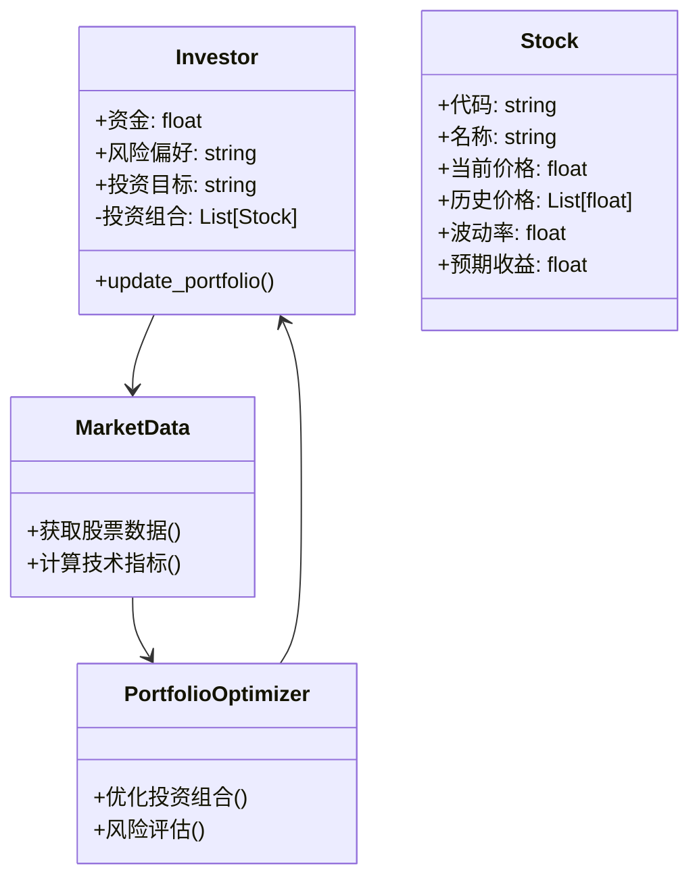

                 


# 特价股票投资组合的年度更新策略

> 关键词：特价股票、投资组合、年度更新、量化分析、风险管理、价值投资、成长投资

> 摘要：本文将详细探讨如何构建和优化特价股票投资组合，并制定年度更新策略。通过分析特价股票的定义、市场环境、投资策略的类型以及量化分析的方法，结合实际案例和系统设计，为投资者提供一套科学的投资框架。文章将涵盖从理论到实践的全过程，帮助投资者在复杂多变的市场中实现稳健的投资收益。

---

# 第一部分: 特价股票投资组合的背景与概念

## 第1章: 特价股票投资组合的背景介绍

### 1.1 特价股票的定义与特点

#### 1.1.1 特价股票的定义
特价股票通常指那些价格低于某个特定阈值（例如2美元）的股票。这类股票通常来自小市值公司，具有较高的波动性和潜在的成长空间。

#### 1.1.2 特价股票的特点
- 价格低：通常在2美元以下，适合小额投资者。
- 波动性高：市场波动较大，风险与收益并存。
- 成长潜力：部分公司可能通过重组或增长实现股价回升。
- 市场关注度低：流动性较低，信息透明度可能不足。

#### 1.1.3 特价股票的市场环境
- 市场周期：在熊市或市场低迷时期，特价股票可能更多出现。
- 行业分布：多集中在小盘股或新兴行业。
- 投资者情绪：投资者对特价股票的态度可能较为悲观，但这也可能带来低估的机会。

### 1.2 投资者心态与风险偏好

#### 1.2.1 投资者心态的分类
- 乐观投资者：相信市场终将回暖，愿意承担高风险。
- 稳健投资者：倾向于低风险投资，注重资产保值。
- 投机者：追求短期高收益，可能忽视基本面。

#### 1.2.2 风险偏好的影响
- 高风险偏好投资者可能更倾向于投资特价股票。
- 低风险偏好投资者可能选择其他投资方式（如债券、ETF）。

#### 1.2.3 特价股票投资的动机
- 寻找低价机会：希望以更低的价格买入，未来获得更高收益。
- 投机心理：部分投资者希望通过短期波动获利。
- 分散投资：通过投资多只特价股票降低风险。

### 1.3 特价股票投资的法律与道德风险

#### 1.3.1 投资的法律风险
- 违规交易：部分低价股票可能涉及内幕交易或操纵市场。
- 信息披露不全：小公司可能财务透明度低，存在虚假信息的风险。

#### 1.3.2 道德风险的定义
道德风险指投资者可能利用信息不对称进行不公平交易，例如利用未公开信息谋利。

#### 1.3.3 如何规避法律与道德风险
- 选择信誉良好的证券公司。
- 避免参与未上市公司或流动性极差的股票。
- 仔细研究公司基本面，避免盲目跟风。

### 1.4 本章小结
本章介绍了特价股票的定义、特点以及投资者的心态与风险偏好。投资者在选择特价股票时，需要充分考虑市场环境、自身风险承受能力以及公司的基本面，避免因信息不对称或盲目投资而导致损失。

---

## 第2章: 特价股票投资策略的类型

### 2.1 价值投资策略

#### 2.1.1 价值投资的定义
价值投资是一种长期投资策略，强调以低于内在价值的价格买入优质股票。

#### 2.1.2 价值投资的核心要素
- 公司基本面：盈利能力、财务状况、行业地位。
- 安全边际：买入价格低于内在价值。
- 长期持有：耐心等待市场回归理性。

#### 2.1.3 价值投资的优缺点
- 优点：风险较低，收益稳定。
- 缺点：需要大量研究，可能需要较长时间才能看到收益。

### 2.2 成长投资策略

#### 2.2.1 成长投资的定义
成长投资策略关注那些收入和利润快速增长的公司，预期未来股价将大幅上涨。

#### 2.2.2 成长投资的核心要素
- 公司成长性：收入增长率、净利润增长率。
- 行业前景：所在行业具有高增长潜力。
- 市盈率（P/E）：可能较高，但预期未来盈利将消化高估值。

#### 2.2.3 成长投资的优缺点
- 优点：潜在高收益。
- 缺点：波动性大，可能面临估值过高风险。

### 2.3 趋势投资策略

#### 2.3.1 趋势投资的定义
趋势投资策略基于市场的技术分析，试图捕捉股价短期趋势。

#### 2.3.2 趋势投资的核心要素
- 技术指标：如移动平均线、相对强弱指数（RSI）。
- 市场情绪：利用成交量、资金流向等指标判断市场趋势。
- 短期交易：频繁买卖，抓住短期价格波动。

#### 2.3.3 趋势投资的优缺点
- 优点：可能获得短期收益。
- 缺点：风险较高，需要较强的技术分析能力。

### 2.4 本章小结
本章介绍了三种主要的投资策略：价值投资、成长投资和趋势投资。每种策略都有其优缺点，投资者可以根据自身风险偏好和市场环境选择适合的策略。

---

## 第3章: 投资组合优化的数学模型

### 3.1 投资组合优化的基本原理

#### 3.1.1 投资组合优化的定义
投资组合优化是通过数学模型选择最优的股票组合，以在特定风险水平下实现最大收益。

#### 3.1.2 投资组合优化的数学模型
$$ \text{最大化} \quad \sum_{i=1}^{n} w_i r_i $$
$$ \text{约束条件} \quad \sum_{i=1}^{n} w_i = 1 $$
$$ \quad \quad \quad \sum_{i=1}^{n} w_i^2 \leq \text{风险容忍度} $$

其中，\( w_i \) 是第 \( i \) 只股票的权重，\( r_i \) 是其预期收益。

#### 3.1.3 投资组合优化的约束条件
- 投资组合的总权重为1。
- 风险容忍度限制（如波动率）。

### 3.2 风险与收益的量化分析

#### 3.2.1 风险的定义与量化
风险通常用标准差衡量：
$$ \text{标准差} = \sqrt{\sum_{i=1}^{n} w_i^2 \sigma_i^2} $$

其中，\( \sigma_i \) 是第 \( i \) 只股票的波动率。

#### 3.2.2 收益的定义
收益通常用期望回报率衡量：
$$ \text{期望回报率} = \sum_{i=1}^{n} w_i r_i $$

### 3.3 投资组合优化的算法实现

#### 3.3.1 简单投资组合优化算法（示例）
以下是一个简单的优化算法示例：

```python
import numpy as np
import pandas as pd

# 假设我们有5只股票，其权重为w1, w2, w3, w4, w5
# 预期收益为r1, r2, r3, r4, r5
# 波动率为s1, s2, s3, s4, s5

# 定义目标函数
def objective_function(weights, returns, variance_matrix):
    return -np.dot(weights, returns)  # 最小化负收益

# 定义约束条件
def constraint1(weights):
    return np.sum(weights) - 1  # 权重和为1

def constraint2(weights, variance_matrix, max_variance):
    return np.dot(weights.T, np.dot(variance_matrix, weights)) - max_variance

# 使用 scipy.optimize 进行优化
from scipy.optimize import minimize

# 初始化权重
initial_weights = np.array([0.2, 0.2, 0.2, 0.2, 0.2])

# 定义问题
problem = {
    'fun': lambda w: objective_function(w, returns, variance_matrix),
    'constraints': [
        {'type': 'eq', 'fun': constraint1},
        {'type': 'ineq', 'fun': lambda w: constraint2(w, variance_matrix, max_variance)}
    ],
    'method': 'SLSQP'
}

# 求解
result = minimize(problem)
optimal_weights = result.x
```

### 3.4 本章小结
本章通过数学模型和算法实现，展示了如何优化投资组合以实现收益与风险的最佳平衡。

---

## 第4章: 特价股票投资组合的系统设计

### 4.1 系统设计概述

#### 4.1.1 系统目标
设计一个能够自动筛选特价股票并优化投资组合的系统。

#### 4.1.2 系统架构
以下是系统架构的类图：



### 4.2 系统实现

#### 4.2.1 数据采集
使用API获取实时股票数据。

#### 4.2.2 策略选择
根据投资者的风险偏好选择合适的投资策略。

#### 4.2.3 风险控制
设置止损和止盈点。

#### 4.2.4 绩效评估
定期评估投资组合的收益与风险。

### 4.3 本章小结
本章通过系统设计展示了如何构建一个自动化投资组合管理系统，帮助投资者实现科学决策。

---

## 第5章: 特价股票投资组合的年度更新策略

### 5.1 年度更新的必要性

#### 5.1.1 市场变化
经济周期、行业趋势等因素会随时间变化。

#### 5.1.2 公司基本面变化
公司财务状况、管理团队等可能发生变化。

#### 5.1.3 投资者自身变化
风险偏好、资金状况可能随时间调整。

### 5.2 年度更新的具体步骤

#### 5.2.1 重新评估投资目标
根据市场变化和个人情况调整投资目标。

#### 5.2.2 优化投资组合
根据新的市场环境优化股票权重。

#### 5.2.3 风险调整
根据新情况调整风险控制措施。

### 5.3 本章小结
本章强调了年度更新的重要性，并提供了具体的实施步骤。

---

## 第6章: 特价股票投资组合的最佳实践

### 6.1 风险管理

#### 6.1.1 分散投资
避免过度集中于某一只股票。

#### 6.1.2 设置止损
控制单只股票的亏损比例。

#### 6.1.3 定期评估
至少每年评估一次投资组合。

### 6.2 定期评估与调整

#### 6.2.1 评估市场环境
分析宏观经济和行业趋势。

#### 6.2.2 评估公司基本面
检查公司财务状况和管理团队。

#### 6.2.3 评估投资组合表现
比较实际收益与预期收益。

### 6.3 长期投资与耐心

#### 6.3.1 长期投资的重要性
避免频繁交易，降低交易成本。

#### 6.3.2 耐心等待
给予投资组合足够的时间实现增长。

### 6.4 本章小结
本章总结了投资特价股票组合的最佳实践，强调风险管理、定期评估和长期投资的重要性。

---

## 第7章: 总结与展望

### 7.1 本文总结
本文详细探讨了特价股票投资组合的年度更新策略，从理论到实践，为投资者提供了科学的指导。

### 7.2 未来展望
未来的研究可以进一步探索人工智能在投资组合优化中的应用，以及如何利用大数据技术提高投资决策的准确性。

---

## 附录: 代码示例

### 附录A: 投资组合优化的Python代码

```python
import numpy as np
from scipy.optimize import minimize

# 示例数据：假设我们有两只股票，预期收益和波动率
returns = np.array([0.1, 0.15])
variance_matrix = np.array([[0.04, 0.02], [0.02, 0.09]])

# 定义目标函数
def objective(weights):
    return -np.dot(weights, returns)  # 最小化负收益

# 定义约束条件
def constraint(weights, variance_matrix, max_variance=0.05):
    return np.dot(weights.T, np.dot(variance_matrix, weights)) - max_variance

# 初始化权重
initial_weights = np.array([0.5, 0.5])

# 定义问题
constraints = [
    {'type': 'eq', 'fun': lambda w: np.sum(w) - 1},
    {'type': 'ineq', 'fun': lambda w: constraint(w, variance_matrix)}
]

# 求解
result = minimize(objective, initial_weights, constraints=constraints)
optimal_weights = result.x

print("最优权重:", optimal_weights)
print("最优收益:", -result.fun)
```

### 附录B: 工具推荐
- 数据分析工具：Python（Pandas、NumPy）
- 图表工具：Matplotlib、Seaborn
- 量化交易平台：Interactive Brokers、MetaTrader

---

## 作者：AI天才研究院/AI Genius Institute & 禅与计算机程序设计艺术 /Zen And The Art of Computer Programming

---

**摘要**：本文通过详细分析特价股票的特点、投资策略以及年度更新策略，结合数学模型和系统设计，为投资者提供了一套科学的投资框架。投资者可以通过本文学会如何构建和优化投资组合，并在实际操作中规避风险，实现稳健收益。

