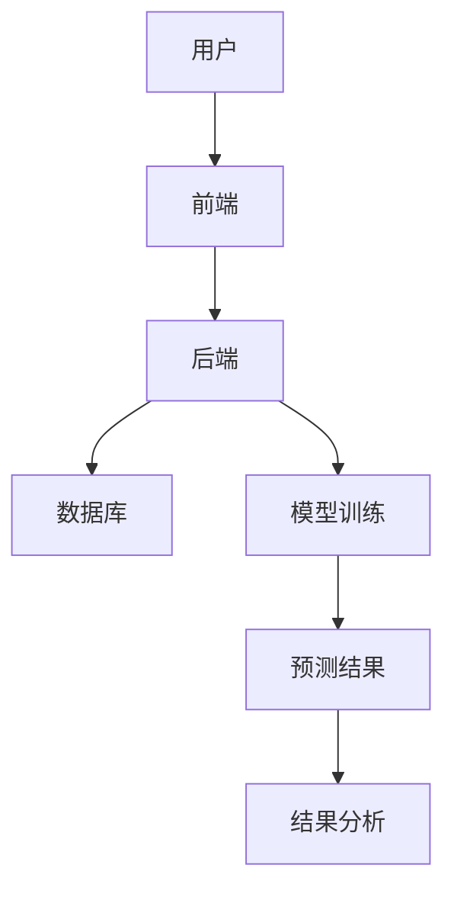

                 


# 特价股票筛选中的人工智能和机器学习应用

## 关键词：特价股票，人工智能，机器学习，股票筛选，金融数据，算法优化，投资策略

## 摘要：  
本文深入探讨了如何利用人工智能和机器学习技术优化特价股票的筛选过程。通过分析数据特征、选择合适的算法模型、设计高效的系统架构以及实际案例的分析，本文展示了如何通过技术手段提升股票筛选的准确性和效率。文章内容涵盖算法原理、系统设计、项目实战以及案例分析，旨在为读者提供从理论到实践的全面指导。

---

# 第一部分: 特价股票筛选的背景与挑战

## 第1章: 特价股票筛选的背景与挑战

### 1.1 特价股票的定义与筛选的重要性

#### 1.1.1 特价股票的定义
特价股票通常指的是价格被市场低估，具有较大上涨潜力的股票。这类股票往往处于估值低点，但其内在价值可能被市场忽视。筛选特价股票的核心在于发现那些被市场低估但基本面良好的公司。

#### 1.1.2 特价股票筛选的意义
筛选特价股票的意义在于帮助投资者在市场中发现潜在的投资机会，尤其是在市场波动较大或经济下行周期中，特价股票可能提供较高的收益。通过技术手段优化筛选过程，可以提高筛选效率和准确性。

#### 1.1.3 特价股票筛选的挑战
传统的筛选方法依赖于人工分析，存在效率低、主观性强、覆盖面有限等问题。随着金融数据的爆炸式增长，传统的筛选方法难以应对海量数据的处理需求。此外，市场波动性和不确定性增加了筛选的难度。

---

### 1.2 人工智能与机器学习在金融领域的应用

#### 1.2.1 人工智能与机器学习的基本概念
人工智能（AI）是指计算机系统能够执行人类智能任务的能力，如视觉识别、语音识别和决策制定。机器学习（ML）是AI的一个子领域，通过训练模型从数据中学习规律，实现预测和分类等任务。

#### 1.2.2 人工智能在金融领域的应用现状
AI和ML在金融领域的应用广泛，包括股票预测、风险评估、交易策略优化等。在股票筛选方面，AI能够处理海量数据，发现隐藏的模式和趋势，帮助投资者做出更明智的决策。

#### 1.2.3 机器学习在股票筛选中的优势
机器学习能够处理复杂的数据关系，发现传统方法难以察觉的模式。通过不断训练和优化模型，ML可以在大量数据中识别潜在的投资机会，提高筛选的准确性和效率。

---

## 第2章: 特价股票筛选的核心概念与联系

### 2.1 数据特征分析

#### 2.1.1 股票数据的特征提取
特价股票的筛选需要关注多个数据特征，如市盈率（P/E）、市净率（P/B）、股息率、收益增长率等。这些特征可以帮助识别被低估的股票。

#### 2.1.2 数据特征的分类与选择
根据特征的重要性进行分类，选择对筛选影响最大的特征。例如，市盈率和收益增长率可能是最重要的指标。

#### 2.1.3 数据特征的可视化
通过可视化工具（如折线图、散点图）展示特征之间的关系，帮助更好地理解数据。

---

### 2.2 算法模型选择

#### 2.2.1 常见的机器学习算法介绍
常用的算法包括线性回归、支持向量机（SVM）、随机森林和神经网络等。

#### 2.2.2 算法选择的依据与策略
选择算法时需要考虑数据的类型、规模和复杂度。例如，线性回归适用于线性关系，而随机森林适合处理高维数据。

#### 2.2.3 算法性能对比分析
通过表格对比不同算法的性能，如准确率、训练时间和预测速度。

---

## 第3章: 常见机器学习算法原理与实现

### 3.1 线性回归

#### 3.1.1 线性回归的基本原理
线性回归通过建立自变量与因变量之间的线性关系，预测股票价格。其数学模型为：  
$$ y = \beta_0 + \beta_1x + \epsilon $$  
其中，$y$ 是目标变量，$x$ 是自变量，$\beta_0$ 和 $\beta_1$ 是回归系数，$\epsilon$ 是误差项。

#### 3.1.2 线性回归的实现步骤
1. 数据预处理：标准化特征。
2. 模型训练：使用最小二乘法求解回归系数。
3. 模型评估：计算均方误差（MSE）和决定系数（R²）。

#### 3.1.3 线性回归的优缺点
优点：简单易懂，计算速度快。缺点：只能处理线性关系，无法捕捉复杂模式。

---

### 3.2 支持向量机（SVM）

#### 3.2.1 SVM的基本原理
SVM通过构建最大间隔超平面，将数据分为两类。其数学模型为：  
$$ y = \text{sign}(\omega \cdot x + b) $$  
其中，$\omega$ 是权重向量，$b$ 是偏置项。

#### 3.2.2 SVM的实现步骤
1. 数据预处理：标准化特征。
2. 模型训练：使用支持向量进行优化。
3. 模型评估：计算准确率和召回率。

#### 3.2.3 SVM的优缺点
优点：适用于非线性分类，泛化能力强。缺点：参数选择复杂，计算成本高。

---

## 第4章: 系统设计与实现

### 4.1 系统架构设计

#### 4.1.1 系统功能设计
系统包括数据采集、特征提取、模型训练、预测和结果分析五大功能模块。

#### 4.1.2 系统架构图


---

### 4.2 系统接口设计

#### 4.2.1 接口描述
- 数据接口：接收股票数据并存储。
- 模型接口：调用训练好的模型进行预测。

#### 4.2.2 接口交互流程
1. 用户输入筛选条件。
2. 前端调用数据接口获取数据。
3. 数据预处理并训练模型。
4. 返回预测结果。

---

## 第5章: 项目实战与案例分析

### 5.1 项目环境搭建

#### 5.1.1 环境配置
安装Python、NumPy、Pandas、Scikit-learn等库。

### 5.2 核心代码实现

#### 5.2.1 数据预处理
```python
import pandas as pd
import numpy as np

# 加载数据
data = pd.read_csv('stock_data.csv')

# 数据清洗
data = data.dropna()

# 标准化特征
from sklearn.preprocessing import StandardScaler
scaler = StandardScaler()
X = data.drop('target', axis=1)
X_scaled = scaler.fit_transform(X)
```

#### 5.2.2 模型训练
```python
from sklearn.linear_model import LinearRegression

model = LinearRegression()
model.fit(X_scaled, data['target'])
```

#### 5.2.3 模型预测
```python
# 预测结果
y_pred = model.predict(X_scaled)

# 计算准确率
from sklearn.metrics import r2_score
print(r2_score(data['target'], y_pred))
```

---

## 第6章: 案例分析与优化

### 6.1 案例分析

#### 6.1.1 数据分析
分析历史数据，找出影响特价股票筛选的关键因素。

#### 6.1.2 模型优化
通过调整参数和特征选择，提升模型性能。

### 6.2 最佳实践与小结

#### 6.2.1 注意事项
- 数据质量是关键，确保数据准确性和完整性。
- 模型调优需结合实际业务需求。
- 风险管理是投资的重要部分。

#### 6.2.2 拓展阅读
推荐相关书籍和论文，帮助读者深入学习。

---

## 作者：AI天才研究院 & 禅与计算机程序设计艺术  
本文由AI天才研究院与“禅与计算机程序设计艺术”联合撰写，转载请注明出处。

