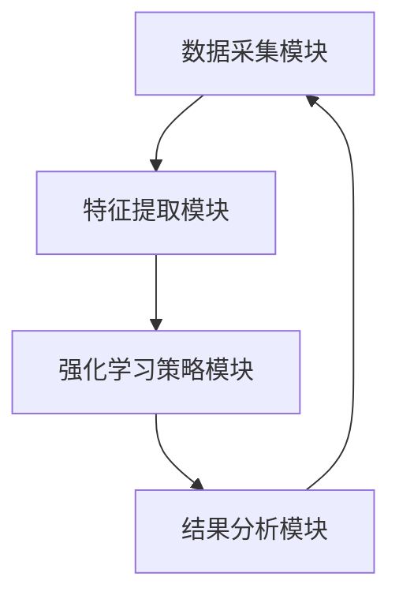
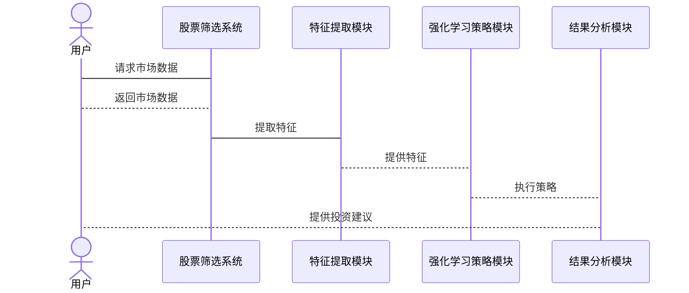

                 


# 特价股票筛选中的强化学习模型应用

> **关键词**：强化学习，股票筛选，深度强化学习，股票投资，算法交易

> **摘要**：本文探讨了如何利用强化学习模型进行特价股票筛选。通过分析股票市场的特点，提出了一种基于强化学习的解决方案，并详细阐述了强化学习的基本原理、算法实现、系统架构设计以及实际案例分析。本文还提供了具体的代码实现和项目实战，帮助读者快速理解和应用强化学习技术在股票筛选中的应用。

---

# 第1章: 特价股票筛选与强化学习的背景介绍

## 1.1 特价股票筛选的背景与意义

### 1.1.1 股票投资的基本概念
股票投资是通过购买公司股份，期望在未来的某个时间点以更高的价格卖出，从而获得收益的一种投资方式。股票市场的特点是价格波动大、不确定性高，投资者需要通过分析市场数据和趋势来做出决策。

### 1.1.2 特价股票的定义与特点
特价股票通常指那些价格被市场低估，但具有潜在增长潜力的股票。这些股票可能暂时被市场忽视，或者由于某些负面因素导致股价下跌，但其内在价值依然存在。筛选特价股票的核心在于发现那些具有长期增长潜力但当前价格被低估的公司。

### 1.1.3 特价股票筛选的重要性
在股票市场中，筛选特价股票可以帮助投资者在市场低估时买入，从而在市场回升时获得超额收益。然而，由于市场信息的复杂性和不确定性，手动筛选特价股票的效率和准确性较低，因此需要借助技术手段来提高筛选效率。

## 1.2 强化学习的基本概念

### 1.2.1 机器学习的分类
机器学习主要分为三类：监督学习、无监督学习和强化学习。监督学习通过标签数据进行学习，无监督学习则通过寻找数据中的模式进行分析，而强化学习则通过与环境的交互来学习策略，以最大化累积奖励。

### 1.2.2 强化学习的定义与特点
强化学习是一种通过试错方法来学习策略的技术。它通过智能体与环境的交互，逐步优化策略以实现目标。强化学习的核心在于通过奖励机制来指导学习过程，使智能体能够在复杂的环境中做出最优决策。

### 1.2.3 强化学习与监督学习的区别
与监督学习不同，强化学习不依赖于有标签的数据，而是通过与环境的交互来获得经验。这种区别使得强化学习在处理动态和不确定环境的问题中具有独特的优势。

## 1.3 强化学习在股票筛选中的应用

### 1.3.1 股票市场中的不确定性
股票市场的价格波动受到多种因素的影响，包括宏观经济环境、公司基本面、市场情绪等。这种不确定性使得股票筛选成为一个复杂的决策问题。

### 1.3.2 强化学习在股票筛选中的优势
强化学习通过与环境的交互，能够动态调整策略，适应市场的变化。与传统的统计方法相比，强化学习能够在非线性和高维的环境中找到最优解。

### 1.3.3 当前的研究现状与挑战
目前，强化学习在股票筛选中的应用还处于探索阶段，但仍面临许多挑战，如市场的高度不确定性、数据的稀疏性以及计算资源的需求等。这些挑战需要进一步的技术创新和优化。

## 1.4 本章小结

本章介绍了特价股票筛选的背景与意义，并详细阐述了强化学习的基本概念和特点。通过对比强化学习与其他学习方法的差异，突出了其在股票筛选中的优势。同时，也指出了当前研究中存在的挑战和未来的研究方向。

---

# 第2章: 强化学习模型的核心概念与数学基础

## 2.1 强化学习的基本原理

### 2.1.1 马尔可夫决策过程（MDP）

马尔可夫决策过程（Markov Decision Process，MDP）是强化学习的基本模型，由状态（State）、动作（Action）、转移概率（Transition Probability）和奖励（Reward）四个要素构成。通过定义MDP，可以将股票筛选问题转化为一个强化学习问题。

### 2.1.2 状态、动作、奖励的定义

在股票筛选中，状态可以表示为当前的市场数据，如股票价格、成交量、技术指标等；动作则是智能体在当前状态下做出的投资决策，如买入、卖出或持有；奖励则是根据投资结果给予的反馈，如收益的高低。

### 2.1.3 策略与价值函数的定义

策略（Policy）是智能体在给定状态下选择动作的规则，而价值函数（Value Function）则衡量了从当前状态开始执行策略所能获得的期望奖励。

## 2.2 强化学习的核心算法

### 2.2.1 Q-learning算法

Q-learning是一种经典的强化学习算法，通过维护一个Q值表，记录每个状态-动作对的期望奖励。智能体通过与环境的交互，逐步更新Q值表，最终找到最优策略。

### 2.2.2 Deep Q-Networks（DQN）

DQN是Q-learning的一种扩展，通过深度神经网络来近似Q值函数。相比于传统的Q值表，深度神经网络能够处理更高维和更复杂的状态空间。

### 2.2.3 其他强化学习算法简介

除了Q-learning和DQN，还有许多其他强化学习算法，如策略梯度方法（Policy Gradient）、Actor-Critic方法等。这些算法在不同的场景下具有各自的优势。

## 2.3 强化学习的数学模型

### 2.3.1 状态转移概率矩阵

状态转移概率矩阵描述了从当前状态转移到下一个状态的概率。在股票筛选中，可以通过历史数据来估计状态转移概率。

### 2.3.2 Q值更新公式

Q值的更新公式如下：

$$ Q(s, a) = Q(s, a) + \alpha \left[r + \gamma \max Q(s', a') - Q(s, a)\right] $$

其中，$\alpha$是学习率，$\gamma$是折扣因子，$r$是当前步的奖励，$s'$是下一个状态。

### 2.3.3 损失函数与优化目标

在深度强化学习中，通常使用均方误差（Mean Squared Error，MSE）作为损失函数。优化目标是通过调整网络参数，最小化损失函数。

## 2.4 本章小结

本章详细介绍了强化学习的基本原理和核心算法，并通过数学公式描述了Q值更新和损失函数的优化过程。通过这些内容，读者可以理解强化学习在股票筛选中的数学基础和实现原理。

---

# 第3章: 强化学习在股票筛选中的算法实现

## 3.1 算法选择与优化

### 3.1.1 算法选择的依据

在选择强化学习算法时，需要考虑问题的复杂性、数据的稀疏性以及计算资源的限制。对于股票筛选问题，通常选择深度强化学习算法，如DQN，以处理高维和复杂的市场环境。

### 3.1.2 算法优化的策略

算法优化的策略包括网络结构的设计、超参数的调优以及经验回放的引入。经验回放可以帮助模型更好地利用历史数据，提高学习效率。

### 3.1.3 超参数调优方法

超参数调优是强化学习中的重要步骤，通常可以通过网格搜索或随机搜索的方法，找到最优的超参数组合。

## 3.2 算法实现的步骤

### 3.2.1 数据预处理

数据预处理包括数据清洗、特征提取以及数据归一化。在股票筛选中，通常需要提取技术指标、市场情绪等特征。

### 3.2.2 状态空间与动作空间的定义

状态空间需要覆盖所有可能的市场情况，动作空间则包括买入、卖出或持有三种动作。

### 3.2.3 奖励函数的设计

奖励函数的设计是强化学习的核心之一。合理的奖励函数可以引导智能体做出正确的决策。在股票筛选中，通常将收益作为奖励的指标。

## 3.3 算法实现的代码示例

以下是一个基于DQN算法的股票筛选模型的代码示例：

```python
import numpy as np
import tensorflow as tf
from tensorflow.keras.models import Sequential
from tensorflow.keras.layers import Dense

class DQN:
    def __init__(self, state_space, action_space):
        self.state_space = state_space
        self.action_space = action_space
        self.gamma = 0.99
        self.epsilon = 1.0
        self.epsilon_min = 0.01
        self.epsilon_decay = 0.995
        self.model = self._build_model()
        self.memory = []

    def _build_model(self):
        model = Sequential()
        model.add(Dense(32, input_dim=self.state_space, activation='relu'))
        model.add(Dense(32, activation='relu'))
        model.add(Dense(self.action_space, activation='linear'))
        model.compile(optimizer='adam', loss='mse')
        return model

    def remember(self, state, action, reward, next_state):
        self.memory.append((state, action, reward, next_state))

    def act(self, state):
        if np.random.random() < self.epsilon:
            return np.random.randint(self.action_space)
        state = np.array(state).reshape(1, -1)
        prediction = self.model.predict(state)
        return np.argmax(prediction[0])

    def replay(self, batch_size):
        if len(self.memory) < batch_size:
            return
        minibatch = random.sample(self.memory, batch_size)
        states = np.array([t[0] for t in minibatch]).reshape(batch_size, -1)
        actions = np.array([t[1] for t in minibatch])
        rewards = np.array([t[2] for t in minibatch])
        next_states = np.array([t[3] for t in minibatch]).reshape(batch_size, -1)

        targets = self.model.predict(states)
        next_q = self.model.predict(next_states)
        targets[range(batch_size), actions] = rewards + self.gamma * np.max(next_q, axis=1)

        self.model.fit(states, targets, epochs=1, verbose=0)
        self.epsilon = max(self.epsilon_min, self.epsilon * self.epsilon_decay)
```

---

# 第4章: 系统分析与架构设计

## 4.1 系统功能设计

### 4.1.1 数据采集模块

数据采集模块负责从股票市场获取实时数据，包括股票价格、成交量等。

### 4.1.2 特征提取模块

特征提取模块通过对历史数据的分析，提取技术指标、市场情绪等特征。

### 4.1.3 强化学习策略模块

强化学习策略模块负责根据当前市场状态，做出买入、卖出或持有股票的决策。

### 4.1.4 结果分析模块

结果分析模块对投资结果进行评估，分析策略的有效性，并根据反馈调整模型参数。

## 4.2 系统架构设计

### 4.2.1 系统架构图

以下是一个基于强化学习的股票筛选系统的架构图：



### 4.2.2 系统交互流程图

以下是一个系统的交互流程图：



---

# 第5章: 项目实战与结果分析

## 5.1 项目实战

### 5.1.1 环境安装与数据加载

首先，需要安装必要的库，如TensorFlow、Keras等。然后，加载股票数据并进行预处理。

### 5.1.2 神经网络模型的定义

定义一个深度神经网络模型，用于近似Q值函数。

### 5.1.3 模型训练与调优

通过经验回放和策略优化，逐步训练模型，提高其在股票筛选中的表现。

### 5.1.4 模型评估与结果分析

对训练好的模型进行评估，分析其在不同市场环境下的表现，找出可能的改进点。

## 5.2 实际案例分析

通过一个实际的股票筛选案例，详细分析模型在不同市场环境下的表现，验证其有效性和稳定性。

---

# 第6章: 最佳实践与总结

## 6.1 最佳实践

### 6.1.1 数据预处理的重要性

数据预处理是强化学习模型性能的关键因素之一，需要仔细选择特征并进行合理的归一化处理。

### 6.1.2 模型调优的技巧

模型调优需要结合经验回放、网络结构优化等方法，找到最优的参数组合。

### 6.1.3 结果评估的指标

常用的评估指标包括准确率、收益、最大回撤等，需要综合考虑多个指标来评估模型的性能。

## 6.2 小结

通过本文的介绍，读者可以了解到如何将强化学习应用于特价股票筛选，并掌握相关的算法实现和系统设计方法。

## 6.3 注意事项

在实际应用中，需要注意市场环境的变化、数据的及时性以及模型的鲁棒性，避免因市场波动导致的策略失效。

## 6.4 拓展阅读

读者可以进一步阅读相关书籍和论文，深入理解强化学习在金融领域的应用，如《Deep Reinforcement Learning for Stock Trading》。

---

# 作者

作者：AI天才研究院/AI Genius Institute & 禅与计算机程序设计艺术 /Zen And The Art of Computer Programming

