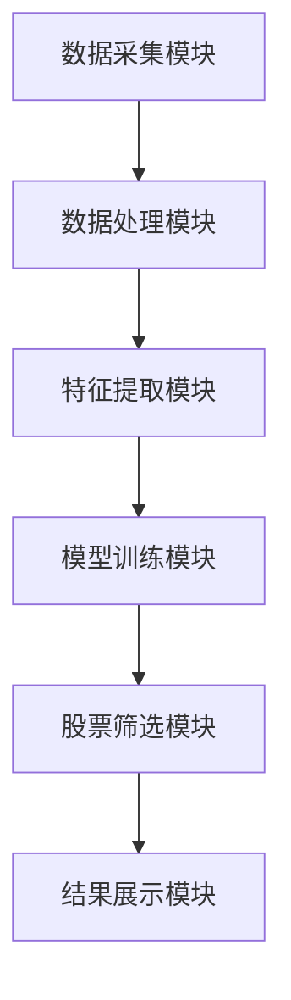
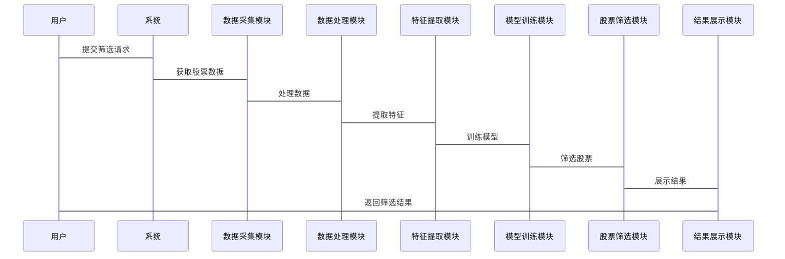

                 


# 特价股票筛选中的深度学习模型应用

> 关键词：深度学习，股票筛选，LSTM，CNN，金融预测

> 摘要：本文探讨了深度学习模型在特价股票筛选中的应用，详细介绍了深度学习的基本原理、模型选择、算法实现、系统架构设计以及实际项目案例。通过对比分析不同深度学习模型的特点，本文展示了如何利用这些模型提取股票价格预测的关键特征，优化筛选策略，提高投资收益。文章还提供了详细的代码实现和案例分析，为读者提供了一个全面的深度学习在金融领域应用的实践指南。

---

# 第1章: 特价股票筛选的背景与意义

## 1.1 特价股票的定义与特点
### 1.1.1 特价股票的定义
特价股票是指在证券市场中价格被低估的股票，通常具有较高的投资潜力。这些股票可能因为市场波动、公司基本面变化或其他因素导致其价格低于其内在价值。

### 1.1.2 特价股票的特点
- **低估值**：市盈率、市净率等指标低于行业平均水平。
- **高成长潜力**：公司基本面良好，未来盈利预期较高。
- **市场关注度低**：可能被市场忽视，存在被低估的机会。

### 1.1.3 特价股票筛选的重要性
筛选特价股票可以帮助投资者发现被市场低估的投资机会，提高投资收益。然而，传统的筛选方法存在效率低、复杂性高等问题，深度学习技术的引入为解决这些问题提供了新的可能性。

## 1.2 深度学习在金融领域的应用
### 1.2.1 深度学习的定义与特点
深度学习是一种人工智能技术，通过多层神经网络结构从数据中学习特征，具有强大的非线性建模能力。

### 1.2.2 深度学习在金融中的应用领域
- **股票价格预测**：利用历史数据预测股票价格走势。
- **风险管理**：识别市场风险，优化投资组合。
- **交易策略开发**：基于深度学习模型制定自动化交易策略。

### 1.2.3 深度学习在股票筛选中的优势
- **非线性特征提取**：深度学习能够捕捉复杂的市场特征。
- **海量数据处理**：能够处理海量的市场数据，包括文本、图像等多种类型。
- **实时性**：深度学习模型可以实时更新，适应市场的快速变化。

## 1.3 传统股票筛选方法的局限性
### 1.3.1 技术分析法
技术分析依赖于价格和成交量的历史数据，但忽略了市场情绪和公司基本面等因素。

### 1.3.2 基本面分析法
基本面分析需要大量的人工计算和判断，且难以量化市场情绪的影响。

### 1.3.3 传统筛选方法的不足
- **信息处理能力有限**：难以处理海量数据。
- **主观性**：分析结果依赖于分析师的经验和判断。
- **效率低下**：筛选过程耗时且效率不高。

## 1.4 深度学习在股票筛选中的应用现状
### 1.4.1 国内外研究现状
深度学习在股票筛选中的研究主要集中在模型优化、特征提取和预测准确性等方面。

### 1.4.2 深度学习在股票筛选中的成功案例
- **基于LSTM的股票价格预测**：利用LSTM模型捕捉时间序列数据中的长期依赖关系。
- **基于CNN的市场情绪分析**：通过文本数据提取市场情绪特征，辅助股票筛选。

### 1.4.3 深度学习股票筛选的未来趋势
- **多模态数据融合**：结合文本、图像等多种数据源进行股票筛选。
- **实时预测**：开发实时更新的深度学习模型，适应市场的快速变化。
- **可解释性增强**：提高模型的可解释性，帮助投资者理解筛选结果。

## 1.5 本章小结
本章介绍了特价股票的定义和特点，分析了深度学习在金融领域的应用优势，探讨了传统筛选方法的局限性，并总结了深度学习在股票筛选中的应用现状和发展趋势。

---

# 第2章: 深度学习模型在股票筛选中的核心概念

## 2.1 深度学习模型的基本原理
### 2.1.1 神经网络的定义与结构
神经网络是由多个神经元组成的层次结构，通过非线性变换捕捉数据中的复杂特征。

### 2.1.2 深度学习的核心算法
- **卷积神经网络（CNN）**：适用于图像数据的特征提取。
- **循环神经网络（RNN）**：适用于时间序列数据的建模。
- **长短期记忆网络（LSTM）**：一种改进的RNN，能够捕捉长期依赖关系。

### 2.1.3 深度学习与传统机器学习的区别
- **特征提取能力**：深度学习能够自动提取特征，而传统机器学习需要人工特征工程。
- **模型复杂性**：深度学习模型通常更复杂，但具有更强的非线性建模能力。

## 2.2 特价股票筛选中的关键特征
### 2.2.1 技术指标的特征提取
- **移动平均线（MA）**：用于识别价格趋势。
- **相对强弱指数（RSI）**：用于判断超买超卖状态。

### 2.2.2 市场情绪的特征提取
- **新闻情感分析**：通过分析新闻文本提取市场情绪特征。
- **社交媒体数据**：利用社交媒体上的用户情绪预测市场走势。

### 2.2.3 公司基本面的特征提取
- **财务指标**：如市盈率、市净率、ROE等。
- **行业趋势**：分析行业的发展前景。

## 2.3 深度学习模型的选择与优化
### 2.3.1 常用深度学习模型介绍
- **LSTM**：适用于时间序列数据的建模。
- **CNN**：适用于图像数据的特征提取。
- **Transformer**：近年来在自然语言处理领域表现出色。

### 2.3.2 模型选择的依据
- **数据类型**：根据数据类型选择合适的模型。
- **任务类型**：分类任务选择CNN或LSTM，回归任务选择LSTM。

### 2.3.3 模型优化的策略
- **超参数调优**：如学习率、批量大小、层数等。
- **正则化技术**：如Dropout、L2正则化。
- **数据增强**：如数据清洗、特征工程。

## 2.4 深度学习模型的评估指标
### 2.4.1 分类指标
- **准确率**：分类正确的比例。
- **精确率和召回率**：衡量分类的精确性和全面性。

### 2.4.2 回归指标
- **均方误差（MSE）**：预测值与真实值的平方差之和。
- **R平方值**：衡量模型的拟合优度。

### 2.4.3 模型的泛化能力评估
- **交叉验证**：通过交叉验证评估模型的泛化能力。
- **ROC曲线**：评估分类模型的性能。

## 2.5 本章小结
本章介绍了深度学习模型的基本原理，探讨了特价股票筛选中的关键特征，并分析了模型选择与优化的策略，最后总结了模型评估的指标。

---

# 第3章: 深度学习模型的算法原理与实现

## 3.1 深度学习模型的数学基础
### 3.1.1 神经网络的数学模型
神经网络由输入层、隐藏层和输出层组成，通过权重和偏置参数进行非线性变换。

### 3.1.2 激活函数的作用
- **ReLU**：非线性激活函数，计算简单，易于收敛。
- **Sigmoid**：将输出限制在0到1之间，适合二分类任务。
- **Tanh**：输出范围在-1到1之间，适合处理负数输入。

### 3.1.3 损失函数与优化器
- **损失函数**：衡量预测值与真实值的差距，如均方误差、交叉熵损失。
- **优化器**：如随机梯度下降（SGD）、Adam优化器，用于更新模型参数。

## 3.2 常用深度学习算法的实现
### 3.2.1 RNN的实现
RNN适用于时间序列数据的建模，通过循环结构处理序列数据。

### 3.2.2 LSTM的实现
LSTM是一种改进的RNN，通过门控机制解决长序列训练中的梯度消失问题。

### 3.2.3 CNN的实现
CNN通过卷积操作提取图像数据的局部特征，适用于股票价格预测中的特征提取。

## 3.3 深度学习模型的训练过程
### 3.3.1 数据预处理
- **归一化**：将数据标准化，使其分布在0到1之间。
- **分批次训练**：将数据分成小批量进行训练，减少内存占用。

### 3.3.2 模型训练
- **前向传播**：计算预测值和损失值。
- **反向传播**：计算损失函数对模型参数的梯度，更新参数。

### 3.3.3 模型评估
- **验证集评估**：在验证集上评估模型的性能。
- **测试集评估**：在独立的测试集上评估模型的泛化能力。

## 3.4 本章小结
本章详细讲解了深度学习模型的数学基础，介绍了RNN、LSTM和CNN的实现，并描述了模型的训练和评估过程。

---

# 第4章: 深度学习模型在股票筛选中的系统分析与架构设计

## 4.1 系统分析
### 4.1.1 项目背景
特价股票筛选系统旨在帮助投资者发现被低估的股票，提高投资收益。

### 4.1.2 系统功能设计
- **数据采集**：从多个数据源采集股票价格、财务数据和新闻数据。
- **特征提取**：提取技术指标、市场情绪和公司基本面特征。
- **模型训练**：基于历史数据训练深度学习模型。
- **股票筛选**：根据模型预测结果筛选出潜在的特价股票。

### 4.1.3 系统架构设计
- **数据层**：存储股票数据和模型参数。
- **业务逻辑层**：实现数据处理和模型训练功能。
- **用户界面层**：提供友好的用户界面，展示筛选结果。

## 4.2 系统架构设计
### 4.2.1 系统架构图


### 4.2.2 系统交互流程图


## 4.3 系统接口设计
### 4.3.1 数据接口
- **输入接口**：接收股票代码、时间范围等参数。
- **输出接口**：返回筛选结果和预测信息。

### 4.3.2 模型接口
- **输入接口**：接收特征数据和模型参数。
- **输出接口**：返回预测结果和模型评估指标。

## 4.4 本章小结
本章分析了特价股票筛选系统的功能需求，设计了系统的架构和交互流程，并展示了系统的接口设计。

---

# 第5章: 深度学习模型在股票筛选中的项目实战

## 5.1 项目环境安装
### 5.1.1 安装Python和相关库
```bash
pip install numpy pandas matplotlib scikit-learn tensorflow keras
```

### 5.1.2 数据源获取
从Yahoo Finance获取股票数据，使用`pandas`进行数据清洗和预处理。

## 5.2 系统核心实现
### 5.2.1 数据预处理
```python
import pandas as pd
import numpy as np

# 读取数据
data = pd.read_csv('stock_data.csv')

# 归一化
normalized_data = (data - data.min()) / (data.max() - data.min())
```

### 5.2.2 模型实现
```python
from tensorflow.keras import layers

# 定义LSTM模型
model = tf.keras.Sequential([
    layers.LSTM(64, return_sequences=True),
    layers.LSTM(32),
    layers.Dense(1)
])

# 编译模型
model.compile(loss='mean_squared_error', optimizer='adam')
```

### 5.2.3 模型训练
```python
# 训练模型
model.fit(X_train, y_train, epochs=100, batch_size=32, validation_split=0.2)
```

### 5.2.4 模型评估
```python
# 预测结果
y_pred = model.predict(X_test)

# 计算均方误差
mse = np.mean((y_pred - y_test) ** 2)
print(f'Mean Squared Error: {mse}')
```

## 5.3 实际案例分析
### 5.3.1 数据分析
分析某只股票的历史价格数据，提取技术指标和市场情绪特征。

### 5.3.2 模型预测
基于训练好的模型，预测该股票的未来价格走势。

### 5.3.3 筛选结果
根据模型预测结果，筛选出具有投资潜力的特价股票。

## 5.4 项目小结
本章通过实际案例展示了深度学习模型在股票筛选中的应用，详细讲解了项目的实现过程，并分析了模型的预测结果。

---

# 第6章: 深度学习模型在股票筛选中的最佳实践

## 6.1 最佳实践
### 6.1.1 数据预处理
- **数据清洗**：处理缺失值和异常值。
- **特征工程**：提取有意义的特征，减少维度。

### 6.1.2 模型调优
- **超参数调优**：使用网格搜索或随机搜索优化模型参数。
- **模型融合**：结合多种模型的结果，提高预测准确性。

### 6.1.3 模型评估
- **交叉验证**：通过多次训练和验证评估模型的泛化能力。
- **性能指标**：关注准确率、召回率和F1分数等指标。

## 6.2 注意事项
### 6.2.1 数据质量
确保数据的完整性和准确性，避免因数据问题导致模型性能下降。

### 6.2.2 模型过拟合
通过正则化技术和交叉验证防止模型过拟合。

### 6.2.3 风险提示
深度学习模型的预测结果仅供参考，实际投资需谨慎，结合市场实际情况进行决策。

## 6.3 拓展阅读
### 6.3.1 深度学习在金融领域的经典论文
- "Long Short-Term Memory Networks for stock price prediction"（LSTM用于股票价格预测）。

### 6.3.2 相关书籍
- 《Deep Learning for Financial Data》
- 《Python机器学习实战》

## 6.4 本章小结
本章总结了深度学习模型在股票筛选中的最佳实践，提出了数据预处理和模型调优的策略，并给出了相关注意事项和拓展阅读建议。

---

# 第7章: 总结与展望

## 7.1 本项目总结
本文详细介绍了深度学习模型在特价股票筛选中的应用，从模型选择到系统实现，再到实际案例分析，为读者提供了一个全面的视角。

## 7.2 未来展望
未来的研究可以进一步探索多模态数据的融合，开发更高效的模型，并结合强化学习技术优化交易策略。

---

# 作者
作者：AI天才研究院/AI Genius Institute  
作者：禅与计算机程序设计艺术/Zen And The Art of Computer Programming

