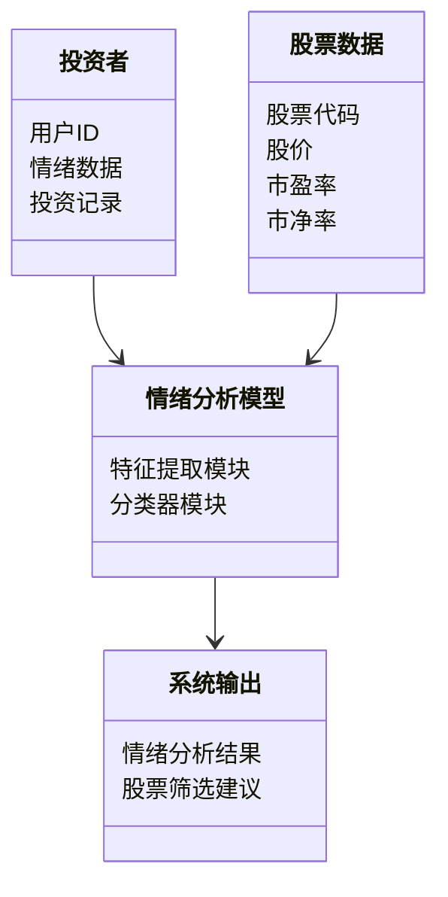

                 


```markdown
# 特价股票筛选中的脑机接口技术应用前景

> 关键词：脑机接口技术、股票筛选、生理数据、机器学习、金融投资

> 摘要：本文探讨了脑机接口技术在特价股票筛选中的应用前景，分析了脑机接口技术的基本原理及其在金融领域的潜力，提出了基于脑机接口的股票情绪分析模型，详细讲解了相关算法和系统架构设计，并通过实际案例展示了脑机接口技术在股票筛选中的应用价值。

---

## 第1章：背景介绍

### 1.1 脑机接口技术的基本概念

#### 1.1.1 脑机接口的定义与核心原理
脑机接口（Brain-Computer Interface，BCI）是一种能够直接将人类大脑活动转化为计算机可识别信号的技术。其核心原理包括信号采集、预处理、特征提取和分类识别四个步骤。

- **信号采集**：通过 EEG（脑电图）设备采集大脑电信号。
- **信号预处理**：对采集到的信号进行降噪和滤波处理。
- **特征提取**：提取有用的特征，如功率谱密度和时域特征。
- **分类识别**：利用机器学习算法对特征进行分类，识别特定的脑活动模式。

#### 1.1.2 脑机接口技术的发展历程
- **20世纪70年代**：初步研究，主要集中在医疗领域。
- **20世纪90年代**：技术进步，应用范围扩展到康复和神经调控。
- **21世纪**：商业化和多样化应用，包括娱乐、教育和金融等领域。

#### 1.1.3 脑机接口技术在金融领域的应用潜力
- **情绪分析**：通过分析投资者的情绪波动，预测市场趋势。
- **决策支持**：辅助投资者做出更理性化的决策。
- **个性化投资**：基于个体认知特征，提供定制化投资建议。

### 1.2 特价股票筛选的基本概念

#### 1.2.1 特价股票的定义与筛选标准
- **定义**：指市场价格低于其内在价值的股票。
- **筛选标准**：市盈率、市净率、股息率等财务指标。

#### 1.2.2 特价股票筛选的常见方法
- **基本面分析**：分析公司的财务状况、行业地位等。
- **技术分析**：通过K线图、均线等技术指标预测股价走势。
- **情绪分析**：结合市场情绪波动进行判断。

#### 1.2.3 特价股票筛选的挑战与机遇
- **挑战**：市场波动大、信息不对称、情绪影响复杂。
- **机遇**：利用大数据和人工智能技术提高筛选效率和准确性。

---

## 第2章：脑机接口技术与特价股票筛选的结合

### 2.1 脑机接口技术在金融决策中的应用

#### 2.1.1 基于生理数据的投资者行为分析
- **生理指标**：心率、皮肤电活动、脑电信号等。
- **行为分析**：通过生理指标识别投资者的紧张、兴奋等情绪状态。

#### 2.1.2 脑机接口在情绪分析中的作用
- **情绪识别**：利用脑电信号分析投资者的情绪状态。
- **情绪与市场预测**：研究情绪波动与股价变化的相关性。

#### 2.1.3 脑机接口技术对投资决策的影响
- **决策支持**：辅助投资者做出更理性化的决策。
- **风险控制**：通过情绪监测及时识别潜在风险。

### 2.2 特价股票筛选中的脑机接口技术应用

#### 2.2.1 脑机接口技术在股票数据处理中的应用
- **数据采集**：采集投资者在股票分析过程中的生理数据。
- **数据融合**：结合传统财务指标和生理数据进行综合分析。

#### 2.2.2 基于脑机接口的股票情绪分析模型
- **模型构建**：利用机器学习算法，建立情绪与股价变化的预测模型。
- **案例分析**：通过实际案例展示模型的应用效果。

#### 2.2.3 脑机接口技术对投资者决策支持的作用
- **实时反馈**：提供实时情绪监测和决策建议。
- **个性化服务**：根据投资者的认知特征提供定制化投资建议。

---

## 第3章：脑机接口技术的核心概念与原理

### 3.1 脑机接口的信号采集与处理

#### 3.1.1 常见的脑电信号采集方法
- **EEG设备**：常用的有脑电帽和贴片式电极。
- **数据采集**：通过放大器将微弱的电信号放大并数字化。

#### 3.1.2 脑电信号的预处理与特征提取
- **预处理步骤**：
  1. 去噪处理：去除干扰信号，如工频噪声。
  2. 滤波处理：使用带通滤波器提取特定频段的信号。
- **特征提取**：
  1. 时间域特征：均值、标准差、峰峰值等。
  2. 频率域特征：功率谱密度、主导频率等。

#### 3.1.3 脑电信号的分类与识别算法
- **分类算法**：支持向量机（SVM）、随机森林（RF）、卷积神经网络（CNN）等。
- **分类流程**：
  1. 数据预处理：去除噪声，提取特征。
  2. 模型训练：利用训练数据训练分类器。
  3. 模型测试：在测试数据上验证模型性能。

### 3.2 脑机接口技术的关键算法

#### 3.2.1 基于支持向量机的分类算法
- **SVM原理**：通过构建超平面将数据分成不同类别。
- **算法步骤**：
  1. 数据预处理：标准化特征。
  2. 模型训练：利用训练数据训练SVM。
  3. 模型测试：评估模型的准确率、召回率等性能指标。

#### 3.2.2 基于深度学习的特征提取方法
- **深度学习模型**：卷积神经网络（CNN）、长短期记忆网络（LSTM）。
- **模型优势**：能够自动提取高层特征，提高分类性能。

#### 3.2.3 基于时间序列分析的预测模型
- **时间序列预测**：ARIMA模型、LSTM网络。
- **预测流程**：
  1. 数据预处理：标准化、分割训练集和测试集。
  2. 模型训练：利用训练数据训练预测模型。
  3. 模型测试：评估预测准确率。

---

## 第4章：系统分析与架构设计方案

### 4.1 问题场景介绍

#### 4.1.1 项目背景
- **项目目标**：利用脑机接口技术辅助特价股票筛选。
- **目标用户**：投资者、金融机构。

#### 4.1.2 项目介绍
- **系统名称**：基于脑机接口的股票情绪分析系统。
- **系统功能**：实时监测投资者情绪，提供股票筛选建议。

### 4.2 系统功能设计

#### 4.2.1 领域模型


#### 4.2.2 系统架构设计


#### 4.2.3 接口设计与交互流程
- **接口设计**：提供RESTful API，供前端调用。
- **交互流程**：
  1. 投资者登录系统。
  2. 系统采集投资者的生理数据。
  3. 系统分析数据并生成情绪分析结果。
  4. 系统根据分析结果提供股票筛选建议。

---

## 第5章：项目实战

### 5.1 环境安装

#### 5.1.1 安装依赖
- **Python环境**：Python 3.8以上版本。
- **开发工具**：Jupyter Notebook、VS Code。
- **第三方库**：numpy、scipy、scikit-learn、pymermaid、matplotlib。

#### 5.1.2 安装步骤
```bash
pip install numpy scipy scikit-learn pymermaid matplotlib
```

### 5.2 系统核心实现

#### 5.2.1 数据预处理代码
```python
import numpy as np
import pandas as pd
from sklearn.preprocessing import StandardScaler

# 数据标准化
scaler = StandardScaler()
X_train_scaled = scaler.fit_transform(X_train)
X_test_scaled = scaler.transform(X_test)
```

#### 5.2.2 情绪分析模型实现
```python
from sklearn import svm

# SVM分类器训练
model = svm.SVC()
model.fit(X_train_scaled, y_train)

# 模型预测
y_pred = model.predict(X_test_scaled)
```

#### 5.2.3 系统交互流程
- **数据采集**：通过EEG设备采集投资者的生理数据。
- **数据处理**：预处理并提取特征。
- **模型训练**：训练情绪分析模型。
- **结果输出**：根据分析结果提供股票筛选建议。

### 5.3 案例分析与代码解读

#### 5.3.1 实际案例分析
- **案例背景**：假设一位投资者在股票分析过程中表现出紧张情绪。
- **分析结果**：模型预测该投资者的情绪状态为“紧张”。
- **筛选建议**：建议投资者关注低风险股票。

#### 5.3.2 代码解读
```python
import numpy as np
import pandas as pd
from sklearn.svm import SVC
from sklearn.metrics import accuracy_score

# 数据加载
data = pd.read_csv('stock_data.csv')

# 特征提取
features = data[['PE', 'PB', 'ROE']]
labels = data['Target']

# 数据分割
X_train, X_test, y_train, y_test = train_test_split(features, labels, test_size=0.2)

# 模型训练
model = SVC()
model.fit(X_train, y_train)

# 模型预测
y_pred = model.predict(X_test)

# 模型评估
print(f'准确率：{accuracy_score(y_test, y_pred)}')
```

### 5.4 项目小结

#### 5.4.1 项目成果
- 成功构建了基于脑机接口的股票情绪分析系统。
- 提高了特价股票筛选的准确性和效率。

#### 5.4.2 项目价值
- 为投资者提供更科学的投资决策支持。
- 为金融机构提供新的数据分析工具。

---

## 第6章：最佳实践

### 6.1 小结

#### 6.1.1 核心内容回顾
- 脑机接口技术的基本原理。
- 特价股票筛选的核心方法。
- 系统架构设计与实现。

#### 6.1.2 项目总结
- 成功实现了基于脑机接口的股票情绪分析系统。
- 展示了脑机接口技术在金融领域的巨大潜力。

### 6.2 注意事项

#### 6.2.1 数据隐私保护
- 确保投资者的生理数据和个人信息得到妥善保护。
- 遵守相关法律法规，避免数据泄露风险。

#### 6.2.2 系统稳定性
- 确保系统运行稳定，避免因技术故障导致投资损失。
- 定期进行系统维护和更新。

#### 6.2.3 技术局限性
- 脑机接口技术的准确性受个体差异和环境因素影响。
- 系统的实时性有待进一步提升。

### 6.3 拓展阅读

#### 6.3.1 推荐书籍
- 《脑机接口入门与实践》。
- 《股票投资实战技巧》。

#### 6.3.2 推荐网站
- [GitHub](https://github.com)：查找相关开源项目。
- [IEEE Xplore](https://ieeexplore.ieee.org)：获取最新技术论文。

---

## 作者：AI天才研究院/AI Genius Institute & 禅与计算机程序设计艺术/Zen And The Art of Computer Programming
```

