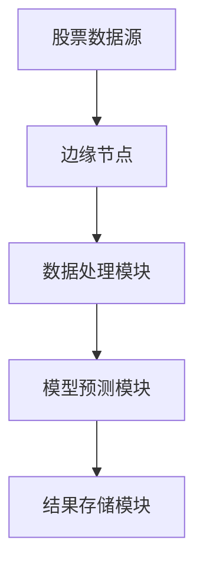
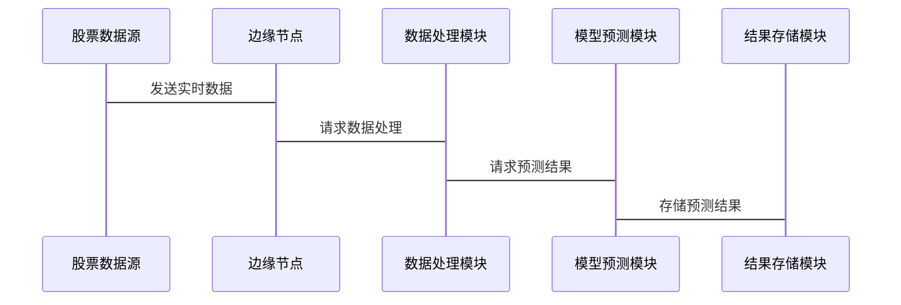

                 


# 特价股票筛选中的边缘计算和5G技术应用

## 关键词：边缘计算、5G技术、股票筛选、实时数据处理、分布式计算

## 摘要：本文详细探讨了边缘计算和5G技术在特价股票筛选中的应用，从背景、核心概念、算法原理到系统架构和项目实战，全面解析了这两种技术如何提升股票筛选的效率和准确性。通过实际案例分析，本文展示了边缘计算和5G技术在金融领域的巨大潜力，并提出了未来发展的建议。

---

# 第一部分: 特价股票筛选中的边缘计算和5G技术应用基础

## 第1章: 特价股票筛选的背景与意义

### 1.1 特价股票筛选的定义与目标
#### 1.1.1 特价股票的定义
特价股票是指市场价格低于其内在价值的股票。通常，投资者认为这些股票被市场低估，具有较大的上涨潜力。

#### 1.1.2 特价股票筛选的目标
- 发现被市场低估的股票。
- 利用技术手段提高筛选效率。
- 通过数据分析挖掘潜在的投资机会。

#### 1.1.3 特价股票筛选的市场价值
- 帮助投资者降低选股成本。
- 提高投资决策的科学性。
- 为机构投资者提供高效工具。

### 1.2 边缘计算与5G技术的背景
#### 1.2.1 边缘计算的定义与特点
边缘计算是一种分布式计算范式，将计算能力从云端转移到数据产生的边缘节点。其特点包括实时性、低延迟和数据隐私保护。

#### 1.2.2 5G技术的定义与特点
5G技术是第五代移动通信技术，具有高速率、低延迟和大规模连接的特点。

#### 1.2.3 边缘计算与5G技术的结合
边缘计算与5G技术的结合，使得数据可以在本地快速处理，减少对云端的依赖，提高数据处理效率。

### 1.3 特价股票筛选中边缘计算和5G技术的应用场景
#### 1.3.1 实时数据处理的需求
股票市场数据瞬息万变，实时数据处理是筛选特价股票的关键。

#### 1.3.2 高效数据传输的重要性
5G技术提供了高速数据传输通道，确保数据能够快速从边缘节点传输到处理中心。

#### 1.3.3 边缘计算在股票筛选中的优势
边缘计算可以在本地快速处理数据，减少延迟，提高筛选效率。

## 1.4 本章小结
本章介绍了特价股票筛选的背景和意义，以及边缘计算和5G技术的基本概念和特点。同时，探讨了这两种技术在股票筛选中的应用场景。

---

## 第2章: 边缘计算与5G技术的核心概念

### 2.1 边缘计算的核心原理
#### 2.1.1 边缘计算的基本架构
- 边缘节点：数据产生和处理的最小单元。
- 边缘计算平台：对边缘节点进行管理和服务的平台。

#### 2.1.2 边缘计算的关键技术
- 数据采集：从各种数据源采集股票数据。
- 数据处理：对数据进行清洗、转换和分析。
- 数据存储：将处理后的数据存储在本地或云端。

#### 2.1.3 边缘计算与云计算的对比
- 边缘计算强调实时性和本地处理。
- 云计算强调资源集中和大规模计算。

### 2.2 5G技术的核心原理
#### 2.2.1 5G网络的组成部分
- 基站：负责与用户设备通信。
- 核心网：负责数据的传输和管理。

#### 2.2.2 5G网络的传输特点
- 高速：5G网络的传输速率远高于4G。
- 低延迟：5G网络的延迟极低，适合实时应用。

#### 2.2.3 5G技术的创新点
- 支持大规模物联网连接。
- 提供网络切片功能，可根据不同场景定制网络性能。

### 2.3 边缘计算与5G技术的结合
#### 2.3.1 边缘计算与5G网络的协同工作
- 边缘节点通过5G网络连接到云端。
- 本地处理的数据通过5G网络进行传输。

#### 2.3.2 边缘计算与5G技术的融合优势
- 提高数据处理效率。
- 减少网络传输延迟。
- 支持大规模数据连接。

#### 2.3.3 边缘计算与5G技术的未来发展趋势
- 更广泛的应用场景。
- 更高效的协同工作模式。
- 更智能的边缘计算能力。

## 2.4 本章小结
本章详细讲解了边缘计算和5G技术的核心概念和原理，探讨了两者结合的优势和未来发展趋势。

---

## 第3章: 边缘计算与5G技术在股票筛选中的算法原理

### 3.1 数据流处理算法
#### 3.1.1 数据流处理的基本原理
- 数据流是指连续不断地数据序列。
- 边缘计算中，数据流处理需要实时进行。

#### 3.1.2 边缘计算中的数据流处理流程
1. 数据采集：从股票市场获取实时数据。
2. 数据清洗：去除噪声数据。
3. 数据转换：将数据转换为适合分析的格式。
4. 数据分析：利用算法对数据进行分析。

#### 3.1.3 5G技术对数据流处理的优化
- 5G技术提供了高速数据传输通道，加快了数据流的处理速度。

### 3.2 分布式计算算法
#### 3.2.1 分布式计算的基本原理
- 分布式计算是指将计算任务分发到多个计算节点上执行。
- 边缘计算中的分布式计算可以提高处理能力。

#### 3.2.2 边缘计算中的分布式计算实现
1. 分布式数据存储：将数据存储在多个边缘节点上。
2. 分布式任务分配：将计算任务分配到多个边缘节点上执行。

#### 3.2.3 5G技术对分布式计算的支持
- 5G技术提供了大规模连接能力，支持更多的边缘节点。

### 3.3 实时数据分析算法
#### 3.3.1 实时数据分析的基本原理
- 实时数据分析是指对数据进行实时处理和分析。
- 边缘计算中的实时数据分析可以快速响应市场变化。

#### 3.3.2 边缘计算中的实时数据分析流程
1. 数据采集：从股票市场获取实时数据。
2. 数据处理：对数据进行清洗、转换和分析。
3. 数据存储：将处理后的数据存储在本地或云端。

#### 3.3.3 5G技术对实时数据分析的加速作用
- 5G技术提供了低延迟的网络连接，加快了数据传输速度。

### 3.4 本章小结
本章详细讲解了边缘计算和5G技术在股票筛选中的算法原理，包括数据流处理、分布式计算和实时数据分析。

---

## 第4章: 特价股票筛选中的数学模型与公式

### 4.1 数据预处理模型
#### 4.1.1 数据清洗与标准化
- 数据清洗：去除噪声数据。
- 数据标准化：将数据归一化处理。

#### 4.1.2 数据特征提取
- 特征提取：从数据中提取有用的特征。

#### 4.1.3 数据预处理的数学公式
$$ y = \frac{x - \mu}{\sigma} $$
其中，$x$ 是原始数据，$\mu$ 是均值，$\sigma$ 是标准差。

### 4.2 特价股票筛选模型
#### 4.2.1 线性回归模型
- 线性回归模型用于预测股票价格。
$$ y = a x + b $$
其中，$y$ 是预测价格，$x$ 是自变量，$a$ 和 $b$ 是系数。

#### 4.2.2 支持向量机模型
- 支持向量机模型用于分类。
$$ \text{最大化} \quad \frac{1}{2} \sum_{i=1}^{n} (\alpha_i + \beta_i) $$
$$ \text{满足} \quad y_i (\alpha_i + \beta_i x_i) \geq 1 $$

#### 4.2.3 随机森林模型
- 随机森林模型用于分类和回归。
$$ y = \sum_{i=1}^{n} w_i y_i $$
其中，$w_i$ 是权重，$y_i$ 是预测值。

### 4.3 模型优化与调参
#### 4.3.1 参数优化方法
- 网格搜索：遍历所有可能的参数组合，选择最优参数。
- 随机搜索：随机选择参数组合，加快优化过程。

#### 4.3.2 超参数调优
- 调整学习率、树深度等参数，优化模型性能。

#### 4.3.3 模型评估指标
- 准确率：模型预测正确的比例。
- 召回率：模型预测出的正样本中实际为正的比例。
- F1分数：准确率和召回率的调和平均数。

### 4.4 本章小结
本章详细讲解了特价股票筛选中的数学模型与公式，包括数据预处理模型、筛选模型和模型优化方法。

---

## 第5章: 系统架构设计与实现

### 5.1 系统功能设计
#### 5.1.1 系统介绍
- 特价股票筛选系统基于边缘计算和5G技术，实现实时数据处理和分析。

#### 5.1.2 系统功能模块
1. 数据采集模块：从股票市场获取实时数据。
2. 数据处理模块：对数据进行清洗、转换和分析。
3. 数据存储模块：将处理后的数据存储在本地或云端。
4. 模型预测模块：利用机器学习模型预测股票价格。

### 5.2 系统架构设计
#### 5.2.1 系统架构图


#### 5.2.2 系统交互设计


### 5.3 本章小结
本章详细讲解了特价股票筛选系统的架构设计，包括功能模块和系统交互流程。

---

## 第6章: 项目实战与案例分析

### 6.1 项目环境搭建
#### 6.1.1 环境介绍
- 操作系统：Ubuntu 20.04
- 程序语言：Python 3.8
- 开发工具：Jupyter Notebook
- 第三方库：pandas、numpy、scikit-learn

### 6.2 系统核心实现源代码
#### 6.2.1 数据采集模块
```python
import pandas as pd
import requests

def get_stock_data(symbol):
    url = f"https://api.example.com/stock/{symbol}"
    response = requests.get(url)
    data = response.json()
    return pd.DataFrame(data)
```

#### 6.2.2 数据处理模块
```python
def preprocess_data(df):
    df = df.dropna()
    df['normalized_price'] = (df['price'] - df['price'].mean()) / df['price'].std()
    return df
```

#### 6.2.3 模型预测模块
```python
from sklearn.ensemble import RandomForestRegressor

def train_model(X, y):
    model = RandomForestRegressor(n_estimators=100)
    model.fit(X, y)
    return model
```

### 6.3 代码应用解读与分析
- 数据采集模块从API获取股票数据。
- 数据处理模块对数据进行清洗和标准化。
- 模型预测模块利用随机森林模型进行预测。

### 6.4 实际案例分析
- 数据来源：某股票市场的实时数据。
- 数据处理：清洗和标准化后的数据。
- 模型预测：预测结果与实际价格进行对比。

### 6.5 本章小结
本章通过实际案例分析，展示了边缘计算和5G技术在特价股票筛选中的应用。

---

## 第7章: 最佳实践与未来展望

### 7.1 最佳实践 tips
- 数据处理要尽量实时。
- 模型要定期更新。
- 系统要保证数据安全。

### 7.2 小结
边缘计算和5G技术在特价股票筛选中的应用，极大地提高了数据处理效率和准确性。

### 7.3 注意事项
- 数据隐私保护。
- 系统稳定性保障。
- 网络连接的可靠性。

### 7.4 拓展阅读
- 《边缘计算入门》
- 《5G技术与金融应用》
- 《股票筛选算法详解》

## 作者：AI天才研究院 & 禅与计算机程序设计艺术

