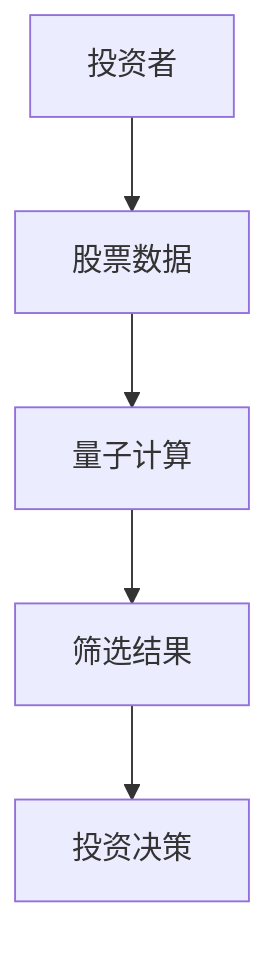
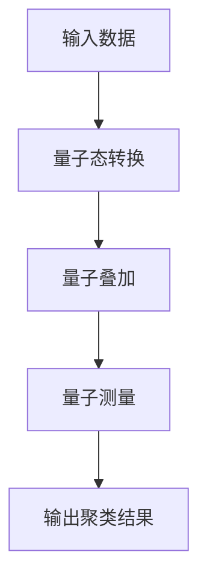
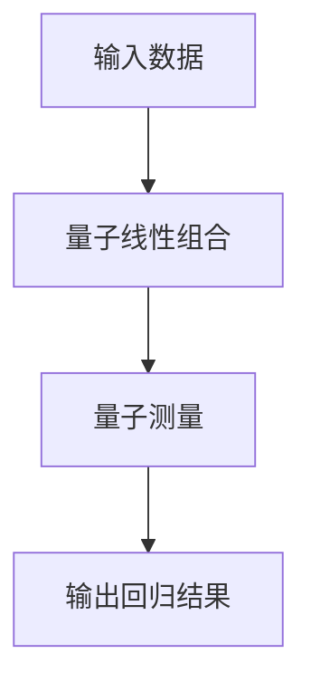

                 


# 特价股票筛选中的量子计算应用前景

## 关键词：量子计算、股票筛选、特价股票、金融应用、算法优化

## 摘要：  
随着金融市场的日益复杂化，传统的股票筛选方法已难以满足高效、精准的需求。量子计算作为一种革命性的计算技术，具备并行计算和超强算力的特点，为特价股票筛选提供了新的可能性。本文将从量子计算的基本原理出发，探讨其在股票筛选中的应用前景，分析其优势与挑战，并通过具体案例展示量子计算如何优化特价股票筛选流程。

---

# 目录

## 第一部分: 特价股票筛选中的量子计算背景与概念

### 第1章: 量子计算的基本概念

#### 1.1 量子计算的定义与特点  
- **量子计算的定义**：量子计算是一种基于量子力学原理的计算方式，利用量子位（qubit）进行信息处理。  
- **量子位与经典位的对比**：  
  - 经典位（bit）：只能是0或1。  
  - 量子位：可以同时处于0和1的叠加态，并且具有纠缠态，能够提供并行计算能力。  
- **量子计算的优势**：计算速度更快，适合解决复杂优化问题和大数据处理。

#### 1.2 特价股票的定义与筛选的重要性  
- **特价股票的定义**：价格低于面值的股票，通常具有较高的投资回报潜力，但也伴随着较高的风险。  
- **筛选的重要性**：通过筛选特价股票，投资者可以找到潜在的高收益机会，同时降低风险。

#### 1.3 量子计算在金融领域的应用现状  
- **量子计算在金融分析中的优势**：  
  - 提高数据分析效率。  
  - 优化投资组合。  
  - 改善风险管理能力。  
- **实际案例**：国内外在量子计算金融应用方面的研究进展。

---

## 第二部分: 特价股票筛选中的量子计算核心概念与联系

### 第2章: 量子计算的核心原理

#### 2.1 量子位与量子叠加原理  
- **量子位的定义**：量子位是量子计算的基本单位，可以处于多个状态的叠加态。  
- **量子叠加的数学表达**：  
  $$|\psi\rangle = \alpha|0\rangle + \beta|1\rangle$$  
  其中，$|\alpha|^2 + |\beta|^2 = 1$。  
- **量子纠缠**：多个量子位之间形成纠缠态，能够实现信息的高效传递和处理。

#### 2.2 量子计算在股票筛选中的应用  
- **量子计算与股票筛选的联系**：  
  - 利用量子计算的并行性，快速分析海量数据。  
  - 通过量子算法优化股票筛选模型。  
- **对比表格**：  
  | 特性 | 传统计算 | 量子计算 |  
  |------|----------|----------|  
  | 计算速度 | 串行处理 | 并行处理 |  
  | 数据处理能力 | 有限 | 巨大 |

#### 2.3 实体关系图  


---

## 第三部分: 特价股票筛选中的量子计算算法原理

### 第3章: 量子算法的基本原理

#### 3.1 量子聚类算法  
- **算法原理**：  
  量子聚类算法利用量子叠加和纠缠的特性，将股票数据映射到量子态，通过量子测量得到聚类结果。  
- **算法流程图**：  

- **Python代码实现**：  
  ```python
  import numpy as np
  from qiskit import QuantumCircuit, Aer, execute

  def quantum_clustering(data):
      # 数据预处理
      # 量子电路构建
      qc = QuantumCircuit(2)
      qc.h(0)
      qc.cx(0, 1)
      qc.measure_all()
      # 仿真与测量
      backend = Aer.get_backend('qasm_simulator')
      result = execute(qc, backend).result()
      return result.get_counts()
  ```

#### 3.2 量子回归算法  
- **算法原理**：  
  量子回归算法通过量子叠加和量子测量，优化回归模型的参数。  
- **算法流程图**：  


---

## 第四部分: 特价股票筛选中的量子计算数学模型

### 第4章: 量子计算的数学模型

#### 4.1 量子计算的数学表达  
- **量子态的表示**：  
  $$|\psi\rangle = \sum_{i=0}^{n} a_i| i \rangle$$  
  其中，$\sum_{i=0}^{n} |a_i|^2 = 1$。  
- **量子门的矩阵表示**：  
  $$I = \begin{pmatrix} 1 & 0 \\ 0 & 1 \end{pmatrix}$$  
  $$X = \begin{pmatrix} 0 & 1 \\ 1 & 0 \end{pmatrix}$$  

#### 4.2 股票筛选的数学模型  
- **目标函数**：  
  $$\min_{x} \sum_{i=1}^{n} w_i x_i$$  
  其中，$w_i$是股票的权重，$x_i$是选择变量。  
- **量子优化模型**：  
  利用量子叠加和量子测量，优化目标函数。

---

## 第五部分: 特价股票筛选中的量子计算系统分析与架构设计

### 第5章: 量子计算系统的架构设计

#### 5.1 系统功能设计  
- **领域模型**：  
  ```mermaid
  classDiagram
      class 股票数据 {
          id: int
          price: float
          volume: float
      }
      class 量子计算模块 {
          输入数据
          输出结果
      }
      股票数据 --> 量子计算模块
  ```

#### 5.2 系统架构设计  
- **整体架构图**：  
  ```mermaid
  graph TD
      A[股票数据] --> B[量子计算模块]
      B --> C[筛选结果]
      C --> D[投资决策]
  ```

---

## 第六部分: 特价股票筛选中的量子计算项目实战

### 第6章: 项目实战

#### 6.1 环境搭建  
- **安装量子计算库**：  
  ```bash
  pip install qiskit
  ```

#### 6.2 核心代码实现  
- **量子聚类算法实现**：  
  ```python
  from qiskit import QuantumCircuit, Aer, execute

  def quantum_clustering(data):
      qc = QuantumCircuit(2)
      qc.h(0)
      qc.cx(0, 1)
      qc.measure_all()
      backend = Aer.get_backend('qasm_simulator')
      result = execute(qc, backend).result()
      return result.get_counts()
  ```

#### 6.3 案例分析  
- **分析结果**：  
  通过量子聚类算法筛选出具有高潜力的特价股票，并进行投资决策。

---

## 第七部分: 总结与展望

### 7.1 最佳实践  
- **注意事项**：  
  - 数据质量对结果影响重大。  
  - 确保量子计算资源的可用性。  

### 7.2 小结  
量子计算在特价股票筛选中的应用前景广阔，其高效计算能力和并行处理能力为金融行业带来了新的可能性。然而，当前技术仍处于发展阶段，需要进一步研究和优化。

### 7.3 拓展阅读  
- 推荐阅读《量子计算与金融》、《量子算法入门》等书籍。

---

## 作者：AI天才研究院 & 禅与计算机程序设计艺术

---

以上内容可以根据具体需求进行扩展和调整，确保每个部分的内容详实且逻辑清晰。

