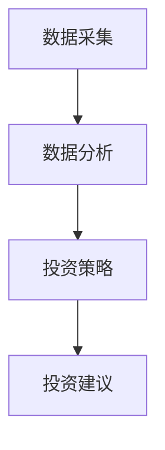

                 


# 特价股票筛选的三大核心规则

> 关键词：股票筛选，投资策略，价值识别，趋势判断，风险控制

> 摘要：本文将详细探讨特价股票筛选的三大核心规则：价值识别、趋势判断和风险控制。通过分析这些规则的原理、实现方法和实际应用，帮助投资者更好地识别和筛选具有投资价值的特价股票。

---

## 第1章: 特价股票筛选的背景与核心概念

### 1.1 特价股票的定义与特征
特价股票是指在特定市场条件下，价格被低估但具有潜在增长潜力的股票。其主要特征包括低市盈率（P/E ratio）、低市净率（P/B ratio）和高股息率（Dividend Yield）。这些指标可以帮助投资者识别市场中的潜在投资机会。

### 1.2 特价股票筛选的必要性
在股票市场中，投资者需要通过筛选特价股票来优化投资组合，降低投资风险，并提高投资收益。特价股票通常具有较高的安全边际，能够在市场波动中为投资者提供保护。

### 1.3 特价股票筛选的核心问题
筛选特价股票的核心问题包括：
1. 如何准确识别具有投资价值的股票。
2. 如何判断股票的未来趋势。
3. 如何控制投资风险。

---

## 第2章: 特价股票筛选的核心规则

### 2.1 核心规则一：价值识别
#### 2.1.1 价值识别的定义与目标
价值识别是通过分析股票的内在价值，判断其是否被市场低估。核心指标包括市盈率、市净率和股息率。

#### 2.1.2 价值识别的关键指标
- **市盈率（P/E ratio）**：股价与每股收益的比率。低市盈率通常意味着股票被低估。
- **市净率（P/B ratio）**：股价与每股净资产的比率。低市净率表明股票可能被市场低估。
- **股息率（Dividend Yield）**：股息与股价的比率。高股息率可能表明股票具有较高的分红能力。

#### 2.1.3 价值识别的实施步骤
1. 收集股票的基本数据。
2. 计算相关指标。
3. 对比市场平均水平，判断股票是否被低估。

### 2.2 核心规则二：趋势判断
#### 2.2.1 趋势判断的定义与目标
趋势判断是通过分析股票的价格走势，预测其未来表现。技术分析是趋势判断的主要方法。

#### 2.2.2 趋势判断的关键指标
- **移动平均线（MA）**：用于判断价格趋势的方向。
- **相对强弱指数（RSI）**：用于判断价格的超买或超卖状态。
- **成交量（Volume）**：用于确认价格走势的强度。

#### 2.2.3 趋势判断的实施步骤
1. 绘制股票价格走势图。
2. 计算相关技术指标。
3. 分析价格走势和成交量的关系。

### 2.3 核心规则三：风险控制
#### 2.3.1 风险控制的定义与目标
风险控制是通过合理的投资组合管理和止损策略，降低投资风险。

#### 2.3.2 风险控制的关键指标
- **波动率（Volatility）**：衡量股票价格的波动程度。
- **最大回撤（Maximum Drawdown）**：衡量投资组合的最大损失。

#### 2.3.3 风险控制的实施步骤
1. 设定止损点，避免重大损失。
2. 分散投资，降低单一股票的风险。
3. 定期评估投资组合，调整风险敞口。

---

## 第3章: 特价股票筛选的核心规则原理

### 3.1 价值识别的数学模型
#### 3.1.1 价值识别的公式推导
假设某股票的市盈率为 $P/E$，每股收益为 $EPS$，则：
$$ P/E = \frac{\text{股价}}{\text{EPS}} $$

如果 $P/E$ 小于市场平均水平，则表明股票可能被低估。

#### 3.1.2 价值识别的指标对比
通过对比市盈率和市净率，可以更全面地评估股票的价值。例如：
- 如果 $P/E$ 和 $P/B$ 均低于市场平均水平，则股票具有较高的投资价值。

### 3.2 趋势判断的数学模型
#### 3.2.1 趋势判断的公式推导
移动平均线的计算公式为：
$$ MA_n = \frac{\sum_{i=1}^{n} P_i}{n} $$
其中，$P_i$ 是第 $i$ 天的价格，$n$ 是天数。

通过比较当前价格与移动平均线的关系，可以判断价格趋势的方向。

#### 3.2.2 趋势判断的指标对比
相对强弱指数（RSI）的计算公式为：
$$ RSI = 100 - \frac{100}{1 + \frac{\text{上涨幅度}}{\text{下跌幅度}}} $$

如果 $RSI > 70$，则可能超买；如果 $RSI < 30$，则可能超卖。

### 3.3 风险控制的数学模型
#### 3.3.1 风险控制的公式推导
最大回撤的计算公式为：
$$ \text{最大回撤} = \max(P_{\text{高}} - P_{\text{低}}) $$
其中，$P_{\text{高}}$ 是最高价格，$P_{\text{低}}$ 是最低价格。

通过设定止损点，可以有效控制投资风险。

---

## 第4章: 特价股票筛选的系统架构设计

### 4.1 系统功能设计
#### 4.1.1 系统功能模块划分
- 数据采集模块：收集股票的基本数据和市场数据。
- 数据分析模块：计算相关指标并生成报告。
- 投资策略模块：根据规则筛选股票并生成投资建议。

#### 4.1.2 系统功能流程图


### 4.2 系统架构设计
#### 4.2.1 系统架构的分层设计
- 数据层：存储股票数据和市场数据。
- 业务逻辑层：实现数据分析和投资策略。
- 用户界面层：展示结果并提供交互功能。

#### 4.2.2 系统架构的模块化设计
- 数据采集模块：负责从数据源获取股票数据。
- 数据分析模块：计算相关指标并生成报告。
- 投资策略模块：根据规则筛选股票并生成投资建议。

#### 4.2.3 系统架构的交互设计
- 用户输入筛选条件。
- 系统根据筛选条件生成报告。
- 用户查看报告并做出决策。

### 4.3 系统接口设计
#### 4.3.1 系统接口的定义
- 数据接口：与数据源对接，获取股票数据。
- 报告接口：生成并返回分析报告。

#### 4.3.2 系统接口的实现
- 数据接口：通过API获取股票数据。
- 报告接口：通过JSON格式返回分析结果。

---

## 第5章: 特价股票筛选的项目实战

### 5.1 环境安装与配置
#### 5.1.1 开发环境的选择
- Python 3.8 或更高版本。
- 数据分析库：Pandas、NumPy。
- 可视化库：Matplotlib、Seaborn。

#### 5.1.2 开发工具的安装
```bash
pip install pandas numpy matplotlib seaborn
```

#### 5.1.3 数据源的获取与配置
从Yahoo Finance获取股票数据。

### 5.2 系统核心实现
#### 5.2.1 价值识别模块的实现
```python
import pandas as pd

def calculate_pe(stock_price, eps):
    return stock_price / eps

# 示例数据
stock_price = 50
eps = 5
pe_ratio = calculate_pe(stock_price, eps)
print(pe_ratio)
```

#### 5.2.2 趋势判断模块的实现
```python
import pandas as pd
import matplotlib.pyplot as plt

def calculate_ma(data, n=5):
    return data['Close'].rolling(n).mean()

# 示例数据
data = pd.read_csv('stock_data.csv')
ma = calculate_ma(data)
plt.plot(data['Close'], label='Price')
plt.plot(ma, label='MA_5')
plt.legend()
plt.show()
```

#### 5.2.3 风险控制模块的实现
```python
def calculate_max_drawdown(prices):
    max_drawdown = 0
    for i in range(len(prices)):
        for j in range(i+1, len(prices)):
            dd = (prices[i] - prices[j]) / prices[i]
            if dd < -max_drawdown:
                max_drawdown = dd
    return max_drawdown

# 示例数据
prices = [100, 90, 80, 70, 60, 50, 60, 70]
max_dd = calculate_max_drawdown(prices)
print(max_dd)
```

### 5.3 代码应用与分析
#### 5.3.1 核心代码的解读
- 价值识别模块：计算市盈率并判断是否低估。
- 趋势判断模块：计算移动平均线并绘制价格走势图。
- 风险控制模块：计算最大回撤并评估投资风险。

#### 5.3.2 代码运行的测试
通过实际数据测试代码的正确性，并根据结果调整参数。

#### 5.3.3 项目小结
通过实战项目，验证了三大核心规则的有效性，并掌握了如何将理论应用于实际投资。

---

## 总结
特价股票筛选的三大核心规则——价值识别、趋势判断和风险控制，是投资者在股票市场中获取超额收益的重要工具。通过本文的详细讲解和实战案例，读者可以更好地理解和应用这些规则，从而在股票投资中取得更好的成绩。

---

作者：AI天才研究院/AI Genius Institute & 禅与计算机程序设计艺术 /Zen And The Art of Computer Programming

