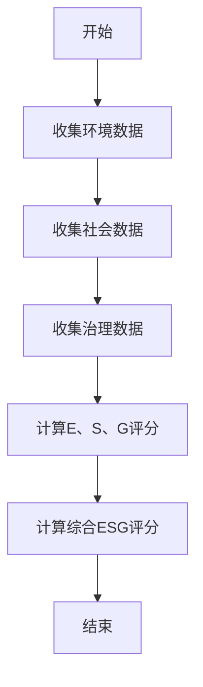
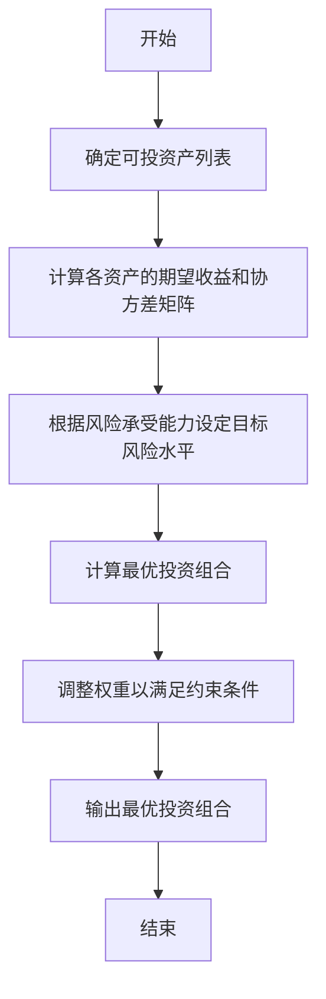
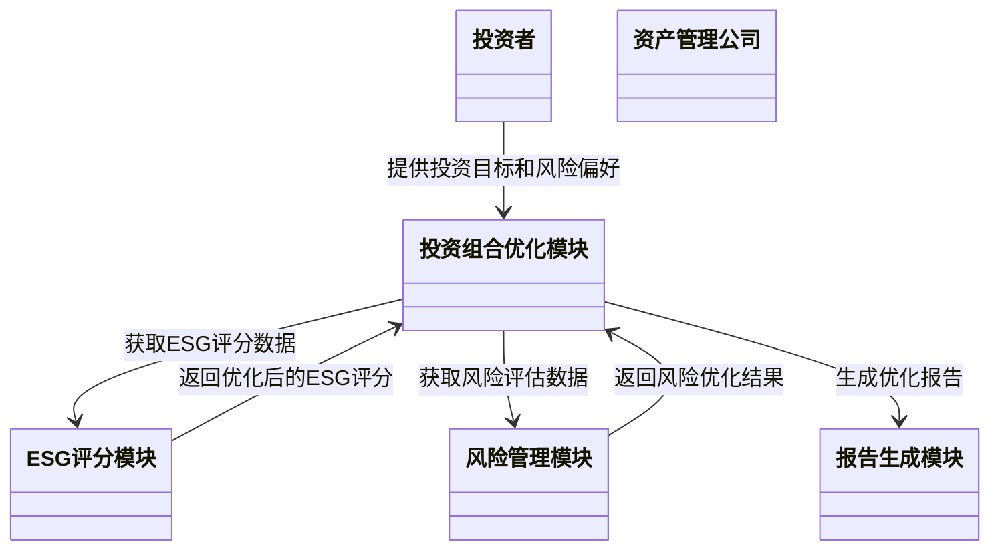
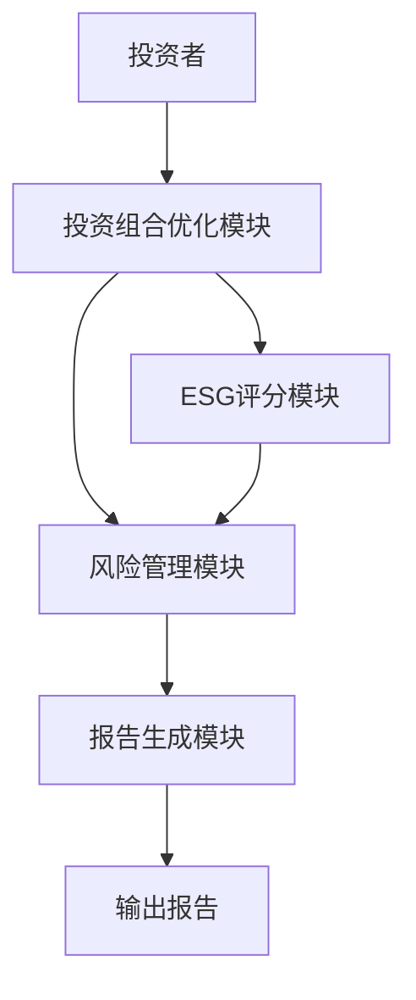
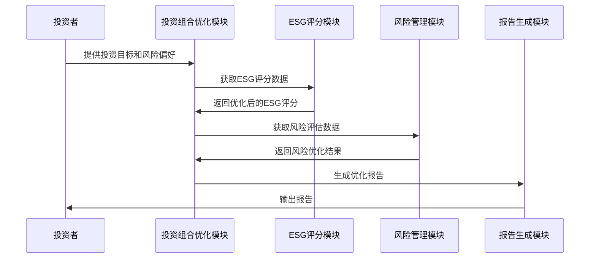

                 


# 目录大纲：《玛丽·巴芙的可持续发展投资策略》

## 第一部分: 可持续发展投资概述

### 第1章: 可持续发展的概念与背景

#### 1.1 可持续发展的概念与背景

- 1.1.1 环境、社会和治理（ESG）的定义
  - 环境因素：企业的环境表现，如碳排放、资源利用效率
  - 社会因素：企业对社会的影响，如员工权益、社会责任
  - 治理因素：公司治理结构和高管薪酬

- 1.1.2 可持续发展的背景与趋势
  - 全球可持续发展的目标与挑战
  - 可持续投资在全球范围内的兴起
  - 玛丽·巴芙在可持续投资中的角色与贡献

- 1.1.3 可持续投资与传统投资的异同
  - 投资目标：长期价值 vs 短期收益
  - 风险管理：全面评估 vs 传统财务指标
  - 信息透明度：更高要求 vs 传统标准

### 第2章: 投资的基本原理

#### 2.1 投资的基本概念与分类

- 2.1.1 投资的基本概念
  - 资产类别：股票、债券、房地产等
  - 投资策略：主动投资 vs 被动投资
  - 风险与收益：风险越大，收益可能越高

- 2.1.2 可持续投资的核心要素
  - 环境因素：企业的环保表现
  - 社会因素：企业对社会的贡献
  - 治理因素：公司治理结构的完善性

- 2.1.3 可持续投资的分类
  - 环境友好型投资：专注于环保产业
  - 社会责任型投资：关注企业社会责任
  - 治理驱动型投资：注重公司治理结构

## 第二部分: 玛丽·巴芙的投资哲学与策略

### 第3章: 玛丽·巴芙的投资哲学

#### 3.1 玛丽·巴芙的投资理念

- 3.1.1 长期投资与价值投资的结合
  - 长期投资：耐心持有优质资产
  - 价值投资：寻找被市场低估的企业

- 3.1.2 企业的基本面分析与竞争优势识别
  - 财务健康状况：利润、现金流、负债情况
  - 市场地位：市场份额、品牌影响力
  - 管理团队：领导力、战略规划能力

- 3.1.3 股价与内在价值的动态平衡
  - 内在价值的计算方法
  - 股价波动与市场情绪的影响
  - 长期持有与短期波动的平衡

### 第4章: 玛丽·巴芙的投资策略

#### 4.1 玛丽·巴芙的投资策略

- 4.1.1 股息率与企业盈利能力的双重考量
  - 股息率的重要性：稳定收益的来源
  - 盈利能力的评估：净利润率、ROE等指标
  - 股息率与盈利能力的平衡点

- 4.1.2 风险控制与投资组合的构建
  - 风险分散：资产配置的重要性
  - 个股风险：企业的特定风险因素
  - 组合优化：通过多元化的降低整体风险

- 4.1.3 投资决策中的心理因素与行为偏差
  - 心理偏差：过度自信、从众心理
  - 行为偏差：过度交易、羊群效应
  - 理性决策：克服心理障碍，坚持长期策略

## 第三部分: 可持续发展投资的核心模型与算法

### 第5章: 可持续投资的数学模型

#### 5.1 环境、社会和治理（ESG）评分模型

- 5.1.1 ESG评分模型的计算方法与权重分配
  - ESG评分的计算流程：数据收集、指标权重、综合评分
  - $$ESG\text{评分} = \alpha \times E + \beta \times S + \gamma \times G$$
    - 其中，$\alpha, \beta, \gamma$ 分别为环境、社会和治理的权重，满足 $\alpha + \beta + \gamma = 1$

  - ESG评分的优缺点：数据来源的可靠性、指标的主观性

- 5.1.2 用Mermaid流程图展示ESG评分模型的计算流程


- 5.1.3 用Python代码实现ESG评分模型
```python
import pandas as pd

def calculate_esg_score(environment, social, governance):
    # 定义权重，可根据具体情况进行调整
    alpha = 0.4
    beta = 0.3
    gamma = 0.3

    # 计算ESG评分
    esg_score = alpha * environment + beta * social + gamma * governance
    return esg_score

# 示例数据
environment_scores = [0.8, 0.7, 0.9]
social_scores = [0.6, 0.8, 0.7]
governance_scores = [0.7, 0.6, 0.8]

# 计算并输出ESG评分
esg_scores = []
for e, s, g in zip(environment_scores, social_scores, governance_scores):
    esg_scores.append(calculate_esg_score(e, s, g))

print("ESG评分结果:", esg_scores)
```

#### 5.2 玛丽·巴芙投资组合优化模型

- 5.2.1 现代投资组合理论（MPT）与风险调整收益优化
  - MPT的核心思想：通过资产组合降低风险
  - 风险调整收益的优化目标：在风险可控的前提下，最大化收益

- 5.2.2 用数学公式展示投资组合优化模型
  - $$\text{收益最大化} = \sum_{i=1}^{n} w_i r_i$$
  - $$\text{风险最小化} = \sqrt{\sum_{i=1}^{n} \sum_{j=1}^{n} w_i w_j \sigma_{ij}}}$$
  - 其中，$w_i$ 是第i个资产的权重，$r_i$ 是第i个资产的期望收益，$\sigma_{ij}$ 是第i和第j个资产之间的协方差

- 5.2.3 用Mermaid流程图展示投资组合优化的步骤


- 5.2.4 用Python代码实现投资组合优化模型
```python
import numpy as np
import pandas as pd
from scipy.optimize import minimize

def portfolio_optimization(returns, cov_matrix, risk_tolerance=0.05):
    # 定义优化目标函数
    n = len(returns)
    # 目标是最小化风险，即最小化方差
    def objective(weights):
        return np.dot(weights.T, np.dot(cov_matrix, weights))

    # 约束条件：权重之和为1
    constraints = [{'type': 'eq', 'fun': lambda w: sum(w) - 1}]

    # 初始猜测：等权重
    initial_guess = np.array([1.0/n] * n)

    # 最优化问题：最小化方差，受约束于权重之和为1
    result = minimize(objective, initial_guess, constraints=constraints)

    return result.x

# 示例数据
returns = [0.1, 0.12, 0.08, 0.15]
cov_matrix = [
    [0.02, 0.01, 0.015, 0.02],
    [0.01, 0.03, 0.01, 0.01],
    [0.015, 0.01, 0.03, 0.02],
    [0.02, 0.01, 0.02, 0.05]
]

# 计算最优投资组合
optimal_weights = portfolio_optimization(returns, cov_matrix)
print("最优权重:", optimal_weights)
```

## 第四部分: 系统分析与架构设计

### 第6章: 可持续投资系统的架构设计

#### 6.1 系统功能设计

- 6.1.1 用Mermaid类图展示系统的领域模型


- 6.1.2 用Mermaid架构图展示系统的整体架构


- 6.1.3 用Mermaid序列图展示系统的主要交互流程


## 第五部分: 项目实战

### 第7章: 项目实战与案例分析

#### 7.1 环境安装与数据准备

- 7.1.1 安装必要的Python库
  - pandas、numpy、scipy、matplotlib、seaborn
  - 安装命令：pip install pandas numpy scipy matplotlib seaborn

- 7.1.2 数据准备
  - 数据来源： yahoo finance、 Bloomberg、ESG评级机构等
  - 数据格式：CSV或Excel文件，包含历史股价、财务数据、ESG评分等

#### 7.2 系统核心实现源代码

- 7.2.1 ESG评分计算模块
```python
import pandas as pd

def calculate_esg_score(environment, social, governance):
    # 定义权重，可根据具体情况进行调整
    alpha = 0.4
    beta = 0.3
    gamma = 0.3

    # 计算ESG评分
    esg_score = alpha * environment + beta * social + gamma * governance
    return esg_score

# 示例数据
environment_scores = [0.8, 0.7, 0.9]
social_scores = [0.6, 0.8, 0.7]
governance_scores = [0.7, 0.6, 0.8]

# 计算并输出ESG评分
esg_scores = []
for e, s, g in zip(environment_scores, social_scores, governance_scores):
    esg_scores.append(calculate_esg_score(e, s, g))

print("ESG评分结果:", esg_scores)
```

- 7.2.2 投资组合优化模块
```python
import numpy as np
import pandas as pd
from scipy.optimize import minimize

def portfolio_optimization(returns, cov_matrix, risk_tolerance=0.05):
    # 定义优化目标函数
    n = len(returns)
    # 目标是最小化风险，即最小化方差
    def objective(weights):
        return np.dot(weights.T, np.dot(cov_matrix, weights))

    # 约束条件：权重之和为1
    constraints = [{'type': 'eq', 'fun': lambda w: sum(w) - 1}]

    # 初始猜测：等权重
    initial_guess = np.array([1.0/n] * n)

    # 最优化问题：最小化方差，受约束于权重之和为1
    result = minimize(objective, initial_guess, constraints=constraints)

    return result.x

# 示例数据
returns = [0.1, 0.12, 0.08, 0.15]
cov_matrix = [
    [0.02, 0.01, 0.015, 0.02],
    [0.01, 0.03, 0.01, 0.01],
    [0.015, 0.01, 0.03, 0.02],
    [0.02, 0.01, 0.02, 0.05]
]

# 计算最优投资组合
optimal_weights = portfolio_optimization(returns, cov_matrix)
print("最优权重:", optimal_weights)
```

#### 7.3 案例分析与详细解读

- 7.3.1 案例背景
  - 假设我们有一个包含四只股票的投资组合
  - 股票代码：AAPL、GOOGL、MSFT、AMZN

- 7.3.2 数据收集与处理
  - 股票的历史股价数据：2018年1月1日到2023年1月1日
  - 各股票的ESG评分数据：来自MSCI或晨星等评级机构

- 7.3.3 算法实现与结果分析
  - 计算各股票的ESG评分
  - 计算各股票的历史收益率和协方差矩阵
  - 运行投资组合优化模型，得到最优权重
  - 分析结果：哪些股票在最优组合中占比较高，原因是什么

- 7.3.4 图表展示
  - 投资组合的收益与风险对比图
  - 各股票在最优组合中的权重分布图
  - ESG评分与股票收益的相关性分析图

#### 7.4 项目小结

- 7.4.1 项目总结
  - 通过本项目，我们掌握了如何利用ESG评分和投资组合优化模型进行可持续投资
  - 学习了如何使用Python进行数据处理和优化计算
  - 理解了可持续投资的实际应用场景和优势

- 7.4.2 最佳实践
  - 定期更新ESG评分和资产数据，以反映市场变化
  - 结合宏观经济环境和行业趋势，动态调整投资组合
  - 注意数据来源的可靠性和模型的适用性，避免片面决策

- 7.4.3 注意事项
  - 数据质量：确保数据的完整性和准确性
  - 模型假设：理解模型的假设条件和局限性
  - 风险管理：始终关注投资组合的整体风险水平

## 第六部分: 总结与展望

### 第8章: 总结与展望

#### 8.1 本书小结

- 玛丽·巴芙的可持续发展投资策略的核心思想
- 可持续投资的关键模型与算法
- 实际应用中的注意事项和最佳实践

#### 8.2 未来展望

- 可持续投资的未来发展趋势
- 人工智能与大数据在可持续投资中的应用前景
- 环境、社会和治理（ESG）评分体系的进一步发展

## 附录

### 附录A: 环境、社会和治理（ESG）评分体系详细介绍

- ESG评分的定义与计算方法
- 各项评分的具体指标与权重分配
- 常见的ESG评级机构及其评分标准

### 附录B: 投资组合优化算法的详细实现

- 现代投资组合理论（MPT）的详细步骤
- 风险调整收益优化的具体实现方法
- 如何根据实际情况调整优化模型的参数

### 附录C: 项目源代码

- ESG评分计算模块的完整代码
- 投资组合优化模块的完整代码
- 数据处理与结果展示的完整代码

## 参考文献

- 玛丽·巴芙的经典著作
- 相关学术论文
- 行业报告与白皮书
- 网络资源与开源代码库

---

# 作者

**作者：AI天才研究院/AI Genius Institute & 禅与计算机程序设计艺术/Zen And The Art of Computer Programming**

---

以上是《玛丽·巴芙的可持续发展投资策略》的详细目录大纲，涵盖了从基础概念到实际应用的各个方面，结合理论与实践，适合对可持续投资感兴趣的专业投资者和研究人员阅读。

