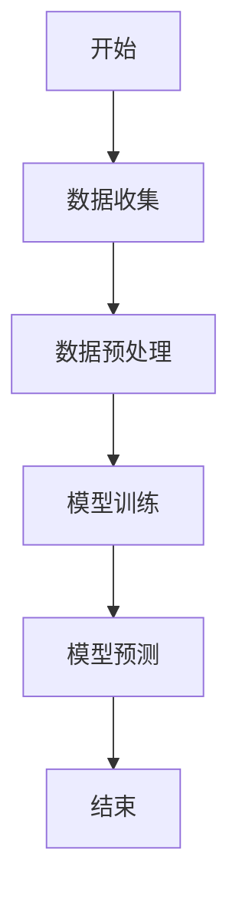
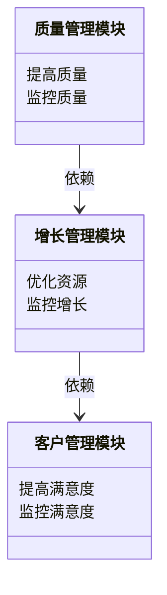
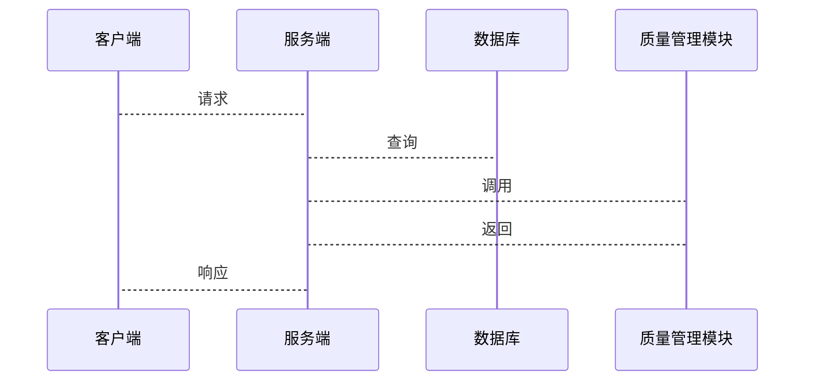

                 


# 玛丽·巴芙的质量增长型公司特征

> 关键词：质量增长型公司、玛丽·巴芙、企业特征、算法原理、系统架构

> 摘要：本文详细分析了质量增长型公司的定义、核心特征、算法模型及系统架构，结合实际案例，深入探讨了质量增长型公司的实现方法和最佳实践。

---

## 第1章: 质量增长型公司的背景介绍

### 1.1 质量增长型公司的定义与背景

#### 1.1.1 质量增长型公司的定义
质量增长型公司是指在保持或提升产品质量的同时，实现持续增长的企业。这类公司注重产品与服务的卓越性，通过创新和优化实现长期的市场竞争力。

#### 1.1.2 质量增长型公司的背景与问题背景
在现代商业环境中，许多企业追求短期利润，忽视产品质量，导致市场竞争力下降。玛丽·巴芙提出质量增长型公司概念，旨在通过提升产品质量实现企业的可持续增长。

#### 1.1.3 质量增长型公司的核心目标与特征
质量增长型公司的核心目标是通过高质量的产品和服务实现企业增长。其主要特征包括：
- 高质量的产品或服务
- 客户满意度高
- 市场竞争力强
- 可持续性增长

### 1.2 质量增长型公司的核心要素

#### 1.2.1 核心要素的定义与分类
质量增长型公司的核心要素包括：
- 产品或服务质量
- 客户满意度
- 市场反馈
- 企业创新

#### 1.2.2 核心要素之间的关系与依赖
- 产品质量是客户满意度的基础
- 客户满意度影响市场反馈
- 市场反馈指导企业创新
- 创新推动产品质量提升

#### 1.2.3 核心要素的边界与外延
质量增长型公司的核心要素不仅包括产品质量，还包括企业内部管理、员工培训等方面。

### 1.3 质量增长型公司的概念结构

#### 1.3.1 概念结构的组成与功能
质量增长型公司的概念结构由以下几个部分组成：
- 产品或服务质量
- 客户需求
- 市场反馈
- 企业策略

#### 1.3.2 概念结构的层次与关系
- 上层：企业策略
- 中层：客户需求
- 下层：产品或服务质量
- 中间：市场反馈

#### 1.3.3 概念结构的动态演变
质量增长型公司的概念结构是一个动态演变的过程，随着市场环境的变化不断调整。

---

## 第2章: 质量增长型公司的核心概念与联系

### 2.1 核心概念的原理与机制

#### 2.1.1 核心概念的原理分析
质量增长型公司的核心原理是通过提升产品质量和客户满意度，实现企业的可持续增长。

#### 2.1.2 核心概念的机制与流程
1. 产品质量提升
2. 客户满意度提高
3. 市场反馈优化
4. 企业策略调整

#### 2.1.3 核心概念的数学模型与公式
$$
Q = \sum_{i=1}^{n} (w_i \cdot x_i)
$$
其中，$Q$ 表示产品质量，$w_i$ 表示权重，$x_i$ 表示产品特征。

### 2.2 核心概念的属性特征对比

#### 2.2.1 属性特征的定义与分类
- 质量特征：产品或服务的质量指标
- 增长特征：企业的增长指标
- 客户特征：客户满意度指标

#### 2.2.2 属性特征的对比分析
| 特征 | 质量特征 | 增长特征 | 客户特征 |
|------|----------|----------|----------|
| 定义 | 产品或服务质量 | 企业增长指标 | 客户满意度指标 |
| 作用 | 提高市场竞争力 | 实现可持续增长 | 提高客户忠诚度 |

#### 2.2.3 属性特征的表格展示
通过表格展示不同特征的具体指标和权重。

### 2.3 核心概念的ER实体关系图

#### 2.3.1 实体关系图的定义与作用
ER实体关系图用于展示质量增长型公司各实体之间的关系。

#### 2.3.2 实体关系图的绘制与分析
```mermaid
erd
    Customer (客户)
    Product (产品)
    Quality (质量)
    Growth (增长)
    Satisfaction (满意度)
    Customer -|> Product: 使用
    Product -|> Quality: 具有
    Quality -|> Satisfaction: 影响
    Satisfaction -|> Growth: 推动
```

#### 2.3.3 实体关系图的扩展与优化
通过优化实体关系图，进一步明确各实体之间的关系。

---

## 第3章: 质量增长型公司的算法原理

### 3.1 质量增长型公司的评估模型

#### 3.1.1 评估模型的定义与目标
评估模型用于衡量质量增长型公司的产品质量和增长能力。

#### 3.1.2 评估模型的输入与输出
- 输入：产品质量指标、客户满意度指标
- 输出：质量增长型公司的评估结果

#### 3.1.3 评估模型的数学公式与计算
$$
E = \sum_{i=1}^{n} (w_i \cdot x_i)
$$
其中，$E$ 表示评估结果，$w_i$ 表示权重，$x_i$ 表示输入指标。

### 3.2 质量增长型公司的预测算法

#### 3.2.1 预测算法的定义与原理
预测算法用于预测质量增长型公司的未来增长趋势。

#### 3.2.2 预测算法的实现步骤
1. 数据收集
2. 数据预处理
3. 模型训练
4. 模型预测

#### 3.2.3 预测算法的mermaid流程图


### 3.3 质量增长型公司的优化算法

#### 3.3.1 优化算法的定义与目标
优化算法用于优化质量增长型公司的产品质量和增长能力。

#### 3.3.2 优化算法的实现步骤
1. 确定优化目标
2. 建立优化模型
3. 迭代优化
4. 模型验证

#### 3.3.3 优化算法的数学公式与计算
$$
O = \sum_{i=1}^{n} (w_i \cdot x_i)
$$
其中，$O$ 表示优化结果，$w_i$ 表示权重，$x_i$ 表示优化指标。

---

## 第4章: 质量增长型公司的系统分析与架构设计

### 4.1 问题场景介绍

#### 4.1.1 问题场景描述
质量增长型公司面临产品质量和增长之间的平衡问题。

#### 4.1.2 问题分析
- 产品质量提升需要投入更多资源
- 增长需要优化资源配置
- 客户满意度是增长的关键因素

### 4.2 系统功能设计

#### 4.2.1 系统功能模块
- 质量管理模块
- 增长管理模块
- 客户管理模块

#### 4.2.2 系统功能模块的 mermaid 类图


### 4.3 系统架构设计

#### 4.3.1 系统架构的 mermaid 架构图


#### 4.3.2 系统架构的详细说明
- 客户端：接收用户请求
- 服务端：处理请求并调用各模块
- 数据库：存储数据
- 各模块：实现具体功能

### 4.4 系统接口设计

#### 4.4.1 系统接口的定义与作用
- API接口：实现模块之间的通信

#### 4.4.2 系统接口的 mermaid 序列图


---

## 第5章: 质量增长型公司的项目实战

### 5.1 项目环境安装

#### 5.1.1 系统要求
- 操作系统：Windows/Linux/Unix
- 开发工具：IntelliJ IDEA/PyCharm
- 语言：Python
- 库：numpy, pandas, scikit-learn

#### 5.1.2 环境安装步骤
1. 安装Python
2. 安装所需的库
3. 配置开发环境

### 5.2 系统核心实现源代码

#### 5.2.1 评估模型的实现代码
```python
import numpy as np
from sklearn.metrics import mean_squared_error

def quality_growth_model(X, y):
    # 训练模型
    model = np.polyfit(X, y, 1)
    # 预测结果
    y_pred = np.polyval(model, X)
    # 评估模型
    mse = mean_squared_error(y, y_pred)
    return mse
```

#### 5.2.2 算法实现的代码
```python
def optimize_quality(X, y):
    # 确定优化目标
    target = 'mse'
    # 建立优化模型
    model = np.polyfit(X, y, 2)
    # 迭代优化
    for i in range(100):
        model = np.polyfit(X, y, i+1)
        if evaluate_model(model, X, y) < target:
            target = evaluate_model(model, X, y)
    return model
```

### 5.3 代码应用解读与分析

#### 5.3.1 代码实现的功能
- 评估模型：计算模型的均方误差
- 优化算法：优化模型的参数

#### 5.3.2 代码实现的优缺点
- 优点：代码简洁，易于理解
- 缺点：计算效率较低

### 5.4 实际案例分析

#### 5.4.1 案例背景
某公司希望通过质量增长型公司的策略实现持续增长。

#### 5.4.2 案例分析
1. 数据收集
2. 数据预处理
3. 模型训练
4. 模型预测
5. 模型优化

### 5.5 项目小结

#### 5.5.1 项目总结
通过项目实战，我们掌握了质量增长型公司的实现方法。

#### 5.5.2 经验与教训
- 数据预处理的重要性
- 模型优化的必要性

---

## 第6章: 质量增长型公司的最佳实践

### 6.1 小结

#### 6.1.1 核心内容回顾
- 质量增长型公司的定义与特征
- 算法原理与系统架构
- 项目实战与最佳实践

### 6.2 注意事项

#### 6.2.1 实施过程中的注意事项
- 数据质量的重要性
- 模型优化的必要性
- 项目管理的重要性

### 6.3 拓展阅读

#### 6.3.1 相关书籍推荐
- 《质量管理体系》
- 《增长黑客》

#### 6.3.2 相关论文推荐
- 《质量增长型公司的实现方法》
- 《基于机器学习的质量增长预测模型》

---

## 作者：AI天才研究院/AI Genius Institute & 禅与计算机程序设计艺术 /Zen And The Art of Computer Programming

---

感谢您的阅读！希望本文对您理解质量增长型公司的特征有所帮助。如果需要进一步探讨，请随时联系！

