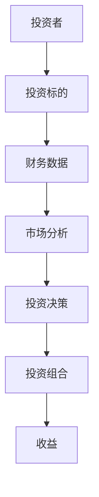
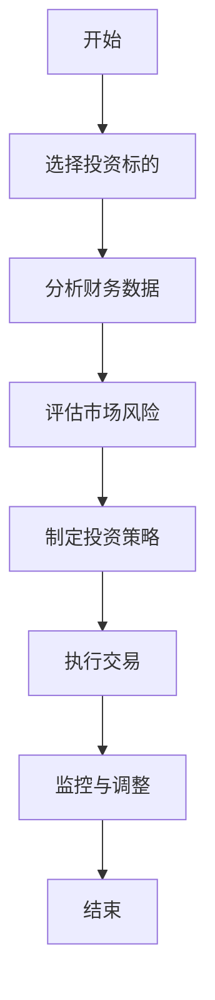
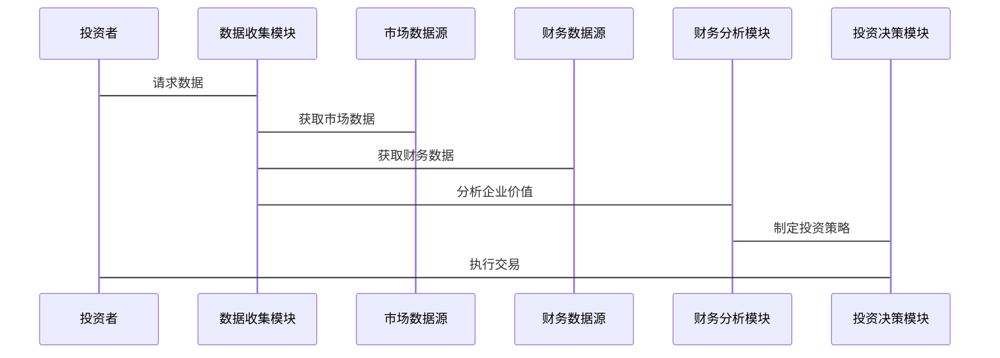

                 


# 玛丽·巴芙达的患者资本理论

## 关键词：
患者资本理论, 长期投资, 价值投资, 玛丽·巴芙达, 投资策略, 投资算法, 系统架构

## 摘要：
本文深入探讨了玛丽·巴芙达的患者资本理论，从理论背景到实际应用进行了系统性分析。文章首先介绍了患者资本理论的定义、核心概念和问题背景，接着详细讲解了其算法原理和数学模型，随后分析了系统的架构设计和项目实现。最后，结合实际案例，总结了患者资本理论的最佳实践和注意事项。通过本文的阐述，读者能够全面理解患者资本理论的内在逻辑和实际应用。

---

# 第一部分: 背景介绍

## 第1章: 患者资本理论的背景

### 1.1 投资理论的演进
投资者在金融市场中面临着复杂的选择，从短期交易到长期投资，从价值投资到趋势投资，每种策略都有其独特的逻辑和适用场景。然而，随着市场的波动加剧和信息不对称的增加，传统的投资策略往往难以应对复杂的市场环境。玛丽·巴芙达的患者资本理论作为一种长期投资策略，强调通过深入分析和耐心持有来实现超额收益。

### 1.2 玛丽·巴芙达的投资者背景
玛丽·巴芙达（Mary Buffett）是沃伦·巴菲特（Warren Buffett）的侄女，她继承了巴菲特的价值投资理念，并在此基础上发展出一套独特的患者资本理论。她强调，投资不仅仅是买卖股票，更是一种对企业的理解和信任，通过长期持有优质资产来实现财富的稳步增长。

### 1.3 患者资本理论的核心问题
患者资本理论的核心问题是如何在长期投资中平衡风险与收益。传统投资策略往往关注短期收益，而患者资本理论则强调通过深入研究和长期持有优质资产来规避短期波动的风险，从而实现长期稳定的收益。

---

## 第2章: 核心概念与联系

### 2.1 患者资本理论的核心原理
患者资本理论的核心原理在于通过长期持有优质资产来实现超额收益。其核心概念包括：

1. **价值投资**：寻找具有长期竞争优势的企业，关注企业的内在价值而非市场波动。
2. **长期持有**：避免频繁交易，降低交易成本和税务负担。
3. **风险管理**：通过分散投资和深入研究降低投资风险。

### 2.2 核心概念对比表
以下是患者资本理论与传统投资策略的核心对比：

| 对比维度         | 患者资本理论                     | 传统短期投资                   |
|------------------|----------------------------------|-------------------------------|
| 投资期限         | 长期持有，注重长期收益           | 短期交易，注重短期收益         |
| 风险管理          | 通过分散投资降低系统性风险       | 通过高频交易规避市场波动       |
| 投资策略          | 价值投资，关注企业基本面         | 技术分析，关注市场趋势           |
| 交易频率          | 极低，避免频繁交易               | 高频，追求短期价差              |

### 2.3 实体关系图
以下是患者资本理论的核心实体关系图：



---

# 第二部分: 算法原理讲解

## 第3章: 投资决策算法

### 3.1 算法概述
患者资本理论的核心算法是基于价值投资的长期决策模型。该算法通过对企业基本面的深入分析，筛选出具有长期竞争优势的企业，并通过长期持有来实现超额收益。

### 3.2 算法流程图
以下是患者资本理论的投资决策流程图：



### 3.3 数学模型与公式
#### 3.3.1 现金流贴现模型
患者资本理论的核心数学模型是现金流贴现模型（DCF模型），用于评估企业的内在价值：

$$DCF = \sum_{t=1}^{n} \frac{CF_t}{(1 + r)^t}$$

其中：
- $CF_t$ 是第 $t$ 年的现金流
- $r$ 是折现率
- $n$ 是评估期限

#### 3.3.2 风险调整回报模型
为了评估投资组合的风险调整回报，可以使用夏普比率（Sharpe Ratio）：

$$Sharpe\ Ratio = \frac{E[r_i - r_f]}{\sigma_i}$$

其中：
- $E[r_i]$ 是投资组合的期望回报
- $r_f$ 是无风险利率
- $\sigma_i$ 是投资组合的收益波动率

---

# 第三部分: 系统分析与架构设计

## 第4章: 问题场景介绍

### 4.1 问题场景
投资者在实际操作中面临以下问题：
1. 如何筛选具有长期竞争优势的企业？
2. 如何通过长期持有实现超额收益？
3. 如何通过系统化的方法降低投资风险？

## 第5章: 系统功能设计

### 5.1 功能模块
1. **数据收集模块**：收集企业的财务数据和市场数据。
2. **财务分析模块**：通过DCF模型评估企业的内在价值。
3. **投资决策模块**：基于财务分析和市场数据制定投资策略。

### 5.2 系统架构设计
以下是系统的整体架构图：


## 第6章: 系统接口设计

### 6.1 系统接口
以下是系统的主要接口：



---

# 第四部分: 项目实战

## 第7章: 环境安装

### 7.1 安装Python
安装Python 3.x版本，确保环境满足项目需求。

### 7.2 安装相关库
安装Pandas、NumPy、Matplotlib等数据分析库。

## 第8章: 核心代码实现

### 8.1 数据收集代码
```python
import pandas as pd

# 下载数据
data = pd.read_csv('data.csv')
```

### 8.2 财务分析代码
```python
def calculateDCF(cash_flows, discount_rate):
    return sum(cash_flows / (1 + discount_rate)**t for t in range(len(cash_flows)))

DCF = calculateDCF([100, 200, 300], 0.1)
print(DCF)
```

### 8.3 投资决策代码
```python
def invest(asset_value, market_value):
    if asset_value > market_value:
        return "买入"
    else:
        return "卖出"

decision = invest(150, 100)
print(decision)
```

## 第9章: 实际案例分析

### 9.1 案例分析
以某企业为例，通过DCF模型计算其内在价值，并制定投资策略。

---

# 第五部分: 最佳实践

## 第10章: 小结

### 10.1 总结
患者资本理论是一种长期投资策略，通过深入分析和长期持有优质资产来实现超额收益。

## 10.2 注意事项
1. **风险管理**：通过分散投资降低系统性风险。
2. **持续学习**：保持对市场的敏感性和对企业基本面的深入理解。
3. **长期视角**：避免短期波动的干扰，坚持长期投资。

## 10.3 拓展阅读
推荐阅读《巴菲特的智慧》和《价值投资入门》等书籍，深入理解患者资本理论的核心思想。

---

# 作者

作者：AI天才研究院/AI Genius Institute & 禅与计算机程序设计艺术 /Zen And The Art of Computer Programming

---

通过以上内容，读者可以系统地理解玛丽·巴芙达的患者资本理论，并将其应用于实际投资中。

