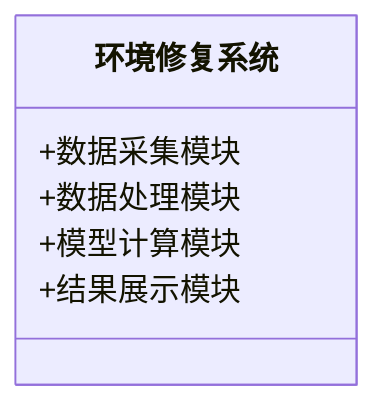

                 


# 环境修复技术公司的市场前景与投资机会

> 关键词：环境修复技术公司，环境修复，投资机会，市场前景，环境技术，污染治理

> 摘要：环境修复技术公司作为环保行业的重要组成部分，近年来在全球范围内得到了快速发展。本文将从环境修复技术的定义与背景、核心概念与联系、算法原理、系统架构、项目实战、最佳实践等方面进行深入分析，探讨环境修复技术公司的市场前景与投资机会。

---

## 第一部分：环境修复技术公司的市场前景与投资机会概述

### 第1章：环境修复技术的定义与背景

#### 1.1 环境修复技术的定义
环境修复技术是一种通过科学手段修复被污染的环境介质（如土壤、水、空气等）的方法。其核心目标是恢复环境的生态功能和经济价值，减少污染对人类健康和生态系统的影响。

#### 1.2 环境修复技术的背景与现状
- **背景**：随着工业化进程的加快，环境污染问题日益严重，环境修复技术的需求不断增加。政府政策的推动和公众环保意识的提高，为环境修复技术公司提供了良好的市场环境。
- **现状**：全球环境修复市场规模持续增长，尤其是在发达国家和地区，环境修复技术已经进入成熟阶段。新兴市场如亚洲和非洲的环境修复需求也在快速上升。

---

### 第2章：环境修复技术的核心概念与联系

#### 2.1 环境修复技术的核心原理
环境修复技术通常包括物理修复、化学修复、生物修复和工程修复等方法。每种技术都有其独特的原理和应用场景。例如，化学修复通过添加化学物质来中和污染物，而生物修复则利用微生物分解污染物。

#### 2.2 环境修复技术的核心概念对比
以下是不同修复技术的对比表格：

| 技术类型       | 原理                          | 优点                           | 缺点                           |
|----------------|-------------------------------|--------------------------------|--------------------------------|
| 物理修复       | 通过物理手段分离污染物      | 操作简单，适用于特定场景      | 成本较高，可能二次污染         |
| 化学修复       | 使用化学试剂中和或沉淀污染物| 修复速度快，效果显著           | 可能产生二次污染，成本较高    |
| 生物修复       | 利用微生物分解污染物         | 环保，成本低，适用于有机污染   | 修复周期长，效果受环境条件限制|
| 工程修复       | 通过工程手段稳定污染物     | 适用于重金属污染，修复效果好   | 工程复杂，周期长               |

---

### 第3章：环境修复技术的算法原理与数学模型

#### 3.1 环境修复技术的算法原理
环境修复技术的优化过程可以看作是一种数学优化问题。例如，可以通过线性规划模型来最小化修复成本，同时满足污染物浓度的限制条件。

#### 3.2 环境修复技术的数学模型
修复过程中的污染物迁移模型可以用以下数学公式表示：

$$ C(x, t) = \frac{C_0}{k x} e^{-k x t} $$

其中，\( C(x, t) \) 表示在位置 \( x \) 和时间 \( t \) 处的污染物浓度，\( C_0 \) 是初始浓度，\( k \) 是迁移系数。

---

### 第4章：环境修复技术的系统分析与架构设计

#### 4.1 系统分析与功能设计
环境修复系统的功能模块通常包括数据采集、污染评估、修复方案设计和效果监测。

#### 4.2 系统架构设计
环境修复系统的架构可以分为数据层、业务逻辑层和用户界面层。以下是系统的类图：



---

### 第5章：环境修复技术的项目实战

#### 5.1 项目背景与目标
假设我们需要修复一个被重金属污染的土壤区域。目标是通过化学修复技术降低土壤中的重金属浓度。

#### 5.2 项目实施步骤
1. **数据采集**：收集土壤样本，分析重金属含量。
2. **污染评估**：确定污染程度和修复目标。
3. **修复方案设计**：选择合适的化学修复剂，制定修复计划。
4. **效果监测**：定期检测土壤中的重金属浓度，评估修复效果。

#### 5.3 代码实现（示例）
以下是化学修复剂添加的简单计算：

```python
def calculate_chemical dosing(required_reduction, current_concentration):
    # 计算需要添加的修复剂剂量
    dose = (required_reduction * current_concentration) / 0.8
    return dose

# 示例计算
current_concentration = 10  # 当前重金属浓度（mg/kg）
required_reduction = 0.8    # 需要减少到当前浓度的80%
dose = calculate_chemical_dosing(required_reduction, current_concentration)
print(f"需要添加的修复剂量为：{dose} 公斤/亩")
```

---

### 第6章：环境修复技术的最佳实践、小结与展望

#### 6.1 最佳实践
- 在选择修复技术时，应综合考虑污染类型、修复成本和修复时间。
- 对于复杂污染问题，建议采用多种修复技术的组合方案。

#### 6.2 小结
环境修复技术公司在环保行业中具有广阔的发展前景。随着技术的进步和政策的支持，环境修复技术将得到更广泛的应用。

#### 6.3 注意事项
- 在实际项目中，需注意修复过程中的二次污染问题。
- 定期监测修复效果，确保达到预期目标。

#### 6.4 拓展阅读
- 推荐阅读《环境修复技术的数学模型与优化》和《环保产业投资分析》。

---

**作者：AI天才研究院/AI Genius Institute & 禅与计算机程序设计艺术 /Zen And The Art of Computer Programming**

---

这篇文章通过系统性的分析，深入探讨了环境修复技术公司的市场前景与投资机会，涵盖了技术原理、系统架构和实际案例等方面，为读者提供了全面的视角。

