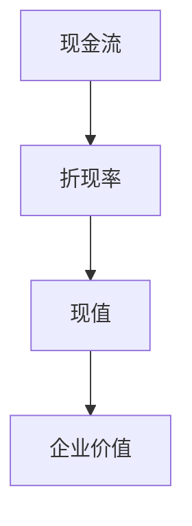
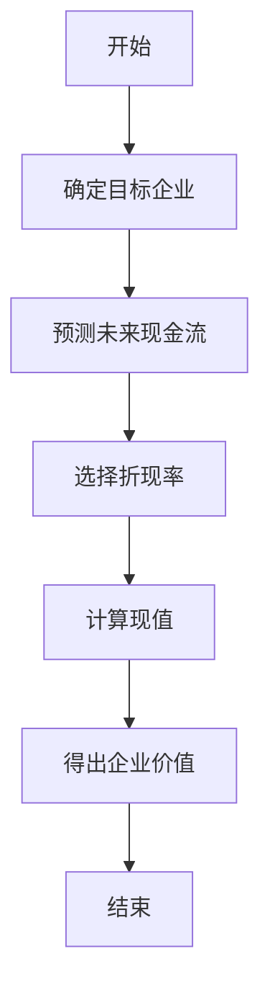
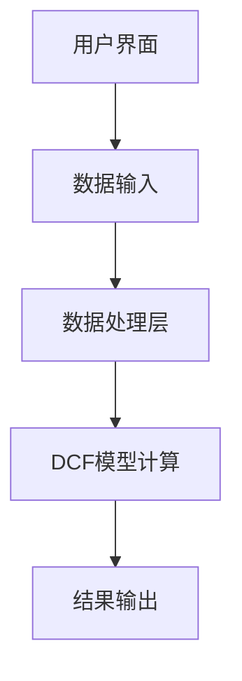
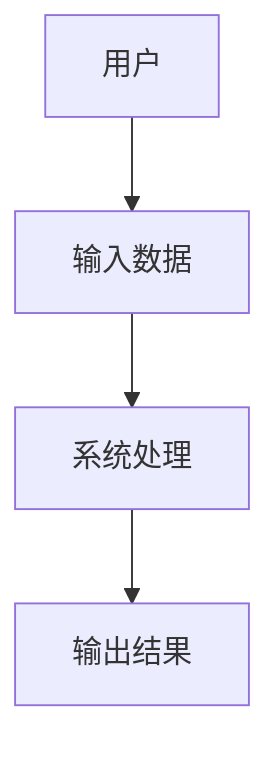

                 


# 现金流折现模型：企业内在价值的科学估算方法

## 关键词：现金流折现模型, 企业估值, 折现率, 现金流预测, 股权价值

## 摘要：现金流折现模型（DCF模型）是评估企业内在价值的重要工具，通过将未来现金流折现到现值来确定企业价值。本文详细介绍了DCF模型的原理、步骤、数学公式和实际应用，帮助读者掌握科学的企业估值方法。

---

## 第一部分：现金流折现模型的背景与基础

### 第1章：现金流折现模型的起源与发展

#### 1.1 金融学中的时间价值理论
- 资金的时间价值是金融学的核心原理，强调当前资金的价值高于未来相同金额的资金。
- 时间价值的计算基础是复利，即资金在持有期间的利息再投资产生的收益。

#### 1.2 折现模型的历史演变
- 起源于19世纪末的美国铁路评估，早期用于铁路和矿业的资产估值。
- 20世纪初，折现模型逐渐应用于企业整体估值，发展出多种变体，如股利折现模型（DDM）和自由现金流模型。

#### 1.3 现金流折现模型的提出
- 由投资银行家 Walter J. Weston 在1934年提出，后经多位学者发展完善。
- 现代DCF模型广泛应用于企业并购、 IPO 估值和战略决策。

---

### 第2章：现金流折现模型的核心概念与联系

#### 2.1 现金流的定义与分类
- **定义**：企业在特定时期内产生的现金流入和流出，反映企业经营和财务状况。
- **分类**：
  - 经营活动现金流：日常运营产生的现金流。
  - 投资活动现金流：资本投资或出售资产产生的现金流。
  - 筹资活动现金流：债务融资或股权融资产生的现金流。

#### 2.2 折现率的内涵与外延
- **内涵**：折现率是将未来现金流调整到现值的贴现率，反映资金的时间价值和风险成本。
- **外延**：包括无风险利率、市场风险溢价和企业特有风险溢价。

#### 2.3 企业价值的现值概念
- 现值是未来现金流的贴现总和，代表企业今天的价值。
- 现值计算公式：
  $$
  PV = \sum_{t=1}^{n} \frac{CF_t}{(1 + r)^t}
  $$

#### 2.4 模型的ER实体关系图


---

## 第二部分：现金流折现模型的算法原理

### 第3章：现金流折现模型的算法流程

#### 3.1 算法流程图


#### 3.2 现金流预测的步骤
1. **历史数据分析**：分析企业的历史现金流，识别趋势和周期性。
2. **假设设定**：基于行业和企业特点，设定增长率和永续增长率。
3. **预测现金流**：根据假设，预测未来各年的现金流。

#### 3.3 折现率的确定方法
1. **CAPM模型**：
   $$
   r = r_f + \beta \times (r_m - r_f)
   $$
   其中，\( r_f \) 是无风险利率，\( \beta \) 是贝塔系数，\( r_m \) 是市场预期回报率。

2. **WACC模型**：计算加权平均资本成本作为折现率。

#### 3.4 计算现值
- 将预测的现金流按选定的折现率折现，计算各年的现值，然后求和。

---

### 第4章：现金流折现模型的数学公式

#### 4.1 核心公式
$$
DCF = \sum_{t=1}^{n} \frac{CF_t}{(1 + r)^t}
$$

- \( DCF \)：现金流折现值（企业价值）。
- \( CF_t \)：第t年的现金流。
- \( r \)：折现率。
- \( n \)：预测的年数。

#### 4.2 永续增长模型
$$
\text{终值} = \frac{CF_n}{r - g}
$$
其中，\( g \) 是永续增长阶段的年增长率。

#### 4.3 两阶段模型
1. 初始阶段（高增长）：计算前n年的现值。
2. 稳定阶段（永续增长）：计算终值的现值。

---

## 第三部分：现金流折现模型的系统分析与架构设计

### 第5章：系统分析与架构设计

#### 5.1 问题场景介绍
- 需要评估目标企业的内在价值，辅助投资决策。

#### 5.2 系统功能设计
- 数据输入：企业财务数据、市场数据。
- 模型计算：现金流预测、折现率计算、现值计算。
- 结果输出：企业价值报告。

#### 5.3 系统架构设计


#### 5.4 接口设计
- 数据输入接口：CSV或Excel格式。
- 输出接口：PDF或Excel报告。

#### 5.5 交互设计


---

## 第四部分：现金流折现模型的项目实战

### 第6章：项目实战

#### 6.1 环境安装
- 安装Python、Pandas、NumPy等工具。

#### 6.2 核心实现代码
```python
def calculate_dcf(cash_flows, discount_rate):
    present_value = 0
    for t, cf in enumerate(cash_flows, 1):
        present_value += cf / (1 + discount_rate) ** t
    return present_value

# 示例数据
cash_flows = [100, 110, 121]
discount_rate = 0.10

DCF_value = calculate_dcf(cash_flows, discount_rate)
print(f"DCF Value: {DCF_value}")
```

#### 6.3 案例分析
- 以某企业为例，预测未来现金流，选择折现率，计算DCF值，与市场价比较。

---

## 第五部分：现金流折现模型的最佳实践与小结

### 第7章：最佳实践与小结

#### 7.1 最佳实践
- 确保现金流预测的准确性和合理性。
- 选择合适的折现率，考虑市场风险和企业特有风险。
- 结合其他估值方法（如PE、PB）进行交叉验证。

#### 7.2 小结
现金流折现模型是一种科学的企业估值方法，但其结果依赖于假设和数据的准确性。正确应用DCF模型需要深入的行业分析和严谨的数学计算。

---

## 作者：AI天才研究院/AI Genius Institute & 禅与计算机程序设计艺术 /Zen And The Art of Computer Programming

---

希望这篇文章能帮助您全面理解现金流折现模型，并能够在实际中灵活运用这一强大的工具。

