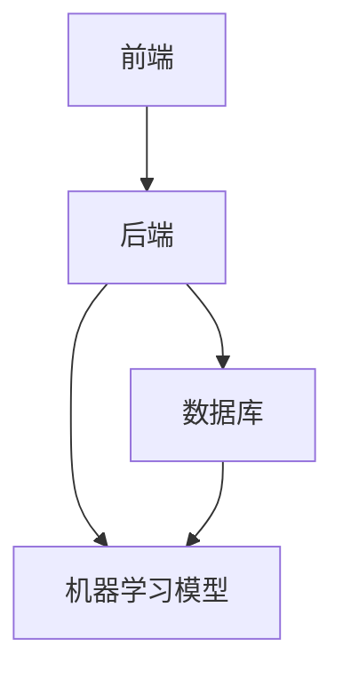
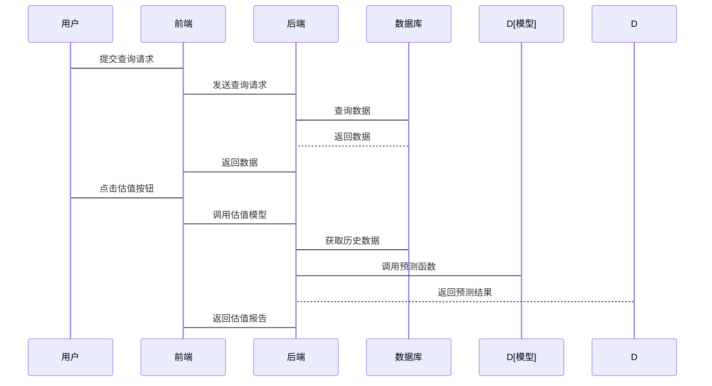

                 


# 瑞典股市估值:北欧经济强国的市场表现

## 关键词：瑞典股市、股市估值、经济分析、投资策略、市场表现、金融模型

## 摘要：  
本文深入探讨瑞典股市的估值方法和市场表现，结合北欧经济的特点，分析影响瑞典股市的主要因素，并提供实用的估值指标和策略。通过数学模型和实际案例，帮助投资者更好地理解瑞典股市的投资机会与风险。

---

# 第一部分：瑞典股市估值的背景与基础

## 第1章：瑞典经济与股市概述

### 1.1 瑞典经济的基本特点

#### 1.1.1 瑞典的经济结构与优势  
瑞典是全球领先的高福利国家，经济以制造业和高科技产业为主。其经济结构高度发达，政府在经济中扮演重要角色，注重可持续发展和环保产业。瑞典的经济优势体现在以下几个方面：  
1. **制造业**：汽车、机械制造、电子设备等。  
2. **高科技产业**：通信技术（如爱立信）、医药健康等。  
3. **可持续发展**：环保技术、可再生能源等领域领先。  

#### 1.1.2 瑞典的货币政策与利率政策  
瑞典央行（Riksbank）实行稳健的货币政策，注重通货膨胀目标制。近年来，瑞典央行采取负利率政策以刺激经济增长，这在一定程度上影响了股市的流动性。  

#### 1.1.3 瑞典在国际经济中的地位  
瑞典是欧盟成员国之一，也是北约和OECD的重要成员。其经济与全球市场高度关联，尤其在能源、汽车和高科技领域表现突出。  

---

### 1.2 瑞典股市的发展历程

#### 1.2.1 瑞典股市的历史沿革  
瑞典股市（Nasdaq Stockholm）是北欧地区最重要的股票市场之一，历史可以追溯到19世纪。其发展经历了多次合并与扩张，现已成为 Nordic 大区的核心交易所之一。  

#### 1.2.2 瑞典股市的主要指数  
- **OMX Stockholm 30**：由30家最大上市公司组成，是衡量瑞典股市表现的主要指标。  
- ** OMX Stockholm Large Cap**：包含前15家大公司，反映大盘股的表现。  

#### 1.2.3 瑞典股市的国际化进程  
随着全球化的发展，瑞典股市吸引了越来越多的国际投资者。Nasdaq Stockholm 与其它北欧交易所的整合，进一步提升了其国际化程度。  

---

### 1.3 北欧市场的特点与瑞典股市的独特性

#### 1.3.1 北欧市场的整体特点  
北欧市场（包括瑞典、挪威、芬兰、丹麦）以高透明度、低波动性和高监管标准著称。这些市场通常被视为避险资产的所在地。  

#### 1.3.2 瑞典股市的独特优势  
- **高成长性**：环保技术和可再生能源领域的公司表现突出。  
- **稳定的经济环境**：低通胀、高社会福利和政治稳定性。  
- **国际化程度高**：许多瑞典公司是全球性企业，如爱立信、沃尔沃等。  

#### 1.3.3 瑞典股市与国际市场的联系  
瑞典股市不仅吸引本地投资者，还吸引了大量外国投资者。其与欧洲和全球市场的联动性较强，尤其是在能源和高科技领域。  

---

## 第2章：瑞典股市估值的核心概念与方法

### 2.1 股市估值的基本原理

#### 2.1.1 股市估值的定义与意义  
股市估值是指通过对公司的财务数据和市场因素进行分析，确定其股票的合理价格范围。其意义在于帮助投资者做出明智的投资决策，避免盲目跟风。  

#### 2.1.2 股市估值的核心要素  
- **内在价值**：公司未来现金流的现值，通常通过DCF模型计算。  
- **市场价值**：股票在市场上的实际交易价格。  
- **风险与收益**：评估股票的风险水平和预期收益。  

#### 2.1.3 股市估值的主要方法  
1. **基本面分析**：通过公司财务数据（如收入、利润、现金流）评估其内在价值。  
2. **技术分析**：通过分析股票价格的历史走势预测未来价格。  
3. **比率分析**：使用市盈率、市净率等指标评估股票的相对价值。  

---

### 2.2 瑞典股市估值的核心指标

#### 2.2.1 股市估值的关键指标

| 指标名称 | 定义 | 计算公式 | 适用场景 |
|----------|------|-----------|----------|
| 市盈率（P/E） | 股票价格与每股收益的比值 | $$P/E = \frac{P}{E}$$ | 评估股票的估值是否合理 |
| 市净率（P/B） | 股票价格与每股净资产的比值 | $$P/B = \frac{P}{B}$$ | 适用于评估低增长行业的估值 |
| 股息率 | 每股股息与股价的比值 | $$Dividend Yield = \frac{D}{P}$$ | 评估股票的收益能力 |

#### 2.2.2 瑞典股市估值指标的特殊性  
- 瑞典股市中，环保技术和可再生能源公司的估值可能受到政策和市场需求的特殊影响。  
- 由于瑞典经济的稳定性，市盈率和市净率的波动相对较小。  

---

## 第3章：股市估值的算法原理与数学模型

### 3.1 常用估值模型的数学解析

#### 3.1.1 市盈率模型  
市盈率模型是最常用的估值方法之一，其公式为：  
$$ P/E = \frac{P}{E} $$  
其中，P为股票价格，E为每股收益。  

#### 3.1.2 市净率模型  
市净率模型适用于评估资产-heavy的公司，其公式为：  
$$ P/B = \frac{P}{B} $$  
其中，B为每股净资产。  

#### 3.1.3 股息贴现模型（DDM）  
股息贴现模型用于评估以股息为主要收益的股票，其公式为：  
$$ V = \sum_{t=1}^{\infty} \frac{D_t}{(1+r)^t} $$  
其中，$D_t$为第t年的股息，r为贴现率。  

---

## 第4章：系统分析与架构设计

### 4.1 问题场景介绍  
为了实现对瑞典股市的系统化分析，我们构建一个基于大数据的股票估值系统，利用机器学习算法对股票价格进行预测和估值。  

#### 4.2 系统功能设计  
- **数据采集**：从Nasdaq Stockholm获取实时股票数据。  
- **数据处理**：清洗和预处理数据，提取关键指标。  
- **模型训练**：使用机器学习算法（如随机森林、神经网络）进行预测。  
- **估值分析**：基于模型输出生成股票估值报告。  

#### 4.3 系统架构设计  



#### 4.4 系统接口设计  
- **数据接口**：提供API用于获取实时数据。  
- **模型接口**：提供API用于调用机器学习模型进行预测。  

#### 4.5 系统交互设计  



---

## 第5章：项目实战

### 5.1 环境安装  
- **编程语言**：Python 3.8+  
- **库依赖**：Pandas、NumPy、Scikit-learn、Plotly  

### 5.2 核心实现代码  

```python
import pandas as pd
import numpy as np
from sklearn.ensemble import RandomForestRegressor
import matplotlib.pyplot as plt

# 数据加载
df = pd.read_csv('swedish_stocks.csv')

# 数据预处理
X = df[['PE', 'PB', 'Dividend_Yield']]
y = df['Price']

# 模型训练
model = RandomForestRegressor(n_estimators=100)
model.fit(X, y)

# 预测与评估
predicted_price = model.predict(X)
print(f"预测股票价格: {predicted_price[-1]:.2f}")
```

### 5.3 代码解读与分析  
- **数据加载**：从CSV文件加载瑞典股市数据。  
- **数据预处理**：提取市盈率、市净率和股息率作为特征变量。  
- **模型训练**：使用随机森林回归模型进行训练。  
- **预测与评估**：利用模型预测股票价格，并输出结果。  

---

## 第6章：最佳实践与小结

### 6.1 投资建议  
- **长期投资**：关注具有高成长性的环保和科技公司。  
- **分散投资**：避免过度集中于某一只股票或行业。  
- **定期复盘**：根据市场变化调整投资组合。  

### 6.2 风险提示  
- **市场波动**：全球经济波动可能影响瑞典股市的表现。  
- **政策风险**：环保政策的变化可能对相关公司估值产生重大影响。  

### 6.3 未来趋势  
随着全球对可持续发展的关注增加，环保技术和可再生能源领域的公司可能在瑞典股市中表现优异。  

---

## 作者：AI天才研究院 & 禅与计算机程序设计艺术

---

以上是《瑞典股市估值:北欧经济强国的市场表现》的完整目录和内容框架。希望这篇文章能为投资者提供有价值的信息和指导。

