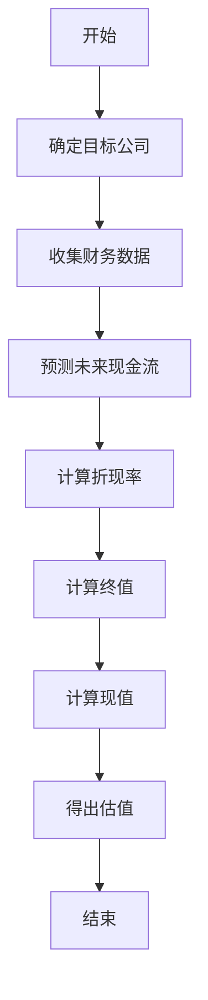
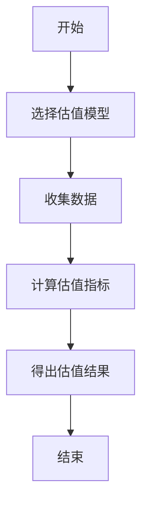
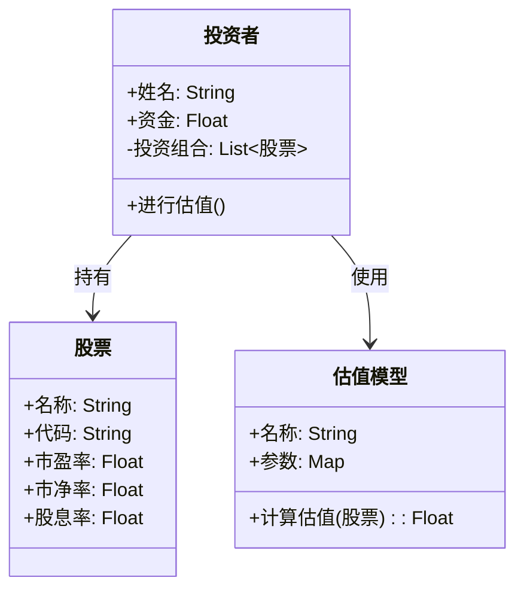
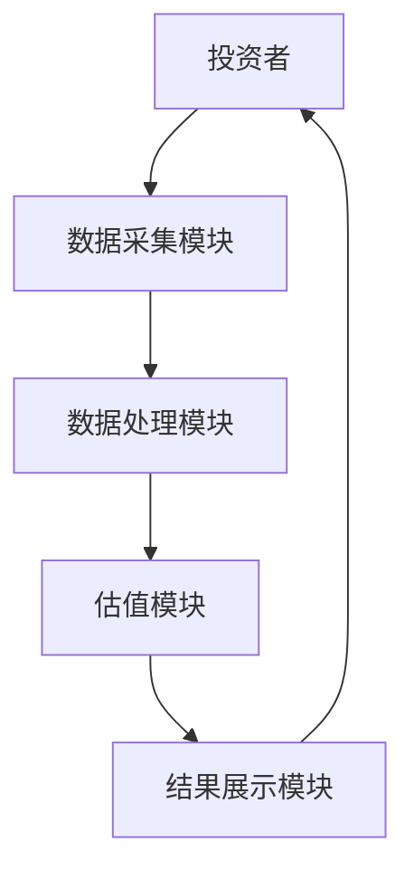

                 


# 瑞士股市估值:避险天堂的市场特点

> 关键词：瑞士股市、股市估值、避险天堂、市场特点、金融分析

> 摘要：本文深入分析瑞士股市的估值方法及其作为避险天堂的市场特点。通过探讨瑞士股市的历史发展、市场结构、估值模型和实际案例，揭示其在国际金融市场中的独特地位和投资价值。

---

# 第一部分: 瑞士股市估值的背景与概述

## 第1章: 瑞士股市的概述与特点

### 1.1 瑞士股市的概述

#### 1.1.1 瑞士股市的定义与历史发展

瑞士股市，全称瑞士股票交易所（SIX Swiss Exchange），是全球最重要的股票交易市场之一，总部位于苏黎世。它成立于1816年，是世界上历史最悠久的证券交易所之一。瑞士股市以其稳定性和安全性著称，吸引了全球投资者。

#### 1.1.2 瑞士股市的市场结构与参与者

瑞士股市的市场结构分为场内交易和场外交易。场内交易主要集中在SIX瑞士交易所，参与者包括机构投资者、个人投资者、银行、保险公司和外国投资者。瑞士股市的交易品种涵盖普通股票、衍生品、债券和基金等。

#### 1.1.3 瑞士股市的国际化特点

瑞士股市不仅是瑞士本地企业的上市地，还吸引了大量国际企业。许多跨国公司选择在瑞士上市，以利用其稳定的市场环境和严格的监管体系。此外，瑞士股市与全球主要市场保持紧密联系，投资者可以通过瑞士股市进行跨国配置。

---

### 1.2 瑞士作为避险天堂的市场特点

#### 1.2.1 瑞士政治与经济的稳定性

瑞士的政治体制是联邦制，各州享有高度自治权，政治环境稳定，无债务问题。瑞士法郎是全球主要避险货币之一，其货币政策稳健，央行保持低通胀目标，为市场提供了稳定的经济环境。

#### 1.2.2 瑞士金融监管的严格性

瑞士金融监管机构（FINMA）以其严格监管著称，确保市场透明和合规。瑞士的反洗钱、反腐败法规严格，为投资者提供了安全的交易环境。此外，瑞士的银行保密法虽然有所改革，但仍保护投资者隐私。

#### 1.2.3 瑞士货币的避险功能

瑞士法郎在经济不确定性时通常走强，成为投资者的避险选择。例如，在全球金融危机期间，瑞士法郎需求激增，成为全球避险资产的代表。

---

### 1.3 瑞士股市与全球市场的对比

#### 1.3.1 瑞士股市在全球市场中的地位

作为全球重要的市场之一，瑞士股市在欧洲市场中占据重要地位，许多跨国公司选择在此上市。与其他市场相比，瑞士股市波动性较低，适合长期投资。

#### 1.3.2 瑞士股市与其他主要市场的差异

相比美国、欧洲和亚洲市场，瑞士股市规模较小，但稳定性更高。瑞士股市的投资者结构以机构投资者为主，个人投资者较少。

#### 1.3.3 瑞士股市的国际化趋势

随着全球化的发展，瑞士股市吸引了更多国际投资者。许多跨国公司选择在瑞士上市，以利用其避险功能和稳定的市场环境。

---

## 第2章: 瑞士股市估值的核心概念与背景

### 2.1 股市估值的基本原理

#### 2.1.1 股票估值的定义与目的

股票估值是通过分析企业的财务状况、行业地位和未来前景，确定其股票的合理价格。其目的是帮助投资者做出明智的投资决策，识别低估或高估的股票。

#### 2.1.2 股票估值的主要方法

常用的股票估值方法包括：

- **相对估值法**：通过比较市盈率、市净率等指标，与同行业公司进行比较。
- **绝对估值法**：通过现金流折现模型（DCF）等方法，计算公司的真实价值。

#### 2.1.3 股票估值的关键指标

关键指标包括市盈率（P/E）、市净率（P/B）、股息率、ROE等。这些指标帮助投资者评估股票的估值水平。

---

### 2.2 瑞士股市估值的特殊性

#### 2.2.1 瑞士股市的低波动性

由于瑞士市场稳定，波动性较低，股票价格通常较为平稳。这使得瑞士股市成为避险资金的流入地。

#### 2.2.2 瑞士股市的避险特性

在市场动荡时，投资者倾向于持有瑞士资产，尤其是瑞士法郎和瑞士股市资产。这进一步推动了瑞士股市的避险特性。

#### 2.2.3 瑞士股市的政策影响

瑞士政府的政策稳定，监管严格，为市场提供了良好的投资环境。此外，瑞士央行的货币政策也为市场提供了支撑。

---

### 2.3 瑞士股市估值的背景与问题

#### 2.3.1 当前全球经济环境对瑞士股市的影响

全球经济不确定性增加，如地缘政治风险和新冠疫情，使得瑞士股市成为避险资金的首选。然而，这也带来了市场的流动性挑战。

#### 2.3.2 瑞士股市面临的挑战与机遇

挑战包括市场竞争加剧和监管压力。机遇则在于全球经济复苏和瑞士企业的创新能力。

#### 2.3.3 瑞士股市估值的未来趋势

随着全球市场的复苏和瑞士经济的稳定增长，瑞士股市的估值有望保持稳定。投资者应关注行业趋势和企业基本面。

---

## 第3章: 瑞士股市估值的核心概念与联系

### 3.1 核心概念的原理与属性

#### 3.1.1 股票估值的核心模型

常用的核心模型包括市盈率、市净率和现金流折现模型。这些模型帮助投资者评估股票的内在价值。

#### 3.1.2 瑞士股市估值的独特性

瑞士股市的稳定性使其在估值时需要考虑其避险特性，同时也要关注企业的基本面。

#### 3.1.3 估值模型的适用性分析

不同模型适用于不同的市场环境。在瑞士股市，相对估值法和DCF模型结合使用效果较好。

---

### 3.2 概念属性特征对比表格

| 指标         | 瑞士股市特点       | 全球市场特点       |
|--------------|--------------------|-------------------|
| 市盈率       | 低于全球平均水平   | 取决于行业和市场   |
| 市净率       | 高稳定性           | 波动性较大         |
| 股息率       | 较高               | 取决于市场环境     |
| ROE          | 稳定               | 波动较大           |

---

### 3.3 ER实体关系图架构

```mermaid
erd
    左边的框：投资者
    中间的框：瑞士股市
    右边的框：上市公司

    左边的框 --> 中间的框：参与交易
    中间的框 --> 右边的框：提供流动性
    左边的框 --> 右边的框：投资企业
```

---

## 第4章: 瑞士股市估值的算法原理

### 4.1 常用的估值模型与方法

#### 4.1.1 市盈率（P/E）模型

市盈率 = 股价 / 每股收益

#### 4.1.2 市净率（P/B）模型

市净率 = 股价 / 每股净资产

#### 4.1.3 现金流折现模型（DCF）

DCF模型通过将未来现金流折现，计算公司的内在价值。其公式为：

$$ V = \sum_{t=1}^{n} \frac{CF_t}{(1+r)^t} + \frac{TV}{(1+r)^n} $$

---

### 4.2 算法原理的数学模型与公式

#### 现金流折现模型（DCF）流程图



---

### 4.3 算法流程图（使用 mermaid）

#### 算法流程图



---

## 第5章: 系统分析与架构设计方案

### 5.1 问题场景介绍

在实际投资中，投资者需要准确评估瑞士股市的股票价值，尤其是在市场波动加剧的情况下。

### 5.2 系统功能设计

设计一个瑞士股市估值系统，包括数据收集、模型选择和结果分析功能。

#### 领域模型（mermaid 类图）



---

### 5.3 系统架构设计

#### 系统架构图



---

## 第6章: 项目实战

### 6.1 环境安装

需要安装Python和相关库，如Pandas、NumPy和Matplotlib。

### 6.2 核心实现源代码

以下是一个简单的DCF模型代码：

```python
import pandas as pd
import numpy as np

def dcf_model(free_cash_flow, discount_rate, terminal_value):
    present_value = 0
    for t in range(1, 5):
        if t == 1:
            cf = free_cash_flow
        else:
            cf = free_cash_flow * (1 + 0.05)
        present_value += cf / (1 + discount_rate) ** t
    present_value += terminal_value / (1 + discount_rate) ** 5
    return present_value

# 示例数据
free_cash_flow = 1000000
discount_rate = 0.08
terminal_value = 20000000

valuation = dcf_model(free_cash_flow, discount_rate, terminal_value)
print(f"DCF估值为: {valuation:.2f}")
```

---

### 6.3 实际案例分析

以瑞士企业雀巢为例，计算其DCF估值：

1. 收集财务数据：自由现金流、折现率和终值。
2. 运行DCF模型。
3. 分析结果并比较市场价。

---

## 第7章: 最佳实践

### 7.1 小结

瑞士股市以其稳定性、避险功能和严格的监管体系著称，是投资者的理想选择。

### 7.2 注意事项

在进行估值时，需考虑市场波动、企业基本面和宏观经济因素。

### 7.3 拓展阅读

推荐阅读《投资学》和《金融分析基础》。

---

# 小结

本文系统地分析了瑞士股市的估值方法和市场特点，揭示了其作为避险天堂的独特优势。通过理论分析和实际案例，为投资者提供了科学的估值思路和实践指导。

---

作者：AI天才研究院/AI Genius Institute & 禅与计算机程序设计艺术 /Zen And The Art of Computer Programming

