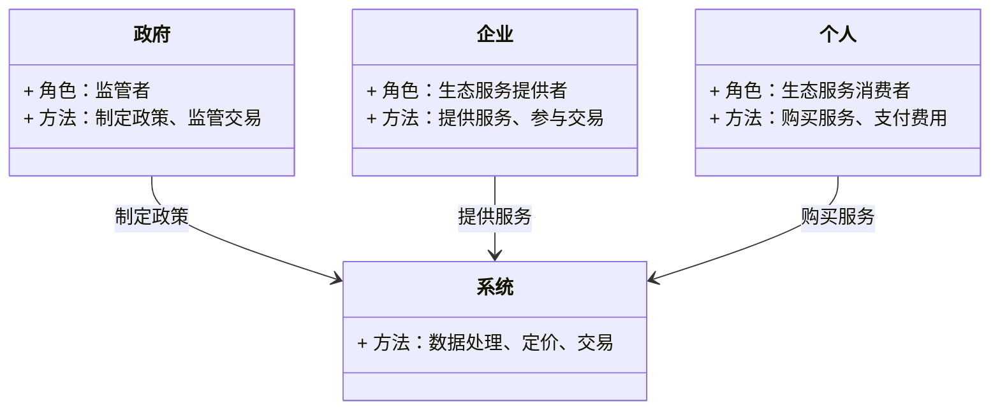
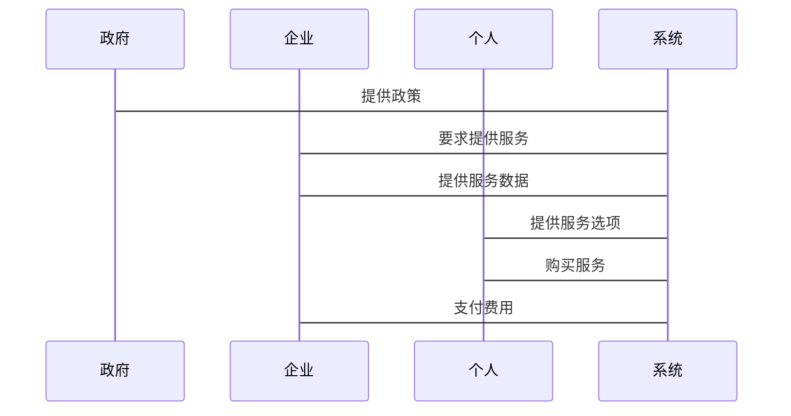

                 


# 生态系统服务付费机制的投资模式探讨

## 关键词：生态系统服务、投资模式、环境经济、数学模型、系统架构、项目实战

## 摘要：  
生态系统服务付费机制是一种通过经济手段激励生态保护和资源可持续利用的模式，其核心在于将生态系统的间接价值转化为可量化的经济价值。本文从生态系统服务的定义、价值评估、付费机制的实施框架入手，构建数学模型，分析其经济效益与投资回报，结合实际案例，探讨生态系统服务付费机制的投资模式。文章旨在为政策制定者、投资者和相关从业者提供理论支持与实践指导。

---

## 第一部分：生态系统服务付费机制的背景与核心概念

### 第1章：生态系统服务付费机制的背景与问题描述

#### 1.1 生态系统服务的定义与价值  
生态系统服务是指自然生态系统提供的对人类有用的 goods 和 services，包括 provisioning（ provisioning services）、regulating（调节服务）、cultural（文化服务）和 supporting（支持服务）四大类。生态系统服务的价值不仅体现在其直接的经济用途（如农产品的生产），还体现在其间接的生态功能（如水土保持、气候调节）和文化价值（如休闲娱乐）。  

##### 1.1.1 生态系统服务的定义  
生态系统服务是指自然生态系统为人类提供的 goods 和 services，包括 provisioning（ provisioning services）、regulating、cultural 和 supporting 四大类。  

##### 1.1.2 生态系统服务的分类与特征  
1. **Provisioning Services**：直接为人类提供食物、水资源、纤维等。  
2. **Regulating Services**：调节气候、水循环、疾病控制等。  
3. **Cultural Services**：提供精神满足，如旅游、文化传承等。  
4. **Supporting Services**：支持其他生态系统服务的提供，如土壤形成、养分循环等。  

##### 1.1.3 生态系统服务的经济价值与社会价值对比  
- **经济价值**：直接可量化的商品价值（如农产品）。  
- **社会价值**：间接的社会效益（如生态系统的稳定性）。  

#### 1.2 生态系统服务付费机制的提出背景  
随着环境资源的过度开发和环境污染问题的加剧，传统的环境经济政策（如税收、补贴）已难以满足生态保护的需求。生态系统服务付费机制作为一种市场化的手段，通过将生态系统的价值转化为经济激励，能够更有效地促进生态保护和资源的可持续利用。  

##### 1.2.1 环境资源的稀缺性与付费机制的必要性  
环境资源的稀缺性导致其经济价值上升，但其分配和利用效率低下。付费机制通过市场化手段优化资源配置。  

##### 1.2.2 现有环境经济政策的局限性  
- 传统政策（如税收）难以精准量化生态服务的价值。  
- 政府补贴可能引发“搭便车”问题。  

##### 1.2.3 全球与区域生态系统服务付费机制的现状  
- 全球范围内，部分国家和地区已开始实施生态系统服务付费机制（如碳汇交易、水权交易）。  

#### 1.3 问题背景与问题描述  
生态系统服务付费机制的核心问题是如何通过经济手段实现生态保护的可持续性，同时兼顾经济效益。  

##### 1.3.1 生态系统服务付费机制的核心问题  
- 如何量化生态系统服务的价值？  
- 如何设计合理的付费机制以激励生态保护？  

##### 1.3.2 付费机制与投资模式的关联性  
- 付费机制为投资者提供了经济回报，吸引社会资本进入生态保护领域。  

##### 1.3.3 本研究的目标与意义  
本文旨在构建生态系统服务付费机制的数学模型，分析其经济效益与投资回报，为政策制定者和投资者提供参考。  

#### 1.4 本章小结  
本章介绍了生态系统服务的定义、分类及其价值，并分析了生态系统服务付费机制的背景与必要性。通过对比传统环境经济政策，提出了本文的研究目标与意义。

---

## 第二部分：生态系统服务付费机制的核心概念与理论框架

### 第2章：生态系统服务付费机制的核心概念  

#### 2.1 生态系统服务付费机制的定义与属性  
生态系统服务付费机制是一种通过市场化的经济手段，将生态系统的间接价值转化为可量化的经济激励的机制。  

##### 2.1.1 定义与内涵  
生态系统服务付费机制通过政府、企业和个人之间的合同或市场交易，实现生态系统的保护与可持续利用。  

##### 2.1.2 核心属性与特征对比  
| 特性         | 传统环境经济政策 | 生态系统服务付费机制 |
|--------------|-----------------|-----------------------|
| 实施主体     | 政府为主         | 多主体参与（政府、企业、个人） |
| 实施手段     | 税收、补贴       | 市场化交易（如碳汇、水权） |
| 目标         | 环境保护         | 经济效益与生态保护结合 |

#### 2.2 生态系统服务付费机制与传统环境经济政策的对比  
- 传统政策注重行政手段，而生态系统服务付费机制强调市场化的经济激励。  

##### 2.2.1 传统环境经济政策的分析  
- 优点：简单易行，覆盖面广。  
- 缺点：缺乏精准性，难以量化生态服务的价值。  

##### 2.2.2 生态系统服务付费机制的独特性  
- 通过市场化手段实现生态服务的经济价值。  

##### 2.2.3 两者在实施目标与手段上的异同  
- 目标：同为环境保护。  
- 手段：传统政策依赖行政手段，付费机制依赖市场交易。  

#### 2.3 生态系统服务付费机制的实施框架  
##### 2.3.1 实施主体与客体  
- 主体：政府、企业、个人。  
- 客体：生态系统服务的提供者与消费者。  

##### 2.3.2 付费机制的构成要素  
1. 交易主体：提供者与消费者。  
2. 交易价格：基于生态服务价值的定价。  
3. 交易方式：合同、市场交易。  

##### 2.3.3 实施过程与阶段划分  
1. 价值评估：量化生态服务的价值。  
2. 机制设计：确定交易主体与价格。  
3. 实施与监管：确保机制的有效运行。  

#### 2.4 本章小结  
本章详细阐述了生态系统服务付费机制的核心概念，分析了其与传统环境经济政策的异同，并提出了实施框架。

---

## 第三部分：生态系统服务付费机制的数学模型与算法原理  

### 第3章：生态系统服务付费机制的数学模型  

#### 3.1 模型假设与变量定义  
##### 3.1.1 模型假设  
- 生态系统的价值可以通过市场交易量化。  
- 交易双方的决策基于经济利益最大化。  

##### 3.1.2 核心变量与参数  
- 生态服务价值：$V$  
- 交易成本：$C$  
- 支付价格：$P$  

#### 3.2 模型构建  
##### 3.2.1 收益函数  
$$ R = \sum_{i=1}^{n} \beta_i x_i $$  
其中，$\beta_i$ 是第 $i$ 个生态服务的收益系数，$x_i$ 是其数量。  

##### 3.2.2 成本函数  
$$ C = \sum_{j=1}^{m} \gamma_j y_j $$  
其中，$\gamma_j$ 是第 $j$ 个生态服务的单位成本，$y_j$ 是其数量。  

##### 3.2.3 效益函数  
$$ B = R - C $$  

#### 3.3 模型求解与分析  
##### 3.3.1 最优化问题的数学表达  
$$ \max B = R - C $$  
约束条件：  
- $x_i \geq 0, y_j \geq 0$  

##### 3.3.2 算法实现  
```python
def optimize():
    import numpy as np
    from scipy.optimize import minimize

    # 定义目标函数
    def objective(x):
        return -(sum(beta * x) - sum(gamma * x))

    # 约束条件
    constraints = [{'type': 'ineq', 'fun': lambda x: x[i] >= 0 for i in range(len(x))}]

    # 初始猜测值
    x0 = np.zeros(len(beta))

    # 求解
    result = minimize(objective, x0, constraints=constraints)

    return result.x
```

#### 3.4 模型验证与案例分析  
##### 3.4.1 案例分析  
假设某地区森林的碳汇能力可以通过交易获得经济回报，其收益和成本函数如下：  
- 收益函数：$R = 50P$  
- 成本函数：$C = 30P$  

则效益函数为：  
$$ B = 50P - 30P = 20P $$  

通过优化算法求解，得到最优交易量为 $P^* = 100$ 吨。  

#### 3.5 本章小结  
本章构建了生态系统服务付费机制的数学模型，并通过案例分析验证了其有效性。

---

## 第四部分：生态系统服务付费机制的系统分析与架构设计  

### 第4章：生态系统服务付费机制的系统分析与架构设计  

#### 4.1 问题场景介绍  
- 政府、企业和个人在生态系统服务付费机制中的角色与互动。  

#### 4.2 系统功能设计  
##### 4.2.1 功能模块  
1. 数据采集与处理模块：收集生态服务的价值与交易数据。  
2. 定价与交易模块：根据模型计算价格，实现交易。  
3. 监管与反馈模块：监督交易过程，提供反馈。  

##### 4.2.2 领域模型（类图）  


#### 4.3 系统架构设计  
##### 4.3.1 系统架构图  


##### 4.3.2 系统接口设计  
- 政府接口：政策制定与监管。  
- 企业接口：服务提供与交易。  
- 个人接口：服务购买与支付。  

#### 4.4 系统交互设计  
##### 4.4.1 序列图  


#### 4.5 本章小结  
本章通过系统分析与架构设计，明确了各主体的交互关系与功能模块，为实际应用提供了指导。

---

## 第五部分：生态系统服务付费机制的项目实战与最佳实践  

### 第5章：生态系统服务付费机制的项目实战  

#### 5.1 项目背景与需求分析  
##### 5.1.1 案例选择：某地森林碳汇项目  
- 项目目标：通过碳汇交易实现生态保护与经济效益。  

##### 5.1.2 需求分析  
- 确定生态服务的价值与交易价格。  

#### 5.2 系统核心实现  
##### 5.2.1 核心代码实现  
```python
def calculate_value(carbon_sequestration, price):
    return carbon_sequestration * price

def calculate_cost(carbon_sequestration, cost_per_ton):
    return carbon_sequestration * cost_per_ton

def net_benefit(carbon_sequestration, price, cost_per_ton):
    return calculate_value(carbon_sequestration, price) - calculate_cost(carbon_sequestration, cost_per_ton)
```

##### 5.2.2 代码应用解读  
- 通过上述函数，计算碳汇的净效益。  

#### 5.3 实际案例分析与结果解读  
##### 5.3.1 实际案例分析  
假设碳汇交易价格为 $P = 50$ 元/吨，单位成本为 $C = 30$ 元/吨。  

##### 5.3.2 结果解读  
净效益为：  
$$ B = 50 \times 100 - 30 \times 100 = 2000 \text{元} $$  

#### 5.4 本章小结  
本章通过实际案例分析，展示了生态系统服务付费机制的实施过程与经济效益。

### 第6章：最佳实践、小结与展望  

#### 6.1 最佳实践 tips  
- 确保生态服务价值的准确量化。  
- 设计合理的交易机制，降低交易成本。  

#### 6.2 本章小结  
本文从理论到实践，系统探讨了生态系统服务付费机制的投资模式，为政策制定者和投资者提供了参考。  

#### 6.3 未来展望  
随着技术的进步，生态系统服务付费机制将更加精准化与智能化。

---

## 作者：AI天才研究院/AI Genius Institute & 禅与计算机程序设计艺术/Zen And The Art of Computer Programming

