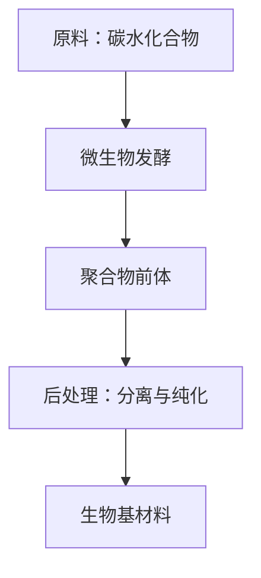
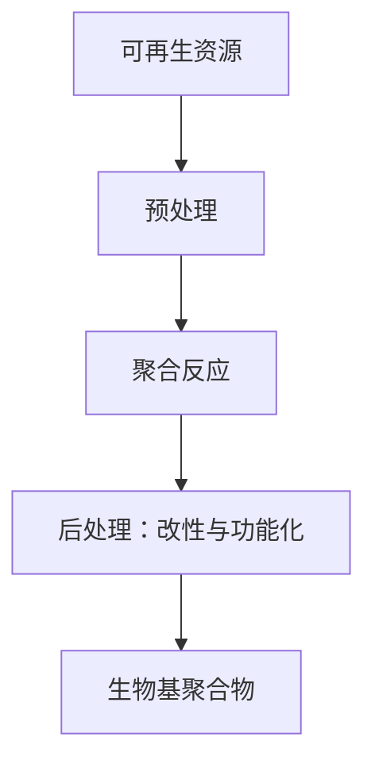

                 

# 生物基材料产业的发展趋势与投资策略

## 关键词
生物基材料，可持续发展，投资策略，技术创新，环保产业

## 摘要
生物基材料是以可再生资源为基础，替代传统石油基材料的一种环保材料。随着全球环保意识的增强和政策的支持，生物基材料市场需求持续增长。本文从技术、市场和投资角度，详细分析生物基材料产业的发展趋势和投资策略，探讨其在包装、纺织、汽车等领域的应用前景，并通过案例分析为投资者提供参考。

---

# 第一部分：生物基材料的定义与分类

## 第1章：生物基材料的定义与分类

### 1.1 生物基材料的定义与内涵

生物基材料是指以可再生生物质资源（如植物纤维、淀粉、木质素、脂肪等）为原料，通过生物、化学或物理方法制备的材料。与传统石油基材料相比，生物基材料具有可再生性、环境友好性和低碳排放的特点。

**生物基材料的核心属性对比表**

| 属性          | 石油基材料          | 生物基材料          |
|---------------|---------------------|---------------------|
| 原料来源      | 石油、天然气等不可再生资源 | 植物、微生物等可再生资源 |
| 环境影响      | 高碳排放，不可降解     | 低碳排放，可降解或可回收 |
| 可持续性      | 不可持续             | 可持续              |

### 1.2 生物基材料的分类与应用领域

生物基材料可以根据其原料和用途进行分类：

#### 1.2.1 分类
- **淀粉基材料**：如聚乳酸（PLA）、聚乙醇酸（PGA）等，广泛应用于包装、纺织等领域。
- **纤维基材料**：如再生纤维素纤维（粘胶纤维）、竹纤维等，用于纺织和家居用品。
- **脂肪基材料**：如聚酯纤维，用于纺织和汽车内饰。
- **微生物基材料**：如聚羟基脂肪酸酯（PHA），用于包装和一次性制品。

#### 1.2.2 应用领域
- **包装领域**：淀粉基可降解塑料、纤维基包装材料。
- **纺织领域**：生物基纤维用于服装、家纺。
- **汽车领域**：生物基塑料用于内饰和部件。
- **电子领域**：生物基材料用于可穿戴设备和柔性电路板。

---

# 第二部分：生物基材料的技术与市场分析

## 第2章：生物基材料的技术创新与工艺优化

### 2.1 生物基材料的制备技术

#### 2.1.1 微生物发酵技术

**微生物发酵制备生物基材料的流程图（Mermaid）**

微生物发酵是制备生物基材料的核心技术之一，通过基因工程技术优化微生物菌株，提高产物的产量和质量。

#### 2.1.2 生物基聚合物的合成工艺

**生物基聚合物合成工艺流程图（Mermaid）**

聚合反应是制备生物基聚合物的关键步骤，常用的聚合方式包括聚酯、聚酰胺等。

### 2.2 生物基材料的性能优化与成本控制

#### 2.2.1 材料性能的提升策略

- **改性技术**：通过添加纳米材料或共聚物，提高材料的机械强度和热稳定性。
- **功能化处理**：赋予材料防水、防菌等特殊性能。

#### 2.2.2 成本优化的关键技术与方法

- **原料优选**：选择廉价易得的生物质原料。
- **工艺改进**：减少能耗和废弃物产生，降低生产成本。

---

## 第3章：生物基材料的市场分析与投资逻辑

### 3.1 全球生物基材料市场的现状与预测

#### 3.1.1 市场规模与增长

根据市场研究机构的数据，全球生物基材料市场规模从2020年的约500亿美元增长到2023年的约700亿美元，年均增长率超过10%。

#### 3.1.2 区域市场分析

- **欧洲市场**：政策支持强烈，市场需求增长迅速。
- **北美市场**：技术创新能力强，企业投资活跃。
- **亚洲市场**：需求潜力大，尤其是中国和印度。

### 3.2 生物基材料产业的投资策略

#### 3.2.1 投资机会与风险分析

- **投资机会**：可降解塑料、生物基纤维等领域市场潜力大。
- **投资风险**：技术壁垒高、市场竞争激烈。

#### 3.2.2 可行性评估

- **技术可行性**：评估企业的技术水平和研发能力。
- **市场可行性**：分析目标市场的容量和竞争状况。

---

# 第三部分：生物基材料产业的实践与案例分析

## 第4章：生物基材料产业的关键技术与动态

### 4.1 生物基材料的技术创新与突破

#### 4.1.1 最新技术进展

- **新型生物基塑料**：如聚乳酸（PLA）和聚乙醇酸（PGA）的应用范围扩展。
- **微生物基材料**：聚羟基脂肪酸酯（PHA）在包装领域的应用。

#### 4.1.2 技术创新对产业的影响

技术创新降低了生产成本，提高了材料性能，推动了生物基材料的广泛应用。

### 4.2 产业整合与协同发展

#### 4.2.1 产业链整合

- **上游原材料供应**：建立稳定的生物质原料供应链。
- **下游应用开发**：与终端企业合作，推动产品市场化。

---

## 第5章：生物基材料产业的典型项目分析

### 5.1 国内外典型项目案例

#### 5.1.1 国内案例：聚乳酸（PLA）生产项目

**项目简介**：某公司投资5亿元建设年产10万吨PLA生产线，预计3年内达产。

**项目优势**：技术成熟，市场前景广阔。

**面临的挑战**：成本较高，市场竞争激烈。

#### 5.1.2 国外案例：生物基纤维的应用项目

**项目简介**：某企业投资于生物基纤维的研发和生产，应用于高端服装和家纺领域。

**项目特点**：技术领先，市场定位高端。

---

## 第6章：生物基材料产业的未来发展趋势与投资建议

### 6.1 未来发展趋势

#### 6.1.1 技术创新的持续推动

- 新材料的研发将继续推动产业进步。
- 微生物技术的应用将更加广泛。

#### 6.1.2 市场需求的持续增长

- 环保政策的加强将推动生物基材料的需求。
- 消费者环保意识的增强将扩大市场空间。

### 6.2 投资建议

#### 6.2.1 关注技术创新型企业

- 投资具备自主研发能力的企业，尤其是掌握核心专利技术的企业。

#### 6.2.2 布局下游应用市场

- 重点关注生物基材料在包装、纺织、汽车等领域的应用。

#### 6.2.3 优化投资组合

- 分散投资风险，选择具有稳定收益的项目。

---

# 结语

生物基材料产业正处于快速发展的阶段，技术创新和市场需求的双重驱动将推动其进一步成长。投资者需要结合技术、市场和政策等多方面因素，制定科学的投资策略，抓住产业发展的机遇。

---

# 作者

作者：AI天才研究院/AI Genius Institute & 禅与计算机程序设计艺术 /Zen And The Art of Computer Programming

---

**本文为AI天才研究院原创文章，转载请注明出处。**

