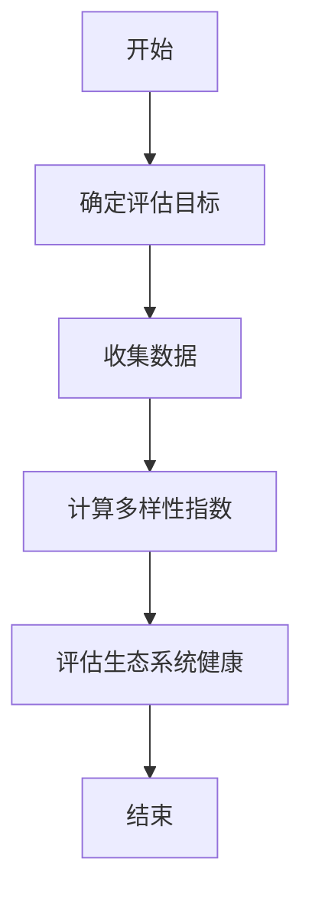
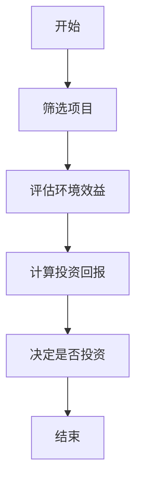
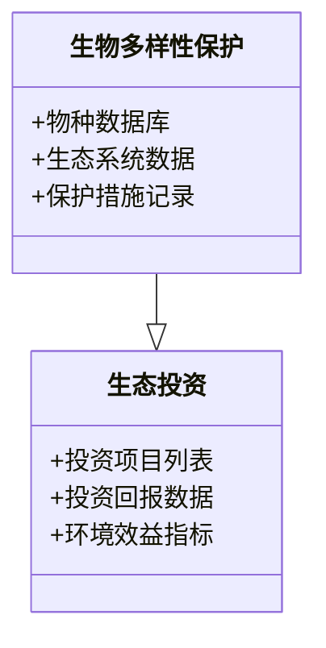
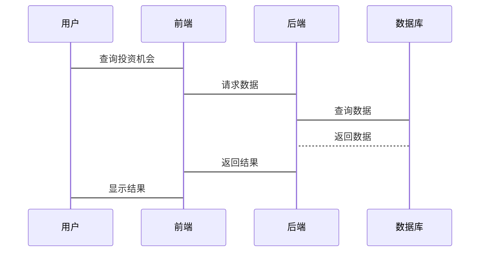

                 


# 生物多样性保护与生态投资机会

## 关键词：生物多样性保护, 生态投资, 可持续发展, 环境保护, 经济价值

## 摘要：生物多样性保护是维护地球生态平衡的重要举措，而生态投资则为这一保护提供了资金和技术支持。本文探讨了生物多样性保护的核心概念、面临的挑战，以及生态投资如何转化为机遇。通过详细分析数学模型与评估方法，结合系统架构设计和实际案例，展示了如何将生物多样性保护与投资机会相结合，实现环境保护与经济发展的双赢。

---

## 第一部分：生物多样性保护的背景与核心概念

### 第1章：生物多样性保护的背景与问题背景

#### 1.1 生物多样性的概念与内涵

##### 1.1.1 生物多样性的定义
生物多样性（Biodiversity）指的是地球上所有生物的多样性，包括基因多样性、物种多样性和生态系统多样性。它是生命的基础，维持着生态系统的功能和服务。

##### 1.1.2 生物多样性的三个层次
- **基因多样性**：不同物种的遗传差异，为自然选择提供了基础。
- **物种多样性**：地球上各种生物的丰富程度，是生态系统稳定性的关键。
- **生态系统多样性**：不同生态系统的类型和结构，如森林、湿地、沙漠等。

##### 1.1.3 生物多样性的重要性与价值
生物多样性对人类的生存和福祉至关重要。它不仅提供食物、药物和工业原料，还通过生态服务（如 pollination、水循环）维持着地球的健康。

#### 1.2 当前生物多样性面临的问题

##### 1.2.1 生物多样性的丧失现状
全球范围内，物种灭绝的速度远超自然灭绝率。据统计，每年约有5万至10万个物种消失，这比自然情况下快了1000倍。

##### 1.2.2 人类活动对生物多样性的影响
- **栖息地破坏**：城市化、农业扩张导致野生动物失去家园。
- **过度捕捞**：海洋生物的过度捕捞导致鱼类资源枯竭。
- **污染**：化学污染和塑料污染破坏了生态系统的平衡。
- **气候变化**：温度变化影响生物的分布和生存。

##### 1.2.3 生物多样性丧失的经济与生态代价
生物多样性的丧失不仅威胁生态系统服务，还导致经济损失。例如，蜜蜂的减少会影响农作物的授粉，进而影响农业产出和经济收入。

#### 1.3 生物多样性保护的必要性与目标

##### 1.3.1 保护生物多样性的核心目标
- 保护濒危物种和生态系统。
- 维持生态系统的功能和服务。
- 为人类的可持续发展提供基础。

##### 1.3.2 生物多样性保护的边界与外延
生物多样性保护不仅包括保护特定物种，还包括保护整个生态系统的结构和功能。其外延涉及政策制定、社区参与和国际合作。

##### 1.3.3 生物多样性保护与可持续发展的关系
生物多样性保护是可持续发展的重要组成部分。只有在保护自然环境的基础上，才能实现经济和社会的可持续发展。

---

### 第2章：生态投资机会的核心概念与联系

#### 2.1 生态投资的基本定义

##### 2.1.1 生态投资的定义
生态投资是指将资金投入到能够带来环境效益的项目中，这些项目通常旨在保护或恢复生态系统，减少环境破坏，或促进可持续发展。

##### 2.1.2 生态投资的分类与特点
- **类型**：包括生态农业、可再生能源、环保技术开发等。
- **特点**：高社会责任感、长期投资回报、环境效益显著。

##### 2.1.3 生态投资的驱动因素
- **政策支持**：政府出台的环保政策和补贴。
- **公众意识**：消费者对环保产品的偏好。
- **技术进步**：环保技术的创新降低了投资成本。

#### 2.2 生物多样性保护与生态投资的关系

##### 2.2.1 生物多样性保护如何创造投资机会
- **生态修复项目**：如植树造林、湿地恢复等项目需要大量投资。
- **可持续农业**：有机农业和生态农业的投资机会。
- **环保技术开发**：研发环保设备和可再生能源技术。

##### 2.2.2 生态投资对生物多样性保护的促进作用
- **资金支持**：为保护项目提供必要的资金。
- **技术支持**：引入先进的技术和管理方法。
- **社区参与**：通过投资促进当地社区的参与和受益。

##### 2.2.3 二者的协同效应与相互影响
生物多样性保护为生态投资提供了目标和方向，而生态投资则为保护工作提供了资源和动力。两者相互促进，共同推动可持续发展。

#### 2.3 核心概念对比分析

##### 2.3.1 生物多样性保护与生态投资的属性对比（表格）

| 属性                | 生物多样性保护                | 生态投资                   |
|---------------------|------------------------------|---------------------------|
| 目标                | 保护生物多样性               | 通过投资实现环境效益       |
| 驱动力              | 环境保护需求                 | 经济利益与社会责任         |
| 实施主体            | 政府、非营利组织、社区        | 投资者、企业               |
| 评估指标            | 物种数量、生态系统服务       | 投资回报率、环境影响指标   |

##### 2.3.2 生物多样性保护与生态投资的ER实体关系图（Mermaid）

```mermaid
erDiagram
    生物多样性保护 <--- 投资者
    生态系统项目 --> 保护措施
    保护措施 --> 投资机会
    投资者 --> 生态投资
    生态投资 --> 环境效益
```

---

### 第3章：生物多样性保护的数学模型与评估方法

#### 3.1 生物多样性指数的计算方法

##### 3.1.1 Shannon多样性指数
Shannon多样性指数用于衡量物种的多样性，公式如下：

$$ H = -\sum_{i=1}^{n} p_i \ln p_i $$

其中，$p_i$ 是第 $i$ 个物种在总样本中的比例，$n$ 是物种总数。

##### 3.1.2 基于生态系统的评估模型
一个简单的生态系统健康评估模型可以用以下步骤进行：

1. 确定关键物种。
2. 评估每个物种的健康状况。
3. 计算综合健康指数。

##### 3.1.3 评估流程图（Mermaid）



#### 3.2 生态投资项目的评估方法

##### 3.2.1 投资回报率计算
生态投资的回报率可以通过以下公式计算：

$$ ROI = \frac{\text{净收益}}{\text{投资成本}} \times 100\% $$

##### 3.2.2 环境影响评估
环境影响评估可以使用生命周期评估（LCA）方法，从原材料提取到产品报废的整个过程进行分析。

##### 3.2.3 投资项目筛选流程图（Mermaid）



---

## 第二部分：系统分析与架构设计

### 第4章：系统分析与架构设计

#### 4.1 问题场景介绍
假设我们需要开发一个生物多样性保护与生态投资的管理系统，目标是通过数字化手段优化保护措施和投资决策。

#### 4.2 系统功能设计

##### 4.2.1 领域模型（Mermaid类图）



#### 4.3 系统架构设计（Mermaid架构图）


#### 4.4 系统接口设计
- 前端接口：用于用户输入和查询。
- 后端接口：处理数据逻辑和API请求。
- 数据库接口：存储和检索数据。

#### 4.5 系统交互流程图（Mermaid序列图）



---

## 第三部分：项目实战

### 第5章：项目实战

#### 5.1 环境安装与配置
- 安装Python和必要的库（如pandas、numpy）。
- 配置数据库和API接口。

#### 5.2 核心实现源代码

##### 5.2.1 生物多样性指数计算代码

```python
import pandas as pd
import numpy as np

def shannon_diversity(index):
    index = index + 1e-15  # 避免零除法
    proportions = index / np.sum(index)
    H = -np.sum(proportions * np.log(proportions))
    return H

data = pd.read_csv('species_data.csv')
diversity_index = data['count'].values
print(shannon_diversity(diversity_index))
```

##### 5.2.2 投资回报率计算代码

```python
def calculate_roi(profits, costs):
    return (profits - costs) / costs * 100

profits = 1000000
costs = 800000
print(calculate_roi(profits, costs))
```

#### 5.3 实际案例分析
以某个地区的生态恢复项目为例，分析其投资回报和环境效益。

#### 5.4 项目小结
通过实际案例分析，展示了如何将生物多样性保护与生态投资相结合，实现双赢。

---

## 第四部分：总结与展望

### 第6章：总结与展望

#### 6.1 最佳实践 Tips
- 投资者应选择具有明确环境效益的项目。
- 政府和企业应加强合作，共同推动生物多样性保护。

#### 6.2 小结
生物多样性保护与生态投资的结合是实现可持续发展的关键。通过科学的评估方法和系统的架构设计，可以最大化投资的环境效益和社会价值。

#### 6.3 注意事项
- 投资者需充分评估项目风险。
- 政府需提供政策支持和资金补贴。

#### 6.4 拓展阅读
推荐阅读相关书籍和文献，深入理解生物多样性保护和生态投资的理论与实践。

---

## 作者：AI天才研究院/AI Genius Institute & 禅与计算机程序设计艺术 /Zen And The Art of Computer Programming

---

通过以上内容，我们可以看到，生物多样性保护与生态投资机会是一个复杂但极具潜力的领域。通过科学的方法和系统的架构设计，我们可以更好地保护生物多样性，同时实现经济的可持续发展。

