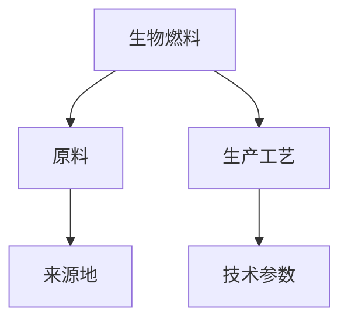
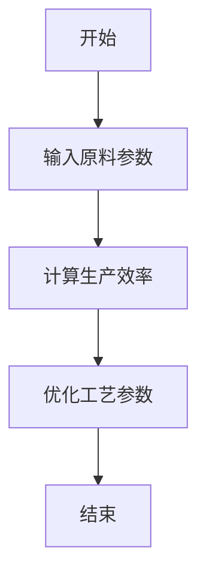
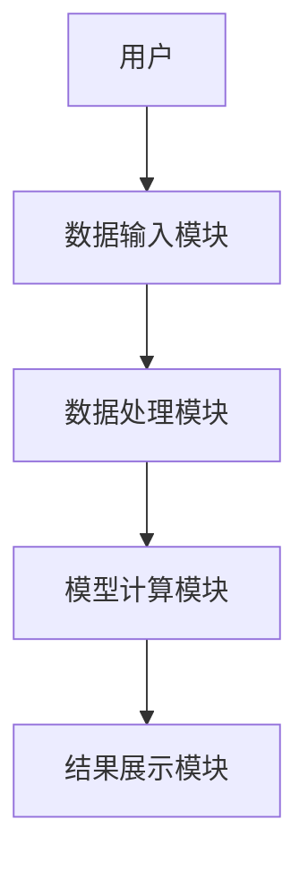

                 

# 生物燃料技术的发展与可再生能源投资

## 关键词：生物燃料，可再生能源，投资分析，技术发展，系统架构

## 摘要：本文探讨生物燃料技术的发展历程及其在可再生能源投资中的应用。通过分析技术原理、经济模型和实际案例，揭示生物燃料在实现可持续能源目标中的潜力和挑战。文章结合技术与经济的双重视角，为投资者提供科学决策依据。

---

# 第1章：生物燃料技术的背景与重要性

## 1.1 生物燃料的定义与分类

### 1.1.1 生物燃料的定义

生物燃料是指通过生物过程转化而来的可再生燃料，主要来源于植物、动物脂肪或微生物等有机物质。根据加工方式的不同，生物燃料可分为第一代、第二代和第三代燃料。

$$
\text{第一代生物燃料：直接来源于作物（如玉米、甘蔗）的糖分或油分。}
$$

$$
\text{第二代生物燃料：来源于非食用纤维素类生物质，如秸秆和林业残渣。}
$$

$$
\text{第三代生物燃料：来源于 algae 等微藻类，具有高产潜力。}
$$

### 1.1.2 生物燃料在能源结构中的地位

生物燃料作为可再生能源的重要组成部分，对减少化石燃料依赖、降低碳排放具有重要意义。全球范围内，生物燃料的使用已逐步替代部分传统能源，特别是在交通和工业领域。

### 1.1.3 生物燃料对可持续发展的意义

生物燃料的推广有助于减少温室气体排放，缓解能源危机，促进绿色经济的发展。通过技术创新和规模效应，生物燃料的成本逐渐降低，市场竞争力增强。

---

## 1.2 可再生能源投资的背景与现状

### 1.2.1 可再生能源投资的定义

可再生能源投资指将资金投入到太阳能、风能、生物质能等清洁能源项目中，以实现能源结构转型和可持续发展目标。

### 1.2.2 全球可再生能源投资的趋势

近年来，全球可再生能源投资持续增长，生物燃料领域成为投资热点。技术创新和政策支持推动了生物燃料项目的快速落地。

### 1.2.3 生物燃料技术与可再生能源投资的结合

生物燃料作为可再生能源的重要组成部分，其技术进步和成本下降为投资者带来了更多机会。投资于生物燃料项目，不仅有助于环境保护，还能带来经济效益。

---

## 1.3 本章小结

本章介绍了生物燃料的定义、分类及其在能源结构中的地位，分析了可再生能源投资的背景与现状，并探讨了两者结合的重要性。这些内容为后续章节的技术发展和投资分析奠定了基础。

---

# 第2章：生物燃料技术的核心概念与联系

## 2.1 生物燃料技术的核心原理

### 2.1.1 生物燃料的生产过程

生物燃料的生产通常包括原料收集、预处理、发酵或转化、精炼等步骤。以第一代乙醇为例，生产过程如下：

1. 原料收集：如玉米 stalks。
2. 预处理：粉碎原料以增加表面积。
3. 发酵：利用酶将纤维素转化为葡萄糖。
4. 蒸馏：将葡萄糖转化为乙醇。

### 2.1.2 生物燃料的技术特点

- **环保性**：减少碳排放。
- **可再生性**：原料可循环利用。
- **多样性**：适用于不同场景。

## 2.2 核心概念的属性特征对比

### 2.2.1 生物燃料与传统燃料的对比

| 属性       | 生物燃料                | 传统燃料            |
|------------|-------------------------|----------------------|
| 来源       | 可再生生物质           | 不可再生化石燃料     |
| 环境影响   | 低排放或零碳排放        | 高排放，尤其是 CO2   |
| 资源可用性 | 取决于农业和林业资源     | 有限，需开采         |

### 2.2.2 不同类型生物燃料的对比

| 类型       | 第一代                  | 第二代                | 第三代                |
|------------|-------------------------|-----------------------|-----------------------|
| 原料       | 食用油、糖类             | 纤维素类生物质        | 微藻                  |
| 生产成本   | 较低                    | 较高                  | 高                    |
| 产量       | 适中                    | 较高                  | 最高                  |

### 2.2.3 ER实体关系图

## 2.3 本章小结

本章分析了生物燃料的核心原理，对比了不同类型生物燃料的特点，并通过ER实体关系图展示了核心概念之间的联系，为后续分析奠定了基础。

---

# 第3章：生物燃料技术的算法原理讲解

## 3.1 生物燃料生产效率优化算法

### 3.1.1 算法目标

通过优化生产工艺参数，最大化生物燃料产量，降低生产成本。

### 3.1.2 算法流程图

### 3.1.3 数学模型

生产效率优化模型：

$$
\text{最大化 } P = \sum_{i=1}^{n} w_i x_i
$$

其中，\( w_i \) 是工艺参数的权重，\( x_i \) 是工艺参数的值。

约束条件：

$$
\sum_{i=1}^{n} x_i \leq C
$$

其中，\( C \) 是总成本限制。

---

## 3.2 生物燃料成本预测模型

### 3.2.1 模型目标

预测不同条件下生物燃料的生产成本。

### 3.2.2 模型实现

使用线性回归模型预测成本：

$$
\text{Cost} = \beta_0 + \beta_1 \times \text{原料价格} + \beta_2 \times \text{工艺效率} + \epsilon
$$

其中，\( \beta_0 \) 是截距，\( \beta_1 \) 和 \( \beta_2 \) 是回归系数，\( \epsilon \) 是误差项。

---

## 3.3 本章小结

本章通过算法优化生产效率和成本预测模型，展示了生物燃料技术在提高产量和降低成本方面的潜力，为投资决策提供了数据支持。

---

# 第4章：生物燃料技术与可再生能源投资的系统分析

## 4.1 系统功能设计

### 4.1.1 系统目标

构建一个生物燃料投资分析系统，帮助投资者评估项目可行性。

### 4.1.2 系统功能模块

- 数据输入模块：收集原料价格、技术参数等数据。
- 模型计算模块：预测生产成本和收益。
- 结果展示模块：生成投资报告。

---

## 4.2 系统架构设计

### 4.2.1 系统架构图

### 4.2.2 接口设计

- 数据输入接口：接收用户输入。
- 模型接口：调用预测模型。
- 展示接口：输出投资报告。

---

## 4.3 本章小结

本章通过系统设计和架构图展示了生物燃料投资分析的流程，为投资者提供了科学的决策工具。

---

# 第5章：生物燃料投资实战分析

## 5.1 项目背景

选择一个典型生物燃料项目，分析其投资回报率。

## 5.2 投资评估模型

使用净现值（NPV）模型评估项目可行性：

$$
\text{NPV} = \sum_{t=0}^{n} \frac{C_t}{(1 + r)^t}
$$

其中，\( C_t \) 是第 \( t \) 年的现金流，\( r \) 是折现率。

---

## 5.3 投资风险分析

### 5.3.1 风险因素

- 原料价格波动。
- 政策变化。

### 5.3.2 风险管理策略

- 多样化原料来源。
- 监测政策动向。

---

## 5.4 本章小结

本章通过实际案例分析，展示了生物燃料项目的投资潜力和风险管理策略，为投资者提供了参考。

---

# 第6章：总结与展望

## 6.1 总结

本文探讨了生物燃料技术的发展及其在可再生能源投资中的应用，分析了技术原理、经济模型和实际案例。

## 6.2 未来展望

未来，生物燃料技术将更加高效，投资环境将更加优化，推动全球能源结构转型。

---

# 作者：AI天才研究院/AI Genius Institute & 禅与计算机程序设计艺术 /Zen And The Art of Computer Programming

---

希望这篇博客文章能满足您的需求。如果需要进一步修改或补充，请随时告知！

