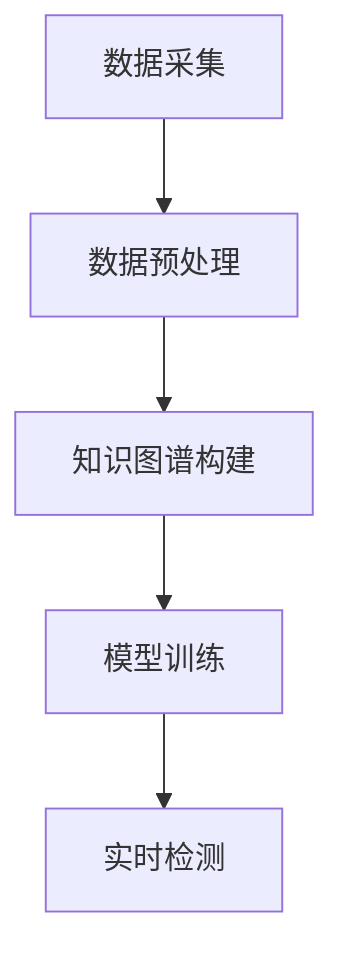
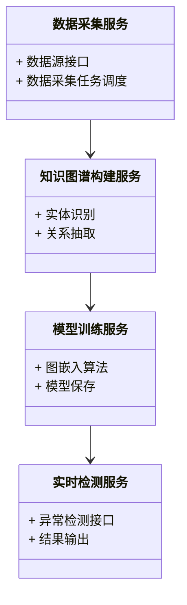

                 


# 知识图谱在金融欺诈检测中的应用

> 关键词：知识图谱，金融欺诈，图嵌入，异常检测，深度学习

> 摘要：本文深入探讨了知识图谱在金融欺诈检测中的应用，从知识图谱的构建到具体算法的实现，结合实际案例分析，展示了如何利用知识图谱技术提升金融欺诈检测的效率和准确性。文章详细介绍了图嵌入算法、异常检测方法以及系统架构设计，并提供了完整的Python实现代码和案例分析，为读者提供了一个全面的技术指南。

---

## 第一部分：知识图谱与金融欺诈检测的背景与基础

### 第1章：知识图谱与金融欺诈检测概述

#### 1.1 知识图谱的定义与特点

知识图谱是一种以图结构形式表示知识的数据库，其中节点代表实体，边代表实体之间的关系。其特点包括：

- **语义丰富**：通过实体间的关系，可以捕捉数据的深层语义。
- **可扩展性**：能够处理大规模、多样化数据。
- **动态更新**：支持实时更新，保持知识的时效性。

#### 1.2 金融欺诈检测的挑战与需求

金融欺诈检测面临以下挑战：

- **数据复杂性**：金融数据涉及多种实体（客户、交易、账户等）及其复杂关系。
- **欺诈手段多样化**：传统规则难以应对新型欺诈模式。
- **实时性要求**：需要快速检测和响应。

知识图谱的优势在于能够发现隐藏的关系和模式，这使其成为金融欺诈检测的理想工具。

---

### 第2章：知识图谱的核心概念与原理

#### 2.1 知识图谱的构建过程

知识图谱的构建包括数据采集、预处理、实体识别和关系抽取等步骤。例如，从金融交易数据中提取客户、交易金额、时间等信息，并建立它们之间的关系。

#### 2.2 知识图谱的表示与推理

知识图谱的表示通常采用RDF（资源描述框架）或其变体。推理机制通过逻辑规则或机器学习模型发现隐含关系，提升欺诈检测的准确性。

#### 2.3 知识图谱在金融欺诈检测中的应用

通过构建客户-交易-地点的知识图谱，可以识别异常交易模式，如短时间内多笔小额交易突然增加，可能表明洗钱行为。

---

## 第二部分：知识图谱在金融欺诈检测中的算法与系统设计

### 第3章：知识图谱在金融欺诈检测中的核心算法

#### 3.1 基于知识图谱的图嵌入算法

图嵌入算法将图结构转化为低维向量，便于后续分析。常用算法包括Node2Vec和GraphSAGE。

**Node2Vec算法流程：**

```python
import networkx as nx
from node2vec import Node2Vec

# 创建图
G = nx.Graph()
G.add_edges_from([("A", "B"), ("B", "C"), ("A", "C")])

# 训练模型
model = Node2Vec(G, walks_per_node=10, context=5)
model.fit()
```

#### 3.2 知识图谱中的异常检测算法

基于聚类的异常检测算法，如DBSCAN，适用于图结构中的异常检测。

**DBSCAN算法步骤：**

1. **数据预处理**：将图节点嵌入转换为数值向量。
2. **聚类**：使用DBSCAN算法发现密度较低的区域。
3. **异常识别**：将孤立点标记为异常。

#### 3.3 知识图谱中的关系推理算法

基于规则的推理适用于已知关系的检测，而基于学习的推理则通过神经网络发现隐含关系。

---

### 第4章：知识图谱的构建与管理

#### 4.1 知识图谱的存储与管理技术

使用图数据库（如Neo4j）存储知识图谱，支持高效的查询和更新。

**Neo4j存储示例：**

```python
from neo4j import GraphDatabase

# 连接数据库
driver = GraphDatabase.driver("neo4j://localhost:7687", auth=("user", "password"))

# 插入数据
def create_relationship(tx, entity1, entity2, relationship_type):
    tx.run("MATCH (a {name: $e1}), (b {name: $e2}) "
            "CREATE (a)-[r:$rt]->(b)",
            e1=entity1, e2=entity2, rt=relationship_type)

with driver.session() as session:
    session.write_transaction(create_relationship, "客户A", "交易B", "进行交易")
```

---

## 第三部分：系统架构与项目实战

### 第5章：系统架构设计

#### 5.1 系统功能设计

系统功能包括：

- 数据采集与预处理
- 知识图谱构建
- 模型训练与部署
- 实时欺诈检测

**系统功能模块图：**



#### 5.2 系统架构设计

采用微服务架构，各模块独立运行，便于扩展和维护。

**系统架构图：**



---

### 第6章：项目实战

#### 6.1 环境安装与配置

安装所需库：

```bash
pip install neo4j networkx node2vec
```

#### 6.2 核心代码实现

**构建知识图谱：**

```python
import networkx as nx

# 创建图
G = nx.Graph()
G.add_edges_from([("客户1", "交易1"), ("交易1", "地点A"), ("客户2", "交易2"), ("交易2", "地点B")])

# 可视化
nx.draw(G, node_size=1500, font_size=10, node_color="red")
plt.show()
```

**训练模型：**

```python
from node2vec import Node2Vec

model = Node2Vec(G, walks_per_node=10, context=5)
model.fit()
```

#### 6.3 实际案例分析

以识别洗钱行为为例，通过构建客户-交易-地点的知识图谱，训练模型识别异常交易模式。

---

## 第四部分：最佳实践与总结

### 第7章：最佳实践与总结

#### 7.1 最佳实践

- **数据质量**：确保数据的完整性和准确性。
- **模型调优**：根据实际需求调整模型参数。
- **实时性优化**：采用流式处理技术，提升检测速度。

#### 7.2 小结与展望

知识图谱在金融欺诈检测中的应用前景广阔，未来可以结合联邦学习和隐私保护技术，进一步提升检测能力。

---

## 作者

**作者：AI天才研究院/AI Genius Institute & 禅与计算机程序设计艺术 /Zen And The Art of Computer Programming**

---

通过本文的详细讲解和代码示例，读者可以系统地了解知识图谱在金融欺诈检测中的应用，并能够实际操作相关技术。希望本文能为相关领域的研究和实践提供有价值的参考。

