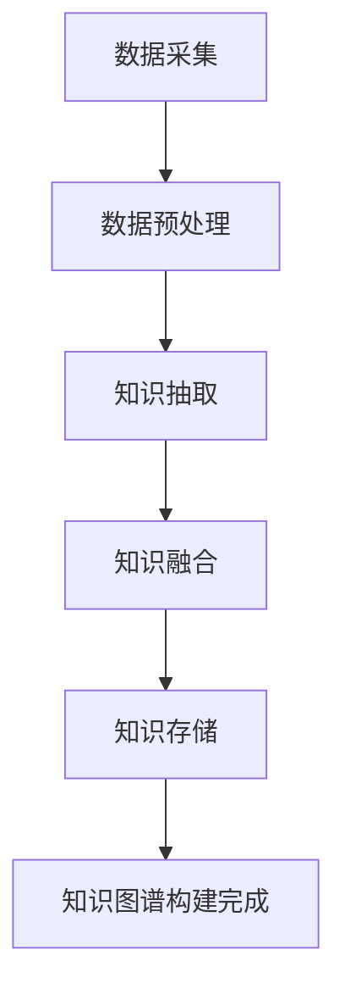

                 


# 知识图谱在金融研究中的构建与应用

> **关键词**: 知识图谱, 金融研究, 金融实体, 图嵌入, 数据挖掘

> **摘要**: 知识图谱作为一种强大的数据建模工具，近年来在金融研究领域得到了广泛应用。本文详细探讨了知识图谱的基本概念、构建方法及其在金融研究中的应用场景。通过分析知识图谱的核心要素、构建算法和系统架构，本文为读者提供了从理论到实践的全面指南。最后，通过具体案例分析和项目实战，展示了如何利用知识图谱提升金融研究的效率和深度。

---

## 第一部分: 知识图谱在金融研究中的构建与应用概述

### 第1章: 知识图谱的基本概念与背景

#### 1.1 知识图谱的定义与核心概念
知识图谱是一种以图结构形式表示知识的模型，由节点（实体）和边（关系）组成。每个节点代表一个实体，边表示实体之间的关系。知识图谱的核心在于将分散的数据整合成一个统一的语义网络，使得计算机能够理解数据之间的语义关联。

- **知识图谱的定义**: 知识图谱是一种基于图的语义网络，通过实体和关系描述现实世界中的知识。它能够将结构化数据、半结构化数据和非结构化数据整合到一个统一的图结构中，支持复杂的语义查询和分析。

- **知识图谱的核心要素**:
  - 实体: 代表具体的概念或对象，如“公司”、“股票”、“市场”等。
  - 关系: 描述实体之间的关联，如“属于”、“影响”、“涉及”等。
  - 属性: 描述实体的特征或性质，如“公司名称”、“成立时间”等。

- **知识图谱与传统数据处理的区别**:
  | 对比维度 | 传统数据处理 | 知识图谱 |
  |----------|--------------|----------|
  | 数据结构 | 结构化数据为主 | 结构化+半结构化+非结构化 |
  | 关系表达 | 行为化描述 | 图结构化的语义描述 |
  | 查询能力 | 基于字段查询 | 基于语义的复杂查询 |

知识图谱在金融研究中的应用，可以有效解决金融数据分散、语义模糊的问题，帮助研究人员快速发现数据背后的关联和趋势。

---

#### 1.2 金融研究中的知识图谱背景

- **金融研究的现状与挑战**:
  金融数据具有多样性、复杂性和动态性。传统的数据分析方法难以捕捉数据之间的深层关联，限制了金融研究的深度和广度。

- **知识图谱在金融研究中的必要性**:
  知识图谱能够将分散的金融数据整合成一个统一的知识网络，帮助研究人员发现隐藏的关系和模式。

- **知识图谱构建的目标与意义**:
  - **目标**: 构建一个覆盖金融领域的知识网络，支持语义查询、关系推理和知识推理。
  - **意义**: 提升金融研究的效率，发现新的研究方向，支持智能投资决策。

---

### 第2章: 知识图谱的核心概念与联系

#### 2.1 知识图谱的构建流程

- **数据采集与预处理**:
  数据采集是知识图谱构建的第一步，需要从多种数据源（如数据库、文本、API等）获取金融数据。预处理包括数据清洗、去重和格式统一。

- **知识抽取与融合**:
  通过自然语言处理（NLP）和信息抽取技术，从文本中提取实体、关系和属性。知识融合是将多个来源的数据整合到一个知识图谱中，解决命名实体冲突和语义冲突的问题。

- **知识表示与存储**:
  使用图数据库（如Neo4j）或关系型数据库存储知识图谱。知识表示采用RDF（Resource Description Framework）或图嵌入（Graph Embedding）等方法。

---

#### 2.2 知识图谱与金融领域的结合

- **金融实体的识别与建模**:
  通过实体识别技术，从金融文本中提取公司名称、股票代码、市场指数等实体，并构建实体的属性和关系。

- **金融关系的抽取与分析**:
  从文本中抽取实体之间的关系，如“公司A影响市场B”、“市场B影响股票C”等。关系抽取可以基于规则或机器学习模型实现。

- **知识图谱在金融研究中的应用场景**:
  - **语义搜索**: 支持基于语义的复杂查询。
  - **关系推理**: 发现实体之间的隐含关系。
  - **知识推理**: 支持因果关系和趋势分析。

---

### 第3章: 知识图谱的构建算法与原理

#### 3.1 知识图谱构建的主流算法

- **基于RDF的构建方法**:
  RDF（资源描述框架）是一种用于表达知识的语义网络模型。通过RDF三元组（主语-谓词-宾语）描述实体之间的关系。

  ```mermaid
  graph TD
    A[Subject] --> B[Predicate]
    B --> C[Object]
  ```

- **基于图嵌入的构建方法**:
  图嵌入是一种将图结构数据转换为低维向量表示的技术。通过图嵌入算法（如Word2Vec、GraphSAGE），可以将实体和关系表示为向量，支持机器学习任务。

- **基于规则的构建方法**:
  通过预定义的规则和模板，从文本中抽取实体和关系。这种方法适用于规则明确的场景，如财务报告中的公司名称和职位关系。

---

#### 3.2 知识抽取与融合的算法原理

- **实体识别与链接**:
  实体识别是通过NLP技术从文本中提取实体，实体链接是将实体映射到知识图谱中的唯一标识符。

- **关系抽取**:
  关系抽取是通过模式匹配或机器学习模型从文本中提取实体之间的关系。

- **知识融合**:
  知识融合是将多个数据源中的知识整合到一个知识图谱中，解决命名冲突和语义冲突的问题。

---

#### 3.3 算法流程图



---

### 第4章: 知识图谱的数学模型与公式

#### 4.1 知识图谱的表示模型

- **基于向量空间的表示方法**:
  使用向量表示实体和关系，通过向量运算进行语义分析。

- **基于图结构的表示方法**:
  使用图论中的概念（如节点、边）表示知识图谱。

- **基于概率的表示方法**:
  使用概率模型（如马尔可夫链）描述实体之间的关系概率。

#### 4.2 知识图谱构建的数学公式

- **实体表示的向量空间模型**:
  $$v_i = \sum_{j=1}^{n} \alpha_{ij}w_j$$
  其中，$v_i$ 表示实体i的向量表示，$\alpha_{ij}$ 表示权重，$w_j$ 表示词向量。

- **关系表示的矩阵分解模型**:
  $$R = U^T V$$
  其中，$R$ 表示关系矩阵，$U$ 和 $V$ 分别表示实体的嵌入向量。

---

### 第5章: 知识图谱的系统架构与设计

#### 5.1 系统功能设计

- **领域模型**:
  ```mermaid
  classDiagram
    class 实体层 {
      实体: 公司、市场、股票
      属性: 名称、代码、时间
    }
    class 关系层 {
      关系: 影响、涉及、属于
    }
    实体层 --> 关系层
  ```

- **系统架构设计**:
  ```mermaid
  architecture
  Client ---(http)--> Web Service
  Web Service ---(rest)--> 数据层
  数据层 ---(jdbc)--> 数据库
  数据层 ---(sparql)--> 图数据库
  ```

- **系统接口设计**:
  - **查询接口**: 提供基于实体或关系的查询接口。
  - **推理接口**: 提供基于知识图谱的推理服务。

---

### 第6章: 项目实战与案例分析

#### 6.1 项目背景

- **项目目标**: 构建一个小型金融知识图谱，涵盖公司、市场和股票之间的关系。
- **数据来源**: 从新闻、财报和市场数据中抽取实体和关系。

#### 6.2 核心代码实现

- **数据采集与预处理**:
  ```python
  import requests
  from bs4 import BeautifulSoup

  url = "https://finance.yahoo.com"
  response = requests.get(url)
  soup = BeautifulSoup(response.text, 'html.parser')
  ```

- **知识抽取与融合**:
  ```python
  from spacy.lang.zh import Chinese
  import spacy

  nlp = spacy.load("zh")
  doc = nlp("阿里巴巴公司影响中国股市。")
  for ent in doc.ents:
      print(ent.text, ent.label_)
  ```

- **知识图谱构建与存储**:
  ```python
  from neo4j import GraphDatabase

  driver = GraphDatabase.driver("neo4j://localhost:7687")
  session = driver.session()
  session.run("CREATE (a:Company {name: '阿里巴巴'})")
  session.run("CREATE (m:Market {name: '中国股市'})")
  session.run("MATCH (a:Company), (m:Market) CREATE (a)-[r:AFFECTS]->(m)")
  ```

---

### 第7章: 最佳实践与小结

#### 7.1 小结

知识图谱在金融研究中的应用前景广阔，能够帮助研究人员更好地理解和分析金融数据。通过构建知识图谱，可以实现语义搜索、关系推理和知识推理，提升金融研究的效率和深度。

#### 7.2 注意事项

- 数据质量是知识图谱构建的关键，需要确保数据的准确性和完整性。
- 知识图谱的构建需要结合金融领域的特点，选择合适的算法和工具。
- 知识图谱的可视化和解释性是实际应用中的重要挑战。

#### 7.3 拓展阅读

- 《知识图谱入门与实战》
- 《图嵌入与深度学习》
- 《金融数据分析与挖掘》

---

**作者：AI天才研究院/AI Genius Institute & 禅与计算机程序设计艺术/Zen And The Art of Computer Programming**

---

**摘要**: 本文详细探讨了知识图谱在金融研究中的构建与应用，从基本概念到实际案例，为读者提供了全面的指导。通过分析知识图谱的核心要素、构建算法和系统架构，本文展示了如何利用知识图谱提升金融研究的效率和深度。

