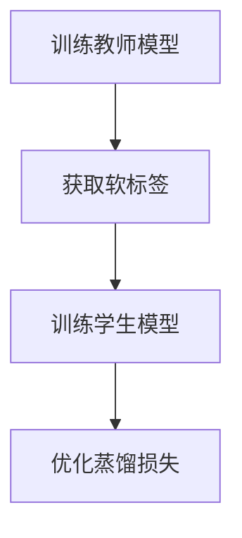
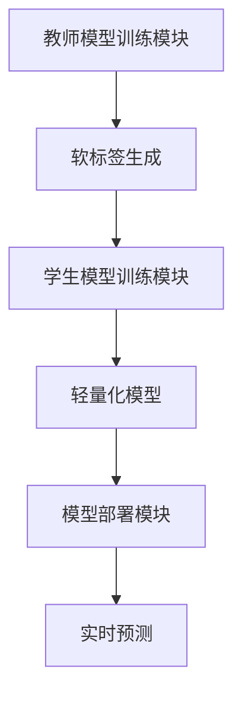

                 


# 知识蒸馏技术在金融模型轻量化中的应用

## 关键词：知识蒸馏技术，金融模型，模型轻量化，机器学习，深度学习

## 摘要：  
本文探讨了知识蒸馏技术在金融模型轻量化中的应用。首先，我们介绍了知识蒸馏技术的基本概念和原理，分析了其在金融领域的应用潜力。接着，我们详细讲解了知识蒸馏技术的核心算法和数学模型，包括教师模型和学生模型的构建过程。然后，我们从金融模型的特点出发，探讨了如何利用知识蒸馏技术实现模型轻量化，并通过实际案例展示了其在金融预测中的应用。最后，我们总结了知识蒸馏技术的优势和挑战，并提出了未来的研究方向。

---

# 1. 背景介绍

## 1.1 知识蒸馏技术的定义与背景

知识蒸馏技术（Knowledge Distillation）是一种用于模型压缩的技术，旨在将大型复杂模型（教师模型）的知识迁移到一个更小、更简单的模型（学生模型）中，同时保持或提升性能。与传统的模型压缩方法不同，知识蒸馏技术通过知识的传递，使得小模型能够继承教师模型的决策能力，从而在保持较低计算成本的同时，实现高性能预测。

知识蒸馏技术最初在机器学习领域得到广泛应用，尤其是在深度学习模型压缩和部署方面。近年来，随着金融领域的数据复杂性和模型需求的不断增加，知识蒸馏技术逐渐成为金融模型轻量化的重要工具。

## 1.2 知识蒸馏技术的核心概念

知识蒸馏技术的核心概念包括教师模型、学生模型和蒸馏过程。教师模型通常是经过充分训练的大型模型，具有较高的准确性和泛化能力。学生模型是一个较小的模型，通过模仿教师模型的行为和决策，学习其知识。

蒸馏过程包括两个主要阶段：教师模型的特征提取和学生模型的优化。在第一阶段，教师模型通过其复杂的网络结构生成中间特征和概率分布。在第二阶段，学生模型通过优化这些特征和分布，逐步逼近教师模型的性能。

## 1.3 知识蒸馏技术在金融领域的应用潜力

金融领域的模型通常需要处理高维数据、复杂的非线性关系和高频交易等场景，这使得模型的计算成本和部署难度较高。知识蒸馏技术通过将大型金融模型的知识迁移到更小、更高效的模型中，可以在不牺牲性能的前提下，降低计算成本和部署难度。

知识蒸馏技术在金融领域的应用潜力主要体现在以下几个方面：

1. **实时预测**：通过轻量化模型，金融模型可以在边缘设备上实现实时预测，减少对云端计算的依赖。
2. **模型部署**：在资源受限的环境中，轻量化模型可以更高效地运行，满足金融行业对快速响应的需求。
3. **模型更新**：知识蒸馏技术可以用于模型的持续更新和优化，提升模型的适应能力和泛化能力。

---

# 2. 知识蒸馏技术的核心原理

## 2.1 知识蒸馏技术的数学模型

知识蒸馏技术的数学模型主要围绕教师模型和学生模型的损失函数展开。教师模型的损失函数通常包括类别损失和蒸馏损失，而学生模型的损失函数则结合了蒸馏损失和分类损失。

教师模型的损失函数可以表示为：

$$
\mathcal{L}_{\text{teacher}} = \mathcal{L}_{\text{cls}} + \lambda \mathcal{L}_{\text{distill}}
$$

其中，$\mathcal{L}_{\text{cls}}$是教师模型的分类损失，$\mathcal{L}_{\text{distill}}$是蒸馏损失，$\lambda$是蒸馏损失的权重系数。

学生模型的损失函数可以表示为：

$$
\mathcal{L}_{\text{student}} = \mathcal{L}_{\text{cls}} + \mathcal{L}_{\text{distill}}
$$

蒸馏损失的计算公式为：

$$
\mathcal{L}_{\text{distill}} = -\sum_{i=1}^{n} p_i \log q_i
$$

其中，$p_i$是教师模型的预测概率，$q_i$是学生模型的预测概率。

## 2.2 知识蒸馏技术的算法流程

知识蒸馏技术的算法流程可以分为以下几个步骤：

1. **训练教师模型**：首先，训练一个大型的教师模型，使其在训练数据上达到较高的准确率。
2. **获取软标签**：在蒸馏过程中，教师模型不仅输出类别概率，还会输出中间层的特征表示。
3. **训练学生模型**：学生模型通过最小化蒸馏损失和分类损失，逐步逼近教师模型的性能。

以下是知识蒸馏技术的算法流程图：



## 2.3 知识蒸馏技术的实现细节

知识蒸馏技术的实现细节包括以下几个方面：

1. **教师模型的选择**：教师模型通常是大型的深度学习模型，如ResNet、BERT等。
2. **蒸馏温度的设置**：蒸馏温度$\tau$是一个关键参数，用于控制软标签的分布。$\tau$越大，软标签的分布越均匀，越有利于学生模型的学习。
3. **损失函数的平衡**：蒸馏损失和分类损失的权重需要根据具体任务进行调整，以达到最佳的性能。

以下是一个简单的Python实现示例：

```python
import torch
import torch.nn as nn

# 定义教师模型和学生模型
class TeacherModel(torch.nn.Module):
    def __init__(self):
        super(TeacherModel, self).__init__()
        self.linear = nn.Linear(10, 5)
        self.dropout = nn.Dropout(0.5)
        self.output = nn.Linear(5, 2)

    def forward(self, x):
        x = self.linear(x)
        x = self.dropout(x)
        x = self.output(x)
        return x

class StudentModel(torch.nn.Module):
    def __init__(self):
        super(StudentModel, self).__init__()
        self.linear = nn.Linear(10, 2)

    def forward(self, x):
        x = self.linear(x)
        return x

# 定义蒸馏损失函数
def distillation_loss(student_output, teacher_output, temp=2):
    student_output = student_output / temp
    teacher_output = teacher_output / temp
    loss = nn.KLDivLoss(reduction='batchmean')(student_output, teacher_output) * temp**2
    return loss

# 训练过程
teacher_model = TeacherModel()
student_model = StudentModel()
optimizer = torch.optim.Adam(student_model.parameters(), lr=0.001)
criterion = nn.CrossEntropyLoss()

for epoch in range(num_epochs):
    for batch in dataloader:
        inputs, labels = batch
        teacher_outputs = teacher_model(inputs)
        student_outputs = student_model(inputs)
        
        # 计算蒸馏损失
        distillation_loss_value = distillation_loss(student_outputs, teacher_outputs)
        # 计算分类损失
        classification_loss = criterion(student_outputs, labels)
        # 总损失
        total_loss = distillation_loss_value + classification_loss
        # 反向传播和优化
        optimizer.zero_grad()
        total_loss.backward()
        optimizer.step()
```

---

# 3. 金融模型轻量化的需求与挑战

## 3.1 金融模型轻量化的必要性

金融模型轻量化的需求主要来自于以下几个方面：

1. **计算成本**：大型金融模型通常需要大量的计算资源和时间，尤其是在高频交易和实时预测场景中，计算成本过高。
2. **部署需求**：金融模型需要在各种设备上部署，包括边缘设备和移动设备，这些设备通常资源有限，无法运行大型模型。
3. **实时性要求**：金融领域的实时性要求非常高，轻量化模型可以在边缘设备上实现实时预测，减少延迟。

## 3.2 知识蒸馏技术在金融模型中的应用场景

知识蒸馏技术在金融模型中的应用场景包括：

1. **金融预测模型**：通过蒸馏技术，将大型金融预测模型的知识迁移到更小的模型中，实现实时预测。
2. **风险评估模型**：轻量化模型可以用于风险评估，尤其是在资源受限的环境中。
3. **高频交易模型**：蒸馏技术可以帮助高频交易模型在边缘设备上快速运行，提升交易速度。

## 3.3 知识蒸馏技术在金融模型中的优势

知识蒸馏技术在金融模型中的优势包括：

1. **性能提升**：通过蒸馏技术，小模型可以继承教师模型的高性能，同时减少计算成本。
2. **资源优化**：轻量化模型可以在资源受限的设备上运行，降低计算成本和部署难度。
3. **适应性增强**：蒸馏技术可以通过不断更新教师模型，提升小模型的适应能力和泛化能力。

---

# 4. 金融模型轻量化中的知识蒸馏技术实现

## 4.1 系统架构设计

知识蒸馏技术在金融模型轻量化中的系统架构设计可以分为以下几个部分：

1. **教师模型训练模块**：负责训练教师模型，生成软标签。
2. **学生模型训练模块**：负责训练学生模型，优化蒸馏损失和分类损失。
3. **模型部署模块**：将轻量化模型部署到目标设备上，实现实时预测。

以下是一个系统的架构图：



## 4.2 项目实战

### 4.2.1 环境配置

首先，我们需要配置开发环境，安装必要的库和工具。以下是常见的环境配置：

```bash
pip install torch numpy pandas scikit-learn
```

### 4.2.2 核心代码实现

以下是知识蒸馏技术在金融模型中的核心代码实现示例：

```python
import torch
import torch.nn as nn
import torch.optim as optim
import numpy as np
import pandas as pd

# 加载数据集
data = pd.read_csv('financial_data.csv')
X = data.drop('target', axis=1).values
y = data['target'].values

# 定义教师模型和学生模型
class TeacherModel(torch.nn.Module):
    def __init__(self):
        super(TeacherModel, self).__init__()
        self.fc1 = nn.Linear(10, 64)
        self.fc2 = nn.Linear(64, 32)
        self.fc3 = nn.Linear(32, 2)

    def forward(self, x):
        x = torch.relu(self.fc1(x))
        x = torch.relu(self.fc2(x))
        x = self.fc3(x)
        return x

class StudentModel(torch.nn.Module):
    def __init__(self):
        super(StudentModel, self).__init__()
        self.fc1 = nn.Linear(10, 16)
        self.fc2 = nn.Linear(16, 2)

    def forward(self, x):
        x = torch.relu(self.fc1(x))
        x = self.fc2(x)
        return x

# 定义蒸馏损失函数
def distillation_loss(student_output, teacher_output, temp=2):
    student_output = student_output / temp
    teacher_output = teacher_output / temp
    loss = nn.KLDivLoss(reduction='batchmean')(student_output, teacher_output) * temp**2
    return loss

# 训练过程
teacher_model = TeacherModel()
student_model = StudentModel()
optimizer = optim.Adam(student_model.parameters(), lr=0.001)
criterion = nn.CrossEntropyLoss()

# 蒸馏温度
temp = 2

# 开始训练
num_epochs = 100
for epoch in range(num_epochs):
    for i in range(len(X)):
        inputs = torch.FloatTensor(X[i])
        labels = torch.LongTensor([y[i]])

        # 前向传播
        with torch.no_grad():
            teacher_outputs = teacher_model(inputs)
        student_outputs = student_model(inputs)

        # 计算损失
        distillation_loss_value = distillation_loss(student_outputs, teacher_outputs, temp)
        classification_loss = criterion(student_outputs, labels)
        total_loss = distillation_loss_value + classification_loss

        # 反向传播和优化
        optimizer.zero_grad()
        total_loss.backward()
        optimizer.step()

    print(f'Epoch {epoch+1}, Loss: {total_loss.item()}')

print("训练完成！")
```

### 4.2.3 案例分析与详细解读

通过上述代码实现，我们可以看到知识蒸馏技术在金融模型中的具体应用。教师模型通过其复杂的网络结构生成软标签，学生模型通过蒸馏损失和分类损失的优化，逐步逼近教师模型的性能。最终，轻量化的学生模型可以在边缘设备上实现实时预测，满足金融领域的实时性要求。

---

# 5. 总结与展望

## 5.1 总结

本文详细探讨了知识蒸馏技术在金融模型轻量化中的应用。通过背景介绍、核心原理、系统架构设计和项目实战的分析，我们展示了知识蒸馏技术在金融领域的巨大潜力。知识蒸馏技术不仅可以降低计算成本和部署难度，还可以提升模型的实时性和适应性，为金融领域的模型优化提供了新的思路。

## 5.2 展望

未来，知识蒸馏技术在金融模型中的应用将更加广泛和深入。随着深度学习模型的不断发展，知识蒸馏技术将面临更多的挑战和机遇。我们需要进一步研究如何优化蒸馏过程，提升轻量化模型的性能和稳定性，同时探索新的应用场景，如多模态金融数据的处理和复杂金融任务的优化。

---

# 作者：AI天才研究院 & 禅与计算机程序设计艺术

