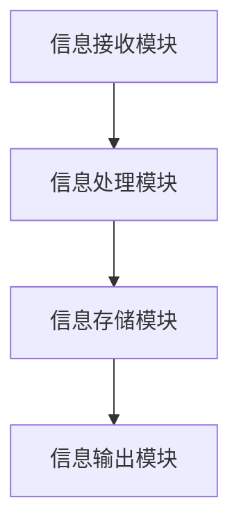

                 


# 确认偏误：如何避免选择性接受信息

> **关键词**：确认偏误、选择性接受信息、信息处理、认知偏差、算法原理、系统架构

> **摘要**：确认偏误是一种常见的认知偏差，表现为人们倾向于寻找和接受支持自己已有观点的信息，而忽视或排斥与之矛盾的信息。本文通过分析确认偏误的定义、形成机制、算法原理以及系统架构，探讨如何避免选择性接受信息，从而做出更加理性的决策。

---

## 第一部分: 确认偏误的背景与核心概念

### 第1章: 确认偏误的定义与特征

#### 1.1 确认偏误的定义
确认偏误（Confirmation Bias）是指人们在处理信息时，倾向于寻找和接受与自己已有观点一致的信息，而忽视或排斥与之矛盾的信息。这种偏误会影响个体的决策和判断。

**关键特征：**
1. **选择性注意**：人们更容易注意到与自己观点一致的信息。
2. **选择性记忆**：人们更容易记住支持自己观点的细节，而忽略矛盾的信息。
3. **选择性说服**：人们更容易被与自己观点一致的论点说服。

#### 1.2 确认偏误的形成机制
确认偏误的形成与人类的认知结构和心理机制密切相关。以下是其形成机制的详细分析：

1. **信息处理的双重模式**：
   - **自动化处理模式**：人们倾向于快速处理信息，基于已有经验和直觉做出判断。
   - **理性分析模式**：人们在面对复杂问题时，会进行详细的分析和验证。

2. **确认偏误的核心特征**：
   - **自我一致性**：人们倾向于维护自己的观点一致性。
   - **认知舒适区**：人们倾向于选择与已有认知一致的信息，以减少认知冲突。

3. **确认偏误与其他认知偏误的区别**：
   | 偏误类型       | 定义                                                                 | 特点                                                                 |
   |----------------|----------------------------------------------------------------------|----------------------------------------------------------------------|
   | 确认偏误       | 倾向于寻找和接受支持已有观点的信息                                           | 强调自我一致性，倾向于维护已有观点                                   |
   | 选择性忽略     | 倾向于忽略与已有观点矛盾的信息                                               | 强调信息过滤，倾向于排斥矛盾信息                                     |
   | 确认陷阱       | 在决策过程中，因确认偏误导致的错误结论                                       | 强调决策错误，与确认偏误密切相关                                     |

### 第2章: 确认偏误的形成机制

#### 2.1 信息处理的双重模式
- **自动化处理模式**：人们在面对大量信息时，往往依赖于自动化处理，基于已有经验和直觉快速做出判断。这种处理模式容易受到确认偏误的影响，因为人们倾向于选择与已有观点一致的信息。
- **理性分析模式**：在面对复杂问题时，人们会进行详细的分析和验证。然而，即使在这种模式下，确认偏误仍然会影响人们的判断，因为人们更倾向于寻找支持自己观点的证据。

#### 2.2 确认偏误的核心特征
- **自我一致性**：人们倾向于维护自己的观点一致性，这种一致性是确认偏误的核心驱动力。
- **认知舒适区**：人们倾向于选择与已有认知一致的信息，以减少认知冲突。这种舒适区使得人们在面对矛盾信息时，更容易选择性地忽略或排斥。

#### 2.3 确认偏误与选择性接受信息的关系
确认偏误通过影响信息处理的全过程，导致选择性接受信息。具体表现在以下几个方面：
1. **选择性注意**：人们更容易注意到与自己观点一致的信息，而忽略与之矛盾的信息。
2. **选择性记忆**：人们更容易记住支持自己观点的细节，而忘记矛盾的信息。
3. **选择性说服**：人们更容易被与自己观点一致的论点说服，而对矛盾论点持怀疑态度。

---

## 第二部分: 确认偏误的核心概念与联系

### 第3章: 确认偏误的核心概念

#### 3.1 信息处理机制
- **信息接收**：人们接收信息的过程是选择性的，倾向于接收与自己观点一致的信息。
- **信息处理**：人们在处理信息时，倾向于对支持自己观点的信息进行详细分析，而对矛盾信息进行快速否定或忽略。
- **信息存储**：人们更容易记住与自己观点一致的信息，而忘记矛盾的信息。

#### 3.2 确认偏误的核心要素
- **已有观点**：确认偏误的核心驱动力是人们已有的观点或信念。
- **信息选择**：人们倾向于选择与已有观点一致的信息。
- **信息处理方式**：人们在处理信息时，采用支持自己观点的处理方式。

#### 3.3 确认偏误的逻辑结构
确认偏误的逻辑结构可以用以下公式表示：
$$ \text{确认偏误} = \text{已有观点} \times \text{信息选择} \times \text{信息处理方式} $$

### 第4章: 确认偏误与选择性接受信息的联系

#### 4.1 确认偏误的核心概念
- **确认偏误的核心概念**：人们倾向于寻找和接受支持自己已有观点的信息。
- **选择性接受信息**：人们倾向于接受与自己观点一致的信息，而排斥与之矛盾的信息。

#### 4.2 选择性接受信息的特征
- **选择性注意**：人们更容易注意到与自己观点一致的信息。
- **选择性记忆**：人们更容易记住支持自己观点的信息。
- **选择性说服**：人们更容易被与自己观点一致的论点说服。

#### 4.3 确认偏误与选择性接受信息的对比分析
| 特性               | 确认偏误             | 选择性接受信息       |
|--------------------|----------------------|-----------------------|
| 核心驱动力         | 已有观点             | 信息一致性           |
| 表现形式           | 寻找支持信息         | 接受支持信息           |
| 对决策的影响       | 影响判断和决策       | 影响接受和拒绝信息     |

---

## 第三部分: 确认偏误的算法原理

### 第5章: 确认偏误的算法模型

#### 5.1 确认偏误的数学模型
确认偏误可以通过贝叶斯定理进行建模。贝叶斯定理可以帮助我们理解人们在面对信息时，如何更新和调整自己的观点。

$$ P(A|B) = \frac{P(B|A) \cdot P(A)}{P(B)} $$

其中：
- \( P(A|B) \) 表示在事件 \( B \) 发生的情况下，事件 \( A \) 发生的概率。
- \( P(B|A) \) 是在事件 \( A \) 发生的情况下，事件 \( B \) 发生的概率。
- \( P(A) \) 是事件 \( A \) 的先验概率。
- \( P(B) \) 是事件 \( B \) 的全概率。

#### 5.2 确认偏误的算法流程
确认偏误的算法流程可以用以下步骤表示：
1. **初始观点**：设定初始观点 \( P(A) \)。
2. **接收信息**：接收与 \( A \) 相关的信息 \( B \)。
3. **计算条件概率**：计算 \( P(B|A) \) 和 \( P(B|\neg A) \)。
4. **更新概率**：根据贝叶斯定理，更新 \( P(A|B) \) 和 \( P(\neg A|B) \)。
5. **选择性接受**：如果 \( P(A|B) > P(\neg A|B) \)，则接受信息 \( B \)；否则，拒绝信息 \( B \)。

#### 5.3 确认偏误的代码实现
以下是一个简单的Python代码示例，用于模拟确认偏误的算法：

```python
def bayesian_update(prior, likelihood):
    posterior = (prior * likelihood) / (prior * likelihood + (1 - prior) * (1 - likelihood))
    return posterior

prior = 0.8  # 初始观点
likelihood = 0.7  # 接收的信息支持初始观点的概率

posterior = bayesian_update(prior, likelihood)
print(f"更新后的概率为：{posterior}")
```

---

## 第四部分: 确认偏误的系统分析

### 第6章: 确认偏误的系统架构

#### 6.1 系统功能设计
- **信息接收模块**：接收输入信息。
- **信息处理模块**：分析信息，判断是否与已有观点一致。
- **信息存储模块**：存储支持和矛盾的信息。
- **信息输出模块**：输出最终的判断结果。

#### 6.2 系统架构设计
以下是一个简单的系统架构图，展示了确认偏误系统的主要组件：



---

## 第五部分: 确认偏误的项目实战

### 第7章: 项目实战

#### 7.1 环境安装
- **Python**：安装Python 3.8或更高版本。
- **依赖库**：安装 `mermaid` 和 `numpy`。

#### 7.2 核心代码实现
以下是一个简单的Python代码示例，用于模拟确认偏误的算法：

```python
import numpy as np

def confirm_bias_detection(data, prior):
    # 计算支持和矛盾信息的数量
    support = np.sum(data >= prior)
    contradict = np.sum(data < prior)
    return support, contradict

# 示例数据
data = np.array([0.7, 0.8, 0.6, 0.9, 0.5])
prior = 0.7

support, contradict = confirm_bias_detection(data, prior)
print(f"支持的数量：{support}")
print(f"矛盾的数量：{contradict}")
```

#### 7.3 代码解读与分析
- **数据输入**：输入一个包含概率值的数据集。
- **支持和矛盾信息计算**：根据初始观点，计算支持和矛盾信息的数量。
- **输出结果**：输出支持和矛盾信息的数量。

---

## 第六部分: 确认偏误的最佳实践

### 第8章: 最佳实践

#### 8.1 确认偏误的应对策略
1. **主动质疑**：定期质疑自己的观点，避免陷入认知陷阱。
2. **多角度思考**：从多个角度分析问题，避免单一视角的局限性。
3. **信息多样性**：主动接触与自己观点矛盾的信息，保持认知的多样性。

#### 8.2 确认偏误的注意事项
- **避免信息孤岛**：保持信息来源的多样性，避免仅接触单一信息源。
- **理性分析**：在面对复杂问题时，进行详细的分析和验证。
- **持续学习**：不断更新自己的知识和观点，避免固化的认知。

#### 8.3 确认偏误的拓展阅读
- **书籍推荐**：
  - 《思考，快与慢》（*Thinking, Fast and Slow*）—— 作者：丹尼尔·卡尼曼（Daniel Kahneman）
  - 《认知偏差：人类决策的规律》（*Thinking: Fast and Slow*）—— 作者：丹尼尔·卡尼曼（Daniel Kahneman）

---

## 作者简介

**作者：AI天才研究院/AI Genius Institute & 禅与计算机程序设计艺术/Zen And The Art of Computer Programming**

AI天才研究院致力于人工智能领域的研究与应用，禅与计算机程序设计艺术则关注计算机科学与人类认知的交叉领域。我们希望通过技术博客的形式，分享人工智能领域的最新研究成果和实践经验，帮助读者更好地理解确认偏误及其应对方法。

---

感谢您的阅读！希望这篇文章能帮助您更好地理解确认偏误，并在实际应用中避免选择性接受信息，做出更加理性的决策。

