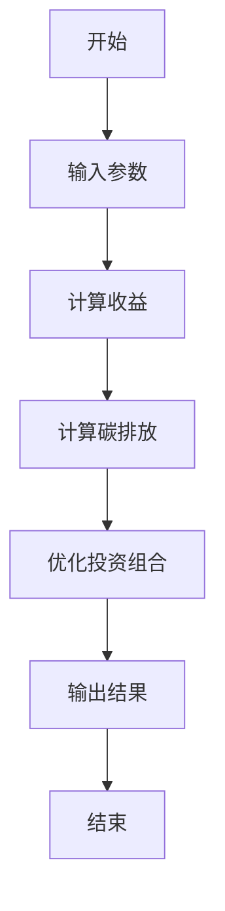
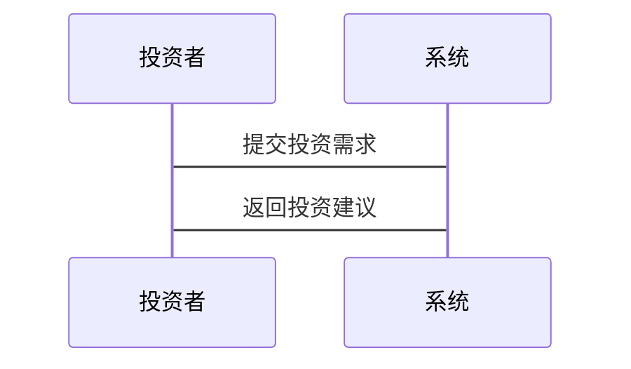

                 


# 碳中和目标下的绿色投资策略

## 关键词
碳中和、绿色投资、可持续发展、投资组合优化、环境影响评估

## 摘要
碳中和目标的实现需要全球范围内的共同努力，绿色投资作为推动这一目标的重要手段，正在受到越来越多的关注。本文从碳中和的背景出发，详细分析绿色投资的核心概念、算法原理、系统设计以及实际应用。通过对比分析、数学模型和实际案例，探讨绿色投资在实现碳中和目标中的策略和方法，为投资者提供科学的指导。

---

# 第1章 碳中和与绿色投资概述

## 1.1 碳中和的目标与意义

### 1.1.1 碳中和的定义与背景
碳中和是指通过减少温室气体排放、增加碳汇等方式，使二氧化碳的净排放量为零。这一目标是全球应对气候变化的重要举措，也是实现可持续发展的重要环节。

### 1.1.2 碳中和对全球经济的影响
碳中和将推动全球经济结构的转型，绿色能源、环保技术和低碳产业将成为经济增长的新引擎。绿色投资在这一过程中扮演着关键角色，通过资金支持推动技术创新和产业升级。

### 1.1.3 绿色投资在碳中和中的作用
绿色投资通过资金流向绿色产业，促进清洁能源、节能环保等领域的快速发展，是实现碳中和的重要保障。

## 1.2 绿色投资的核心概念

### 1.2.1 绿色投资的定义
绿色投资是指将资金投入到有助于减少碳排放、保护环境和促进可持续发展的项目或企业中。

### 1.2.2 绿色投资的必要性
传统投资模式往往忽视环境成本，导致资源浪费和环境污染。绿色投资通过将环境因素纳入考量，优化资源配置，降低环境风险。

### 1.2.3 绿色投资与可持续发展的关系
绿色投资是可持续发展的重要组成部分，通过支持绿色产业，推动经济与环境的协调发展。

## 1.3 绿色投资的国内外现状

### 1.3.1 国际绿色投资的发展历程
国际上，绿色投资已形成一定的规模，许多国家和地区出台了相关政策支持绿色产业发展。

### 1.3.2 国内绿色投资的政策支持
中国政府提出“双碳”目标，出台了一系列政策鼓励绿色投资，绿色债券、绿色基金等金融工具快速发展。

### 1.3.3 绿色投资的未来趋势
随着技术进步和政策支持，绿色投资将呈现多元化和规模化趋势，成为推动全球经济转型的重要力量。

---

# 第2章 绿色投资的核心概念与联系

## 2.1 绿色投资的原理分析

### 2.1.1 绿色投资的驱动因素
- **政策驱动**：政府政策的支持和监管推动绿色投资发展。
- **市场驱动**：投资者对环境和社会责任的关注增加。
- **技术驱动**：绿色技术的创新降低了投资成本，提高了收益。

### 2.1.2 绿色投资的实现路径
- **资金配置**：将资金投向绿色产业，如可再生能源、节能环保等。
- **风险管理**：评估投资项目对环境的影响，降低投资风险。

### 2.1.3 绿色投资的生态系统
绿色投资的生态系统包括政府、企业、金融机构、非政府组织等多个主体，通过协同合作推动绿色投资的发展。

## 2.2 绿色投资的核心要素对比

### 2.2.1 绿色投资与传统投资的对比
| 特性         | 绿色投资       | 传统投资       |
|--------------|----------------|----------------|
| 投资目标     | 减少碳排放     | 追求经济效益     |
| 风险因素     | 环境风险       | 市场风险         |
| 收益来源     | 环境效益       | 经济收益         |

### 2.2.2 绿色投资的属性特征分析
绿色投资具有高社会价值、高环境效益、高技术依赖性和高政策支持性的特点。

### 2.2.3 绿色投资的ER实体关系图
```mermaid
erd {
  经济实体 -> 投资项目: 投资
  投资项目 -> 环境因素: 影响
  经济实体 -> 政策: 支持
}
```

---

# 第3章 绿色投资的算法原理

## 3.1 绿色投资的数学模型

### 3.1.1 投资组合优化的数学模型
$$ \text{目标函数：最大化收益} = \sum w_i r_i $$
$$ \text{约束条件：最小化碳排放} = \sum w_i c_i $$
$$ \text{权重：} w_i \geq 0 \text{且} \sum w_i = 1 $$

### 3.1.2 碳中和目标下的投资组合优化
使用线性规划模型，将环境因素纳入投资决策，优化投资组合。

### 3.1.3 绿色投资的数学公式与实例
$$ \text{收益-风险平衡：} r = \alpha + \beta c $$
其中，$\alpha$是基准收益，$\beta$是碳排放的敏感系数，$c$是碳排放量。

---

## 3.2 绿色投资的算法流程

### 3.2.1 算法原理的Mermaid流程图


### 3.2.2 算法实现的Python代码示例
```python
import numpy as np
from scipy.optimize import minimize

# 定义目标函数
def objective(w, c):
    return np.dot(w, c)

# 定义约束条件
def constraint(w, r):
    return np.dot(w, r) - 1

# 求解优化问题
w = minimize(objective, np.ones(len(c)) / len(c), 
             constraints={'type': 'eq', 'fun': lambda w: constraint(w, r)})
```

### 3.2.3 算法优化与实际应用
通过动态规划和蒙特卡洛模拟优化投资组合，降低风险，提高收益。

---

# 第4章 绿色投资的系统分析与架构设计

## 4.1 绿色投资的系统功能设计

### 4.1.1 系统功能模块划分
- 数据采集：收集环境数据、投资数据。
- 风险评估：评估投资项目对环境的影响。
- 投资决策：优化投资组合，生成投资建议。

### 4.1.2 系统功能的领域模型Mermaid类图


## 4.2 绿色投资的系统架构设计

### 4.2.1 系统架构的总体设计
采用分层架构，包括数据层、业务逻辑层和用户界面层。

### 4.2.2 系统架构的Mermaid架构图


## 4.3 绿色投资的系统接口设计

### 4.3.1 系统接口的功能描述
- 数据接口：获取环境和投资数据。
- 评估接口：计算环境影响和投资收益。
- 决策接口：生成投资建议。

### 4.3.2 系统接口的交互流程
1. 用户提交投资需求。
2. 系统调用数据接口获取数据。
3. 系统调用评估接口计算环境影响。
4. 系统调用决策接口生成投资建议。
5. 系统返回投资建议给用户。

### 4.3.3 系统接口的实现方式
使用RESTful API，通过JSON格式传递数据，确保接口的高效性和可靠性。

---

# 第5章 绿色投资的系统交互设计

## 5.1 系统交互的场景分析

### 5.1.1 用户角色与权限分配
- 投资者：提交投资需求，查看投资建议。
- 管理员：维护系统数据，监控系统运行。

### 5.1.2 系统交互的Mermaid序列图


---

# 小结

绿色投资是实现碳中和目标的重要手段，通过科学的算法和系统设计，可以有效优化投资组合，降低环境风险，实现经济效益与环境效益的双赢。未来，随着技术的进步和政策的支持，绿色投资将发挥更大的作用，推动全球经济的可持续发展。

---

# 作者

作者：AI天才研究院/AI Genius Institute & 禅与计算机程序设计艺术 /Zen And The Art of Computer Programming

---

**小结**：本文系统地分析了碳中和目标下的绿色投资策略，从背景、概念、算法到系统设计，为投资者提供了全面的指导。通过实际案例和代码示例，帮助读者理解绿色投资的核心原理和实现方法。

