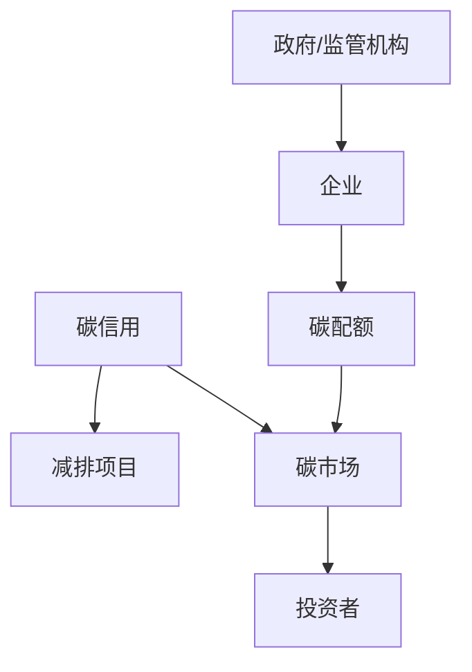
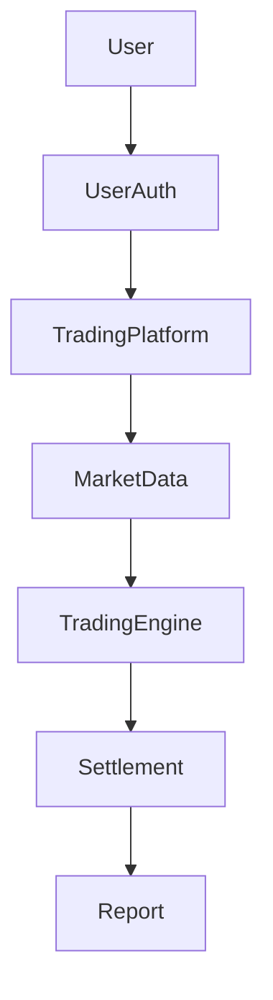

                 


# 碳交易市场的发展与投资机会分析

**关键词**：碳交易市场、碳配额、碳信用、碳金融、投资机会、风险管理

**摘要**：  
碳交易市场作为全球应对气候变化的重要机制，近年来发展迅速，成为全球关注的焦点。本文从碳交易市场的背景、核心概念、定价机制、风险管理、系统架构、投资机会以及项目实战等多角度进行深入分析，结合技术与市场的双重视角，揭示碳交易市场的内在逻辑与未来发展方向。通过详细的技术分析与案例解读，本文为投资者、企业与政策制定者提供有价值的参考与启示。

---

## 第1章 碳交易市场的背景与发展

### 1.1 碳交易市场的定义与背景

#### 1.1.1 碳交易市场的定义
碳交易市场是指通过市场机制买卖碳排放配额或碳信用的市场。碳排放配额（Carbon Allowance）是政府或监管机构分配给企业的排放权，企业可以在市场上交易这些配额；碳信用（Carbon Credit）是通过减少碳排放或增加碳汇（如植树造林）所获得的可交易凭证。

#### 1.1.2 碳交易市场的背景与驱动因素
碳交易市场的起源可以追溯到《京都议定书》的签署（1997年），该协议为发达国家设定了强制性的减排目标。随后，欧盟于2005年启动了世界首个碳交易市场——欧盟排放交易系统（EU Emissions Trading System, EU-ETS）。碳交易市场的快速发展主要由以下因素驱动：
- 气候变化的全球性问题；
- 政府政策与法规的推动；
- 企业社会责任与可持续发展的需求；
- 投资者对绿色金融的关注。

#### 1.1.3 碳交易市场与可持续发展的关系
碳交易市场是实现全球碳中和目标的重要工具。通过市场机制，碳交易可以降低减排成本，促进技术创新，推动绿色产业发展。同时，碳交易市场也是实现《巴黎协定》目标的关键路径之一。

---

### 1.2 碳交易市场的现状与趋势

#### 1.2.1 全球碳交易市场的现状
目前，全球碳交易市场主要由欧盟的EU-ETS、美国的区域碳市场（如RGGI和WCI）以及澳大利亚的碳市场组成。近年来，中国也逐步建立和完善了自己的碳交易市场，成为全球第二大碳市场。

#### 1.2.2 区域性碳市场的特点与差异
不同地区的碳市场在机制、规则和参与者方面存在差异。例如，EU-ETS采用强制性减排机制，而美国的RGGI则主要通过拍卖配额来实现减排目标。

#### 1.2.3 碳交易市场的发展趋势
- 全球碳市场的整合与扩大；
- 数字化与智能化交易工具的广泛应用；
- 碳市场的参与者从企业扩展到个人和机构投资者；
- 碳信用的质量与透明度成为市场关注的重点。

---

## 第2章 碳交易市场的核心概念与联系

### 2.1 碳配额与碳信用的对比分析

#### 2.1.1 碳配额的定义与属性
- **定义**：政府分配给企业的碳排放额度，企业必须在规定期限内使用或交易这些配额。
- **属性**：
  - 有限性：总量控制；
  - 可交易性：可以在市场上买卖；
  - 时间性：通常与特定年度或时间段相关。

#### 2.1.2 碳信用的定义与属性
- **定义**：通过减少碳排放或增加碳汇（如植树造林）所获得的可交易凭证。
- **属性**：
  - 可核查性：需经过第三方认证；
  - 可转让性：可以在市场上买卖；
  - 可累积性：碳信用可以累积使用。

#### 2.1.3 碳配额与碳信用的对比表格

| 对比维度 | 碁配额 | 碳信用 |
|----------|--------|--------|
| 性质     | 排放权  | 减排成果 |
| 来源     | 政府分配 | 项目实施 |
| 用途     | 满足合规需求 | 抵消排放 |
| 可交易性 | 是      | 是      |

### 2.2 碳交易市场的实体关系图



---

## 第3章 碳交易市场的定价机制与影响因素

### 3.1 碳价格的形成机制

#### 3.1.1 碳价格的影响因素分析
碳价格受多种因素影响，包括：
- 市场供需关系；
- 政策法规；
- 经济环境；
- 技术进步。

#### 3.1.2 碳市场的供需关系与价格波动
碳市场的供需关系可以通过以下公式表示：
$$ P = f(D, S) $$
其中，P为碳价格，D为市场需求，S为市场供给。

---

### 3.2 碳价格预测模型

#### 3.2.1 碳价格预测的数学模型
常用的碳价格预测模型包括：
- 时间序列分析模型（ARIMA）；
- 机器学习模型（如随机森林、LSTM）。

#### 3.2.2 碳价格预测的算法流程图

```mermaid
graph TD
    Start --> Collect Data
    Collect Data --> Preprocess Data
    Preprocess Data --> Train Model
    Train Model --> Validate Model
    Validate Model --> Predict Price
    Predict Price --> End
```

#### 3.2.3 碳价格预测的Python代码实现

```python
import pandas as pd
from sklearn.ensemble import RandomForestRegressor
from sklearn.metrics import mean_squared_error

# 数据加载与预处理
data = pd.read_csv('carbon_price.csv')
features = data[['demand', 'policy', 'economic_factors']]
labels = data['price']

# 模型训练
model = RandomForestRegressor()
model.fit(features, labels)

# 模型验证
predicted = model.predict(features)
mse = mean_squared_error(labels, predicted)
print(f'Mean Squared Error: {mse}')
```

---

## 第4章 碳交易市场的风险管理与投资机会

### 4.1 碳市场的风险分析

#### 4.1.1 碳市场的价格波动风险
碳价格的波动性较大，可能导致投资损失。

#### 4.1.2 碳市场的政策风险
政策的变化可能对碳市场产生重大影响。

#### 4.1.3 碳市场的信用风险
碳信用的质量与真实性可能存在问题。

---

### 4.2 碳市场的投资机会分析

#### 4.2.1 碳配额投资机会
企业可以通过购买碳配额满足合规需求，同时在市场中进行交易获利。

#### 4.2.2 碳项目投资机会
投资者可以投资于碳汇项目（如植树造林）或可再生能源项目，以获得碳信用。

#### 4.2.3 碳金融产品的投资机会
碳金融产品（如碳债券、碳基金）为投资者提供了多样化的选择。

---

## 第5章 碳交易市场的系统分析与架构设计

### 5.1 碳交易市场的系统架构

#### 5.1.1 碳交易系统的功能模块
- 用户管理模块；
- 配额管理模块；
- 交易模块；
- 结算模块；
- 监测与报告模块。

#### 5.1.2 碳交易系统的架构图



---

## 第6章 项目实战：碳交易系统的核心实现

### 6.1 系统环境与安装

#### 6.1.1 系统环境
- 操作系统：Linux/Windows/MacOS；
- 开发工具：PyCharm/VS Code；
- 依赖库：Python（版本3.8及以上）、Pandas、Scikit-learn、Flask。

#### 6.1.2 安装依赖
```bash
pip install pandas scikit-learn flask
```

---

### 6.2 系统核心实现

#### 6.2.1 碳价格预测模块

```python
import pandas as pd
from sklearn.ensemble import RandomForestRegressor

# 数据加载与预处理
data = pd.read_csv('carbon_price.csv')
features = data[['demand', 'policy', 'economic_factors']]
labels = data['price']

# 模型训练
model = RandomForestRegressor()
model.fit(features, labels)

# 预测碳价格
new_data = pd.DataFrame({'demand': [1000], 'policy': [1], 'economic_factors': [2]})
predicted_price = model.predict(new_data)
print(f'Predicted Carbon Price: {predicted_price[0]}')
```

#### 6.2.2 交易模块

```python
from flask import Flask, request, jsonify

app = Flask(__name__)

@app.route('/trade', methods=['POST'])
def trade():
    data = request.json
    # 交易逻辑
    return jsonify({'status': 'success', 'message': 'Trade completed'})

if __name__ == '__main__':
    app.run(debug=True)
```

---

## 第7章 总结与展望

### 7.1 总结
碳交易市场是应对气候变化的重要工具，其发展离不开技术的支持与市场的推动。本文从多个角度分析了碳交易市场的核心概念、定价机制、风险管理与投资机会，并通过系统设计与项目实战提供了具体的实现方案。

### 7.2 未来展望
随着技术的进步与政策的完善，碳交易市场将更加智能化与全球化。未来，人工智能与大数据技术将在碳价格预测、交易优化与风险管理中发挥更大的作用。

---

**作者**：AI天才研究院/AI Genius Institute & 禅与计算机程序设计艺术/Zen And The Art of Computer Programming

