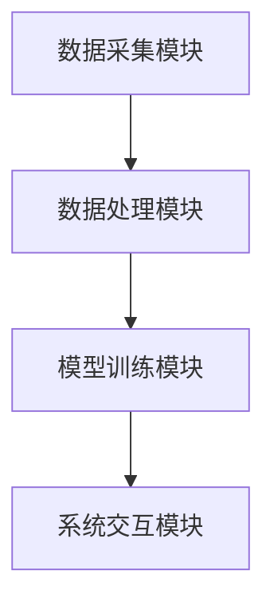

                 

# 社交媒体 AI Agent：LLM 辅助内容管理与互动

---

## 关键词

- 社交媒体
- AI Agent
- LLM
- 内容管理
- 互动

---

## 摘要

随着社交媒体的快速发展，内容管理与用户互动已成为企业和个人面临的重要挑战。本文深入探讨了如何利用大语言模型（LLM）构建社交媒体AI代理，以实现高效的内容管理和智能化的用户互动。文章从背景、技术原理、系统架构到实际案例，全面分析了LLM在社交媒体中的应用，并提出了优化策略和未来发展方向。

---

# 第一章: 社交媒体与 AI Agent 的概述

## 1.1 社交媒体的现状与发展

### 1.1.1 社交媒体的定义与特征

社交媒体是一种基于互联网的平台，允许用户创建、分享、互动和传播信息。其主要特征包括：

- **互动性**：用户可以实时交流、点赞、评论和分享。
- **开放性**：信息传播速度快，覆盖范围广。
- **多样性**：内容形式多样，包括文字、图片、视频等。

### 1.1.2 社交媒体的发展历程

社交媒体从早期的静态网页发展到如今的动态互动平台，经历了以下几个阶段：

1. **Web 1.0**：静态网页，用户只能浏览信息。
2. **Web 2.0**：动态交互，用户可以创建和分享内容。
3. **Web 3.0**：智能化，基于AI和大数据的个性化体验。

### 1.1.3 社交媒体在现代社会中的作用

社交媒体已成为人们日常生活的重要组成部分，广泛应用于社交、商务、娱乐等领域。它不仅改变了人们的沟通方式，还对企业营销、品牌推广和信息传播产生了深远影响。

## 1.2 AI Agent 的定义与特点

### 1.2.1 AI Agent 的定义

AI Agent（人工智能代理）是指能够感知环境并采取行动以实现目标的智能实体。它通过传感器获取信息，利用算法进行决策，并通过执行器与环境交互。

### 1.2.2 AI Agent 的核心特点

- **智能性**：能够理解、学习和推理。
- **自主性**：无需外部干预，自主决策。
- **交互性**：能够与用户和其他系统进行交互。
- **适应性**：能够根据环境变化调整行为。

### 1.2.3 AI Agent 与传统软件的区别

| 特性      | AI Agent                | 传统软件              |
|-----------|--------------------------|-----------------------|
| 智能性     | 高                       | 低                   |
| 自主性     | 高                       | 低                   |
| 交互性     | 高                       | 低                   |
| 适应性     | 高                       | 低                   |

## 1.3 社交媒体 AI Agent 的概念与背景

### 1.3.1 社交媒体 AI Agent 的定义

社交媒体AI Agent是指在社交媒体平台上运行的智能代理，能够自动执行内容管理、用户互动和数据分析等任务。

### 1.3.2 社交媒体 AI Agent 的应用场景

- **内容生成**：自动创作文本、图像等内容。
- **内容审核**：自动检测并删除违规内容。
- **用户互动**：自动回复评论、私信，与用户互动。

### 1.3.3 社交媒体 AI Agent 的发展背景

随着社交媒体的普及和AI技术的进步，企业和个人越来越依赖自动化工具来提高效率。社交媒体AI Agent应运而生，成为提升竞争力的重要手段。

## 1.4 本章小结

本章介绍了社交媒体和AI Agent的基本概念、特点和发展背景，为后续章节奠定了基础。通过理解社交媒体的多样性和AI Agent的智能性，我们可以更好地理解两者结合的潜力。

---

# 第二章: LLM 在社交媒体 AI Agent 中的核心作用

## 2.1 大语言模型（LLM）的定义与特点

### 2.1.1 大语言模型的定义

LLM（Large Language Model）是一种基于深度学习的自然语言处理模型，能够理解和生成人类语言。它通常基于Transformer架构，具有巨大的参数规模。

### 2.1.2 LLM 的核心特点

- **大规模训练数据**：通常使用 billions of parameters。
- **强大的上下文理解**：能够捕捉语言的复杂性。
- **多任务能力**：适用于文本生成、翻译、问答等多种任务。

### 2.1.3 LLM 与传统NLP模型的区别

| 特性      | LLM                | 传统NLP模型            |
|-----------|--------------------|-----------------------|
| 参数规模   | 大（ billions）     | 小（ millions）       |
| 上下文理解 | 强大               | 较弱                  |
| 任务能力   | 多任务             | 单任务                |

## 2.2 LLM 的主要技术与实现

### 2.2.1 深度学习与神经网络

深度学习是一种通过多层神经网络模拟人类学习方式的技术。神经网络通过多层处理，能够提取数据的高层次特征。

### 2.2.2 注意力机制与Transformer架构

注意力机制是一种用于处理序列数据的技术，能够捕捉输入中的重要部分。Transformer架构基于注意力机制，已成为现代LLM的核心结构。

### 2.2.3 模型训练与优化方法

- **模型训练**：使用大规模数据进行监督学习。
- **优化策略**：采用Adam优化器，学习率调整等技术。

## 2.3 LLM 在社交媒体中的应用潜力

### 2.3.1 内容生成与创作

LLM可以自动生成高质量的文本内容，如社交媒体帖子、广告文案等。

### 2.3.2 内容理解与分析

通过自然语言处理，LLM能够分析用户评论、情感倾向，帮助企业进行市场调研。

### 2.3.3 个性化推荐与互动

LLM可以根据用户行为和偏好，推荐相关内容或与用户进行个性化互动。

## 2.4 本章小结

本章详细介绍了LLM的基本原理和其在社交媒体中的应用潜力，为后续章节奠定了技术基础。通过理解LLM的强大能力，我们可以更好地设计社交媒体AI Agent。

---

# 第三章: 社交媒体内容管理与 LLM 的结合

## 3.1 社交媒体内容管理的挑战与需求

### 3.1.1 内容的多样性和复杂性

社交媒体内容形式多样，包括文本、图片、视频等，且内容生成速度快，增加了管理难度。

### 3.1.2 内容的实时性和动态性

社交媒体内容实时更新，需要快速响应和处理。

### 3.1.3 内容的安全性和合规性

需要防止违规内容的传播，确保内容符合法律法规。

## 3.2 LLM 在内容管理中的优势

### 3.2.1 高效的内容生成能力

LLM可以快速生成高质量的内容，节省时间和成本。

### 3.2.2 精准的内容理解能力

通过自然语言处理，LLM能够准确理解用户意图和情感倾向。

### 3.2.3 智能的内容推荐能力

LLM可以根据用户行为和偏好，推荐相关内容，提高用户满意度。

## 3.3 内容管理的系统架构与设计

### 3.3.1 系统功能模块划分

- **内容生成模块**：负责生成文本内容。
- **内容审核模块**：自动检测违规内容。
- **内容推荐模块**：基于用户行为推荐内容。

### 3.3.2 系统数据流设计

内容生成模块 → 内容审核模块 → 内容推荐模块。

### 3.3.3 系统性能优化策略

- **分布式计算**：提高处理效率。
- **缓存技术**：减少重复计算。

## 3.4 本章小结

本章探讨了社交媒体内容管理的挑战与需求，并分析了LLM在其中的优势。通过合理设计系统架构，可以实现高效的内容管理。

---

# 第四章: 社交媒体用户互动与 LLM 的应用

## 4.1 用户互动的核心问题

### 4.1.1 个性化互动需求

用户希望与品牌或个人进行个性化互动，提高体验感。

### 4.1.2 实时响应需求

用户期望快速得到回复，提升互动效率。

### 4.1.3 情感理解需求

用户希望互动过程中感受到情感关怀。

## 4.2 LLM 在用户互动中的应用

### 4.2.1 用户画像与行为分析

通过LLM分析用户数据，构建用户画像，了解用户需求和偏好。

### 4.2.2 智能对话系统

LLM可以构建智能对话系统，实现自动回复和情感分析。

### 4.2.3 个性化推荐系统

基于用户画像，推荐相关内容或产品。

## 4.3 系统架构与设计

### 4.3.1 系统功能模块

- **用户画像模块**：分析用户数据。
- **对话系统模块**：实现智能对话。
- **推荐系统模块**：推荐相关内容。

### 4.3.2 系统交互流程

用户请求 → 用户画像模块 → 对话系统模块 → 推荐系统模块 → 用户反馈。

## 4.4 本章小结

本章分析了用户互动的核心问题，并探讨了LLM在其中的应用。通过构建智能对话系统和个性化推荐系统，可以提升用户互动体验。

---

# 第五章: 社交媒体 AI Agent 的系统架构与实现

## 5.1 系统架构设计

### 5.1.1 系统功能模块

- **数据采集模块**：采集社交媒体数据。
- **数据处理模块**：清洗和预处理数据。
- **模型训练模块**：训练LLM模型。
- **系统交互模块**：实现用户与AI Agent的互动。

### 5.1.2 系统架构图

## 5.2 系统实现细节

### 5.2.1 数据采集模块

使用API接口从社交媒体平台获取数据，如Twitter API。

### 5.2.2 数据处理模块

对采集的数据进行清洗、分词和标注，准备训练数据。

### 5.2.3 模型训练模块

使用深度学习框架（如TensorFlow）训练LLM模型，优化参数。

### 5.2.4 系统交互模块

实现用户与AI Agent的互动接口，如聊天界面。

## 5.3 本章小结

本章详细设计了社交媒体AI Agent的系统架构，并讨论了实现细节。通过合理设计和优化，可以实现高效的系统运行。

---

# 第六章: 项目实战：构建一个社交媒体AI Agent

## 6.1 项目背景与目标

### 6.1.1 项目背景

企业希望利用AI技术提升社交媒体管理效率。

### 6.1.2 项目目标

构建一个能够自动生成、审核和推荐内容的社交媒体AI Agent。

## 6.2 项目实施步骤

### 6.2.1 环境配置

安装必要的开发工具和依赖库，如Python、TensorFlow等。

### 6.2.2 核心代码实现

实现数据采集、内容生成和用户互动功能。

### 6.2.3 测试与优化

对系统进行功能测试和性能优化。

### 6.2.4 部署与发布

将系统部署到云服务器，提供给用户使用。

## 6.3 项目小结

本章通过实际案例展示了如何构建一个社交媒体AI Agent。通过详细步骤和代码示例，读者可以掌握项目的实现方法。

---

# 第七章: 总结与展望

## 7.1 本章总结

本文深入探讨了社交媒体AI Agent的构建与应用，分析了LLM在内容管理和用户互动中的重要作用。通过合理设计系统架构和优化算法，可以实现高效的社交媒体管理。

## 7.2 未来展望

随着AI技术的不断发展，社交媒体AI Agent将更加智能化和个性化。未来的研究方向包括更高效的模型训练方法和更智能的用户互动模式。

---

# 作者：AI天才研究院 & 禅与计算机程序设计艺术

---

通过本文的详细讲解，读者可以全面了解社交媒体AI Agent的构建与应用，掌握利用LLM技术提升社交媒体管理效率的方法。

