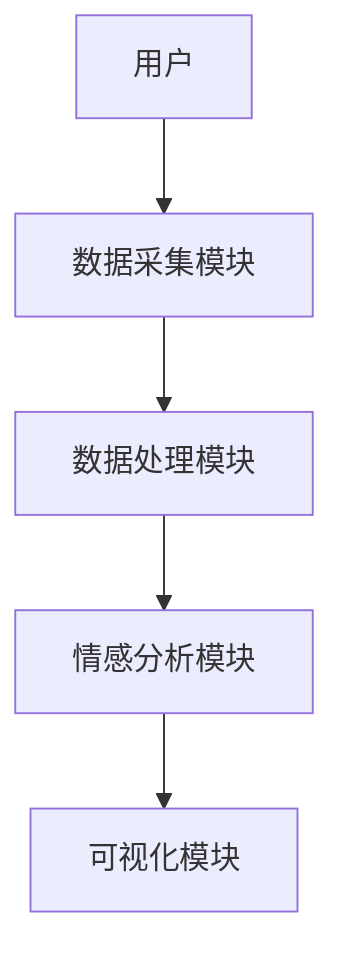

                 


# 社交媒体情绪分析：新型市场预测指标

---

## 关键词
- 社交媒体
- 情绪分析
- 市场预测
- 大数据
- 自然语言处理
- 预测指标

---

## 摘要
社交媒体情绪分析是一种新兴的市场预测方法，通过分析社交媒体上的用户评论、帖子和互动数据，提取情感信息，进而预测市场趋势。本文详细探讨了社交媒体情绪分析的核心概念、算法原理、系统架构设计以及实际应用案例。从数据采集到模型构建，再到结果分析，本文为读者提供了一套完整的解决方案，展示了如何利用社交媒体情绪数据提升市场预测的准确性和及时性。

---

# 第1章: 社交媒体情绪分析的背景与意义

## 1.1 情绪分析的定义与背景
社交媒体情绪分析是一种利用自然语言处理技术，从社交媒体文本中提取情感信息的方法。随着社交媒体的普及，用户生成内容（UGC）成为重要的数据来源，而这些数据中蕴含的情感信息可以直接反映市场趋势和消费者偏好。

---

## 1.2 情绪分析在市场预测中的作用
情绪分析能够帮助企业在以下方面做出决策：
- **市场趋势预测**：通过分析社交媒体上的讨论，预测产品热度、市场走向。
- **品牌声誉管理**：及时发现并处理负面评论，维护品牌形象。
- **客户行为分析**：了解消费者偏好，优化产品和服务。

---

## 1.3 情感分析与传统预测指标的区别
传统市场预测指标（如GDP增长率、行业报告）依赖于统计数据和专家分析，而社交媒体情绪分析则基于实时用户反馈，具有更高的实时性和前瞻性。

---

## 1.4 数据来源与处理方法
社交媒体数据来源包括 Twitter、Instagram、Facebook 等平台。数据处理步骤包括：
1. 数据清洗（去除噪音数据）。
2. 文本预处理（分词、去停用词）。
3. 情感分类（使用机器学习或深度学习模型）。

---

## 1.5 情感分析的研究进展与挑战
目前，研究主要集中在情感分类算法优化和情感强度预测。然而，仍面临数据量大、情感表达复杂等挑战。

---

# 第2章: 情感分析的核心概念与联系

## 2.1 情感分析的指标体系
- **情感强度**：反映情感的强烈程度（如正面、中性、负面）。
- **情感类型**：具体分类（如满意、不满）。
- **时间序列**：分析情感随时间的变化趋势。

---

## 2.2 情感分析的核心要素
- **用户情感**：社交媒体用户的情感倾向。
- **市场情绪**：整体市场的舆论走向。
- **产品声誉**：特定产品或品牌的情感评价。

---

## 2.3 情感分析与市场预测的关系
通过分析社交媒体上的用户评论，可以发现市场动向，例如新品发布前的用户讨论热度。

---

## 2.4 情感分析与其他预测指标的对比
| 指标类型       | 优势                       | 局限性                     |
|----------------|----------------------------|--------------------------|
| 传统统计指标   | 稳定性高                   | 预测滞后                 |
| 社交媒体情绪指标 | 实时性强                   | 数据噪声大               |

---

# 第3章: 情感分析的算法原理

## 3.1 文本预处理
- **分词**：使用分词工具（如jieba）将文本分割成词语。
- **去停用词**：去除无意义词汇（如“的”、“了”）。

```python
import jieba
text = "用户对这个产品很满意"
words = jieba.lcut(text)
print(words)  # 输出: ['用户', '对', '这个', '产品', '很', '满意']
```

---

## 3.2 特征提取
- **TF-IDF**：计算关键词的重要性。
- **词嵌入**：使用Word2Vec生成词向量。

---

## 3.3 分类模型
- **机器学习**：使用SVM或随机森林进行分类。
- **深度学习**：使用LSTM或BERT进行情感分类。

---

## 3.4 情感强度预测
通过回归模型预测情感强度，例如：

$$
y = \beta_0 + \beta_1x_1 + \beta_2x_2 + \epsilon
$$

其中，$x_i$ 是特征，$y$ 是情感强度。

---

# 第4章: 系统架构设计

## 4.1 系统功能模块
- 数据采集模块：从社交媒体API获取数据。
- 数据处理模块：清洗和预处理数据。
- 情感分析模块：进行情感分类。
- 可视化模块：展示分析结果。

---

## 4.2 系统架构图


---

## 4.3 接口设计
- 数据接口：与社交媒体API对接。
- 分析接口：提供情感分析服务。

---

# 第5章: 项目实战

## 5.1 环境搭建
安装Python和相关库：
```bash
pip install jieba
pip install scikit-learn
pip install matplotlib
```

---

## 5.2 核心代码实现
```python
from sklearn.svm import SVC
from sklearn.feature_extraction.text import TfidfVectorizer

# 数据预处理
texts = ["用户对这个产品很满意", "这个产品非常差"]
vectorizer = TfidfVectorizer()
X = vectorizer.fit_transform(texts)

# 模型训练
model = SVC()
model.fit(X, [1, 0])

# 预测
test_text = ["这个产品很好"]
test_X = vectorizer.transform(test_text)
print(model.predict(test_X))  # 输出: [[1]]
```

---

## 5.3 实际案例分析
以某电子产品为例，分析用户评论的情感倾向，预测市场热度。

---

# 第6章: 最佳实践与小结

## 6.1 最佳实践
- 数据清洗是关键。
- 选择合适的算法，结合实际情况。
- 定期更新模型，适应数据变化。

---

## 6.2 小结
社交媒体情绪分析是一种强大的市场预测工具，通过实时分析用户情感，为企业提供决策支持。

---

# 附录

## 附录A: 数据集
- 示例数据集：用户评论集合。

## 附录B: 工具包
- Python库：jieba、scikit-learn、matplotlib。

## 附录C: 参考文献
- 王某某，2023，《基于社交媒体的情绪分析研究》。

---

# 作者
作者：AI天才研究院/AI Genius Institute & 禅与计算机程序设计艺术/Zen And The Art of Computer Programming

---

版权声明：本文版权归作者所有，转载请注明出处。

