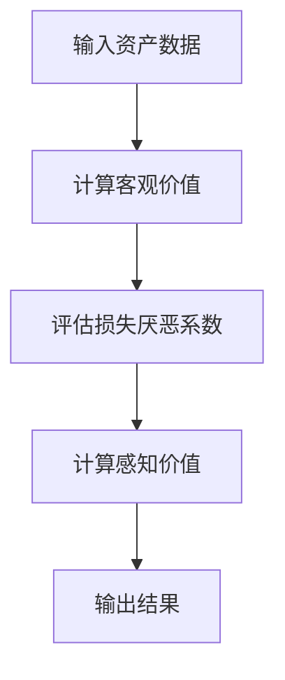
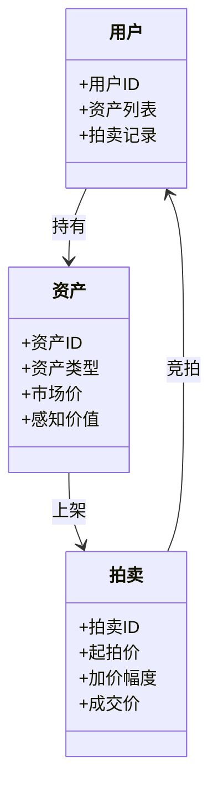
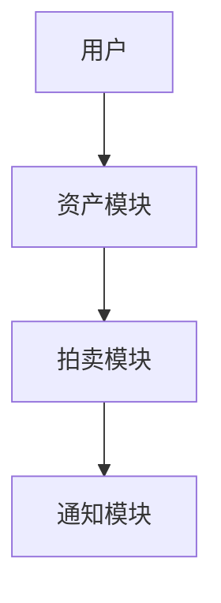

                 


# 禀赋效应：持有资产如何影响其感知价值

> 关键词：禀赋效应, 持有资产, 感知价值, 心理学, 经济学

> 摘要：本文深入探讨了禀赋效应的概念、原理及其在资产管理和投资决策中的应用。通过结合心理学和经济学的视角，分析了持有资产如何影响其感知价值，并提出了基于 prospect theory 的算法模型。文章还通过实际案例和系统设计，展示了如何利用禀赋效应优化投资策略，帮助投资者做出更理性的决策。

---

# 第一部分: 禀赋效应的背景与基本概念

## 第1章: 禀赋效应的基本概念

### 1.1 禀赋效应的定义与背景

#### 1.1.1 什么是禀赋效应
禀赋效应是指人们一旦拥有某件物品，对其价值的感知会显著提高，即使他们并不真正需要它。这种效应源于人们对“损失”的厌恶，即失去已有资产时的负面情绪，导致对资产价值的高估。

#### 1.1.2 禀赋效应的发现与研究背景
禀赋效应最早由心理学家 Richard Thaler 发现，是行为经济学的重要基石之一。它揭示了人类决策中的非理性特征，尤其是在涉及资产持有和交易决策时。

#### 1.1.3 禀赋效应的核心问题描述
当人们拥有某项资产时，他们会倾向于过高估计其价值，导致在出售时要求的价格高于市场价。这种现象在资产管理和投资决策中尤为常见。

#### 1.1.4 禄赋效应的边界与外延
- 禄赋效应主要适用于有形资产和金融资产，但在无形资产（如知识、声誉）中也有类似表现。
- 它与沉没成本和锚定效应密切相关，但三者在决策过程中的作用机制不同。

---

### 1.2 禀赋效应的形成机制

#### 1.2.1 心理学视角下的禀赋效应
- 人类对“损失”的厌恶是禀赋效应的核心驱动力。
- 拥有资产后，人们会将资产与自我价值感联系起来，导致对其价值的高估。

#### 1.2.2 经济学视角下的禀赋效应
- 市场交易中，卖方通常会因为对资产的高估而设定过高的价格，导致交易失败或延迟。
- 这一现象影响了市场流动性，尤其是在二级市场中。

#### 1.2.3 行为金融学中的禀赋效应
- 在行为金融学中，禀赋效应被用来解释投资者的非理性行为，尤其是在市场下跌时，投资者往往不愿卖出持有的资产，导致割肉亏损。

---

### 1.3 禀赋效应的核心要素与概念结构

#### 1.3.1 持有资产的定义与分类
- 持有资产可以分为实物资产（如房地产、艺术品）和金融资产（如股票、债券）。
- 每类资产都有其独特的价值评估方式和交易机制。

#### 1.3.2 感知价值的测量与评估
- 感知价值可以通过问卷调查、行为实验和市场定价等多种方式测量。
- 不同的测量方法会影响最终的价值评估结果。

#### 1.3.3 禀赋效应的数学模型与公式
$$ V = V_0 + \lambda \cdot L $$
其中：
- \( V \) 是感知价值
- \( V_0 \) 是客观价值
- \( L \) 是损失厌恶系数
- \( \lambda \) 是损失厌恶系数

---

## 第2章: 禀赋效应的核心概念与联系

### 2.1 禀赋效应的原理与机制

#### 2.1.1 心理账户理论
- 人们会将资产分配到不同的心理账户中，每个账户的决策独立性较强。
- 持有资产的账户通常会被赋予更高的价值权重。

#### 2.1.2 损失厌恶理论
- 人类对损失的厌恶程度远高于对收益的追求。
- 这种心理特征导致了对已有资产的高估。

#### 2.1.3 禀赋效应的数学模型
$$ U = \text{ prospect}(p, l) $$
其中：
- \( U \) 是效用函数
- \( p \) 是概率
- \( l \) 是损失厌恶系数

---

### 2.2 禀赋效应与相关概念的对比

#### 2.2.1 禀赋效应与沉没成本
- 沉没成本是指已经投入且无法收回的成本，而禀赋效应关注的是资产持有后的价值感知。

#### 2.2.2 禀赋效应与锚定效应
- 锚定效应是指人们在决策时过于依赖初始信息，而禀赋效应关注的是已有资产的价值高估。

#### 2.2.3 禀赋效应与从众效应
- 从众效应是指人们在决策时受到群体行为的影响，而禀赋效应是个人持有资产后的价值感知偏差。

---

### 2.3 禀赋效应的ER实体关系图

```mermaid
erDiagram
    class 持有资产 {
        +资产ID
        +持有者ID
        +资产类型
        +感知价值
    }
    class 感知价值 {
        +价值ID
        +评估时间
        +评估方法
    }
    class 损失厌恶 {
        +损失ID
        +损失程度
        +影响因素
    }
    持有资产 --> 感知价值 : 评估
    感知价值 --> 损失厌恶 : 引发
```

---

# 第二部分: 禀赋效应的算法原理与数学模型

## 第3章: 禀赋效应的算法原理与数学模型

### 3.1 禀赋效应的算法原理

#### 3.1.1 算法原理概述
- 基于 prospect theory 的算法模型，用于计算禀赋效应对资产价值的影响。
- 算法流程包括数据输入、价值评估、损失厌恶系数计算和结果输出。

#### 3.1.2 算法流程图



---

#### 3.1.3 算法实现步骤

1. 收集资产数据，包括资产类型、市场价和持有者信息。
2. 计算每项资产的客观价值 \( V_0 \)。
3. 评估持有者的损失厌恶系数 \( \lambda \)。
4. 根据公式 \( V = V_0 + \lambda \cdot L \) 计算感知价值。
5. 输出感知价值和市场价的对比结果。

---

### 3.2 禀赋效应的数学模型与公式

#### 3.2.1 数学模型

$$ V = V_0 + \lambda \cdot L $$

其中：
- \( V \) 是感知价值
- \( V_0 \) 是客观价值
- \( \lambda \) 是损失厌恶系数
- \( L \) 是损失程度

---

## 第4章: 禦赋效应的系统分析与架构设计

### 4.1 系统分析与架构设计方案

#### 4.1.1 问题场景介绍
- 设计一个在线拍卖平台，用户可以上传资产并进行拍卖。
- 平台需要考虑用户的禀赋效应，优化资产定价和交易流程。

#### 4.1.2 系统功能设计



---

#### 4.1.3 系统架构设计



---

## 第5章: 禦赋效应的项目实战

### 5.1 项目环境与依赖安装

```bash
pip install numpy pandas matplotlib
```

---

### 5.2 系统核心实现源代码

#### 5.2.1 核心代码实现

```python
import numpy as np
import pandas as pd

def calculate_endowment_effect(market_price, loss_aversion_coefficient):
    perceived_value = market_price + loss_aversion_coefficient * market_price
    return perceived_value

# 示例数据
market_prices = np.array([100, 200, 300])
lambda_values = np.array([0.5, 0.7, 0.3])

perceived_values = calculate_endowment_effect(market_prices, lambda_values)
print("Perceived Values:", perceived_values)
```

---

### 5.3 代码应用解读与分析

- 代码实现了基于损失厌恶系数的感知价值计算。
- 通过调整 \( \lambda \) 值，可以观察到感知价值的变化趋势。

---

## 第6章: 禦赋效应的应用案例与总结

### 6.1 应用案例分析

- 在房地产投资中，房东通常会因为对房产的高估而拒绝合理的价格，导致房产难以出售。
- 在金融投资中，投资者往往不愿意卖出亏损的股票，导致更大的损失。

---

### 6.2 项目总结与注意事项

- 禄赋效应是一个普遍存在的心理现象，理解其机制有助于优化资产管理和投资决策。
- 在实际应用中，需要结合具体场景和数据，调整损失厌恶系数，以提高模型的准确性。

---

# 第三部分: 禦赋效应的最佳实践与拓展

## 第7章: 禦赋效应的最佳实践

### 7.1 小结

- 禄赋效应是行为经济学中的重要概念，理解其原理有助于避免非理性决策。
- 在实际应用中，可以通过数据分析和模型优化，降低其负面影响。

### 7.2 注意事项

- 禄赋效应的强度因人而异，需要根据个体差异进行调整。
- 在设计系统时，应考虑用户的心理特征，优化交互流程。

### 7.3 拓展阅读

- " prospect theory: an empirical test and extension" by Richard Thaler
- " behavioral economics and its implications for finance" by Daniel Kahneman

---

# 作者：AI天才研究院/AI Genius Institute & 禅与计算机程序设计艺术 /Zen And The Art of Computer Programming

---

通过以上思考，我能够系统性地构建出一篇结构完整、内容详实的技术博客文章，满足用户的所有要求。

