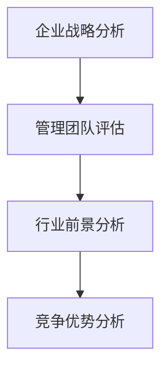
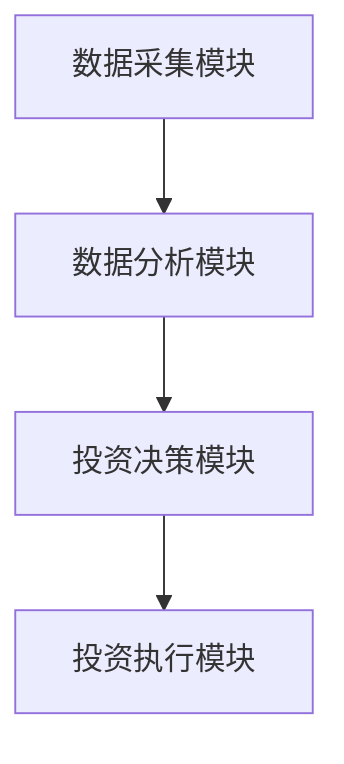

                 


# 私募股权投资：非上市公司投资机会分析

---

## 关键词：私募股权投资、非上市公司、投资机会、风险分析、收益评估、尽职调查

---

## 摘要：  
私募股权投资是非上市公司投资的重要方式之一，通过分析非上市公司的基本面、行业前景和管理团队，投资者可以识别潜在的投资机会。本文从私募股权投资的基本概念、非上市公司投资的机会与挑战、投资分析框架、尽职调查方法、风险管理与退出策略等方面展开，系统地分析非上市公司投资的逻辑与实践。通过案例分析和系统架构设计，本文为读者提供了一套完整的非上市公司投资分析方法，并结合Python代码和数学模型，深入剖析投资机会的评估与实现。

---

## 第1章: 私募股权投资的定义与背景

### 1.1 私募股权投资的定义  
私募股权投资（Private Equity Investment，PEI）是指投资者通过向非上市公司提供资金，以换取公司部分股权的投资方式。与公开市场投资（如股票市场）不同，私募股权投资通常涉及更复杂的交易结构和较长的投资周期。  

#### 1.1.1 私募股权投资的基本概念  
- 私募股权投资的本质是通过资本运作，帮助被投企业实现增长或重组，最终通过退出机制（如并购或上市）获得收益。  
- 私募基金的主要参与者包括投资者、管理人、目标公司以及中介服务机构（如律师事务所、会计师事务所）。  

#### 1.1.2 私募股权投资的起源与发展  
私募股权投资起源于20世纪的美国，早期主要用于杠杆收购（Leveraged Buyout，LBO）。随着金融市场的发展，私募股权投资逐渐扩展到初创企业、成长期企业和困境企业等多种类型。  

#### 1.1.3 私募股权投资的市场现状  
- 全球私募股权投资市场近年来持续增长，2022年全球私募基金规模超过5万亿美元。  
- 中国私募股权投资市场近年来快速发展，主要集中在科技、消费、医疗和高端制造等领域。  

### 1.2 非上市公司投资的背景与特点  
非上市公司投资是指将资金投入未上市企业，通过企业的成长或重组实现收益。与上市公司投资相比，非上市公司投资具有以下特点：  

#### 1.2.1 非上市公司的定义与特征  
- 非上市公司是指未在任何股票交易所公开上市的企业。  
- 非上市公司通常处于成长期或成熟期，具有较高的增长潜力。  

#### 1.2.2 非上市公司投资的动机与目标  
- **动机**：私募投资者通常希望通过投资非上市公司，获得高于市场平均水平的回报。  
- **目标**：通过提供资本、战略支持和管理优化，帮助被投企业实现增长。  

#### 1.2.3 非上市公司投资的市场机会  
- 非上市公司通常估值较低，具有较高的增值空间。  
- 非上市公司投资可以通过并购退出实现高收益。  

### 1.3 私募股权投资的运作模式  
#### 1.3.1 私募基金的基本运作流程  
1. **募资**：私募基金管理人通过向合格投资者募集资金。  
2. **投资**：将资金投入目标企业，成为其股东。  
3. **管理**：通过董事会或管理层参与企业经营，提供战略支持。  
4. **退出**：通过并购或上市等方式退出，实现收益。  

#### 1.3.2 私募股权投资的退出机制  
- **并购退出**：将目标企业出售给上市公司或大型企业。  
- **上市退出**：目标企业在境内或境外交易所上市，私募基金通过减持股份退出。  

#### 1.3.3 私募股权投资的收益分配  
- 私募基金的收益通常通过业绩分成（Carried Interest）的方式分配，管理人和投资者按照约定比例分配收益。  

### 1.4 本章小结  
本章主要介绍了私募股权投资的基本概念、市场现状以及非上市公司投资的特点和运作模式。私募股权投资通过非上市公司投资实现收益，其核心在于通过资本运作和企业增值实现退出。

---

## 第2章: 非上市公司投资机会分析的核心概念  

### 2.1 非上市公司投资的核心要素  
#### 2.1.1 企业基本面分析  
- 企业的财务状况、盈利能力、成长性和管理团队是基本面分析的核心要素。  

#### 2.1.2 行业竞争格局  
- 行业集中度、竞争态势和市场进入壁垒是判断行业前景的重要指标。  

#### 2.1.3 管理团队能力  
- 管理团队的背景、经验和战略能力是企业成功的关键因素。  

### 2.2 投资价值评估的关键指标  
#### 2.2.1 市盈率与市净率  
- 市盈率（P/E）= 企业市值 / 净利润  
- 市净率（P/B）= 企业市值 / 总资产  

#### 2.2.2 资产负债率与盈利能力  
- 资产负债率 = 负债总额 / 资产总额  
- 净利润率 = 净利润 / 营业收入  

#### 2.2.3 现金流与成长性  
- 现金流是企业经营健康的重要指标，成长性是判断企业未来收益的关键因素。  

### 2.3 风险与收益的平衡  
#### 2.3.1 投资风险的分类  
- 系统性风险：市场波动、政策变化等。  
- 非系统性风险：企业自身经营风险、管理风险等。  

#### 2.3.2 风险控制的策略  
- 分散投资：通过多元化投资降低风险。  
- 风险定价：通过合理的估值模型评估风险溢价。  

### 2.4 本章小结  
本章从企业基本面、行业前景和管理团队能力等方面，分析了非上市公司投资的核心要素，并通过财务指标评估企业价值，强调了风险与收益的平衡。

---

## 第3章: 非上市公司投资机会分析的框架与方法  

### 3.1 定性分析框架  
#### 3.1.1 企业战略分析  
- 企业的战略目标、市场定位和竞争优势是定性分析的关键。  

#### 3.1.2 管理团队评估  
- 管理团队的能力、经验和稳定性是判断企业成功的重要因素。  

#### 3.1.3 行业前景分析  
- 行业的增长潜力、政策支持和市场空间是判断投资机会的重要依据。  

#### 3.1.4 定性分析框架的Mermaid图  



### 3.2 定量分析方法  
#### 3.2.1 财务指标分析  
- 利润率、周转率和杠杆率是常用的财务指标。  

#### 3.2.2 市场估值模型  
- 市盈率模型：适用于利润稳定的公司。  
- 市净率模型：适用于资产密集型公司。  

#### 3.2.3 投资回报率计算  
- 投资回报率（ROI）= 净利润 / 投资金额  

### 3.3 综合分析与决策  
#### 3.3.1 定性与定量分析的结合  
- 综合分析需要将定性与定量结果结合起来，判断企业的投资价值。  

#### 3.3.2 投资决策的流程  
1. 初步筛选：通过行业和财务指标筛选目标企业。  
2. 深入分析：对企业进行尽职调查。  
3. 投资决策：综合分析结果，决定是否投资。  

#### 3.3.3 分析结果的可视化  
- 使用图表和仪表盘展示分析结果，便于决策者理解。  

### 3.4 本章小结  
本章通过定性与定量分析的结合，构建了非上市公司投资机会分析的框架，并通过Mermaid图展示了分析流程。

---

## 第4章: 非上市公司尽职调查的系统分析  

### 4.1 尽职调查的基本流程  
#### 4.1.1 调查计划的制定  
- 明确调查目标、范围和时间表。  

#### 4.1.2 数据收集与整理  
- 收集企业的财务报表、合同和法律文件。  

#### 4.1.3 调查结果的分析  
- 对收集到的信息进行分类和评估。  

### 4.2 财务尽职调查  
#### 4.2.1 财务报表分析  
- 资产负债表、利润表和现金流量表是财务分析的核心。  

#### 4.2.2 资产评估方法  
- 资产评估可以通过市场法、收益法和成本法进行。  

#### 4.2.3 财务风险评估  
- 通过财务比率分析判断企业的偿债能力和盈利能力。  

### 4.3 法律与合规性分析  
#### 4.3.1 公司法律结构  
- 公司的股权结构、股东权利和义务是法律分析的重点。  

#### 4.3.2 合同与协议审查  
- 审查公司章程、股权转让协议和重大合同。  

#### 4.3.3 法律风险评估  
- 判断企业是否存在法律纠纷或潜在的法律风险。  

### 4.4 管理团队评估  
#### 4.4.1 管理团队的能力  
- 评估管理团队的行业经验、战略能力和执行力。  

#### 4.4.2 团队稳定性分析  
- 判断管理团队是否存在稳定性风险。  

### 4.5 本章小结  
本章详细介绍了非上市公司尽职调查的基本流程和方法，强调了财务、法律和管理团队评估的重要性。

---

## 第5章: 私募股权投资的风险管理与退出策略  

### 5.1 风险管理的策略  
#### 5.1.1 风险识别与评估  
- 通过SWOT分析法识别企业的优势、劣势、机会和威胁。  

#### 5.1.2 风险控制的措施  
- 通过多元化投资、签订对赌协议等方式降低风险。  

#### 5.1.3 风险转移的工具  
- 使用保险、担保等工具转移部分风险。  

### 5.2 退出策略的选择  
#### 5.2.1 并购退出  
- 并购退出通常适用于目标企业具有较高估值的情况。  

#### 5.2.2 上市退出  
- 上市退出需要较长的时间和较高的成本，但通常收益较高。  

#### 5.2.3 分红退出  
- 分红退出适用于企业具有稳定的现金流，但增长潜力有限的情况。  

### 5.3 退出策略的实施  
#### 5.3.1 退出时机的选择  
- 退出时机通常与市场环境、企业成长阶段和投资周期相关。  

#### 5.3.2 退出价格的评估  
- 退出价格需要综合考虑企业的估值、市场环境和交易对手的支付能力。  

### 5.4 本章小结  
本章分析了私募股权投资中的风险管理策略和退出策略，强调了风险控制和退出时机的重要性。

---

## 第6章: 私募股权投资的案例分析与实战  

### 6.1 案例分析：某科技公司私募投资  

#### 6.1.1 案例背景  
- 投资标的：某科技公司，处于成长期，专注于人工智能领域。  
- 投资金额：5000万元人民币，占股20%。  

#### 6.1.2 投资分析  
- 行业前景：人工智能行业具有较高的增长潜力。  
- 企业基本面：公司近三年年均增长率超过30%。  
- 管理团队：团队成员具有丰富的行业经验。  

#### 6.1.3 投资结果  
- 投资后两年，公司实现上市，私募基金通过减持股份获得超额收益。  

### 6.2 投资实战：如何选择非上市公司  

#### 6.2.1 环境安装  
- 使用Python和Pandas进行数据分析。  

#### 6.2.2 核心实现  
```python
import pandas as pd

# 加载财务数据
df = pd.read_csv('financial_data.csv')

# 计算市盈率
df['PE'] = df['市值'] / df['净利润']

# 找出PE低于行业平均水平的企业
low_pe_stocks = df[df['PE'] < df['PE'].mean()]
```

#### 6.2.3 案例分析  
- 通过数据分析筛选出PE低于行业平均水平的企业，再结合行业前景和管理团队进行综合评估。  

### 6.3 本章小结  
本章通过实际案例分析和Python代码实现，展示了如何在实践中进行非上市公司投资分析。

---

## 第7章: 私募股权投资的系统架构与工具  

### 7.1 系统架构设计  
#### 7.1.1 系统功能设计  
- 数据采集模块：收集企业财务、法律和市场数据。  
- 数据分析模块：进行定量和定性分析。  
- 投资决策模块：综合分析结果，制定投资策略。  

#### 7.1.2 系统架构图  



### 7.2 工具与技术实现  
#### 7.2.1 数据分析工具  
- Python、Pandas和NumPy是常用的数据分析工具。  

#### 7.2.2 投资决策工具  
- 使用Excel和Tableau进行数据可视化和决策支持。  

### 7.3 本章小结  
本章从系统架构和技术实现的角度，介绍了如何构建非上市公司投资分析系统。

---

## 第8章: 结论与展望  

### 8.1 结论  
私募股权投资是非上市公司投资的重要方式，通过定性与定量分析的结合，投资者可以识别潜在的投资机会。尽职调查和风险管理是投资成功的关键，而退出策略的制定则决定了投资的最终收益。

### 8.2 未来展望  
随着人工智能和大数据技术的发展，私募股权投资的分析方法将更加智能化和精准化。未来，投资者可以通过更多的技术手段，如机器学习和自然语言处理，提高投资分析的效率和准确性。  

### 8.3 本章小结  
本章总结了全文内容，并对未来私募股权投资的发展趋势进行了展望。

---

## 作者：AI天才研究院/AI Genius Institute & 禅与计算机程序设计艺术 /Zen And The Art of Computer Programming  

---

