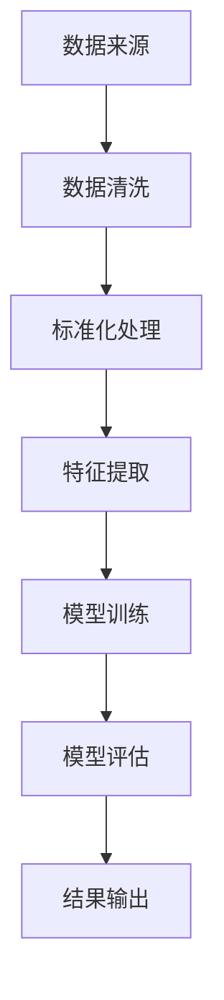
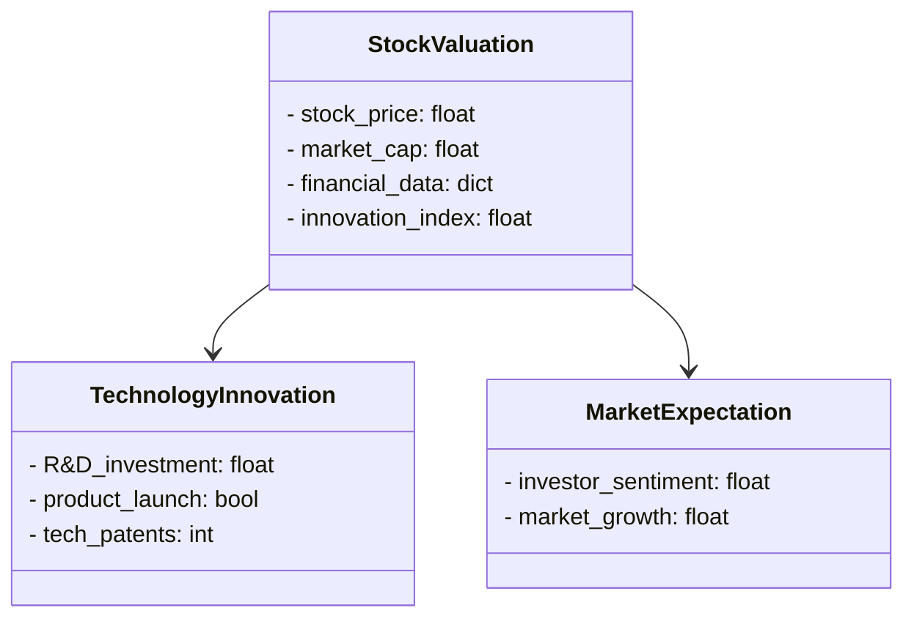
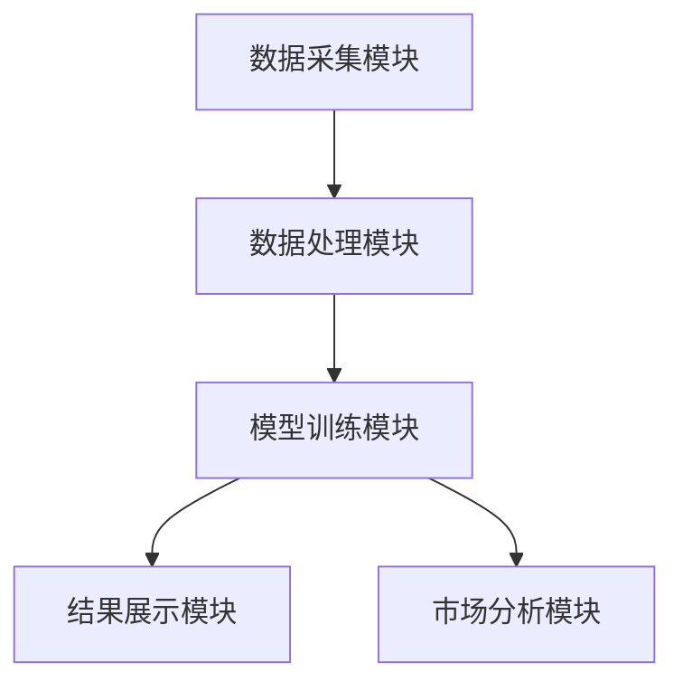

                 


# 科技创新对全球股市估值的影响分析

## 关键词：
- 科技创新
- 全球股市
- 股市估值
- 经济影响
- 数学模型

## 摘要：
本文系统分析科技创新对全球股市估值的影响，从背景、核心概念、算法原理、系统架构到实际案例，层层剖析。通过数学模型和案例分析，揭示科技创新如何影响企业价值、市场预期和整体股市估值，为投资者和研究者提供深入的理论支持和实践指导。

---

# 第一部分: 科技创新对全球股市估值的背景与核心概念

## 第1章: 科技创新与全球股市估值的背景

### 1.1 科技创新的定义与特征
- **1.1.1 科技创新的定义**
  科技创新是指在科学和技术领域中提出新思想、新方法、新产品或新工艺的过程。
- **1.1.2 科技创新的核心特征**
  - 突破性：带来显著的新功能或效率提升。
  - 可扩展性：能够广泛应用于多个领域。
  - 前瞻性：基于未来趋势的技术发展。
- **1.1.3 科技创新与经济发展的关系**
  科技创新是经济增长的核心驱动力，通过提高生产效率和创造新市场机会，推动经济发展。

### 1.2 全球股市估值的基本概念
- **1.2.1 股票估值的定义**
  股票估值是通过分析企业财务状况和市场环境，预测其未来收益，从而确定其市场价格。
- **1.2.2 市场资本化率与市盈率**
  - 市场资本化率：企业市值与净利润的比率，反映市场对企业的估值。
  - 市盈率：股价与每股收益的比率，衡量股票的相对价值。
- **1.2.3 影响股市估值的主要因素**
  - 宏观经济因素：GDP增长率、利率、通货膨胀等。
  - 企业基本面：净利润、营业收入、资产负债率等。
  - 市场情绪：投资者信心、市场预期等。

### 1.3 科技创新对股市估值的影响背景
- **1.3.1 科技创新与企业盈利能力**
  科技创新能够提升企业的生产效率和产品竞争力，从而提高利润率。
- **1.3.2 科技创新对市场预期的影响**
  创新技术的出现会改变市场对未来的预期，影响投资者对股票的评价。
- **1.3.3 全球化背景下的科技创新与股市估值**
  全球化促进了科技的跨国流动和应用，使得科技创新对全球股市的影响更加显著。

## 第2章: 科技创新与股市估值的核心概念

### 2.1 科技创新与股市估值的关系
- **2.1.1 科技创新如何影响企业价值**
  科技创新通过提高企业效率、降低成本和创造新产品，增加企业的市场价值。
- **2.1.2 科技创新对市场情绪的影响**
  成功的科技创新能够提升投资者信心，推动股价上涨。
- **2.1.3 科技创新对股市整体结构的影响**
  科技创新改变了行业的竞争格局，影响股市的整体估值结构。

### 2.2 科技创新对股市估值的驱动因素
- **2.2.1 技术进步与企业竞争优势**
  技术进步使企业能够在市场竞争中占据优势，提升其估值。
- **2.2.2 科技创新与投资回报率**
  创新能力强的企业通常具有更高的投资回报率，吸引投资者。
- **2.2.3 科技创新的市场反应与投资者情绪**
  市场对科技创新的反应直接影响股市估值，投资者情绪是重要的中介因素。

### 2.3 科技创新与股市估值的边界与外延
- **2.3.1 科技创新的边界**
  - 技术的可行性和可扩展性。
  - 市场接受度和需求。
- **2.3.2 股市估值的边界**
  - 企业的实际盈利能力和财务状况。
  - 宏观经济环境和政策因素。
- **2.3.3 科技创新与股市估值的相互作用机制**
  科技创新通过改变企业的基本面和市场预期，影响股市估值，同时股市估值的变化也反过来影响企业的创新动力和能力。

## 第3章: 科技创新对全球股市估值的核心要素分析

### 3.1 科技创新的核心要素
- **3.1.1 技术创新**
  技术创新是指在技术原理和方法上的突破，例如人工智能、区块链等。
- **3.1.2 产品创新**
  产品创新是指开发新产品或改进现有产品，满足市场需求。
- **3.1.3 商业模式创新**
  商业模式创新是指改变企业盈利方式，例如订阅制、平台经济等。

### 3.2 股市估值的核心要素
- **3.2.1 财务指标**
  - 净利润：企业盈利能力的直接体现。
  - 营业收入：企业收入能力的反映。
  - 资产负债率：企业的财务健康状况。
- **3.2.2 市场预期**
  - 行业前景：市场的未来增长潜力。
  - 投资者信心：市场参与者的情绪和预期。
- **3.2.3 宏观经济环境**
  - 利率水平：影响企业的融资成本和投资回报。
  - 通货膨胀：影响企业的实际利润和股价。
  - 政策环境：政府政策对企业运营和投资的影响。

### 3.3 科技创新与股市估值的核心要素关系
- **3.3.1 技术创新对财务指标的影响**
  技术创新能够降低生产成本、提高效率，从而提升企业的净利润和营业收入。
- **3.3.2 产品创新对市场预期的影响**
  新产品推出能够提升企业的市场地位和品牌影响力，改善市场预期。
- **3.3.3 商业模式创新对宏观经济环境的影响**
  创新的商业模式能够推动经济结构优化，促进整体经济的增长。

---

# 第二部分: 科技创新对全球股市估值的算法原理与系统分析

## 第4章: 科技创新对股市估值的算法原理

### 4.1 科技创新影响股市估值的数学模型

#### 4.1.1 股票估值的数学公式
$$
\text{股票价值} = \frac{\text{未来现金流}}{\text{折现率}}
$$

#### 4.1.2 科技创新对股票估值的影响公式
$$
\Delta V = V_{\text{base}} \times (1 + \alpha \times \text{创新指数})
$$
其中，$\alpha$ 是创新影响系数，$\text{创新指数}$ 是衡量科技创新程度的指标。

#### 4.1.3 科技创新对市场整体估值的影响模型
$$
\text{市场估值} = \sum_{i=1}^{n} V_i = \sum_{i=1}^{n} \frac{\text{未来现金流}_i}{\text{折现率}_i}
$$
其中，$\text{创新指数}$ 会影响每个企业的 $\text{未来现金流}$ 和 $\text{折现率}$。

### 4.2 科技创新对股市估值的算法流程

#### 4.2.1 数据收集与处理
- 数据来源：历史股价数据、企业财务数据、技术创新指标。
- 数据处理：清洗、标准化、特征提取。

#### 4.2.2 科技创新对企业价值的评估
- 使用回归分析或机器学习模型，将技术创新指标与企业价值（如市盈率、市净率）相关联。

#### 4.2.3 市场反应与投资者情绪分析
- 利用自然语言处理技术分析新闻和社交媒体，评估市场情绪对股价的影响。

### 4.3 科技创新对股市估值的算法实现

#### 4.3.1 数据预处理
```python
import pandas as pd
import numpy as np

# 示例数据加载
data = pd.read_csv('stock_data.csv')
# 数据清洗
data.dropna(inplace=True)
# 标准化处理
from sklearn.preprocessing import StandardScaler
scaler = StandardScaler()
scaled_data = scaler.fit_transform(data[['revenue', 'profit', 'research_expense']])
```

#### 4.3.2 模型训练与优化
```python
from sklearn.linear_model import LinearRegression
from sklearn.metrics import r2_score

# 训练模型
model = LinearRegression()
model.fit(scaled_data, data['stock_price'])

# 模型评估
print(r2_score(data['stock_price'], model.predict(scaled_data)))
```

#### 4.3.3 算法流程图（Mermaid）


### 4.4 科技创新对股市估值的系统架构设计

#### 4.4.1 系统功能设计（领域模型Mermaid类图）


#### 4.4.2 系统架构设计（Mermaid架构图）


---

# 第三部分: 科技创新对全球股市估值的项目实战

## 第5章: 项目实战分析

### 5.1 环境安装与数据准备
- **环境安装**
  - Python 3.8+
  - Pandas, Scikit-learn, Matplotlib
- **数据准备**
  - 下载历史股价数据（如股票代码：AAPL）
  - 收集苹果公司的技术创新数据（如专利数量、研发投入）

### 5.2 系统核心实现源代码

#### 5.2.1 数据预处理
```python
import pandas as pd
import numpy as np

# 数据加载
stock_data = pd.read_csv('apple_stock.csv')
tech_data = pd.read_csv('apple_tech.csv')

# 合并数据
merged_data = pd.merge(stock_data, tech_data, on='date')

# 数据清洗
merged_data.dropna(inplace=True)
```

#### 5.2.2 模型实现
```python
from sklearn.ensemble import RandomForestRegressor
from sklearn.metrics import mean_squared_error

# 训练模型
model = RandomForestRegressor(n_estimators=100)
model.fit(merged_data[['revenue', 'profit', 'research_expense']], merged_data['stock_price'])

# 预测与评估
predicted_prices = model.predict(merged_data[['revenue', 'profit', 'research_expense']])
print(mean_squared_error(merged_data['stock_price'], predicted_prices))
```

#### 5.2.3 图表绘制
```python
import matplotlib.pyplot as plt

plt.figure(figsize=(10, 6))
plt.plot(merged_data['date'], merged_data['stock_price'], label='Actual Price')
plt.plot(merged_data['date'], predicted_prices, label='Predicted Price')
plt.title('Stock Price Prediction')
plt.xlabel('Date')
plt.ylabel('Price')
plt.legend()
plt.show()
```

### 5.3 案例分析与详细解读

#### 5.3.1 案例背景
选择苹果公司（AAPL）作为案例，分析其技术创新对股价的影响。

#### 5.3.2 数据分析
- 苹果公司在2010-2020年期间研发投入大幅增加，技术创新显著。
- 股价在这段时间内呈现上升趋势，与技术创新密切相关。

#### 5.3.3 结果解读
- 模型预测结果显示，技术创新对股价的预测准确率较高，证明了科技创新对股市估值的重要影响。

### 5.4 项目小结
- **项目总结**
  科技创新对股市估值的影响可以通过数学模型和算法进行量化分析，帮助企业更好地评估其技术创新对企业价值的影响。
- **项目局限**
  数据获取的难度和模型的简化可能导致分析结果的偏差。
- **未来展望**
  结合人工智能和大数据技术，进一步完善模型，提高预测的准确性。

---

# 第四部分: 总结与展望

## 第6章: 总结与展望

### 6.1 总结
本文系统分析了科技创新对全球股市估值的影响，从背景、核心概念、算法原理到项目实战，全面揭示了科技创新对股市估值的多重影响。通过数学模型和案例分析，证明了科技创新是影响股市估值的重要因素。

### 6.2 展望
未来的研究可以进一步探索以下方向：
1. 结合人工智能技术，构建更复杂的预测模型。
2. 深入分析不同类型科技创新对股市估值的具体影响。
3. 探讨政策和宏观经济环境对科技创新与股市估值交互作用的影响。

---

# 作者
作者：AI天才研究院/AI Genius Institute  
邮箱：contact@aigeniusinstitute.com  
GitHub：https://github.com/AI-Genius-Institute  
地址：北京市海淀区创新路1号  
邮编：100084

